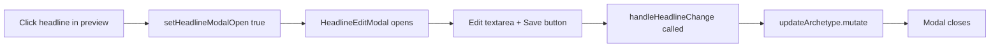

# Consistent Headline UX — Modal with Save Button

## Context

Headlines currently use inline editing (click text → textarea → auto-save on blur), while every other resume section (personal info, experiences, education, skills) uses a modal dialog with an explicit Save button. This inconsistency is confusing. We need to replace the inline headline editing with a modal to match the established pattern.

## Changes

### 1. Create `HeadlineEditModal` component

**New file:** `web/src/components/resume/builder/HeadlineEditModal.tsx`

Follow the `PersonalInfoModal` pattern exactly:
- Props: `open`, `onClose`, `headlineText`, `onSave: (text: string) => void`
- `useEffect` to sync draft state when modal opens
- `<textarea>` inside a `Dialog` with `DialogHeader` ("Edit Headline"), `DialogFooter` with Save button
- Save button calls `onSave(trimmed)` then `onClose()`
- No API call inside the modal — the parent already has `handleHeadlineChange` that calls `updateArchetype.mutate`

### 2. Simplify `ResumePreview`

**File:** `web/src/components/resume/builder/ResumePreview.tsx`

- Remove all inline editing state/logic: `editingHeadline`, `headlineDraft`, `headlineRef`, `startEditingHeadline`, `commitHeadline`
- Change `onHeadlineChange` prop to `onEditHeadline: () => void` (just opens the modal)
- Replace the headline `
` content with a simple `<button>` (like personal info) that calls `onEditHeadline` on click
- Keep the same visual styling for the headline text

### 3. Wire up in `builder.tsx`

**File:** `web/src/routes/resume/builder.tsx`

- Add `headlineModalOpen` state
- Pass `onEditHeadline={() => setHeadlineModalOpen(true)}` to `ResumePreview`
- Render `<HeadlineEditModal>` with `open={headlineModalOpen}`, `onClose`, `headlineText`, and `onSave={handleHeadlineChange}`

## Files to modify

| File | Action |
|------|--------|
| `web/src/components/resume/builder/HeadlineEditModal.tsx` | Create — new modal component |
| `web/src/components/resume/builder/ResumePreview.tsx` | Edit — remove inline editing, change prop to `onEditHeadline` |
| `web/src/routes/resume/builder.tsx` | Edit — add modal state + render `HeadlineEditModal` |

## Verification

1. `bun run --cwd web typecheck` — no type errors
2. `bun run check` — Biome lint/format passes
3. `bun run web:dev` — open resume builder, click headline, verify modal opens with current text, edit + Save works, Escape/close discards changes
