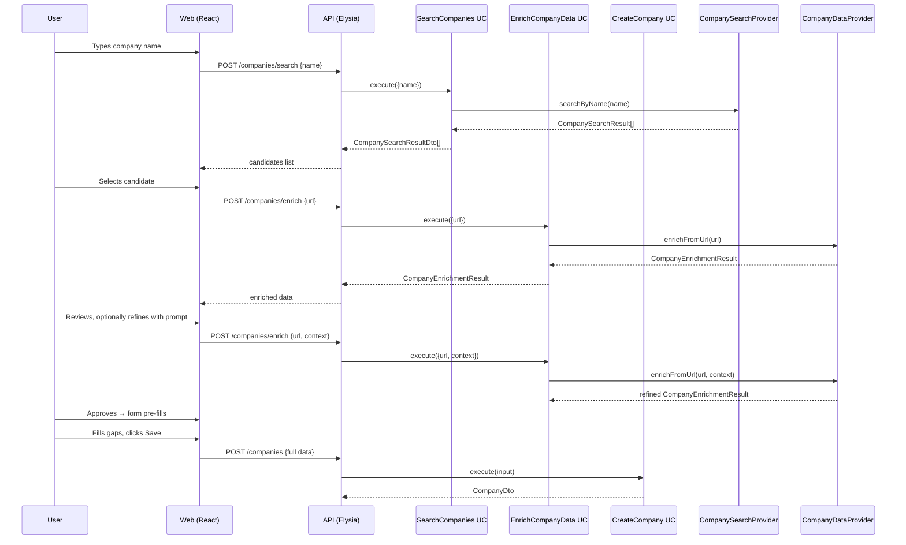

# Multi-Step Company Creation with AI Enrichment

## Context

Currently, creating a company requires manually filling every field. The `CompanyDataProvider` port exists with `enrichFromUrl()` but isn't connected to the creation UX. We want a progressive, multi-step flow that avoids wasting tokens on deep-diving the wrong company:

1. User types a company name → lightweight search returns candidates
2. User picks the right one → deep enrichment gathers full details
3. User reviews results, can refine with a free-text prompt
4. On approval, the create modal pre-fills with enriched data

## Architecture



## Changes by Layer

### 1. Application — New Port: `CompanySearchProvider`

**New file: `application/src/ports/CompanySearchProvider.ts`**

```typescript
export type CompanySearchResult = {
  name: string;
  website: string | null;
  description: string | null;
};

export interface CompanySearchProvider {
  searchByName(name: string): Promise<CompanySearchResult[]>;
}
```

- Lightweight search — returns name, website, short description
- Results ordered by relevance
- Export from `application/src/ports/index.ts`

### 2. Application — New Use Case: `SearchCompanies`

**New file: `application/src/use-cases/company/SearchCompanies.ts`**

```typescript
export type SearchCompaniesInput = { name: string };

export class SearchCompanies {
  constructor(private readonly searchProvider: CompanySearchProvider) {}
  async execute(input: SearchCompaniesInput): Promise<CompanySearchResult[]> {
    return this.searchProvider.searchByName(input.name);
  }
}
```

- Export from `application/src/use-cases/index.ts`

### 3. Application — Update `EnrichCompanyData` Use Case

**File: `application/src/use-cases/company/EnrichCompanyData.ts`**

Add optional `context` to the input so users can refine enrichment:

```typescript
export type EnrichCompanyDataInput = {
  url: string;
  context?: string;  // free-text refinement prompt
};
```

### 4. Application — Update `CompanyDataProvider` Port

**File: `application/src/ports/CompanyDataProvider.ts`**

Add optional `context` parameter to `enrichFromUrl`:

```typescript
export interface CompanyDataProvider {
  enrichFromUrl(url: string, context?: string): Promise<CompanyEnrichmentResult>;
}
```

### 5. Infrastructure — New Service: `ClaudeCliCompanySearchProvider`

**New file: `infrastructure/src/services/ClaudeCliCompanySearchProvider.ts`**

- `@injectable()` class implementing `CompanySearchProvider`
- Uses `Bun.spawn(['claude', '-p', prompt, '--output-format', 'json'])`
- Prompt: "Given this company name, return the top 5 matching real companies as a JSON array with fields: name, website, description (1-sentence). Order by likelihood of match."
- `parseResponse()` validates and returns `CompanySearchResult[]`
- Export from `infrastructure/src/index.ts`

### 6. Infrastructure — Update `ClaudeCliCompanyDataProvider`

**File: `infrastructure/src/services/ClaudeCliCompanyDataProvider.ts`**

- Update `enrichFromUrl(url: string, context?: string)` signature
- Update `buildPrompt` to append context when provided: "Additional context from the user: {context}"
- Existing tests for `parseResponse` remain valid

### 7. Infrastructure — Update `DI.ts`

**File: `infrastructure/src/DI.ts`**

Add tokens:
```typescript
Company: {
  // ... existing tokens ...
  SearchProvider: new InjectionToken<CompanySearchProvider>('DI.Company.SearchProvider'),
  Search: new InjectionToken<SearchCompanies>('DI.Company.Search'),
}
```

### 8. API — Update Container

**File: `api/src/container.ts`**

Wire new services:
```typescript
container.bind({ provide: DI.Company.SearchProvider, useClass: ClaudeCliCompanySearchProvider });
container.bind({
  provide: DI.Company.Search,
  useFactory: () => new SearchCompanies(container.get(DI.Company.SearchProvider))
});
```

### 9. API — New Route: `SearchCompaniesRoute`

**New file: `api/src/routes/company/SearchCompaniesRoute.ts`**

- `POST /companies/search` with body `{ name: string }`
- Returns `{ data: CompanySearchResult[] }`
- Mount in `api/src/index.ts`

### 10. API — Update `EnrichCompanyRoute`

**File: `api/src/routes/company/EnrichCompanyRoute.ts`**

Add optional `context` field to the body schema:
```typescript
body: t.Object({
  url: t.String({ minLength: 1 }),
  context: t.Optional(t.String())
})
```

Pass `context` through to the use case.

### 11. Web — New Hooks

**File: `web/src/hooks/use-companies.ts`**

Add two new hooks:

```typescript
// Lightweight search
export function useSearchCompanies() { /* mutation: POST /companies/search */ }

// Deep enrichment
export function useEnrichCompany() { /* mutation: POST /companies/enrich */ }
```

Add types: `CompanySearchResult`, `CompanyEnrichmentResult`.

### 12. Web — New Query Keys

**File: `web/src/lib/query-keys.ts`**

No changes needed — search and enrich are mutations, not queries.

### 13. Web — Multi-Step Modal UI

**File: `web/src/components/companies/CompanyFormModal.tsx`**

Replace the current single-form modal with a stepped flow:

```
Step 1: SEARCH
┌────────────────────────────────────┐
│  Add Company                       │
│                                    │
│  Company name: [            ]      │
│                    [Search]        │
│                                    │
│  Results:                          │
│  ○ Stripe — stripe.com            │
│    Online payment processing...    │
│  ○ Stripe (UK) — stripe.co.uk     │
│    UK-based subsidiary...          │
│                                    │
│           [Cancel]  [Next →]       │
└────────────────────────────────────┘

Step 2: ENRICH (loading)
┌────────────────────────────────────┐
│  Add Company                       │
│                                    │
│  Gathering details for Stripe...   │
│  ████████░░░░ (spinner)            │
│                                    │
│           [Cancel]                 │
└────────────────────────────────────┘

Step 3: REVIEW
┌────────────────────────────────────┐
│  Add Company                       │
│                                    │
│  Name:     Stripe                  │
│  Website:  https://stripe.com      │
│  Industry: SAAS                    │
│  Stage:    GROWTH                  │
│  ...                               │
│                                    │
│  Not right? [Refine with prompt]   │
│  ┌──────────────────────────────┐  │
│  │ The fintech one in SF...     │  │
│  └──────────────────────────────┘  │
│  [Re-enrich]                       │
│                                    │
│   [← Back]  [Cancel]  [Approve]   │
└────────────────────────────────────┘

Step 4: FORM (after approve)
→ Existing form pre-filled, user fills gaps, clicks Save
```

State machine: `search → enriching → review → form`

- Step 1: Name input + Search button. Shows candidate list with radio selection. "Next" triggers enrichment.
- Step 2: Loading state during enrichment.
- Step 3: Read-only display of enrichment results. Optional textarea for refinement prompt + "Re-enrich" button. "Approve" moves to form. "Back" returns to search.
- Step 4: Existing form fields pre-filled from enrichment. User edits as needed, clicks Save (existing `CreateCompany` flow).

### 14. Tests

**New: `application/test/use-cases/company/SearchCompanies.test.ts`**
- Mock `CompanySearchProvider`, verify delegation

**Update: `application/test/use-cases/company/EnrichCompanyData.test.ts`**
- Add test for `context` passthrough
- Update mock provider to accept optional context

**New: `infrastructure/test/services/ClaudeCliCompanySearchProvider.test.ts`**
- Test `parseResponse` with valid/invalid JSON
- Test empty results

**Update: `infrastructure/test/services/ClaudeCliCompanyDataProvider.test.ts`**
- Test prompt includes context when provided

## Files Modified (existing)

| File | Change |
|------|--------|
| `application/src/ports/CompanyDataProvider.ts` | Add optional `context` param |
| `application/src/ports/index.ts` | Export new port |
| `application/src/use-cases/company/EnrichCompanyData.ts` | Add `context` to input |
| `application/src/use-cases/index.ts` | Export new use case |
| `infrastructure/src/services/ClaudeCliCompanyDataProvider.ts` | Pass context to prompt |
| `infrastructure/src/DI.ts` | Add search tokens |
| `infrastructure/src/index.ts` | Export new service |
| `api/src/container.ts` | Wire search provider + use case |
| `api/src/routes/company/EnrichCompanyRoute.ts` | Add context field |
| `api/src/index.ts` | Mount search route |
| `web/src/hooks/use-companies.ts` | Add search + enrich hooks |
| `web/src/components/companies/CompanyFormModal.tsx` | Multi-step flow |
| `application/test/use-cases/company/EnrichCompanyData.test.ts` | Context tests |

## Files Created (new)

| File | Purpose |
|------|---------|
| `application/src/ports/CompanySearchProvider.ts` | Search port interface |
| `application/src/use-cases/company/SearchCompanies.ts` | Search use case |
| `infrastructure/src/services/ClaudeCliCompanySearchProvider.ts` | Claude CLI search impl |
| `api/src/routes/company/SearchCompaniesRoute.ts` | POST /companies/search |
| `application/test/use-cases/company/SearchCompanies.test.ts` | Search UC tests |
| `infrastructure/test/services/ClaudeCliCompanySearchProvider.test.ts` | Search provider tests |

## Implementation Order

1. **Application ports + use cases** — new `CompanySearchProvider` port, `SearchCompanies` use case, update `CompanyDataProvider` and `EnrichCompanyData` with context
2. **Infrastructure** — new `ClaudeCliCompanySearchProvider`, update `ClaudeCliCompanyDataProvider`, DI tokens
3. **API** — new `SearchCompaniesRoute`, update `EnrichCompanyRoute`, container wiring
4. **Tests** — unit tests for new and updated use cases/services
5. **Frontend** — hooks, multi-step modal UI

## Verification

1. `bun run typecheck` — all packages compile
2. `bun run test` — unit tests pass (mocked providers)
3. `bun run check` — Biome lint/format clean
4. `bun run knip` — no dead exports
5. `bun run dep:check` — architecture boundaries respected
6. Manual test with `bun dev:up`:
   - Search "Stripe" → see candidates
   - Select one → see enrichment results
   - Refine with prompt → see updated results
   - Approve → form pre-fills
   - Save → company created
