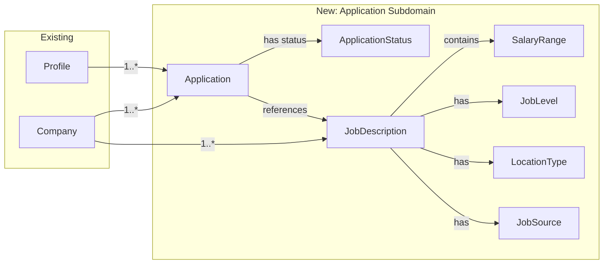

# Plan: Application Subdomain (DOMAIN → DOMAIN_EVOLUTION)

## Context

TailoredIn currently has Profile and Company subdomains. The next step is adding an **Application subdomain** — job applications and job descriptions — as defined in `domain/DOMAIN_EVOLUTION.mmd`. This enables users to track where they've applied, link applications to companies and job descriptions, and manage application status through their job search pipeline.

## What's changing



### New Aggregates
- **Application** — tracks a profile's application to a company, with optional job description link
- **JobDescription** — describes a job posting at a company, with salary/level/location metadata

### New Enums
- `ApplicationStatus`: DRAFT, APPLIED, INTERVIEWING, OFFERED, REJECTED, WITHDRAWN, ACCEPTED
- `JobLevel`: INTERNSHIP, ENTRY_LEVEL, ASSOCIATE, MID_SENIOR, DIRECTOR, EXECUTIVE
- `LocationType`: REMOTE, HYBRID, ONSITE
- `JobSource`: LINKEDIN, PARAFORM, GREENHOUSE, UPLOAD

### New Value Objects
- `SalaryRange` (min?, max?, currency) — flattened to 3 columns in DB
- `ApplicationId`, `JobDescriptionId` — ID types

### Design Decisions
- **No state machine** for ApplicationStatus — simple `setStatus()` update. Can add transition rules later without changing the use case interface.
- **Dedicated `UpdateApplicationStatus` use case** — separated from general `UpdateApplication` to keep status changes explicit.
- **SalaryRange flattened** in DB (`salary_min`, `salary_max`, `salary_currency`) — standard VO-to-columns pattern, reconstructed in `toDomain()`.

---

## Implementation (~37 new files, ~8 modified)

### Phase 1: Domain Layer

**Value objects & enums** (7 files in `domain/src/value-objects/`):
- `ApplicationId.ts`, `JobDescriptionId.ts` — ID types following `CompanyId` pattern
- `ApplicationStatus.ts`, `JobLevel.ts`, `LocationType.ts`, `JobSource.ts` — enums with lowercase string values
- `SalaryRange.ts` — extends `ValueObject`, getters for min/max/currency

**Entities** (2 files in `domain/src/entities/`):
- `Application.ts` — `AggregateRoot<ApplicationId>`, `static create(props)` defaults status to DRAFT, `setStatus()` method
- `JobDescription.ts` — `AggregateRoot<JobDescriptionId>`, `static create(props)` with optional SalaryRange

**Repository ports** (2 files in `domain/src/ports/`):
- `ApplicationRepository.ts` — `findById`, `findByProfileId`, `save`, `delete`
- `JobDescriptionRepository.ts` — `findById`, `findByCompanyId`, `save`, `delete`

**Update** `domain/src/index.ts` barrel.

### Phase 2: Application Layer

**DTOs** (2 files in `application/src/dtos/`):
- `ApplicationDto.ts` — with `toApplicationDto()` converter, dates as ISO strings
- `JobDescriptionDto.ts` — includes `SalaryRangeDto`, with `toJobDescriptionDto()` converter

**Use cases** (11 files):

`application/src/use-cases/application/`:
| Use Case | Input | Returns |
|---|---|---|
| `CreateApplication` | profileId, companyId, jobDescriptionId?, notes? | `ApplicationDto` |
| `GetApplication` | applicationId | `ApplicationDto` |
| `ListApplications` | profileId | `ApplicationDto[]` |
| `UpdateApplication` | applicationId, jobDescriptionId?, notes? | `ApplicationDto` |
| `UpdateApplicationStatus` | applicationId, status | `ApplicationDto` |
| `DeleteApplication` | applicationId | `void` |

`application/src/use-cases/job-description/`:
| Use Case | Input | Returns |
|---|---|---|
| `CreateJobDescription` | full create props | `JobDescriptionDto` |
| `GetJobDescription` | jobDescriptionId | `JobDescriptionDto` |
| `ListJobDescriptions` | companyId | `JobDescriptionDto[]` |
| `UpdateJobDescription` | id + update fields | `JobDescriptionDto` |
| `DeleteJobDescription` | jobDescriptionId | `void` |

**Update** barrel exports in `application/src/dtos/index.ts` and `application/src/use-cases/index.ts`.

### Phase 3: Infrastructure Layer

**Migration** (1 file): `infrastructure/src/db/migrations/Migration_20260417000000_create_applications_and_job_descriptions.ts`

```sql
-- job_descriptions first (referenced by applications FK)
CREATE TABLE "job_descriptions" (
  "id" UUID PRIMARY KEY,
  "company_id" UUID NOT NULL REFERENCES "companies"("id"),
  "title" TEXT NOT NULL,
  "description" TEXT NOT NULL,
  "url" TEXT,
  "location" TEXT,
  "salary_min" INTEGER,
  "salary_max" INTEGER,
  "salary_currency" TEXT,
  "level" TEXT,
  "location_type" TEXT,
  "source" TEXT NOT NULL,
  "posted_at" TIMESTAMP(3),
  "created_at" TIMESTAMP(3) NOT NULL DEFAULT CURRENT_TIMESTAMP,
  "updated_at" TIMESTAMP(3) NOT NULL DEFAULT CURRENT_TIMESTAMP
);
-- INDEX on company_id

CREATE TABLE "applications" (
  "id" UUID PRIMARY KEY,
  "profile_id" UUID NOT NULL REFERENCES "profiles"("id"),
  "company_id" UUID NOT NULL REFERENCES "companies"("id"),
  "job_description_id" UUID REFERENCES "job_descriptions"("id") ON DELETE SET NULL,
  "status" TEXT NOT NULL DEFAULT 'draft',
  "notes" TEXT,
  "applied_at" TIMESTAMP(3) NOT NULL DEFAULT CURRENT_TIMESTAMP,
  "updated_at" TIMESTAMP(3) NOT NULL DEFAULT CURRENT_TIMESTAMP
);
-- INDEXES on profile_id, company_id, status
```

**ORM entities** (2 files):
- `infrastructure/src/db/entities/application/Application.ts`
- `infrastructure/src/db/entities/job-description/JobDescription.ts`

**Repositories** (2 files):
- `infrastructure/src/repositories/PostgresApplicationRepository.ts` — `toDomain()` reconstructs ApplicationId + status enum
- `infrastructure/src/repositories/PostgresJobDescriptionRepository.ts` — `toDomain()` reconstructs SalaryRange from flat columns (null if all 3 salary fields are null)

**DI tokens** — add to `infrastructure/src/DI.ts`:
- `DI.Application.{Repository, Create, Get, List, Update, UpdateStatus, Delete}`
- `DI.JobDescription.{Repository, Create, Get, List, Update, Delete}`

**Update** `infrastructure/src/db/orm-config.ts` (register entities) and `infrastructure/src/index.ts` (export repos).

### Phase 4: API Layer

**Routes** (11 files):

`api/src/routes/application/`:
| Route | Method | Path |
|---|---|---|
| `CreateApplicationRoute` | POST | `/applications` |
| `GetApplicationRoute` | GET | `/applications/:id` |
| `ListApplicationsRoute` | GET | `/applications` (?profile_id) |
| `UpdateApplicationRoute` | PUT | `/applications/:id` |
| `UpdateApplicationStatusRoute` | PATCH | `/applications/:id/status` |
| `DeleteApplicationRoute` | DELETE | `/applications/:id` |

`api/src/routes/job-description/`:
| Route | Method | Path |
|---|---|---|
| `CreateJobDescriptionRoute` | POST | `/job-descriptions` |
| `GetJobDescriptionRoute` | GET | `/job-descriptions/:id` |
| `ListJobDescriptionsRoute` | GET | `/job-descriptions` (?company_id) |
| `UpdateJobDescriptionRoute` | PUT | `/job-descriptions/:id` |
| `DeleteJobDescriptionRoute` | DELETE | `/job-descriptions/:id` |

**Update** `api/src/container.ts` (bind repos + use cases) and `api/src/index.ts` (mount routes).

### Phase 5: Tests

- `domain/test/entities/Application.test.ts` — create, setStatus, defaults
- `domain/test/entities/JobDescription.test.ts` — create with/without optional fields, SalaryRange
- `application/test/use-cases/application/CreateApplication.test.ts`
- `application/test/use-cases/application/UpdateApplicationStatus.test.ts`
- `application/test/use-cases/job-description/CreateJobDescription.test.ts`

### Phase 6: Diagrams & Cleanup

- Copy `DOMAIN_EVOLUTION.mmd` → `DOMAIN.mmd` (or regenerate via `bun run domain:diagram`)
- Regenerate `bun run app:diagram`
- `bun run typecheck && bun run check && bun run dep:check && bun run knip`

---

## Verification

1. `bun run typecheck` — all packages type-check
2. `bun run check` — Biome lint/format passes
3. `bun run dep:check` — onion architecture boundaries enforced
4. `bun run knip` — no dead code/unused exports
5. `bun run test` — all unit tests pass
6. `bun wt:up` — worktree env starts, migration runs
7. Manual API smoke test: create a company → create a job description for it → create an application linking both → update status → list applications
8. `bun wt:down` — clean teardown
