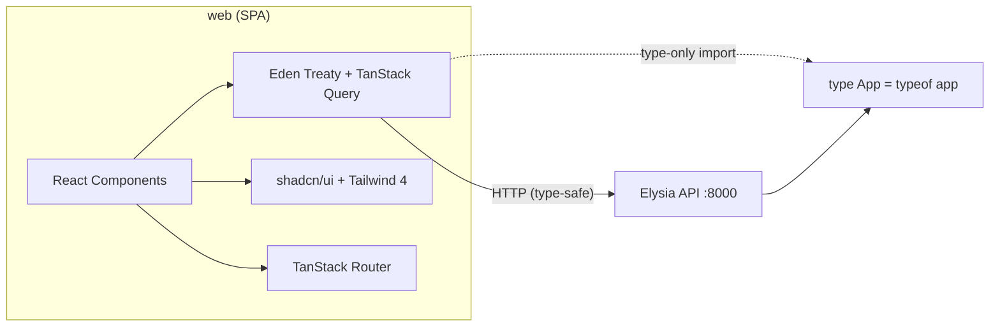
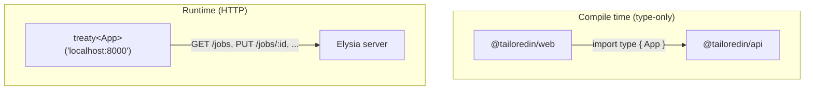

# Frontend Framework Decision — Reference Document

## Context

TailoredIn needs a web frontend. The app serves both public-facing and dashboard views, but SEO is not a concern (self-hosted tool). The frontend will consume the existing Elysia API (`api/`, port 8000). Key requirements: strong end-to-end typing with Elysia, ergonomic monorepo integration, component library (shadcn/ui), and all tools managed via mise.

---

## Decision: React 19 + Vite 6 (SPA)

Three hard constraints drove this:
1. **Eden Treaty** — Elysia's type-safe client. `api/src/index.ts:93` already exports `type App = typeof app`. Eden Treaty infers all route/param/response types from this.
2. **shadcn/ui** — React-only component library (Radix + Tailwind). No mature port exists for other frameworks.
3. **Bun compatibility** — Vite 6 runs natively under Bun. No Node.js needed.



---

## Library Stack

| Category | Library | Version | Why |
|---|---|---|---|
| **UI framework** | React + React DOM | ^19.0 | shadcn/ui + Eden Treaty + largest ecosystem |
| **Build tool** | Vite | ^6.0 | Bun-native, fast HMR, no Node.js |
| **API client** | @elysiajs/eden | latest | End-to-end type inference from Elysia App type |
| **Server state** | @tanstack/react-query | ^5.0 | Caching, mutations, loading/error states |
| **Router** | @tanstack/react-router | ^1.0 | Type-safe params + search params, file-based routing, Zod validation |
| **Components** | shadcn/ui (CLI) | latest | Accessible Radix primitives, copy-paste ownership |
| **Styling** | Tailwind CSS | ^4.0 | CSS-first config (v4), Vite plugin integration |
| **Forms** | react-hook-form + @hookform/resolvers | ^7.0 / ^3.0 | Performant forms, Zod resolver (Zod already in monorepo) |
| **Icons** | lucide-react | latest | shadcn default icon set |
| **Toasts** | sonner | ^2.0 | shadcn-integrated toast library |
| **Dates** | date-fns | ^4.1 | Already in monorepo |
| **Client state** | None (React built-ins) | — | TanStack Query covers server state; useState/useReducer for UI. Add Zustand if needed later. |

### TanStack Router over React Router v7

- Deeper type inference for route params and search params
- Built-in Zod search param validation (Zod already in monorepo)
- First-class TanStack Query integration for route-level data loading
- React Router v7's Remix-derived loader/action model adds unnecessary complexity for an SPA calling a separate API

---

## Monorepo Integration

### Package: `web/`

Add `"web"` to the `workspaces` array in root `package.json`.

### Eden Treaty Type Bridge



```ts
// web/src/lib/api.ts
import { treaty } from '@elysiajs/eden';
import type { App } from '@tailoredin/api';

export const api = treaty<App>('localhost:8000');
// Full autocomplete: api.jobs({ id }).get() → typed response
```

**Prerequisite:** Add `exports` field to `api/package.json`:
```json
{ "exports": { ".": "./src/index.ts" } }
```

### tsconfig.json — Standalone (does NOT extend tsconfig.base.json)

The web package uses `"moduleResolution": "bundler"` (not `"NodeNext"`). This is intentional: Vite resolves imports differently from Node.js. Imports in the web package do NOT use `.js` extensions. A standalone tsconfig avoids inheriting `"module": "NodeNext"` and `"types": ["node"]` which conflict with a browser environment.

Key settings: `"module": "ESNext"`, `"moduleResolution": "bundler"`, `"jsx": "react-jsx"`, `"lib": ["es2022", "DOM", "DOM.Iterable"]`.

### Vite Config

```ts
// web/vite.config.ts
export default defineConfig({
  plugins: [TanStackRouterVite(), react(), tailwindcss()],
  server: {
    port: 5173,
    proxy: {
      '/api': {
        target: 'http://localhost:8000',
        rewrite: path => path.replace(/^\/api/, '')
      }
    }
  }
});
```

### Root Scripts

```json
"web": "bun run --cwd web dev",
"web:build": "bun run --cwd web build",
"web:preview": "bun run --cwd web preview",
"web:typecheck": "bun run --cwd web typecheck"
```

### Dependency-Cruiser Rules (3 new)

| Rule | From | Cannot import | Reason |
|---|---|---|---|
| `web-no-infrastructure` | `web/` | `infrastructure/` | Use Eden Treaty, not direct DB access |
| `web-not-depends-on-cli` | `web/` | `cli/` | Entry-point packages are isolated |
| `cli-not-depends-on-web` | `cli/` | `web/` | Entry-point packages are isolated |

**What web CAN import:** `@tailoredin/api` (type-only for Eden Treaty), `@tailoredin/domain` (enums like `JobStatus`), `@tailoredin/core` (utilities), `@tailoredin/application` (DTO types if needed — though Eden Treaty infers most).

### No Changes Needed

- **Biome** — already covers all top-level packages, supports JSX/TSX natively
- **mise** — Vite runs under Bun, Tailwind 4 runs as Vite plugin. No new tools needed.

---

## Frontend Architecture

```
web/
├── index.html
├── package.json
├── tsconfig.json
├── vite.config.ts
├── components.json                  # shadcn/ui config
└── src/
    ├── main.tsx                     # React root + providers
    ├── app.css                      # Tailwind 4 @theme config
    ├── routeTree.gen.ts             # Auto-generated by TanStack Router
    ├── routes/                      # File-based routing
    │   ├── __root.tsx               # Root layout (sidebar, toaster)
    │   ├── index.tsx                # / → redirect to /jobs
    │   ├── jobs/
    │   │   ├── index.tsx            # /jobs → job list
    │   │   └── $jobId.tsx           # /jobs/:jobId → detail
    │   ├── resume/
    │   │   ├── experience.tsx
    │   │   ├── skills.tsx
    │   │   ├── education.tsx
    │   │   └── profile.tsx
    │   └── archetypes/
    │       ├── index.tsx
    │       └── $archetypeId.tsx
    ├── lib/                         # Shared utilities
    │   ├── api.ts                   # Eden Treaty client
    │   ├── utils.ts                 # cn() helper (clsx + tailwind-merge)
    │   └── query-keys.ts            # TanStack Query key factory
    ├── components/
    │   ├── ui/                      # shadcn/ui generated components
    │   └── layout/                  # App shell (sidebar, nav, header)
    └── features/                    # Feature modules
        ├── jobs/
        │   ├── components/          # JobCard, StatusBadge, ScoreIndicator
        │   └── hooks/               # useJobs, useJob, useChangeJobStatus
        ├── resume/
        │   ├── components/
        │   └── hooks/
        └── archetypes/
            ├── components/
            └── hooks/
```

### Eden Treaty + TanStack Query Pattern

```ts
// src/features/jobs/hooks/useTopJob.ts
import { useQuery } from '@tanstack/react-query';
import { api } from '@/lib/api';
import { queryKeys } from '@/lib/query-keys';

export function useTopJob(targetSalary: number) {
  return useQuery({
    queryKey: queryKeys.jobs.top({ targetSalary }),
    queryFn: async () => {
      const { data, error } = await api.jobs.tops.next.get({
        query: { target_salary: targetSalary }
      });
      if (error) throw error;
      return data;
    }
  });
}
```

Eden Treaty provides the **type-safe HTTP call**. TanStack Query provides **caching, refetching, loading/error states, optimistic updates**.

### Types Strategy

- **Primary:** Use Eden Treaty inferred types (response types derived from Elysia route definitions)
- **Import from domain:** Enums like `JobStatus` for display logic (status badges, dropdowns)
- **Import from application:** DTO types only when needed outside API call context
- **Rarely needed:** Manual type definitions — Eden Treaty covers most cases

---

## Alternatives Rejected

| Framework | Why not |
|---|---|
| **Next.js** | SSR not needed (no SEO), adds complexity (App Router, server components) that duplicates Elysia, known Bun monorepo friction, would require Node.js in mise |
| **SvelteKit** | No shadcn/ui (svelte port is immature), smaller ecosystem, SSR-first architecture unnecessary |
| **Vue / Nuxt** | No native shadcn/ui (vue port is separate project), Eden Treaty community patterns are React-centric |
| **SolidJS** | Smallest ecosystem, no shadcn/ui port, more custom work needed |
| **React Router v7** | Remix-derived loader/action model unnecessary for SPA + separate API; weaker type inference than TanStack Router |

---

## Open Questions for Implementation

1. **Production serving** — Serve the SPA from Elysia (`@elysiajs/static`) or separate static host? Recommendation: serve from Elysia (single process, no CORS).
2. **CORS** — Vite dev proxy avoids CORS in dev. Production same-origin serving avoids it entirely. Add `@elysiajs/cors` only if needed.
3. **Path aliases** — Configure `@/` alias in both `vite.config.ts` (`resolve.alias`) and `tsconfig.json` (`paths`). Standard for shadcn/ui projects.
4. **shadcn init** — Run `bunx shadcn@latest init` in `web/` after scaffolding. Then `bunx shadcn@latest add button card dialog table` as needed.
5. **Testing** — Vitest (ships with Vite) + React Testing Library for components. Playwright for E2E (already in monorepo).