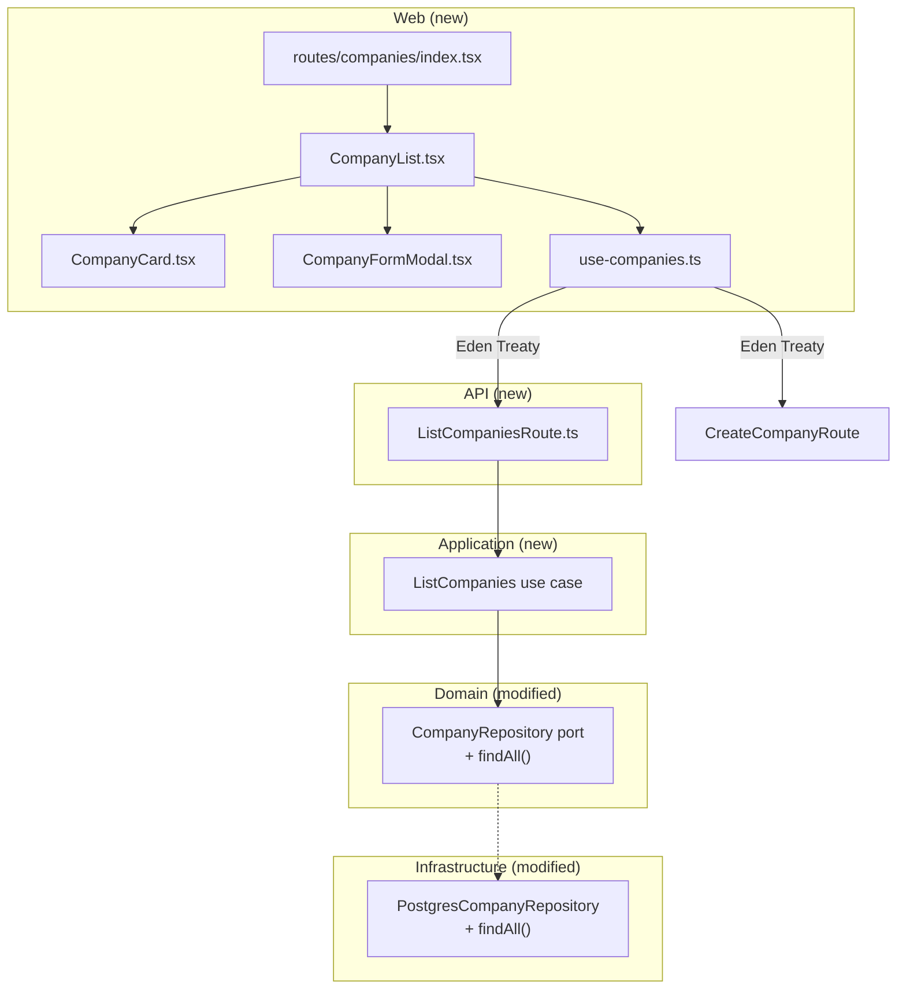

# Plan: Companies Page

## Context

The Company aggregate is fully implemented across domain, application, infrastructure, and API layers — but has no standalone web UI. Currently only `CreateCompany` and `EnrichCompanyData` use cases exist. The goal is to add a Companies page that lets users **view**, **search**, and **create** companies.

## Architecture Diagram

## Company Fields (from domain aggregate)

| Field | Type | Required | Form field type |
|---|---|---|---|
| name | string | yes | text |
| website | string \| null | no | text |
| logoUrl | string \| null | no | text |
| linkedinLink | string \| null | no | text |
| businessType | BusinessType enum \| null | no | select |
| industry | Industry enum \| null | no | select |
| stage | CompanyStage enum \| null | no | select |

## Steps

### Step 1: Backend — ListCompanies use case + API route

**1a. Add `findAll()` to domain port**
- File: `domain/src/ports/CompanyRepository.ts`
- Add: `findAll(): Promise<Company[]>`

**1b. Implement `findAll()` in Postgres repository**
- File: `infrastructure/src/repositories/PostgresCompanyRepository.ts`
- Add `findAll()` using `this.orm.em.find(OrmCompany, {}, { orderBy: { name: 'ASC' } })` and map via `toDomain()`

**1c. Create `ListCompanies` use case**
- File: `application/src/use-cases/company/ListCompanies.ts`
- Pattern: same as `ListExperiences` — calls `companyRepository.findAll()`, maps to `CompanyDto[]`
- Export from `application/src/use-cases/company/index.ts` and `application/src/use-cases/index.ts`

**1d. Add DI token**
- File: `infrastructure/src/DI.ts`
- Add `List: new InjectionToken<ListCompanies>('DI.Company.List')` to `DI.Company`

**1e. Wire in container**
- File: `api/src/container.ts`
- Bind `DI.Company.List` with `useFactory` calling `new ListCompanies(container.get(DI.Company.Repository))`

**1f. Create `ListCompaniesRoute`**
- File: `api/src/routes/company/ListCompaniesRoute.ts`
- `GET /companies` → returns `{ data: CompanyDto[] }`
- Follow `ListExperiencesRoute` pattern exactly

**1g. Mount route**
- File: `api/src/index.ts`
- Add `ListCompaniesRoute` import and `.use(container.get(ListCompaniesRoute).plugin())`

### Step 2: Frontend — Companies page

**2a. Add query keys**
- File: `web/src/lib/query-keys.ts`
- Add `companies: { all: ['companies'] as const, list: () => [...queryKeys.companies.all, 'list'] as const }`

**2b. Add validation**
- File: `web/src/lib/validation.ts`
- Add `CompanyFormState` interface and `validateCompany()` function
- Required: `name`. All others optional.

**2c. Create `use-companies.ts` hook**
- File: `web/src/hooks/use-companies.ts`
- `useCompanies()` — fetches `GET /companies`
- `useCreateCompany()` — calls `POST /companies`, invalidates list
- Export `Company` type matching `CompanyDto`

**2d. Create `CompanyCard.tsx`**
- File: `web/src/components/companies/CompanyCard.tsx`
- Clickable card showing: name (primary), website, industry/stage/businessType as badges
- No delete button for now (companies are shared resources)
- Click → opens edit modal (future; for now just shows detail)

**2e. Create `CompanyFormModal.tsx`**
- File: `web/src/components/companies/CompanyFormModal.tsx`
- Uses `FormModal` + `EditableField` + `useDirtyTracking`
- Fields: name (text, required), website (text), logoUrl (text), linkedinLink (text), businessType (select), industry (select), stage (select)
- Select options built from `BusinessType`, `Industry`, `CompanyStage` enum values with human-readable labels
- Create mode only for now

**2f. Create `CompanyList.tsx`**
- File: `web/src/components/companies/CompanyList.tsx`
- Search input at top (client-side filter by name — no backend search needed given `findAll()` pattern)
- Renders filtered `CompanyCard` list + "Add company" button
- Modal state management (closed | create)
- Loading skeleton, empty state

**2g. Create route**
- File: `web/src/routes/companies/index.tsx`
- Page heading "Companies" + subtitle + `CompanyList`

**2h. Add sidebar nav entry**
- File: `web/src/components/layout/sidebar.tsx`
- Add a new sidebar group "Companies" with `Building2` icon from lucide-react, linking to `/companies`

### Step 3: Tests

**3a. Unit test for `ListCompanies` use case**
- File: `application/test/use-cases/company/ListCompanies.test.ts`

**3b. Unit test for `CreateCompany` use case** (if not already tested)
- Check `application/test/use-cases/company/CreateCompany.test.ts`

## Key Files to Modify

| File | Change |
|---|---|
| `domain/src/ports/CompanyRepository.ts` | Add `findAll()` |
| `infrastructure/src/repositories/PostgresCompanyRepository.ts` | Implement `findAll()` |
| `infrastructure/src/DI.ts` | Add `DI.Company.List` token |
| `api/src/container.ts` | Bind `ListCompanies` |
| `api/src/index.ts` | Mount `ListCompaniesRoute` |
| `web/src/lib/query-keys.ts` | Add company keys |
| `web/src/lib/validation.ts` | Add company validation |
| `web/src/components/layout/sidebar.tsx` | Add Companies nav |

## New Files

| File | Purpose |
|---|---|
| `application/src/use-cases/company/ListCompanies.ts` | List use case |
| `api/src/routes/company/ListCompaniesRoute.ts` | GET /companies |
| `web/src/hooks/use-companies.ts` | Query + mutation hooks |
| `web/src/components/companies/CompanyList.tsx` | List + search + modal state |
| `web/src/components/companies/CompanyCard.tsx` | Summary card |
| `web/src/components/companies/CompanyFormModal.tsx` | Create form modal |
| `web/src/routes/companies/index.tsx` | Route page |
| `application/test/use-cases/company/ListCompanies.test.ts` | Unit test |

## Reuse

- `FormModal` from `web/src/components/shared/FormModal.tsx`
- `EditableField` from `web/src/components/shared/EditableField.tsx`
- `EmptyState` from `web/src/components/shared/EmptyState.tsx`
- `LoadingSkeleton` from `web/src/components/shared/LoadingSkeleton.tsx`
- `useDirtyTracking` from `web/src/hooks/use-dirty-tracking.ts`
- `toCompanyDto` from `application/src/dtos/CompanyDto.ts`
- `EnumUtil.values()` from `@tailoredin/core` for building select options

## Search Approach

Client-side filtering on the company name. A search `<Input>` at the top of the list filters the fetched companies array. This matches the current codebase pattern (no pagination, fetch-all) and avoids adding a new backend search endpoint.

## Verification

1. `bun run typecheck` — no type errors
2. `bun run check` — Biome lint/format passes
3. `bun run test` — unit tests pass (including new ListCompanies test)
4. `bun run dep:check` — architecture boundaries respected
5. `bun run knip` — no dead exports
6. Manual: start dev server, navigate to `/companies`, verify list loads, search filters, create modal works
