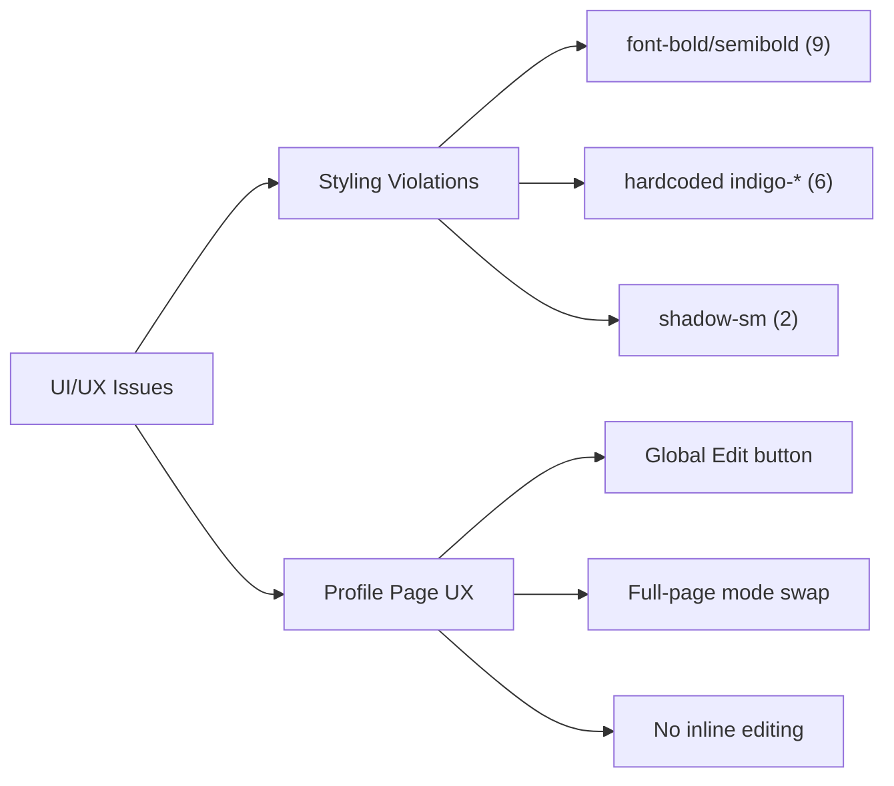

# Fix UI/UX Design System Violations

## Context

The design system spec at `docs/superpowers/specs/2026-03-30-web-frontend-design-system.md` defines clear rules for typography, colors, spacing, and component styling. An audit of all TSX files reveals **~20 styling violations** plus a **major UX inconsistency** on the Profile page. Claude-generated code has been ignoring these guidelines.

Additionally, `domain/DOMAIN.mmd` is the source of truth for all entities and fields — the UI must reflect it accurately, and `web/CLAUDE.md` should reference it so future code stays in sync.

## Two Categories of Issues



---

## Issue 1: Profile Page UX Inconsistency

### The Problem

Every other data page uses **inline editing** — click the pencil on a card, the card transforms into an edit form:
- **Headlines**: Card shows label + summary. Click pencil → card becomes Input + Textarea. Save/Cancel inline.
- **Education**: Card shows institution + degree. Click pencil → card becomes form fields. Save/Cancel inline.
- **Accomplishments**: Card shows title + narrative. Click pencil → card header becomes editable. Save/Cancel inline.

**Profile is the outlier:** It has a hidden "Edit" button in the top-right header that swaps the *entire page* between read-only `ProfileField` components and a traditional form. This creates two problems:
1. **Discoverability** — the Edit button is easy to miss (ghost variant, no visual hint that fields are editable)
2. **Inconsistency** — it's the only page with a modal-like full-page edit mode instead of per-field inline editing

### The Fix

Redesign Profile to use **per-field inline editing** matching the pattern from Headlines/Education.

Profile fields from `domain/DOMAIN.mmd`:
- `email` (string, required)
- `firstName` (string, required)
- `lastName` (string, required)
- `about` (string?, optional)
- `phone` (string?, optional)
- `location` (string?, optional)
- `githubUrl` (string?, optional)
- `linkedinUrl` (string?, optional)
- `websiteUrl` (string?, optional)

Each `ProfileField` becomes a self-contained inline-editable component:
- **View mode**: Label (uppercase, `text-xs font-medium`, muted) + value text. Pencil icon on hover (like Headlines/Education cards).
- **Edit mode**: Click pencil → value text transforms into an `<Input>` or `<Textarea>` (for About). Check/X icons to save/cancel.
- Each field saves independently via `useUpdateProfile` mutation (sends all fields, updating only the changed one).
- Remove the global `editing` state, the top-right Edit button, and the full-page form.

**Field grouping:**
- **Name**: Single row, "First name" and "Last name" as two side-by-side inputs in edit mode
- **About**: Uses `<Textarea>` instead of `<Input>` in edit mode
- **All others**: Single `<Input>` per field

### Files to Modify

| File | Change |
|------|--------|
| `web/src/routes/profile/index.tsx` | Rewrite to use inline-editable `ProfileField` components. Remove global edit state + Edit button. |

---

## Issue 2: Design System Styling Violations

### 2a. Font Weight — Replace all bold/semibold with medium

The spec says: **"No bold (700) anywhere in the default UI — heaviest weight is medium (500)."**

| File | Line | Current | Fix |
|------|------|---------|-----|
| `web/src/routes/experiences/index.tsx` | 12 | `text-2xl font-bold` | `text-2xl font-medium` |
| `web/src/routes/headlines/index.tsx` | 12 | `text-2xl font-bold` | `text-2xl font-medium` |
| `web/src/routes/education/index.tsx` | 12 | `text-2xl font-bold` | `text-2xl font-medium` |
| `web/src/routes/profile/index.tsx` | 94 | `text-2xl font-bold` | `text-2xl font-medium` |
| `web/src/components/layout/sidebar.tsx` | 35 | `font-semibold` | `font-medium` |
| `web/src/components/resume/experience/ExperienceList.tsx` | 101 | `font-semibold` (company) | `font-medium` |
| `web/src/components/resume/experience/ExperienceList.tsx` | 113, 124 | `font-semibold` (labels) | `font-medium` |
| `web/src/routes/profile/index.tsx` | 180, 194 | `font-semibold` (labels) | `font-medium` |

### 2b. Hardcoded Colors — Replace `indigo-*` with design tokens

Edit-mode borders use raw `indigo-*` which breaks when switching palettes (teal, violet, etc.).

| File | Current | Fix |
|------|---------|-----|
| `web/src/components/resume/headlines/HeadlineList.tsx` (lines 55, 106) | `border-indigo-300` | `border-primary/30` |
| `web/src/components/resume/education/EducationList.tsx` (lines 80, 175) | `border-indigo-300` | `border-primary/30` |
| `web/src/components/resume/experience/AccomplishmentEditor.tsx` (line 40) | `border-indigo-300` | `border-primary/30` |
| `web/src/components/resume/experience/AccomplishmentEditor.tsx` (line 41) | `bg-indigo-50 border-indigo-200` | `bg-accent border-primary/20` |

### 2c. Remove Unauthorized Shadows

Spec says no shadows on cards/inputs — borders only.

| File | Current | Fix |
|------|---------|-----|
| `web/src/components/resume/experience/ExperienceList.tsx` (line 118) | `shadow-sm` on textarea | Remove `shadow-sm` |
| `web/src/components/resume/experience/AccomplishmentEditor.tsx` (line 59) | `shadow-sm` on textarea | Remove `shadow-sm` |

---

## Issue 3: Prevent Future Violations

Add to `web/CLAUDE.md`:

```markdown
## Design System

All UI must follow `docs/superpowers/specs/2026-03-30-web-frontend-design-system.md`. Key rules:
- **No bold (700) or semibold (600)** — max weight is `font-medium` (500)
- **No hardcoded colors** — use design tokens (`primary`, `accent`, `muted`, etc.)
- **No shadows on cards/inputs** — use borders only
- **Inline editing pattern** — each data field edits in-place (pencil icon on hover → field transforms to input). No global Edit buttons or full-page mode swaps.
- **Typography scale**: h1=22px/medium, h2=18px/medium, h3=15px/medium, body=14px/regular

## Domain Model as Source of Truth

`domain/DOMAIN.mmd` defines all entities, fields, and relationships. The UI must reflect this model:
- Entity fields shown in the UI must match the domain model exactly
- Adding or removing fields in the UI requires verifying against `DOMAIN.mmd` first
- When building forms or display components, consult `DOMAIN.mmd` for the canonical field list
```

---

## Files to Modify (Complete List)

1. `web/src/routes/profile/index.tsx` — **rewrite** (inline editing)
2. `web/src/routes/experiences/index.tsx` — font-bold → font-medium
3. `web/src/routes/headlines/index.tsx` — font-bold → font-medium
4. `web/src/routes/education/index.tsx` — font-bold → font-medium
5. `web/src/components/layout/sidebar.tsx` — font-semibold → font-medium
6. `web/src/components/resume/experience/ExperienceList.tsx` — font-semibold → font-medium, remove shadow-sm
7. `web/src/components/resume/experience/AccomplishmentEditor.tsx` — indigo → tokens, remove shadow-sm
8. `web/src/components/resume/headlines/HeadlineList.tsx` — indigo → tokens
9. `web/src/components/resume/education/EducationList.tsx` — indigo → tokens
10. `web/CLAUDE.md` — add design system + domain model references

## Verification

1. `bun run typecheck` — no type errors
2. `bun run check` — Biome lint/format passes
3. Start dev server and visually confirm:
   - All headings are medium weight (not bold)
   - Profile fields edit inline (click pencil on any field → transforms to input)
   - Edit-mode borders use the active palette color (amber by default), not indigo
   - Switch palettes — edit borders follow the palette
   - No shadows on textareas or cards
   - Profile fields match `DOMAIN.mmd` Profile entity exactly
