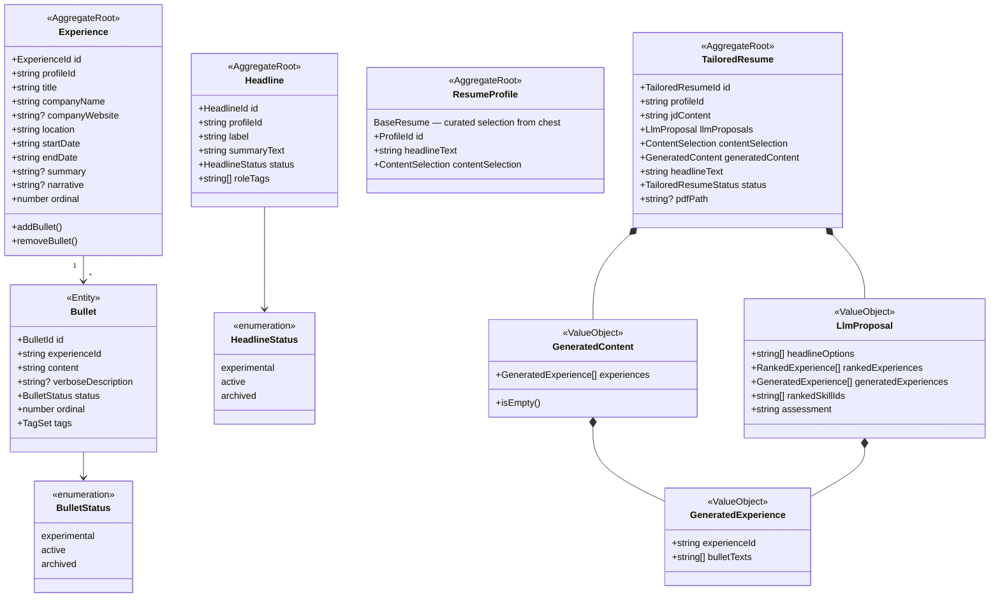

# Resume Chest Architecture

## Context

The current resume system has a fundamental limitation: `Bullet.content` is a single polished string, and tailoring only *ranks* existing bullets — the LLM never writes new text. This means:

- You can't feed the LLM rich, detailed context about what you actually did
- Job-tailored resumes are constrained to existing phrasings
- There's no place to accumulate experimental content or job-search feedback

This redesign introduces a **content chest** — the collection of all verbose experience content from which resumes are compiled. `Bullet` gets a `verboseDescription` (the raw material), `Experience` gets a `narrative`, and `Headline` gets a `status`. The tailoring service shifts from *ranking bullet IDs* to *generating new bullet text from verbose chest content*.

**Three resume concepts post-redesign:**
1. **Content Chest** — all `Bullet`s and `Headline`s with status `active | experimental | archived`, each with verbose/narrative source material. Not a new entity; a lens over existing ones.
2. **Base Resume** (`ResumeProfile`) — user-curated selection of the strongest chest bullets; unchanged structure.
3. **Tailored Resume** (`TailoredResume`) — LLM reads the full chest (verbose descriptions + experience narratives), then *writes* targeted bullet texts for the specific JD; stored as `GeneratedContent`.

---

## Architecture Diagram



---

## Data Flow: Tailored Resume (new)

```
CreateTailoredResume.execute({ profileId, jdContent })
  ↓
  1. resumeChestQuery.makeChestMarkdown(profileId)
       → loads ALL experiences + bullets (with verboseDescription) + narratives
       → formats as rich markdown (verbose, not polished-resume style)
  ↓
  2. resumeTailoringService.tailorFromJd(jdContent, chestMarkdown)
       → LLM reads full chest, writes targeted bullet texts per experience
       → returns LlmProposal {
           headlineOptions,
           generatedExperiences[{ experienceId, bulletTexts[] }],
           rankedSkillIds,
           assessment
         }
  ↓
  3. TailoredResume.create() with generatedContent set from LLM response
  ↓
  4. Save to DB

GenerateTailoredResumePdf.execute({ resumeId })
  ↓
  if resume.generatedContent.isEmpty()
    → makeFromSelection(contentSelection)   ← current path (base resume)
  else
    → makeFromGeneratedContent(generatedContent, profileId)  ← new path
  ↓
  resumeRenderer.render() → PDF
```

---

## Implementation Plan

### Step 1 — Domain layer

**`domain/src/value-objects/BulletStatus.ts`** (new)
- Enum: `'experimental' | 'active' | 'archived'`

**`domain/src/value-objects/HeadlineStatus.ts`** (new)
- Enum: `'experimental' | 'active' | 'archived'`

**`domain/src/value-objects/GeneratedContent.ts`** (new)
- `GeneratedExperience`: `{ experienceId: string; bulletTexts: string[] }`
- `GeneratedContent`: value object wrapping `GeneratedExperience[]`, with `isEmpty()` and `static empty()`

**`domain/src/entities/Bullet.ts`** — add fields:
- `verboseDescription: string | null`
- `status: BulletStatus` (default: `'active'`)
- Update `BulletCreateProps` and constructor
- Add `updateVerboseDescription(text: string)` method

**`domain/src/entities/Experience.ts`** — add field:
- `narrative: string | null`

**`domain/src/entities/Headline.ts`** — add field:
- `status: HeadlineStatus` (default: `'active'`)

**`domain/src/value-objects/LlmProposal.ts`** — add field:
- `generatedExperiences: GeneratedExperience[]`
- Update constructor and `static empty()`

**`domain/src/entities/TailoredResume.ts`** — add field:
- `generatedContent: GeneratedContent`
- Add `updateGeneratedContent(content: GeneratedContent)` method
- Update `static create()` to initialize with `GeneratedContent.empty()`

Export new value objects from `domain/src/index.ts`.

---

### Step 2 — Application layer

**`application/src/ports/ResumeChestQuery.ts`** (new port)
```typescript
export interface ResumeChestQuery {
  makeChestMarkdown(profileId: string): Promise<string>;
}
```

**`application/src/dtos/ResumeContentDto.ts`** — add `makeFromGeneratedContent` input type:
```typescript
export type MakeResumeContentFromGeneratedInput = {
  profileId: string;
  headlineText: string;
  generatedContent: GeneratedContent;
  educationIds: string[];
  skillCategoryIds: string[];
  skillItemIds: string[];
  keywords: string[];
};
```

**`application/src/ports/ResumeContentFactory.ts`** — add method:
```typescript
makeFromGeneratedContent(input: MakeResumeContentFromGeneratedInput): Promise<ResumeContentDto>;
```

**`application/src/use-cases/tailored-resume/CreateTailoredResume.ts`** — update:
- Replace `resumeContentFactory.makeFromSelection` with `resumeChestQuery.makeChestMarkdown`
- Map `llmProposal.generatedExperiences` → `GeneratedContent`
- Call `resume.updateGeneratedContent(generatedContent)`
- Add `ResumeChestQuery` as a constructor dependency

**`application/src/use-cases/tailored-resume/GenerateTailoredResumePdf.ts`** — update:
- If `resume.generatedContent.isEmpty()` → use `makeFromSelection` (current path)
- Else → use `makeFromGeneratedContent(resume.generatedContent, ...)`

Export new port from `application/src/index.ts`.

---

### Step 3 — Infrastructure layer

**ORM entities:**

`infrastructure/src/db/entities/experience/Bullet.ts`:
- Add `@Property({ nullable: true }) verboseDescription: string | null = null`
- Add `@Property() status: string = 'active'`

`infrastructure/src/db/entities/experience/Experience.ts`:
- Add `@Property({ nullable: true }) narrative: string | null = null`

`infrastructure/src/db/entities/headline/Headline.ts`:
- Add `@Property() status: string = 'active'`

`infrastructure/src/db/entities/tailored-resume/TailoredResumeOrm.ts`:
- Add `@Property({ type: 'json', nullable: true }) generatedContent: object | null = null`

**Repository mappers** — update all affected `toDomain()` / `fromDomain()` mapper functions:
- `PostgresExperienceRepository`: map `verboseDescription`, `status`, `narrative`
- `PostgresHeadlineRepository`: map `status`
- `PostgresTailoredResumeRepository`: map `generatedContent` (serialize/deserialize `GeneratedContent`)

**`infrastructure/src/services/DatabaseResumeChestQuery.ts`** (new — implements `ResumeChestQuery`):
- Loads all experiences + bullets (including `verboseDescription`) + experience narratives
- Formats as rich markdown: each experience with narrative (if present) + all non-archived bullets with verbose descriptions inline
- Provides the richest possible context for the LLM

**`infrastructure/src/services/DatabaseResumeContentFactory.ts`** — add `makeFromGeneratedContent`:
- Uses `generatedContent.experiences[].bulletTexts` as `highlights` for each experience
- Fetches experience metadata (title, company, dates) from DB for context
- Falls back to `contentSelection` path if `generatedContent` is empty (defensive)

**`infrastructure/src/services/OpenAiResumeTailoringService.ts`** — update:
- New system prompt: instructs LLM to write targeted bullet text from verbose descriptions, not just rank IDs
- New JSON schema: add `generatedExperiences: [{ experienceId, generatedBullets[] }]`
- Map result to updated `LlmProposal` including `generatedExperiences`

**`infrastructure/src/DI.ts`** — add token for `ResumeChestQuery`

**`api/src/container.ts`** — bind `DatabaseResumeChestQuery` to `ResumeChestQuery` token; inject into `CreateTailoredResume`

**Migration** (`infrastructure/src/db/migrations/`):
```sql
-- bullets: verbose_description, status
ALTER TABLE bullets ADD COLUMN verbose_description TEXT;
ALTER TABLE bullets ADD COLUMN status VARCHAR(20) NOT NULL DEFAULT 'active';

-- experiences: narrative
ALTER TABLE experiences ADD COLUMN narrative TEXT;

-- headlines: status
ALTER TABLE headlines ADD COLUMN status VARCHAR(20) NOT NULL DEFAULT 'active';

-- tailored_resumes: generated_content
ALTER TABLE tailored_resumes ADD COLUMN generated_content JSONB;
```

---

### Step 4 — DOMAIN.md update

Update the Profile subdomain diagram to show:
- `Bullet` with `verboseDescription` and `status`
- `Experience` with `narrative`
- `Headline` with `status`

Add a **Resume subdomain** showing:
- `ResumeProfile` (Base Resume)
- `TailoredResume` with `GeneratedContent`
- `GeneratedContent` → `GeneratedExperience`

Remove stale `Archetype` subdomain (or note it's retired). Remove `BulletVariant`, `Project` from diagram if not implemented.

---

## Critical Files

| File | Change type |
|------|-------------|
| `domain/src/entities/Bullet.ts` | Add `verboseDescription`, `status` |
| `domain/src/entities/Experience.ts` | Add `narrative` |
| `domain/src/entities/Headline.ts` | Add `status` |
| `domain/src/entities/TailoredResume.ts` | Add `generatedContent` |
| `domain/src/value-objects/LlmProposal.ts` | Add `generatedExperiences` |
| `domain/src/value-objects/GeneratedContent.ts` | **New** |
| `domain/src/value-objects/BulletStatus.ts` | **New** |
| `domain/src/value-objects/HeadlineStatus.ts` | **New** |
| `application/src/ports/ResumeChestQuery.ts` | **New** |
| `application/src/ports/ResumeContentFactory.ts` | Add `makeFromGeneratedContent` |
| `application/src/use-cases/tailored-resume/CreateTailoredResume.ts` | Use chest + generated content |
| `application/src/use-cases/tailored-resume/GenerateTailoredResumePdf.ts` | Branch on `generatedContent` |
| `infrastructure/src/db/entities/experience/Bullet.ts` | Add ORM columns |
| `infrastructure/src/db/entities/experience/Experience.ts` | Add `narrative` column |
| `infrastructure/src/db/entities/headline/Headline.ts` | Add `status` column |
| `infrastructure/src/db/entities/tailored-resume/TailoredResumeOrm.ts` | Add `generatedContent` column |
| `infrastructure/src/repositories/PostgresExperienceRepository.ts` | Map new fields |
| `infrastructure/src/repositories/PostgresHeadlineRepository.ts` | Map `status` |
| `infrastructure/src/repositories/PostgresTailoredResumeRepository.ts` | Map `generatedContent` |
| `infrastructure/src/services/DatabaseResumeChestQuery.ts` | **New** |
| `infrastructure/src/services/DatabaseResumeContentFactory.ts` | Add `makeFromGeneratedContent` |
| `infrastructure/src/services/OpenAiResumeTailoringService.ts` | New prompt + schema |
| `infrastructure/src/DI.ts` | Add `ResumeChestQuery` token |
| `api/src/container.ts` | Bind `DatabaseResumeChestQuery` |
| `infrastructure/src/db/migrations/YYYYMMDD_add_chest_fields.ts` | **New migration** |
| `DOMAIN.md` | Update diagram |

---

## Verification

```bash
# 1. Run migration
bun run db:migration:up

# 2. Typecheck all layers
bun run typecheck

# 3. Lint
bun run check

# 4. Unit tests
bun run test

# 5. Integration tests (real Postgres via Testcontainers)
bun run --cwd infrastructure test:integration

# 6. Manual smoke test
# POST /tailored-resumes { profileId, jdContent }
# → inspect response: llmProposals.generatedExperiences should have bullet texts
# GET /tailored-resumes/:id/pdf
# → PDF should contain LLM-generated bullets, not ranked selections
```
