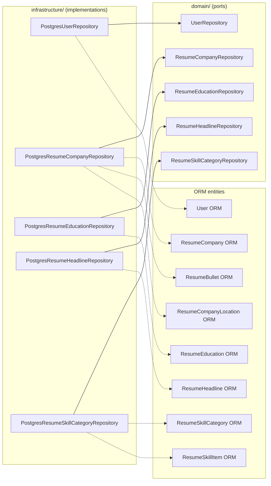

# Plan: Milestone 1B — Infrastructure Repository Implementations

## Context

Milestone 1A (PR #4) added domain entities, repository port interfaces, and DTOs for resume data. The ORM entities and database migration already exist. This step implements the infrastructure repositories that bridge the ORM layer to the domain, adds DI tokens, wires them into the API composition root, and verifies correctness with a smoke test against seeded data.

## Architecture



## Step 1: Implement 5 repository classes

All follow the existing pattern: `@injectable()`, constructor takes `MikroORM`, private `toDomain()` mapper, `flush()` after mutations.

### 1a. `infrastructure/src/repositories/PostgresUserRepository.ts`

| Method | Logic |
|---|---|
| `findByIdOrFail(id)` | `em.findOneOrFail(OrmUser, id)` → `toDomain()` |
| `findSingle()` | `em.findOneOrFail(OrmUser, {})` (single-user app) → `toDomain()` |
| `save(user)` | Find existing ORM entity, update mutable fields, `persist` + `flush` |

Mapping: straightforward field copy, `UserId` wraps `orm.id`.

### 1b. `infrastructure/src/repositories/PostgresResumeCompanyRepository.ts`

| Method | Logic |
|---|---|
| `findByIdOrFail(id)` | `em.findOneOrFail(OrmResumeCompany, id, { populate: ['bullets', 'locations'] })` → `toDomain()` |
| `findAllByUserId(userId)` | `em.find(OrmResumeCompany, { user: userId }, { populate: ['bullets', 'locations'] })` → map all |
| `save(company)` | Upsert: try find by ID. If exists → update fields + sync children. If not → create new ORM entity + children. `flush()`. |
| `delete(id)` | `em.nativeDelete(OrmResumeCompany, id)` (cascade handles children) |

Mapping (aggregate — the complex one):
- `OrmResumeCompany` → `new DomainResumeCompany({ id: new ResumeCompanyId(orm.id), userId: orm.user.id (via reference), ... })`
- `Collection<OrmResumeBullet>` → `DomainResumeBullet[]` with `new ResumeBulletId(b.id)`
- `Collection<OrmResumeCompanyLocation>` → `ResumeLocation[]` value objects with `new ResumeLocation(loc.locationLabel, loc.ordinal)`

Save logic for children (bullets + locations):
- Load existing children from DB
- Diff against domain entity's children: add new, update existing, remove deleted
- Use `em.persist()` for new/updated, `em.remove()` for deleted

### 1c. `infrastructure/src/repositories/PostgresResumeEducationRepository.ts`

| Method | Logic |
|---|---|
| `findAllByUserId(userId)` | `em.find(OrmResumeEducation, { user: userId }, { orderBy: { ordinal: 'ASC' } })` → map |
| `save(education)` | Upsert by ID: find or create, set fields, `flush()` |
| `delete(id)` | `em.nativeDelete(OrmResumeEducation, id)` |

Mapping: flat entity, straightforward field copy with `ResumeEducationId`.

### 1d. `infrastructure/src/repositories/PostgresResumeHeadlineRepository.ts`

| Method | Logic |
|---|---|
| `findByIdOrFail(id)` | `em.findOneOrFail(OrmResumeHeadline, id)` → `toDomain()` |
| `findAllByUserId(userId)` | `em.find(OrmResumeHeadline, { user: userId })` → map |
| `save(headline)` | Upsert by ID, `flush()` |
| `delete(id)` | `em.nativeDelete(OrmResumeHeadline, id)` |

Mapping: flat, straightforward.

### 1e. `infrastructure/src/repositories/PostgresResumeSkillCategoryRepository.ts`

| Method | Logic |
|---|---|
| `findByIdOrFail(id)` | `em.findOneOrFail(OrmResumeSkillCategory, id, { populate: ['items'] })` → `toDomain()` |
| `findAllByUserId(userId)` | `em.find(OrmResumeSkillCategory, { user: userId }, { populate: ['items'], orderBy: { ordinal: 'ASC' } })` → map |
| `save(category)` | Upsert + sync items (same diff pattern as company bullets) |
| `delete(id)` | `em.nativeDelete(OrmResumeSkillCategory, id)` (cascade handles items) |

Mapping (aggregate):
- `Collection<OrmResumeSkillItem>` → `DomainResumeSkillItem[]` with `new ResumeSkillItemId(item.id)`

## Step 2: Add DI tokens

**File:** `infrastructure/src/DI.ts`

Add under a new `// Resume data ports` section:
```
UserRepository: new InjectionToken<UserRepository>('DI.UserRepository'),
ResumeCompanyRepository: new InjectionToken<ResumeCompanyRepository>('DI.ResumeCompanyRepository'),
ResumeEducationRepository: new InjectionToken<ResumeEducationRepository>('DI.ResumeEducationRepository'),
ResumeHeadlineRepository: new InjectionToken<ResumeHeadlineRepository>('DI.ResumeHeadlineRepository'),
ResumeSkillCategoryRepository: new InjectionToken<ResumeSkillCategoryRepository>('DI.ResumeSkillCategoryRepository'),
```

## Step 3: Update infrastructure barrel

**File:** `infrastructure/src/index.ts`

Add exports for all 5 new repository classes.

## Step 4: Wire into API composition root

**File:** `api/src/index.ts`

Add bindings:
```typescript
container.bind({ provide: DI.UserRepository, useClass: PostgresUserRepository });
container.bind({ provide: DI.ResumeCompanyRepository, useClass: PostgresResumeCompanyRepository });
container.bind({ provide: DI.ResumeEducationRepository, useClass: PostgresResumeEducationRepository });
container.bind({ provide: DI.ResumeHeadlineRepository, useClass: PostgresResumeHeadlineRepository });
container.bind({ provide: DI.ResumeSkillCategoryRepository, useClass: PostgresResumeSkillCategoryRepository });
```

## Step 5: Smoke test

**File:** `infrastructure/test/repositories/smoke.test.ts`

Integration test that requires a running PostgreSQL with seeded data (from `ResumeDataSeeder`). Tests:

1. **UserRepository**: `findSingle()` returns a user with expected fields populated
2. **ResumeCompanyRepository**: `findAllByUserId()` returns companies with nested bullets and locations
3. **ResumeEducationRepository**: `findAllByUserId()` returns education entries ordered by ordinal
4. **ResumeHeadlineRepository**: `findAllByUserId()` returns headlines
5. **ResumeSkillCategoryRepository**: `findAllByUserId()` returns categories with nested items

The test initializes MikroORM, calls each repository method, and asserts domain objects have correct types and non-empty data. This validates the full chain: DB → ORM entity → domain mapping.

Add `test` and `test:coverage` scripts to `infrastructure/package.json`.

## Files to create/modify

| Action | File |
|---|---|
| **Create** | `infrastructure/src/repositories/PostgresUserRepository.ts` |
| **Create** | `infrastructure/src/repositories/PostgresResumeCompanyRepository.ts` |
| **Create** | `infrastructure/src/repositories/PostgresResumeEducationRepository.ts` |
| **Create** | `infrastructure/src/repositories/PostgresResumeHeadlineRepository.ts` |
| **Create** | `infrastructure/src/repositories/PostgresResumeSkillCategoryRepository.ts` |
| **Create** | `infrastructure/test/repositories/smoke.test.ts` |
| **Edit** | `infrastructure/src/DI.ts` — add 5 DI tokens |
| **Edit** | `infrastructure/src/index.ts` — add 5 exports |
| **Edit** | `api/src/index.ts` — add 5 DI bindings + imports |
| **Edit** | `infrastructure/package.json` — add test/test:coverage scripts |

## Verification

1. `bun run --cwd infrastructure typecheck` — no type errors
2. `bun run check` — Biome lint/format passes
3. `bun run db:migration:up && bun run db:seed` — seed data loads
4. `bun run --cwd infrastructure test` — smoke test passes (requires running Postgres with seeded data)
5. `bun run dep:check` — no dependency boundary violations