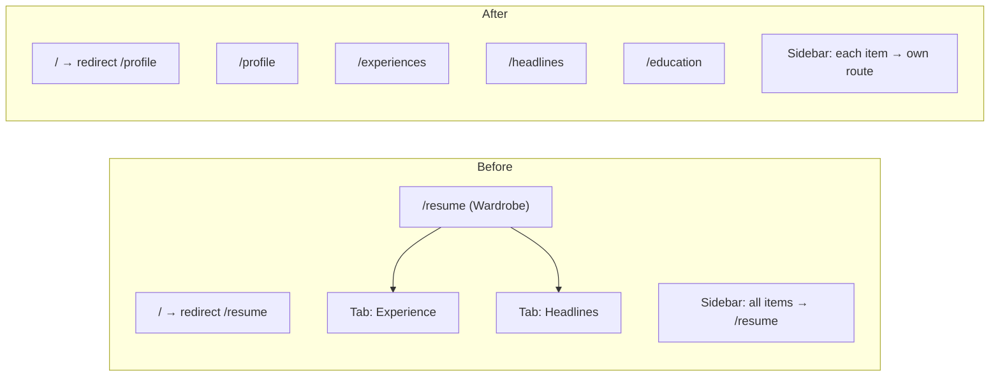

# Plan: UI/UX Revision — Remove Wardrobe, Per-Aggregate Routes

## Context

The current web app funnels everything through a single `/resume` "Wardrobe" page with tabs. All sidebar items point to `/resume`. Education and Profile nav items do nothing. The TODO asks us to remove the wardrobe concept entirely, give each aggregate its own route, and make the site open to the profile page.

## Architecture Change



## Steps

### 1. Create `use-educations.ts` hook

**Create** `web/src/hooks/use-educations.ts`

Follow the exact pattern from `use-headlines.ts`. Education API fields (snake_case for API body):
- `degree_title`, `institution_name`, `graduation_year`, `location`, `honors`, `ordinal`

Response DTO fields (camelCase): `id`, `degreeTitle`, `institutionName`, `graduationYear`, `location`, `honors`, `ordinal`

Export: `useEducations()`, `useCreateEducation()`, `useUpdateEducation()`, `useDeleteEducation()`

### 2. Move components from `wardrobe/` to `resume/` feature dirs

Per `web/CLAUDE.md`, components live under `src/components/resume/<feature>/`.

| Source | Destination | Rename |
|--------|-------------|--------|
| `components/wardrobe/ExperienceTab.tsx` | `components/resume/experience/ExperienceList.tsx` | `ExperienceTab` → `ExperienceList` |
| `components/wardrobe/AccomplishmentEditor.tsx` | `components/resume/experience/AccomplishmentEditor.tsx` | (no rename) |
| `components/wardrobe/HeadlineTab.tsx` | `components/resume/headlines/HeadlineList.tsx` | `HeadlineTab` → `HeadlineList` |

**Create** `components/resume/education/EducationList.tsx` — new CRUD list component modeled after HeadlineList, showing: institution, degree, graduation year, location, honors. Add/edit/delete with inline forms.

### 3. Create four route pages

Each route is a thin wrapper — page title + subtitle + feature component.

| Route file | Path | Component | Title |
|------------|------|-----------|-------|
| `routes/profile/index.tsx` | `/profile` | Inline (uses `useProfile()`) | Profile |
| `routes/experiences/index.tsx` | `/experiences` | `<ExperienceList />` | Experiences |
| `routes/headlines/index.tsx` | `/headlines` | `<HeadlineList />` | Headlines |
| `routes/education/index.tsx` | `/education` | `<EducationList />` | Education |

**Profile page**: Display profile fields (name, email, phone, location, LinkedIn, GitHub, website) in a clean read-only layout. Keep it simple — editing can be added later.

### 4. Update home redirect

**Modify** `web/src/routes/index.tsx`: change redirect from `/resume` to `/profile`.

### 5. Update sidebar navigation

**Modify** `web/src/components/layout/sidebar.tsx`: each nav item points to its own route.

```
Profile    → /profile
Experience → /experiences
Headlines  → /headlines
Education  → /education
```

### 6. Delete old wardrobe files

- Delete `web/src/routes/resume/index.tsx` and `web/src/routes/resume/` dir
- Delete `web/src/components/wardrobe/` dir (all 3 files)

### 7. Seed E2E test data

**Modify** `infrastructure/src/db/seeds/E2eSeeder.ts`

After truncating, insert fixture data via raw SQL so E2E tests have content to work with:

- **1 profile**: first/last name, email, phone, location, LinkedIn/GitHub/website URLs
- **2 experiences**: with different companies, titles, dates, narratives — one with 2 accomplishments, one with 1
- **3 headlines**: different labels and summary texts
- **2 educations**: different institutions, degrees, graduation years

Use raw SQL inserts (matching the existing truncate pattern) with hardcoded UUIDs so tests can reference specific entities.

### 8. E2E tests

All tests go in `e2e/tests/`. The E2E infrastructure is fully set up (Testcontainers Postgres + API + Vite dev server, global setup/teardown) but has zero tests — these will be the first.

#### Test file structure

```
e2e/tests/
├── navigation.spec.ts      ← Routing, redirects, sidebar navigation
├── profile.spec.ts          ← Profile page display
├── experiences.spec.ts      ← Experience list, expand/collapse, narrative, accomplishments
├── headlines.spec.ts        ← Headline CRUD
└── education.spec.ts        ← Education CRUD
```

#### `navigation.spec.ts` — Routing & Sidebar

Tests the structural changes from this revision:

| Test | What it verifies |
|------|-----------------|
| `home redirects to profile` | Navigate to `/`, assert URL is `/profile` |
| `sidebar has all four nav items` | Assert 4 items visible: Profile, Experience, Headlines, Education |
| `sidebar Profile navigates to /profile` | Click Profile, assert URL + page heading |
| `sidebar Experience navigates to /experiences` | Click Experience, assert URL + page heading |
| `sidebar Headlines navigates to /headlines` | Click Headlines, assert URL + page heading |
| `sidebar Education navigates to /education` | Click Education, assert URL + page heading |
| `active sidebar item highlights correctly` | Navigate to each route, verify the corresponding sidebar item has active state |
| `/resume no longer exists` | Navigate to `/resume`, assert it does not render the old Wardrobe page |

#### `profile.spec.ts` — Profile Page

| Test | What it verifies |
|------|-----------------|
| `displays profile heading` | Page has "Profile" h1 |
| `shows profile fields from seeded data` | First name, last name, email, phone, location, LinkedIn URL, GitHub URL, website URL all visible |
| `handles missing optional fields gracefully` | Null fields (phone, URLs) show placeholder or are absent — no broken rendering |

#### `experiences.spec.ts` — Experience List

| Test | What it verifies |
|------|-----------------|
| `displays page heading` | "Experiences" h1 visible |
| `lists all seeded experiences` | Both seeded experiences visible by company name and title |
| `shows accomplishment count per experience` | Badge/text shows correct count (2 and 1) |
| `expand experience shows narrative and accomplishments` | Click to expand, assert narrative textarea and accomplishment titles visible |
| `collapse experience hides details` | Click again to collapse, details hidden |
| `edit narrative and save on blur` | Expand, change narrative text, blur, verify toast "Narrative saved" |
| `add accomplishment` | Click "Add accomplishment" button, verify new empty accomplishment appears |
| `edit accomplishment` | Click edit on accomplishment, change title/narrative, save, verify updated |
| `delete accomplishment` | Click delete on accomplishment, verify removed from list |

#### `headlines.spec.ts` — Headline CRUD

| Test | What it verifies |
|------|-----------------|
| `displays page heading` | "Headlines" h1 visible |
| `lists all seeded headlines` | All 3 seeded headlines visible with labels and summary texts |
| `create a new headline` | Click "Add headline variant", fill label + summary, save, verify appears in list |
| `edit a headline` | Hover, click pencil icon, change label, save, verify updated |
| `delete a headline` | Hover, click trash icon, verify removed from list |
| `validation: empty label shows error` | Try to save with empty label, verify error toast |

#### `education.spec.ts` — Education CRUD

| Test | What it verifies |
|------|-----------------|
| `displays page heading` | "Education" h1 visible |
| `lists all seeded educations` | Both seeded educations visible with institution, degree, year |
| `create a new education` | Click add, fill institution + degree + year, save, verify appears |
| `edit an education` | Hover, click edit, change degree title, save, verify updated |
| `delete an education` | Hover, click delete, verify removed |

#### E2E test patterns to follow

- Use `page.getByRole()` and `page.getByText()` selectors (accessibility-first, no fragile CSS selectors)
- Add `data-testid` attributes to components only where role/text selectors are ambiguous
- Each test file uses `test.describe()` for grouping
- Tests that mutate data should be ordered or isolated (since E2E seeder runs once per suite)
- Use `page.waitForURL()` after navigation actions
- Use `expect(page).toHaveURL()` for route assertions
- Use `expect(locator).toBeVisible()` / `toBeHidden()` for expand/collapse

## Files Summary

| Action | File |
|--------|------|
| Create | `web/src/hooks/use-educations.ts` |
| Create | `web/src/components/resume/experience/ExperienceList.tsx` |
| Create | `web/src/components/resume/experience/AccomplishmentEditor.tsx` |
| Create | `web/src/components/resume/headlines/HeadlineList.tsx` |
| Create | `web/src/components/resume/education/EducationList.tsx` |
| Create | `web/src/routes/profile/index.tsx` |
| Create | `web/src/routes/experiences/index.tsx` |
| Create | `web/src/routes/headlines/index.tsx` |
| Create | `web/src/routes/education/index.tsx` |
| Modify | `web/src/routes/index.tsx` |
| Modify | `web/src/components/layout/sidebar.tsx` |
| Modify | `infrastructure/src/db/seeds/E2eSeeder.ts` |
| Create | `e2e/tests/navigation.spec.ts` |
| Create | `e2e/tests/profile.spec.ts` |
| Create | `e2e/tests/experiences.spec.ts` |
| Create | `e2e/tests/headlines.spec.ts` |
| Create | `e2e/tests/education.spec.ts` |
| Delete | `web/src/routes/resume/index.tsx` |
| Delete | `web/src/components/wardrobe/ExperienceTab.tsx` |
| Delete | `web/src/components/wardrobe/HeadlineTab.tsx` |
| Delete | `web/src/components/wardrobe/AccomplishmentEditor.tsx` |

## Verification

1. `bun run typecheck` — no type errors
2. `bun run check` — Biome passes
3. `bun run test:e2e` — all E2E tests pass (navigation, profile, experiences, headlines, education)
4. Manual spot-check: `bun run dev` → navigate all routes, verify sidebar highlighting
