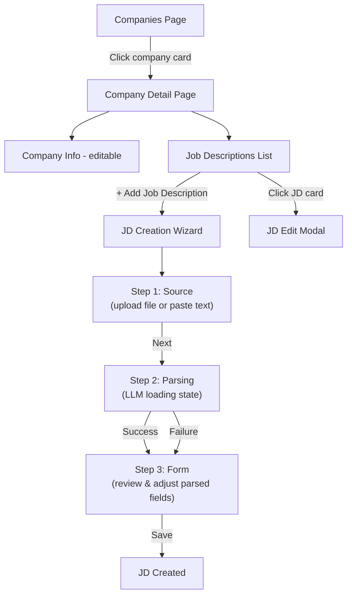
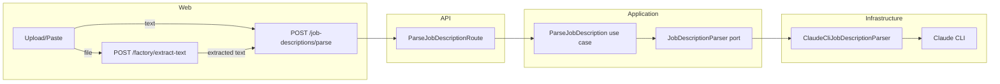

# Job Description Management UI

## Context

TailoredIn needs UI for managing Job Descriptions. JDs are scoped to companies — the company must exist first. JDs are created from documents (PDF, DOCX, MD) or pasted text. An LLM parses the input into structured fields, the user reviews/adjusts, then saves.

The backend (domain, application, infrastructure, API) already has full CRUD for job descriptions. What's missing:
1. **LLM parsing pipeline** for extracting structured JD data from text
2. **Company detail page** — clicking a company navigates to its detail view with JDs listed below
3. **JD UI components** — cards, creation wizard modal, edit modal

### UX Flow



### Architecture Flow (parse pipeline)



---

## Phase 1: Backend — LLM Parsing Pipeline

### 1.1 Application port: `JobDescriptionParser`

**File:** `application/src/ports/JobDescriptionParser.ts`

```typescript
export type JobDescriptionParseResult = {
  title: string | null;
  description: string | null;
  url: string | null;
  location: string | null;
  salaryMin: number | null;
  salaryMax: number | null;
  salaryCurrency: string | null;
  level: JobLevel | null;
  locationType: LocationType | null;
  postedAt: string | null;
};

export interface JobDescriptionParser {
  parseFromText(text: string): Promise<JobDescriptionParseResult>;
}
```

**Also update:** `application/src/ports/index.ts` — add export.

### 1.2 Use case: `ParseJobDescription`

**File:** `application/src/use-cases/job-description/ParseJobDescription.ts`

Thin use case delegating to the port. Input: `{ text: string }`. Output: `JobDescriptionParseResult`.

**Also update:** `application/src/use-cases/index.ts` — add export.

### 1.3 Prompt template

**File:** `infrastructure/src/services/prompts/parse-job-description.md`

Follows `enrich-company.md` pattern. Instructs the LLM to extract JD fields from raw text. Template variables: `{{text}}`, `{{levels}}`, `{{locationTypes}}`. Returns null for uncertain fields.

### 1.4 Infrastructure adapter: `ClaudeCliJobDescriptionParser`

**File:** `infrastructure/src/services/ClaudeCliJobDescriptionParser.ts`

Follows `ClaudeCliCompanyDataProvider.ts` pattern exactly:
- Zod schema matching `JobDescriptionParseResult`
- Inner `JobDescriptionParseRequest extends LlmJsonRequest<typeof schema>`
- `@injectable()` class implements `JobDescriptionParser`
- Injects `ClaudeCliProvider` via `inject(DI.Llm.ClaudeCliProvider)`

**Reuse:** `infrastructure/src/services/llm/LlmJsonRequest.ts`, `ClaudeCliProvider.ts`, `BaseLlmCliProvider.ts`

### 1.5 DI tokens

**File:** `infrastructure/src/DI.ts`

Add to `JobDescription` namespace:
- `Parser: InjectionToken<JobDescriptionParser>`
- `Parse: InjectionToken<ParseJobDescription>`

### 1.6 API route: `ParseJobDescriptionRoute`

**File:** `api/src/routes/job-description/ParseJobDescriptionRoute.ts`

```
POST /job-descriptions/parse
Body: { text: string }
Response: { data: JobDescriptionParseResult }
```

**Also update:**
- `api/src/container.ts` — bind `ClaudeCliJobDescriptionParser`, wire `ParseJobDescription`
- `api/src/index.ts` — mount route (before parameterized `/job-descriptions/:id` routes to avoid conflicts)

---

## Phase 2: Frontend — Company Detail Page

### 2.1 Change company card click behavior

**File:** `web/src/components/companies/CompanyCard.tsx`

Change from `<button onClick>` to `<Link to="/companies/$companyId">`. Keep the same visual styling (hover bg-accent/40). External link icons still stop propagation.

**File:** `web/src/components/companies/CompanyList.tsx`

Remove the `edit` modal state and the edit `CompanyFormModal` render. Keep only the `create` modal. The card no longer opens an edit modal — it navigates to the detail page instead.

### 2.2 New route: `/companies/$companyId`

**File:** `web/src/routes/companies/$companyId.tsx`

```typescript
export const Route = createFileRoute('/companies/$companyId')({ component: CompanyDetailPage });
```

The page renders:
- Company info section at top (with edit button → opens `CompanyFormModal` in edit mode)
- Job descriptions section below

### 2.3 Company detail page component

**File:** `web/src/components/companies/CompanyDetail.tsx`

Layout:
- Back link to `/companies`
- Company header: logo, name, description, badges, external links, "Edit" button
- Divider
- "Job Descriptions" section with `<JobDescriptionList companyId={id} />`

Uses `useCompanies()` to get company data (already cached from the list page), or a new `useCompany(id)` hook if needed.

### 2.4 Hook: `useCompany(id)`

**File:** `web/src/hooks/use-companies.ts`

Add a `useCompany(id)` query hook that calls `GET /companies/:id`. This is needed because navigating directly to `/companies/$companyId` won't have the list cached.

**Note:** Check if a `GetCompanyRoute` exists. If not, the detail page can filter from `useCompanies()` list data (simpler, avoids backend changes). Since this is a personal tool with a small company count, filtering from the list query is fine.

---

## Phase 3: Frontend — Job Description Components

### 3.1 Query keys

**File:** `web/src/lib/query-keys.ts`

```typescript
jobDescriptions: {
  all: ['jobDescriptions'] as const,
  list: (companyId: string) => ['jobDescriptions', 'list', companyId] as const,
}
```

### 3.2 Hooks

**File:** `web/src/hooks/use-job-descriptions.ts`

Following `use-companies.ts` pattern:

| Hook | Method | Endpoint |
|------|--------|----------|
| `useJobDescriptions(companyId)` | GET | `/job-descriptions?company_id=` |
| `useCreateJobDescription()` | POST | `/job-descriptions` |
| `useUpdateJobDescription()` | PUT | `/job-descriptions/:id` |
| `useDeleteJobDescription()` | DELETE | `/job-descriptions/:id` |
| `useParseJobDescription()` | POST | `/job-descriptions/parse` |
| `useExtractText()` | POST | `/factory/extract-text` (FormData) |

### 3.3 Validation

**File:** `web/src/lib/validation.ts`

Add `JobDescriptionFormState` and `validateJobDescription`:
- Required: `title`, `description`
- All other fields optional

### 3.4 Options file

**File:** `web/src/components/job-descriptions/job-description-options.ts`

Export arrays for select dropdowns:
- `jobLevelOptions` — Internship, Entry Level, Associate, Mid-Senior, Director, Executive
- `locationTypeOptions` — Remote, Hybrid, Onsite
- `currencyOptions` — USD, EUR, GBP, etc.
- `formatEnumLabel()` helper

### 3.5 Job Description Card

**File:** `web/src/components/job-descriptions/JobDescriptionCard.tsx`

Displays: title, location, level badge, location type badge, salary range (if present), posted date. Click opens edit modal. Same visual pattern as `CompanyCard` (border, rounded-[14px], hover bg-accent/40).

### 3.6 Job Description Form Modal (creation wizard)

**File:** `web/src/components/job-descriptions/JobDescriptionFormModal.tsx`

**Steps:** `'source' | 'parsing' | 'form'`

**Source step:**
- Two input modes (tabs or radio): "Upload file" or "Paste text"
- File upload: drop zone accepting `.pdf, .txt, .md` (DOCX deferred — `ExtractTextRoute` only handles PDF + plain text)
- Text paste: `<Textarea>` for raw JD content
- "Next" enabled when file selected OR text pasted

**Parsing step:**
- If file: call `useExtractText()` → then `useParseJobDescription()` with extracted text
- If text: call `useParseJobDescription()` directly
- Spinner + "Parsing job description..." message
- On error: toast + fallback to empty form

**Form step:**
- Pre-populated from parse result via `setFields()`
- Fields: title (required), description (required, textarea), url, location, salary min/max/currency (3-col grid), level (select), locationType (select), postedAt (date input)
- `source` is auto-set to `UPLOAD` (not shown in form)
- `companyId` comes from props (implicit from company detail page)
- Dirty tracking, validation on save, same patterns as `CompanyFormModal`

**Edit mode:** When `jobDescription` prop is provided, opens directly to form step. No re-parsing.

### 3.7 Job Description List

**File:** `web/src/components/job-descriptions/JobDescriptionList.tsx`

Props: `{ companyId: string }`

- Fetches JDs via `useJobDescriptions(companyId)`
- Search bar (filters by title)
- List of `JobDescriptionCard` components
- "Add job description" dashed button
- Modal state: `closed | create | edit`
- Empty state: "No job descriptions yet."

---

## Phase 4: Wiring & Polish

### 4.1 Mount new route in app

The TanStack Router Vite plugin auto-generates `routeTree.gen.ts` when the route file is created. No manual wiring needed.

### 4.2 Delete support

Add delete button in the edit modal footer (or as a destructive action). Uses `useDeleteJobDescription()` + confirmation dialog.

---

## Verification

1. `bun run typecheck` — no type errors across all packages
2. `bun run check` — Biome lint + format passes
3. `bun run test` — unit tests pass
4. `bun wt:up` — start worktree environment
5. Manual testing:
   - Navigate to Companies page → click a company → see detail page with JD section
   - Click "+ Add Job Description" → paste text → LLM parses → review form → save
   - Click a JD card → edit form → save changes
   - Delete a JD
   - Upload a PDF → verify text extraction + parsing
6. `bun run dep:check` — architecture boundaries respected
7. `bun run knip` — no dead exports

## Critical Files

| Purpose | File |
|---------|------|
| Company card (modify) | `web/src/components/companies/CompanyCard.tsx` |
| Company list (modify) | `web/src/components/companies/CompanyList.tsx` |
| Company form modal (reference) | `web/src/components/companies/CompanyFormModal.tsx` |
| LLM adapter (reference) | `infrastructure/src/services/ClaudeCliCompanyDataProvider.ts` |
| LLM request base class | `infrastructure/src/services/llm/LlmJsonRequest.ts` |
| Prompt template (reference) | `infrastructure/src/services/prompts/enrich-company.md` |
| DI tokens (modify) | `infrastructure/src/DI.ts` |
| Container (modify) | `api/src/container.ts` |
| API entry (modify) | `api/src/index.ts` |
| Extract text route (reuse) | `api/src/routes/factory/ExtractTextRoute.ts` |
| Query keys (modify) | `web/src/lib/query-keys.ts` |
| Validation (modify) | `web/src/lib/validation.ts` |
| Hooks (reference) | `web/src/hooks/use-companies.ts` |
