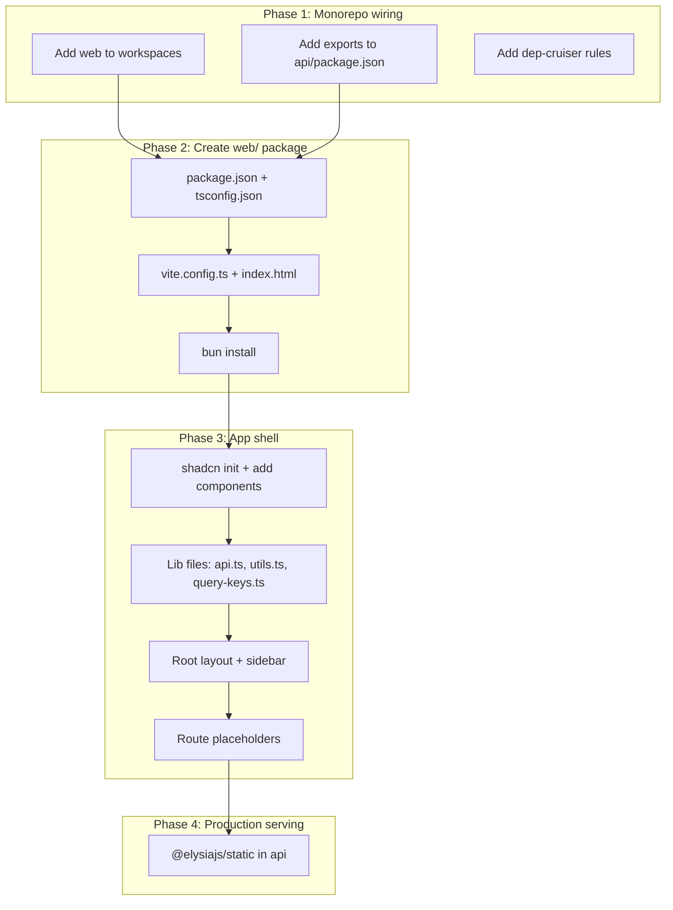

# Plan: 3A — Frontend Scaffold

## Context

TailoredIn is transitioning from a CLI-only tool to a web-first application. Step 3A creates the `web/` package — a React 19 SPA that will become the primary interface. The framework decision is already made (see `.claude/plans/frontend-framework-decision.md`); this plan covers the actual implementation.

## Decisions (from interview)

| Question | Answer |
|---|---|
| Production serving | Elysia serves the SPA via `@elysiajs/static` — single process, no CORS |
| Path alias | `@/` → `src/` in both vite.config.ts and tsconfig.json |
| Initial shadcn components | Shell essentials + form basics: button, sidebar, toast, separator, scroll-area, input, label, select, dialog, card, badge, table |
| Testing | Skip for now — no Vitest/RTL config in this step |

## Implementation

### Phase 1: Monorepo wiring

**Files to modify:**

- **`package.json`** (root) — add `"web"` to workspaces array, add scripts:
  ```
  "web": "bun run --cwd web dev",
  "web:build": "bun run --cwd web build",
  "web:preview": "bun run --cwd web preview"
  ```
- **`api/package.json`** — add `"exports": { ".": "./src/index.ts" }` for Eden Treaty type import
- **`.dependency-cruiser.cjs`** — add 3 rules:
  - `web-no-infrastructure`: web/ cannot import infrastructure/
  - `web-not-depends-on-cli`: web/ cannot import cli/
  - `cli-not-depends-on-web`: cli/ cannot import web/

### Phase 2: Create `web/` package

**New files:**

- **`web/package.json`** — `@tailoredin/web`, type: module, dependencies:
  - react, react-dom (^19.0)
  - @elysiajs/eden
  - @tanstack/react-query (^5.0), @tanstack/react-router (^1.0), @tanstack/react-router-vite-plugin
  - @tailoredin/api (workspace:*, for type import)
  - @tailoredin/domain (workspace:*, for enums like JobStatus)
  - tailwindcss (^4.0), @tailwindcss/vite
  - lucide-react, sonner, date-fns
  - react-hook-form (^7.0), @hookform/resolvers (^3.0), zod
  - DevDeps: vite (^6.0), @vitejs/plugin-react, typescript (^5.7), @types/react, @types/react-dom

- **`web/tsconfig.json`** — standalone (does NOT extend tsconfig.base.json):
  - `"module": "ESNext"`, `"moduleResolution": "bundler"`, `"jsx": "react-jsx"`
  - `"lib": ["es2022", "DOM", "DOM.Iterable"]`
  - `"paths": { "@/*": ["./src/*"] }`
  - `"strict": true`, `"noEmit": true`

- **`web/vite.config.ts`**:
  - Plugins: TanStackRouterVite(), react(), tailwindcss()
  - Dev server port 5173, proxy `/api` → `http://localhost:8000` (rewrite to strip `/api` prefix)
  - Resolve alias: `@/` → `./src`

- **`web/index.html`** — minimal SPA entry point

### Phase 3: App shell + routing

**New files in `web/src/`:**

```
web/src/
├── main.tsx                     # React root + QueryClientProvider + RouterProvider
├── app.css                      # Tailwind 4 @theme + @import "tailwindcss"
├── lib/
│   ├── api.ts                   # Eden Treaty client: treaty<App>('/api')
│   ├── utils.ts                 # cn() helper (clsx + tailwind-merge)
│   └── query-keys.ts            # TanStack Query key factory
├── routes/
│   ├── __root.tsx               # Root layout: sidebar nav + content area + Toaster
│   ├── index.tsx                # / → redirect to /jobs
│   ├── jobs/
│   │   ├── index.tsx            # /jobs — placeholder page
│   │   └── $jobId.tsx           # /jobs/:jobId — placeholder page
│   ├── resume/
│   │   ├── experience.tsx       # /resume/experience — placeholder
│   │   ├── skills.tsx           # /resume/skills — placeholder
│   │   ├── education.tsx        # /resume/education — placeholder
│   │   └── profile.tsx          # /resume/profile — placeholder
│   └── archetypes/
│       ├── index.tsx            # /archetypes — placeholder
│       └── $archetypeId.tsx     # /archetypes/:id — placeholder
├── components/
│   ├── ui/                      # shadcn/ui generated (button, card, dialog, etc.)
│   └── layout/
│       └── sidebar.tsx          # Sidebar navigation component
└── routeTree.gen.ts             # Auto-generated by TanStack Router plugin
```

**Sidebar nav links:**
- Jobs → `/jobs`
- Resume (section header)
  - Profile → `/resume/profile`
  - Experience → `/resume/experience`
  - Skills → `/resume/skills`
  - Education → `/resume/education`
- Archetypes → `/archetypes`

**Route placeholders:** Each page renders a heading with the page name. No API calls, no data — just the routing skeleton.

### Phase 4: Production serving setup

**File to modify:**

- **`api/src/index.ts`** — add `@elysiajs/static` plugin to serve `web/dist/` in production. Conditionally enabled (only when the built assets exist or based on environment). SPA fallback: serve `index.html` for all non-API routes.

- **`api/package.json`** — add `@elysiajs/static` dependency

### Phase 5: shadcn/ui init + components

Run `bunx shadcn@latest init` in `web/` to generate `components.json` and base styles, then add components:

```
bunx shadcn@latest add button card dialog table badge input label select separator scroll-area
```

Also install `sonner` for toast notifications (shadcn-integrated).



## Verification

1. `bun install` — no workspace resolution errors
2. `bun run web` — Vite dev server starts on port 5173
3. Navigate to `http://localhost:5173` — sidebar renders, links work, pages show placeholders
4. Click through all routes — no 404s, correct page headings
5. `bun run dep:check` — no dependency violations
6. `bun run check` — Biome passes on web/ files
7. Start API (`bun run backend`) + dev server — `/api` proxy works (e.g., `/api/health` returns OK)
8. `bun run web:build` — Vite build succeeds, outputs to `web/dist/`