# Domain Model

```mermaid
---
title: TailoredIn — Domain Entities & Relationships
---

classDiagram
    direction TB

    %% ──────────────────────────────────────────────
    %%  Job Discovery Subdomain
    %% ──────────────────────────────────────────────

    class Company {
        <<AggregateRoot>>
        +CompanyId id
        +string name
        +string linkedinLink
        +string? website
        +string? logoUrl
        +boolean ignored
        +BusinessType? businessType
        +Industry? industry
        +CompanyStage? stage
    }

    class CompanyBrief {
        <<AggregateRoot>>
        +CompanyBriefId id
        +string companyId
        +string productOverview
        +string techStack
        +string culture
        +string recentNews
        +string keyPeople
        +refresh()
    }

    class JobPosting {
        <<AggregateRoot>>
        +JobId id
        +string companyId
        +JobStatus status
        +string linkedinId
        +string title
        +string locationRaw
        +string description
        +number? salaryLow
        +number? salaryHigh
        +number? applicantsCount
        +JobScores? scores
        +changeStatus()
        +retire()
        +score()
    }

    class Skill {
        <<Entity>>
        +SkillId id
        +string name
        +string key
        +SkillAffinity affinity
        +string[] variants
    }

    class Resume {
        <<AggregateRoot>>
        +ResumeId id
        +string jobId
        +Archetype archetype
        +string[] keywords
        +string outputPath
    }

    Company "1" --> "*" JobPosting : has
    Company "1" --> "0..1" CompanyBrief : has
    JobPosting "1" --> "0..1" Resume : generates
    JobPosting ..> Skill : scores reference

    %% ──────────────────────────────────────────────
    %%  Resume / Profile Subdomain
    %% ──────────────────────────────────────────────

    class User {
        <<Entity>>
        +UserId id
        +string email
        +string firstName
        +string lastName
        +string? phoneNumber
        +string? githubHandle
        +string? linkedinHandle
        +string? locationLabel
    }

    class ResumeHeadline {
        <<Entity>>
        +ResumeHeadlineId id
        +string userId
        +string headlineLabel
        +string summaryText
    }

    class ResumeEducation {
        <<Entity>>
        +ResumeEducationId id
        +string userId
        +string degreeTitle
        +string institutionName
        +string graduationYear
        +string locationLabel
        +number ordinal
    }

    class ResumeCompany {
        <<AggregateRoot>>
        +ResumeCompanyId id
        +string userId
        +string companyName
        +string? companyMention
        +string businessDomain
        +ResumeLocation[] locations
        +addPosition()
        +removePosition()
    }

    class ResumePosition {
        <<Entity>>
        +ResumePositionId id
        +string resumeCompanyId
        +string title
        +string startDate
        +string endDate
        +string? summary
        +number ordinal
        +addBullet()
    }

    class ResumeBullet {
        <<Entity>>
        +ResumeBulletId id
        +string resumePositionId
        +string content
        +number ordinal
    }

    class ResumeSkillCategory {
        <<AggregateRoot>>
        +ResumeSkillCategoryId id
        +string userId
        +string categoryName
        +number ordinal
        +addItem()
    }

    class ResumeSkillItem {
        <<Entity>>
        +ResumeSkillItemId id
        +string categoryId
        +string skillName
        +number ordinal
    }

    User "1" --> "*" ResumeHeadline : has
    User "1" --> "*" ResumeEducation : has
    User "1" --> "*" ResumeCompany : has
    User "1" --> "*" ResumeSkillCategory : has
    ResumeCompany "1" --> "*" ResumePosition : has
    ResumePosition "1" --> "*" ResumeBullet : has
    ResumeSkillCategory "1" --> "*" ResumeSkillItem : has

    %% ──────────────────────────────────────────────
    %%  Archetype / Tailoring Subdomain
    %% ──────────────────────────────────────────────

    class ArchetypeConfig {
        <<AggregateRoot>>
        +ArchetypeConfigId id
        +string userId
        +Archetype archetypeKey
        +string archetypeLabel
        +string headlineId
        +string[] socialNetworks
        +replacePositions()
        +replaceEducationSelections()
        +replaceSkillSelections()
    }

    class ArchetypePosition {
        <<Entity>>
        +ArchetypePositionId id
        +string archetypeId
        +string resumePositionId
        +string? jobTitle
        +string displayCompanyName
        +string locationLabel
        +number ordinal
        +ArchetypePositionBulletRef[] bullets
    }

    User "1" --> "*" ArchetypeConfig : has
    ArchetypeConfig "1" --> "*" ArchetypePosition : has
    ArchetypeConfig --> ResumeHeadline : references
    ArchetypePosition ..> ResumePosition : selects from
    ArchetypeConfig ..> ResumeEducation : selects from
    ArchetypeConfig ..> ResumeSkillCategory : selects from
    ArchetypeConfig ..> ResumeSkillItem : selects from

    %% ──────────────────────────────────────────────
    %%  Enums
    %% ──────────────────────────────────────────────

    class JobStatus {
        <<enumeration>>
        NEW
        LATER
        APPLIED
        RECRUITER_SCREEN
        TECHNICAL_SCREEN
        HM_SCREEN
        ON_SITE
        OFFER
        REJECTED
        NO_NEWS
        UNFIT
        EXPIRED
        LOW_SALARY
        RETIRED
        DUPLICATE
        HIGH_APPLICANTS
        LOCATION_UNFIT
        POSTED_TOO_LONG_AGO
    }

    class Archetype {
        <<enumeration>>
        HANDS_ON_MANAGER
        LEADER_MANAGER
        IC
        LEAD_IC
        NERD
    }

    class SkillAffinity {
        <<enumeration>>
        EXPERT
        INTEREST
        AVOID
    }

    class BusinessType {
        <<enumeration>>
        B2B
        B2C
        B2B2C
        B2G
        D2C
        MARKETPLACE
        PLATFORM
    }

    class Industry {
        <<enumeration>>
        AUTOMOBILE
        SECURITY
        FINANCE
        HEALTHCARE
        EDUCATION
        E_COMMERCE
        ...24 total
    }

    class CompanyStage {
        <<enumeration>>
        SEED
        SERIES_A
        SERIES_B
        SERIES_C
        SERIES_D_PLUS
        GROWTH
        PUBLIC
        BOOTSTRAPPED
        ACQUIRED
    }

    JobPosting --> JobStatus
    JobPosting ..> SkillAffinity : scores keyed by
    Company --> BusinessType
    Company --> Industry
    Company --> CompanyStage
    ArchetypeConfig --> Archetype
    Resume --> Archetype
    Skill --> SkillAffinity

    %% ──────────────────────────────────────────────
    %%  Value Objects
    %% ──────────────────────────────────────────────

    class ResumeLocation {
        <<ValueObject>>
        +string label
        +number ordinal
    }

    class TailoringScore {
        <<ValueObject>>
        +number matched
        +number total
        +ratio()
        +percentage()
    }

    class ArchetypePositionBulletRef {
        <<ValueObject>>
        +string bulletId
        +number ordinal
    }

    class ArchetypeEducationSelection {
        <<ValueObject>>
        +string educationId
        +number ordinal
    }

    class ArchetypeSkillCategorySelection {
        <<ValueObject>>
        +string categoryId
        +number ordinal
    }

    class ArchetypeSkillItemSelection {
        <<ValueObject>>
        +string itemId
        +number ordinal
    }

    ResumeCompany *-- ResumeLocation
    ArchetypePosition *-- ArchetypePositionBulletRef
    ArchetypeConfig *-- ArchetypeEducationSelection
    ArchetypeConfig *-- ArchetypeSkillCategorySelection
    ArchetypeConfig *-- ArchetypeSkillItemSelection

    %% ──────────────────────────────────────────────
    %%  Domain Events
    %% ──────────────────────────────────────────────

    class JobStatusChangedEvent {
        <<DomainEvent>>
        +string jobId
        +JobStatus oldStatus
        +JobStatus newStatus
    }

    class ResumeGeneratedEvent {
        <<DomainEvent>>
        +string resumeId
        +string jobId
        +string outputPath
    }

    class JobScrapedEvent {
        <<DomainEvent>>
        +string linkedinId
        +string companyName
    }

    JobPosting ..> JobStatusChangedEvent : publishes
    Resume ..> ResumeGeneratedEvent : publishes
    JobPosting ..> JobScrapedEvent : publishes

    %% ──────────────────────────────────────────────
    %%  Apply Styles
    %% ──────────────────────────────────────────────

    style Company fill:#4338ca,stroke:#312e81,color:#e0e7ff,stroke-width:2px
    style CompanyBrief fill:#4338ca,stroke:#312e81,color:#e0e7ff,stroke-width:2px
    style JobPosting fill:#4338ca,stroke:#312e81,color:#e0e7ff,stroke-width:2px
    style Resume fill:#4338ca,stroke:#312e81,color:#e0e7ff,stroke-width:2px
    style ResumeCompany fill:#4338ca,stroke:#312e81,color:#e0e7ff,stroke-width:2px
    style ResumeSkillCategory fill:#4338ca,stroke:#312e81,color:#e0e7ff,stroke-width:2px
    style ArchetypeConfig fill:#4338ca,stroke:#312e81,color:#e0e7ff,stroke-width:2px

    style User fill:#0369a1,stroke:#0c4a6e,color:#e0f2fe,stroke-width:2px
    style Skill fill:#0369a1,stroke:#0c4a6e,color:#e0f2fe,stroke-width:2px
    style ResumeHeadline fill:#0369a1,stroke:#0c4a6e,color:#e0f2fe,stroke-width:2px
    style ResumeEducation fill:#0369a1,stroke:#0c4a6e,color:#e0f2fe,stroke-width:2px
    style ResumePosition fill:#0369a1,stroke:#0c4a6e,color:#e0f2fe,stroke-width:2px
    style ResumeBullet fill:#0369a1,stroke:#0c4a6e,color:#e0f2fe,stroke-width:2px
    style ResumeSkillItem fill:#0369a1,stroke:#0c4a6e,color:#e0f2fe,stroke-width:2px
    style ArchetypePosition fill:#0369a1,stroke:#0c4a6e,color:#e0f2fe,stroke-width:2px

    style ResumeLocation fill:#047857,stroke:#064e3b,color:#d1fae5,stroke-width:1px
    style TailoringScore fill:#047857,stroke:#064e3b,color:#d1fae5,stroke-width:1px
    style ArchetypePositionBulletRef fill:#047857,stroke:#064e3b,color:#d1fae5,stroke-width:1px
    style ArchetypeEducationSelection fill:#047857,stroke:#064e3b,color:#d1fae5,stroke-width:1px
    style ArchetypeSkillCategorySelection fill:#047857,stroke:#064e3b,color:#d1fae5,stroke-width:1px
    style ArchetypeSkillItemSelection fill:#047857,stroke:#064e3b,color:#d1fae5,stroke-width:1px

    style JobStatus fill:#a16207,stroke:#713f12,color:#fef3c7,stroke-width:1px
    style Archetype fill:#a16207,stroke:#713f12,color:#fef3c7,stroke-width:1px
    style SkillAffinity fill:#a16207,stroke:#713f12,color:#fef3c7,stroke-width:1px
    style BusinessType fill:#a16207,stroke:#713f12,color:#fef3c7,stroke-width:1px
    style Industry fill:#a16207,stroke:#713f12,color:#fef3c7,stroke-width:1px
    style CompanyStage fill:#a16207,stroke:#713f12,color:#fef3c7,stroke-width:1px

    style JobStatusChangedEvent fill:#be123c,stroke:#881337,color:#ffe4e6,stroke-width:1px
    style ResumeGeneratedEvent fill:#be123c,stroke:#881337,color:#ffe4e6,stroke-width:1px
    style JobScrapedEvent fill:#be123c,stroke:#881337,color:#ffe4e6,stroke-width:1px
```

### Legend

| Color | Type |
|-------|------|
| **Indigo** | Aggregate Root |
| **Blue** | Entity |
| **Green** | Value Object |
| **Amber** | Enumeration |
| **Rose** (dashed) | Domain Event |
