# Domain Model

```mermaid
---
title: TailoredIn — Domain Entities & Relationships
---

classDiagram
    direction TB

    %% ──────────────────────────────────────────────
    %%  Profile Subdomain
    %% ──────────────────────────────────────────────

    class Profile {
        <<AggregateRoot>>
        +ProfileId id
        +string email
        +string firstName
        +string lastName
        +string? phone
        +string? location
        +string? linkedinUrl
        +string? githubUrl
        +string? websiteUrl
        +fullName()
    }

    class Experience {
        <<AggregateRoot>>
        +ExperienceId id
        +string profileId
        +string title
        +string companyName
        +string? companyWebsite
        +string location
        +string startDate
        +string endDate
        +string? summary
        +number ordinal
        +addBullet()
        +removeBullet()
        +findBulletOrFail()
    }

    class Bullet {
        <<Entity>>
        +BulletId id
        +string experienceId
        +string content
        +number ordinal
        +TagSet tags
        +addVariant()
        +removeVariant()
        +approvedVariants()
        +updateTags()
    }

    class BulletVariant {
        <<Entity>>
        +BulletVariantId id
        +string bulletId
        +string text
        +string angle
        +TagSet tags
        +BulletVariantSource source
        +ApprovalStatus approvalStatus
        +approve()
        +reject()
    }

    class Project {
        <<AggregateRoot>>
        +ProjectId id
        +string profileId
        +string name
        +string? description
        +string? url
        +string startDate
        +string? endDate
        +number ordinal
        +TagSet tags
        +updateTags()
    }

    class Headline {
        <<AggregateRoot>>
        +HeadlineId id
        +string profileId
        +string label
        +string summaryText
        +string[] roleTags
        +updateRoleTags()
    }

    class Education {
        <<AggregateRoot>>
        +EducationId id
        +string profileId
        +string degreeTitle
        +string institutionName
        +number graduationYear
        +string? location
        +string? honors
        +number ordinal
    }

    class SkillCategory {
        <<AggregateRoot>>
        +SkillCategoryId id
        +string profileId
        +string name
        +number ordinal
        +addItem()
        +removeItem()
    }

    class SkillItem {
        <<Entity>>
        +SkillItemId id
        +string skillCategoryId
        +string name
        +number ordinal
    }

    Profile "1" --> "*" Experience : has
    Profile "1" --> "*" Project : has
    Profile "1" --> "*" Headline : has
    Profile "1" --> "*" Education : has
    Profile "1" --> "*" SkillCategory : has
    Experience "1" --> "*" Bullet : contains
    Bullet "1" --> "*" BulletVariant : has
    SkillCategory "1" --> "*" SkillItem : contains

    %% ──────────────────────────────────────────────
    %%  Tagging Subdomain
    %% ──────────────────────────────────────────────

    class Tag {
        <<AggregateRoot>>
        +TagId id
        +string name
        +TagDimension dimension
        +normalize()
    }

    class TagSet {
        <<ValueObject>>
        +string[] roleTags
        +string[] skillTags
        +isEmpty()
        +merge()
        +equals()
    }

    class TagProfile {
        <<ValueObject>>
        +Map~string number~ roleWeights
        +Map~string number~ skillWeights
        +overlapWith()
    }

    Bullet *-- TagSet : tagged-with
    BulletVariant *-- TagSet : tagged-with
    Project *-- TagSet : tagged-with
    Headline ..> Tag : role tags reference

    %% ──────────────────────────────────────────────
    %%  Archetype Subdomain
    %% ──────────────────────────────────────────────

    class Archetype {
        <<AggregateRoot>>
        +ArchetypeId id
        +string profileId
        +string key
        +string label
        +string headlineId
        +TagProfile tagProfile
        +ContentSelection contentSelection
        +updateTagProfile()
        +replaceContentSelection()
    }

    class ContentSelection {
        <<ValueObject>>
        +ExperienceSelection[] experienceSelections
        +string[] projectIds
        +string[] educationIds
        +string[] skillCategoryIds
        +string[] skillItemIds
    }

    class ExperienceSelection {
        <<ValueObject>>
        +string experienceId
        +string[] bulletVariantIds
    }

    Profile "1" --> "*" Archetype : has
    Archetype --> Headline : selects
    Archetype *-- TagProfile : defines
    Archetype *-- ContentSelection : curates
    ContentSelection *-- ExperienceSelection
    ContentSelection ..> Experience : includes
    ContentSelection ..> Project : includes
    ContentSelection ..> Education : includes
    ContentSelection ..> SkillCategory : includes
    ContentSelection ..> SkillItem : includes
    ExperienceSelection ..> BulletVariant : picks

    %% ──────────────────────────────────────────────
    %%  Job Subdomain
    %% ──────────────────────────────────────────────

    class JobPosting {
        <<AggregateRoot>>
        +JobPostingId id
        +string linkedinUrl
        +string title
        +string companyName
        +string? companyWebsite
        +string? companyLogo
        +string? companyIndustry
        +string? companySize
        +string? location
        +string? salary
        +string description
        +JobRequirements requirements
        +ArchetypeMatch[] archetypeMatches
        +setRequirements()
        +setArchetypeMatches()
    }

    class JobRequirements {
        <<ValueObject>>
        +string[] skillTags
        +string[] roleTags
        +string? senioritySignal
    }

    class ArchetypeMatch {
        <<ValueObject>>
        +string archetypeId
        +string archetypeKey
        +number tagOverlap
        +string reasoning
        +SuggestedTuning suggestedTuning
    }

    class SuggestedTuning {
        <<ValueObject>>
        +SwapVariant[] swapVariants
        +string[] emphasize
    }

    JobPosting *-- JobRequirements : extracted-from
    JobPosting *-- ArchetypeMatch : matched-against
    ArchetypeMatch *-- SuggestedTuning
    ArchetypeMatch ..> Archetype : scores against

    %% ──────────────────────────────────────────────
    %%  Enums
    %% ──────────────────────────────────────────────

    class ApprovalStatus {
        <<enumeration>>
        PENDING
        APPROVED
        REJECTED
    }

    class TagDimension {
        <<enumeration>>
        ROLE
        SKILL
    }

    class BulletVariantSource {
        <<enumeration>>
        llm
        manual
    }

    BulletVariant --> ApprovalStatus
    BulletVariant --> BulletVariantSource
    Tag --> TagDimension

    %% ──────────────────────────────────────────────
    %%  Apply Styles
    %% ──────────────────────────────────────────────

    style Profile fill:#4338ca,stroke:#312e81,color:#e0e7ff,stroke-width:2px
    style Experience fill:#4338ca,stroke:#312e81,color:#e0e7ff,stroke-width:2px
    style Project fill:#4338ca,stroke:#312e81,color:#e0e7ff,stroke-width:2px
    style Headline fill:#4338ca,stroke:#312e81,color:#e0e7ff,stroke-width:2px
    style Education fill:#4338ca,stroke:#312e81,color:#e0e7ff,stroke-width:2px
    style SkillCategory fill:#4338ca,stroke:#312e81,color:#e0e7ff,stroke-width:2px
    style Tag fill:#4338ca,stroke:#312e81,color:#e0e7ff,stroke-width:2px
    style Archetype fill:#4338ca,stroke:#312e81,color:#e0e7ff,stroke-width:2px
    style JobPosting fill:#4338ca,stroke:#312e81,color:#e0e7ff,stroke-width:2px

    style Bullet fill:#0369a1,stroke:#0c4a6e,color:#e0f2fe,stroke-width:2px
    style BulletVariant fill:#0369a1,stroke:#0c4a6e,color:#e0f2fe,stroke-width:2px
    style SkillItem fill:#0369a1,stroke:#0c4a6e,color:#e0f2fe,stroke-width:2px

    style TagSet fill:#047857,stroke:#064e3b,color:#d1fae5,stroke-width:1px
    style TagProfile fill:#047857,stroke:#064e3b,color:#d1fae5,stroke-width:1px
    style ContentSelection fill:#047857,stroke:#064e3b,color:#d1fae5,stroke-width:1px
    style ExperienceSelection fill:#047857,stroke:#064e3b,color:#d1fae5,stroke-width:1px
    style JobRequirements fill:#047857,stroke:#064e3b,color:#d1fae5,stroke-width:1px
    style ArchetypeMatch fill:#047857,stroke:#064e3b,color:#d1fae5,stroke-width:1px
    style SuggestedTuning fill:#047857,stroke:#064e3b,color:#d1fae5,stroke-width:1px

    style ApprovalStatus fill:#a16207,stroke:#713f12,color:#fef3c7,stroke-width:1px
    style TagDimension fill:#a16207,stroke:#713f12,color:#fef3c7,stroke-width:1px
    style BulletVariantSource fill:#a16207,stroke:#713f12,color:#fef3c7,stroke-width:1px
```

### Legend

| Color | Type |
|-------|------|
| **Indigo** | Aggregate Root |
| **Blue** | Entity |
| **Green** | Value Object |
| **Amber** | Enumeration |

### Subdomains

| Subdomain | Aggregates | Purpose |
|---|---|---|
| **Profile** | Profile, Experience, Project, Headline, Education, SkillCategory | The engineer's story — work history, projects, skills, education |
| **Tagging** | Tag | Classification system — role tags (how you contributed) and skill tags (what tech/domains) |
| **Archetype** | Archetype | Resume personas — curated content selections with weighted tag profiles |
| **Job** | JobPosting | Opportunity matching — scraped jobs with extracted requirements and archetype match scores |
