# Domain Model

```mermaid
---
title: TailoredIn — Domain Entities & Relationships
---

classDiagram
    direction TB

    %% ──────────────────────────────────────────────
    %%  Profile Subdomain
    %% ──────────────────────────────────────────────

    class Profile {
        <<AggregateRoot>>
        +ProfileId id
        +string email
        +string firstName
        +string lastName
        +string? phone
        +string? location
        +string? linkedinUrl
        +string? githubUrl
        +string? websiteUrl
        +fullName()
    }

    class Experience {
        <<AggregateRoot>>
        +ExperienceId id
        +string profileId
        +string title
        +string companyName
        +string? companyWebsite
        +string location
        +string startDate
        +string? endDate
        +string? summary
        +string? narrative
        +number ordinal
        +addBullet()
        +removeBullet()
        +findBulletOrFail()
    }

    class Bullet {
        <<Entity>>
        +BulletId id
        +string experienceId
        +string content
        +string? verboseDescription
        +BulletStatus status
        +number ordinal
        +TagSet tags
        +updateTags()
        +updateVerboseDescription()
    }

    class Headline {
        <<AggregateRoot>>
        +HeadlineId id
        +string profileId
        +string label
        +string summaryText
        +HeadlineStatus status
        +Tag[] roleTags
    }

    class Education {
        <<AggregateRoot>>
        +EducationId id
        +string profileId
        +string degreeTitle
        +string institutionName
        +number graduationYear
        +string? location
        +string? honors
        +number ordinal
    }

    class SkillCategory {
        <<AggregateRoot>>
        +SkillCategoryId id
        +string profileId
        +string name
        +number ordinal
        +addItem()
        +updateItem()
        +removeItem()
    }

    class SkillItem {
        <<Entity>>
        +SkillItemId id
        +string skillCategoryId
        +string name
        +number ordinal
    }

    Profile "1" --> "*" Experience : has
    Profile "1" --> "*" Headline : has
    Profile "1" --> "*" Education : has
    Profile "1" --> "*" SkillCategory : has
    Experience "1" --> "*" Bullet : contains
    SkillCategory "1" --> "*" SkillItem : contains

    %% ──────────────────────────────────────────────
    %%  Company Subdomain
    %% ──────────────────────────────────────────────

    class Company {
        <<AggregateRoot>>
        +CompanyId id
        +string name
        +string? website
        +string? logoUrl
        +string linkedinLink
        +boolean ignored
        +BusinessType? businessType
        +Industry? industry
        +CompanyStage? stage
        +setWebsite()
        +setBusinessType()
        +setIndustry()
        +setStage()
    }

    class CompanyBrief {
        <<AggregateRoot>>
        +CompanyBriefId id
        +string companyId
        +string productOverview
        +string techStack
        +string culture
        +string recentNews
        +string keyPeople
        +refresh()
    }

    Company "1" --> "0..1" CompanyBrief : has

    %% ──────────────────────────────────────────────
    %%  Tagging Subdomain
    %% ──────────────────────────────────────────────

    class Tag {
        <<AggregateRoot>>
        +TagId id
        +string name
        +TagDimension dimension
        +normalize()
    }

    class TagSet {
        <<ValueObject>>
        +Tag[] roleTags
        +Tag[] skillTags
        +isEmpty()
        +merge()
        +empty()
    }

    Bullet *-- TagSet : tagged-with
    Headline ..> Tag : role tags reference

    %% ──────────────────────────────────────────────
    %%  Job Subdomain
    %% ──────────────────────────────────────────────

    class JobPosting {
        <<AggregateRoot>>
        +JobId id
        +string companyId
        +JobStatus status
        +string linkedinId
        +string title
        +string linkedinLink
        +string? applyLink
        +string? type
        +string? level
        +string? remote
        +Date? postedAt
        +boolean? isRepost
        +string locationRaw
        +number? salaryLow
        +number? salaryHigh
        +string description
        +number? applicantsCount
        +isNew()
        +isInProcess()
        +isDiscarded()
        +isRemote()
        +changeStatus()
        +retire()
    }

    JobPosting --> Company : belongs-to

    %% ──────────────────────────────────────────────
    %%  Resume Subdomain
    %% ──────────────────────────────────────────────

    class ResumeProfile {
        <<AggregateRoot>>
        +ProfileId id
        +string headlineText
        +ContentSelection contentSelection
        +updateHeadline()
        +replaceContentSelection()
    }

    class TailoredResume {
        <<AggregateRoot>>
        +TailoredResumeId id
        +string profileId
        +string jdContent
        +LlmProposal llmProposals
        +ContentSelection contentSelection
        +GeneratedContent generatedContent
        +string headlineText
        +TailoredResumeStatus status
        +string? pdfPath
        +updateProposals()
        +replaceContentSelection()
        +updateGeneratedContent()
        +updateHeadline()
        +finalize()
    }

    class Resume {
        <<AggregateRoot>>
        +ResumeId id
        +string jobId
        +ArchetypeKey archetype
        +string[] keywords
        +string outputPath
        +Date generatedAt
    }

    class ContentSelection {
        <<ValueObject>>
        +ExperienceSelection[] experienceSelections
        +string[] projectIds
        +string[] educationIds
        +string[] skillCategoryIds
        +string[] skillItemIds
        +empty()
    }

    class ExperienceSelection {
        <<ValueObject>>
        +string experienceId
        +string[] bulletIds
    }

    ResumeProfile *-- ContentSelection
    TailoredResume *-- ContentSelection
    ContentSelection *-- ExperienceSelection
    Resume --> JobPosting : generated-for

    %% ──────────────────────────────────────────────
    %%  Skill Subdomain
    %% ──────────────────────────────────────────────

    class Skill {
        <<Entity>>
        +SkillId id
        +string name
        +string key
        +SkillAffinity affinity
        +string[] variants
        +refresh()
        +normalizeName()
    }

    %% ──────────────────────────────────────────────
    %%  Enums
    %% ──────────────────────────────────────────────

    class JobStatus {
        <<enumeration>>
        NEW · LATER
        APPLIED · RECRUITER_SCREEN
        TECHNICAL_SCREEN · HM_SCREEN
        ON_SITE · OFFER
        REJECTED · NO_NEWS
        UNFIT · EXPIRED · LOW_SALARY
        RETIRED · DUPLICATE
        HIGH_APPLICANTS · LOCATION_UNFIT
        POSTED_TOO_LONG_AGO
    }

    class SkillAffinity {
        <<enumeration>>
        EXPERT
        INTEREST
        AVOID
    }

    class ArchetypeKey {
        <<enumeration>>
        HAND_ON_MANAGER
        LEADER_MANAGER
        IC
        LEAD_IC
        NERD
    }

    class TagDimension {
        <<enumeration>>
        ROLE
        SKILL
    }

    class BulletStatus {
        <<enumeration>>
        active
    }

    class HeadlineStatus {
        <<enumeration>>
        active
    }

    class BusinessType {
        <<enumeration>>
        STARTUP · SCALE_UP
        ENTERPRISE · AGENCY
        CONSULTING · OTHER
    }

    class CompanyStage {
        <<enumeration>>
        PRE_SEED · SEED
        SERIES_A · SERIES_B
        SERIES_C_PLUS · PUBLIC · OTHER
    }

    JobPosting --> JobStatus
    Skill --> SkillAffinity
    Resume --> ArchetypeKey
    Tag --> TagDimension
    Bullet --> BulletStatus
    Headline --> HeadlineStatus
    Company --> BusinessType
    Company --> CompanyStage

    %% ──────────────────────────────────────────────
    %%  Apply Styles
    %% ──────────────────────────────────────────────

    style Profile fill:#4338ca,stroke:#312e81,color:#e0e7ff,stroke-width:2px
    style Experience fill:#4338ca,stroke:#312e81,color:#e0e7ff,stroke-width:2px
    style Headline fill:#4338ca,stroke:#312e81,color:#e0e7ff,stroke-width:2px
    style Education fill:#4338ca,stroke:#312e81,color:#e0e7ff,stroke-width:2px
    style SkillCategory fill:#4338ca,stroke:#312e81,color:#e0e7ff,stroke-width:2px
    style Tag fill:#4338ca,stroke:#312e81,color:#e0e7ff,stroke-width:2px
    style JobPosting fill:#4338ca,stroke:#312e81,color:#e0e7ff,stroke-width:2px
    style Company fill:#4338ca,stroke:#312e81,color:#e0e7ff,stroke-width:2px
    style CompanyBrief fill:#4338ca,stroke:#312e81,color:#e0e7ff,stroke-width:2px
    style ResumeProfile fill:#4338ca,stroke:#312e81,color:#e0e7ff,stroke-width:2px
    style TailoredResume fill:#4338ca,stroke:#312e81,color:#e0e7ff,stroke-width:2px
    style Resume fill:#4338ca,stroke:#312e81,color:#e0e7ff,stroke-width:2px

    style Bullet fill:#0369a1,stroke:#0c4a6e,color:#e0f2fe,stroke-width:2px
    style SkillItem fill:#0369a1,stroke:#0c4a6e,color:#e0f2fe,stroke-width:2px
    style Skill fill:#0369a1,stroke:#0c4a6e,color:#e0f2fe,stroke-width:2px

    style TagSet fill:#047857,stroke:#064e3b,color:#d1fae5,stroke-width:1px
    style ContentSelection fill:#047857,stroke:#064e3b,color:#d1fae5,stroke-width:1px
    style ExperienceSelection fill:#047857,stroke:#064e3b,color:#d1fae5,stroke-width:1px

    style JobStatus fill:#a16207,stroke:#713f12,color:#fef3c7,stroke-width:1px
    style SkillAffinity fill:#a16207,stroke:#713f12,color:#fef3c7,stroke-width:1px
    style ArchetypeKey fill:#a16207,stroke:#713f12,color:#fef3c7,stroke-width:1px
    style TagDimension fill:#a16207,stroke:#713f12,color:#fef3c7,stroke-width:1px
    style BulletStatus fill:#a16207,stroke:#713f12,color:#fef3c7,stroke-width:1px
    style HeadlineStatus fill:#a16207,stroke:#713f12,color:#fef3c7,stroke-width:1px
    style BusinessType fill:#a16207,stroke:#713f12,color:#fef3c7,stroke-width:1px
    style CompanyStage fill:#a16207,stroke:#713f12,color:#fef3c7,stroke-width:1px
```

### Legend

| Color | Type |
|-------|------|
| **Indigo** | Aggregate Root |
| **Blue** | Entity |
| **Green** | Value Object |
| **Amber** | Enumeration |

### Subdomains

| Subdomain | Aggregates | Purpose |
|---|---|---|
| **Profile** | Profile, Experience, Headline, Education, SkillCategory | The engineer's story — work history, skills, education |
| **Company** | Company, CompanyBrief | Job context — scraped company data and LLM-generated research |
| **Tagging** | Tag | Classification system — role tags (how you contributed) and skill tags (what tech/domains) |
| **Job** | JobPosting | Opportunity funnel — scraped jobs, election, scoring, status lifecycle |
| **Resume** | ResumeProfile, TailoredResume, Resume | Generated artifacts — global resume profile, job-tailored draft resumes, and rendered PDF records |
| **Skill** | Skill | Curated skill graph — normalized skill names with affinity signals (EXPERT, INTEREST, AVOID) |
