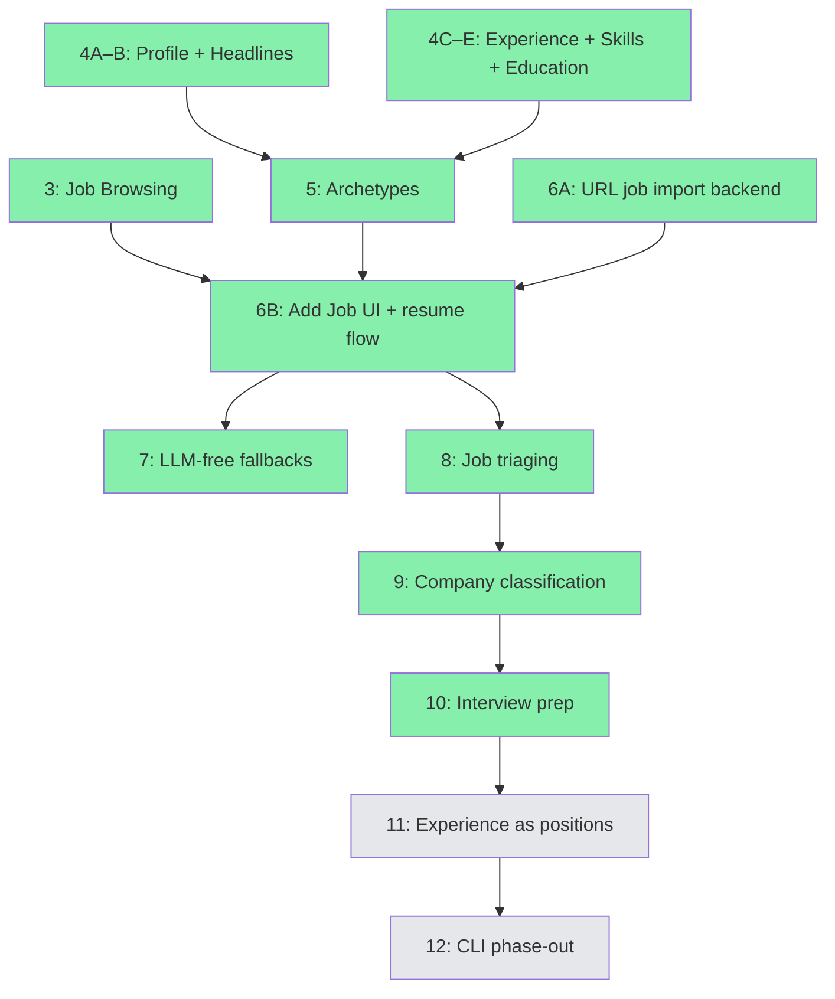

# GOALS.md

Product ceiling for TailoredIn — what it will become at most.

## What TailoredIn Is

TailoredIn is a web application that automates the job search pipeline for software engineers. It discovers relevant openings across job boards, generates ATS-optimized resumes tailored to each posting, and prepares company research briefs for interviews. It is designed for anyone to self-host and run locally via a browser-based interface.

## Three Pillars

These are the product's three capabilities. Everything TailoredIn does should serve one of them.

### 1. Job Discovery

Scrape job boards, auto-filter by configurable criteria (salary, location, posting age, applicant count), and score/rank matches against a personal skill profile. LinkedIn is the starting point; the scraper port is designed so additional boards (Indeed, Greenhouse, Lever, etc.) can be added over time.

### 2. Resume Tailoring

Generate company-branded PDF resumes tailored to each job posting. Resume content is authored by the user through an iterative definition process — the tool never fabricates experience or skills. LLM analysis of job postings extracts keywords and insights that guide how the user's real data is presented. The output is an ATS-optimized document with the user's content, embedded keywords, a template selected by detected archetype, and the company's brand color applied automatically.

### 3. Interview Prep

Auto-generate company research briefs for jobs the user is actively pursuing: product overview, tech stack, engineering culture, recent news, and key people.

## What TailoredIn Is Not

- **Not an auto-applier.** TailoredIn never submits applications on the user's behalf. The pipeline ends at resume PDF generation.
- **Not a SaaS product.** No auth, user accounts, or hosted infrastructure. Designed for self-hosted local execution.
- **Not a mock-interview platform.** Interview prep means research briefs, not interactive practice sessions or AI-scored answers.
- **Not an ATS/CRM.** Job funnel tracking exists to support the three pillars, but building a full applicant tracking system is not a goal.

## Design Principles

- **Web-first.** The primary interface is a browser-based UI backed by the Elysia API. CLI tools are transitional and will be phased out as the web UI matures.
- **Multi-source ready.** The scraper port abstracts job boards behind a common interface. New sources plug in without touching the core pipeline.
- **LLM-assisted, not LLM-dependent.** AI enhances the pipeline (insight extraction, keyword matching, company research) but the tool should remain functional without it — manual job entry, generic resume templates.
- **Truthful.** Resume content comes from the user, not the AI. The LLM's role is to analyze job postings and optimize presentation of the user's real experience — never to generate or embellish qualifications.
- **Dogfooded.** The author is the primary user. Features ship when they solve a real problem in an active job search.

## Parallel Execution Strategy

Multiple Claude Code sessions can work on different steps simultaneously using git worktrees. Each session gets its own branch and worktree under `.claude/worktrees/`.

### ~~Wave 1~~ ✅ Complete

### Wave 2 — ← CURRENT

| Session | Steps | Branch | Worktree |
|---|---|---|---|
| 1 | **5A–5B** (archetypes) | `feat/milestone-5` | `.claude/worktrees/milestone-5` |
| 2 | **6A** (URL job import backend) | `feat/milestone-6a` | `.claude/worktrees/milestone-6a` |
| 3 | **9** (company classification) | `feat/milestone-9` | `.claude/worktrees/milestone-9` |

### Wave 3 — after M5 + M6A merge

| Session | Steps | Branch | Worktree |
|---|---|---|---|
| 1 | **6B** (add job UI + resume flow) | `feat/milestone-6b` | `.claude/worktrees/milestone-6b` |
| 2 | **8** (job triaging) | `feat/milestone-8` | `.claude/worktrees/milestone-8` |

### Wave 4 — after M6B + M9 merge

| Session | Steps | Branch | Worktree |
|---|---|---|---|
| 1 | **7** (LLM-free fallbacks) | `feat/milestone-7` | `.claude/worktrees/milestone-7` |
| 2 | **10** (interview prep) | `feat/milestone-10` | `.claude/worktrees/milestone-10` |

### Wave 5+

M11 (experience as positions) → M12 (CLI phase-out), sequential.

### Dependency graph

Green = done. Yellow = next up. Grey = future.

## Completed Milestones

Milestone 1 — Database-Driven Resume Generation (PRs #4, #6, #9)

Replaced hardcoded TypeScript templates with database-backed resume content.

- [x] **1A.** Domain + application layer for resume data — PR #4
- [x] **1B.** Infrastructure: repository implementations — PR #6
- [x] **1C.** DatabaseResumeContentFactory — PR #9

Milestone 2 — Resume Data API (PRs #7, #10)

CRUD endpoints for all resume content.

- [x] **2A.** User profile endpoints — PR #7
- [x] **2B.** Work experience endpoints — PR #10
- [x] **2C.** Education + headline endpoints — PR #7
- [x] **2D.** Skill category + item endpoints — PR #10
- [x] **2E.** Archetype endpoints — PR #10

Milestone 3 — Job Browsing (PR #11)

Browse and manage the 11k+ scraped jobs in the web UI.

- [x] **3A.** Job list page — paginated table with score, company, title, status badge, posted date; sort/filter
- [x] **3B.** Job detail page — full posting info, status controls
- [x] **3C.** Resume download on job detail — generate + download PDF

Milestone 4 — Profile & Resume Editing (PRs #12, #13)

Edit all resume content that feeds into PDF generation.

- [x] **4A.** Profile page — PR #13
- [x] **4B.** Headlines page — PR #13
- [x] **4C.** Work experience page — PR #12
- [x] **4D.** Skills page — PR #12
- [x] **4E.** Education page — PR #12

## Milestones

### Milestone 5 — Archetypes
> Branch: `feat/milestone-5` · Worktree: `.claude/worktrees/milestone-5`

Configure which resume content appears for each archetype.

- [ ] **5A. Archetype list page**
  - [ ] List archetypes with create/delete
- [ ] **5B. Archetype detail page**
  - [ ] Edit archetype metadata (name, headline selection)
  - [x] Default headline fallback when archetype doesn't specify one
  - [ ] Select positions (company refs + bullet overrides)
  - [ ] Select skill categories/items
  - [ ] Select education entries

### Milestone 6 — Single-URL Job Import + Resume Generation
> Branch: `feat/milestone-6a` (backend) + `feat/milestone-6b` (UI)

Paste a LinkedIn job URL → scrape → generate a tailored PDF. The end-to-end payoff.

- [ ] **6A. URL-based job import (backend)**
  - [ ] `POST /jobs` endpoint accepts a LinkedIn URL (or manual fields as fallback)
  - [ ] `IngestJobByUrl` use case: scrape single posting, run election + scoring
- [ ] **6B. "Add Job" UI + resume generation flow**
  - [ ] "Add Job" form on jobs page: paste URL or enter fields manually
  - [ ] After import, navigate to job detail → generate resume → download PDF

### Milestone 7 — LLM-Free Fallbacks
> Branch: `feat/milestone-7` · Worktree: `.claude/worktrees/milestone-7`

Make the tool usable without an OpenAI key.

- [ ] **7A. Generic resume generation**
  - [ ] Fallback path in `GenerateResume`: skip insight extraction when no LLM key
  - [ ] Use user-supplied archetype + default keywords
- [ ] **7B. LLM-free UI**
  - [ ] Archetype picker + keyword input on job detail when generating without LLM

### Milestone 8 — Job Triaging
> Branch: `feat/milestone-8` · Worktree: `.claude/worktrees/milestone-8`

Lifecycle-driven job management UI. Jobs should be triaged, tracked through stages, and resurfaced when needed.

- [ ] **8A. Triaging UI**
  - [ ] Dedicated triage view for new jobs (separate from the full job list)
  - [ ] Bulk actions for status changes
- [ ] **8B. Lifecycle views**
  - [ ] Status-based views/filters (applied, interviewing, archived, etc.)
  - [ ] Reopen archived jobs
- [ ] **8C. Apply button**
  - [ ] Apply button shows the underlying platform (Greenhouse, Workday, Lever, etc.)
- [ ] **8D. Experience titles**
  - [ ] Show job titles on the experience page

### Milestone 9 — Company Classification
> Branch: `feat/milestone-9` · Worktree: `.claude/worktrees/milestone-9`

Structured company metadata instead of flat tags.

- [ ] **9A. Domain model**
  - [ ] Business type enum: B2B, B2C, B2B2C, etc.
  - [ ] Industry enum: automobile, security, finance, etc.
  - [ ] Stage enum: Seed, Series A, Series B, etc.
  - [ ] Migration + ORM entity updates
- [ ] **9B. Classification UI**
  - [ ] Company detail/edit with classification fields
  - [ ] Job list filtering by company classification

### Milestone 10 — Interview Prep
> Branch: `feat/milestone-10` · Worktree: `.claude/worktrees/milestone-10`

Auto-generate company research briefs for active job pursuits.

- [ ] **10A. Domain + backend**
  - [ ] `CompanyBrief` domain entity (product overview, tech stack, culture, recent news, key people)
  - [ ] `GenerateCompanyBrief` use case, `CompanyBriefRepository` port
  - [ ] ORM entity, migration, repository implementation
  - [ ] `POST /jobs/:id/generate-brief`, `GET /jobs/:id/brief` endpoints
- [ ] **10B. Web UI**
  - [ ] Brief panel on job detail page
  - [ ] Generate/refresh button, structured display of brief sections

### Milestone 11 — Experience as Positions
> Branch: `feat/milestone-11` · Worktree: `.claude/worktrees/milestone-11`

Refactor resume experience from company-centric to position-centric. A person can hold multiple roles at the same company (e.g., promoted from Senior Engineer to Engineering Manager).

- [ ] **11A. Domain model refactor**
  - [ ] `ResumePosition` entity under `ResumeCompany` (title, startDate, endDate, summary)
  - [ ] Bullets move from company to position
  - [ ] Remove `jobTitle`, `joinedAt`, `leftAt`, `promotedAt` from `ResumeCompany`
  - [ ] Migration: split existing company-level fields into positions
- [ ] **11B. Application + infrastructure**
  - [ ] Update use cases, DTOs, and repository implementations
  - [ ] Update `ArchetypePosition` to reference `ResumePosition` instead of duplicating data
  - [ ] Update `DatabaseResumeContentFactory` to build from positions
- [ ] **11C. Experience page**
  - [ ] Show positions grouped by company
  - [ ] CRUD for positions within a company
  - [ ] Archetype detail page references positions directly

### Milestone 12 — CLI Phase-Out
> Branch: `feat/milestone-12` · Worktree: `.claude/worktrees/milestone-12`

Remove CLI tools once the web app covers their functionality.

- [ ] **12A. Migrate robot to background service**
  - [ ] Move scraping loop into a background worker started by the API process
  - [ ] `POST /robot/start`, `POST /robot/stop`, `GET /robot/status` endpoints
  - [ ] Web UI controls for the scraping daemon
- [ ] **12B. Remove CLI packages**
  - [ ] Delete `cli/` package
  - [ ] Remove CLI scripts from root `package.json`
  - [ ] Update CLAUDE.md
