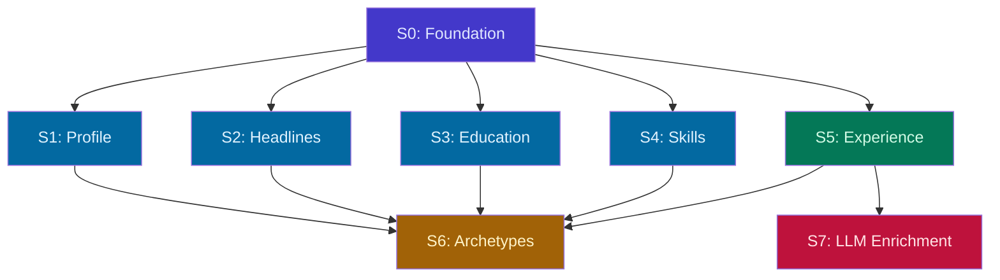

# GOALS.md

Product ceiling for TailoredIn — what it will become at most.

## What TailoredIn Is

TailoredIn is a web application that automates the job search pipeline for software engineers. It discovers relevant openings across job boards, generates ATS-optimized resumes tailored to each posting, and prepares company research briefs for interviews. It is designed for anyone to self-host and run locally via a browser-based interface.

## Three Pillars

These are the product's three capabilities. Everything TailoredIn does should serve one of them.

### 1. Job Discovery

Scrape job boards, auto-filter by configurable criteria (salary, location, posting age, applicant count), and score/rank matches against a personal skill profile. LinkedIn is the starting point; the scraper port is designed so additional boards (Indeed, Greenhouse, Lever, etc.) can be added over time.

### 2. Resume Tailoring

Generate company-branded PDF resumes tailored to each job posting. Resume content is authored by the user through an iterative definition process — the tool never fabricates experience or skills. LLM analysis of job postings extracts keywords and insights that guide how the user's real data is presented. The output is an ATS-optimized document with the user's content, embedded keywords, a template selected by detected archetype, and the company's brand color applied automatically.

### 3. Interview Prep

Auto-generate company research briefs for jobs the user is actively pursuing: product overview, tech stack, engineering culture, recent news, and key people.

## What TailoredIn Is Not

- **Not an auto-applier.** TailoredIn never submits applications on the user's behalf. The pipeline ends at resume PDF generation.
- **Not a SaaS product.** No auth, user accounts, or hosted infrastructure. Designed for self-hosted local execution.
- **Not a mock-interview platform.** Interview prep means research briefs, not interactive practice sessions or AI-scored answers.
- **Not an ATS/CRM.** Job funnel tracking exists to support the three pillars, but building a full applicant tracking system is not a goal.

## Design Principles

- **Web-first.** The primary interface is a browser-based UI backed by the Elysia API. CLI tools are transitional and will be phased out as the web UI matures.
- **Multi-source ready.** The scraper port abstracts job boards behind a common interface. New sources plug in without touching the core pipeline.
- **LLM-assisted, not LLM-dependent.** AI enhances the pipeline (insight extraction, keyword matching, company research) but the tool should remain functional without it — manual job entry, generic resume templates.
- **Truthful.** Resume content comes from the user, not the AI. The LLM's role is to analyze job postings and optimize presentation of the user's real experience — never to generate or embellish qualifications.
- **Dogfooded.** The author is the primary user. Features ship when they solve a real problem in an active job search.

---

## Domain Rethink — Vertical Slices

Redesign TailoredIn's domain model via full-stack vertical slices. Each slice delivers domain → application → infrastructure → API → web UI as a single unit, replacing the existing page in-place.

**Design spec:** `docs/superpowers/specs/2026-04-01-domain-rethink-vertical-slices.md`
**Domain spec:** `docs/superpowers/specs/2026-03-31-domain-rethink-design.md`
**Original task plan:** `docs/superpowers/plans/2026-03-31-domain-rethink.md`

### Slice Summary

| Slice | Replaces | Scope |
|---|---|---|
| **S0: Foundation** | (no UI) | TagSet, ApprovalStatus, IDs, Tag entity, TagProfile, ContentSelection, DB migration (all 17 tables) |
| **S1: Profile** | `/resume/profile` | Profile entity, GetProfile/UpdateProfile, new API + rewritten page |
| **S2: Headlines** | `/resume/headlines` | Headline entity with role tags, CRUD, tag picker in UI |
| **S3: Education** | `/resume/education` | Education entity, CRUD, rewritten page |
| **S4: Skills** | `/resume/skills` | SkillCategory + SkillItem, CRUD, drag-drop reordering |
| **S5: Experience** | `/resume/experience` | Experience + Bullet + BulletVariant (manual only), tags, approval workflow |
| **S6: Archetypes** | `/archetypes/` | Archetype + TagProfile + ContentSelection, tag weight editor, content picker |
| **S7: LLM Enrichment** | adds to experience | ClaudeService, SuggestVariants, AutoTag, UI buttons |

### Dependency Graph

---

## Parallel Execution Strategy

Each worktree runs `bun up` for independent Docker + port allocation. UI testing happens at the local URL printed by `bun up`.

### Wave 1 — Foundation ✅

| Session | Slice | Branch | Worktree | Status |
|---|---|---|---|---|
| 1 | **S0** (Foundation) | `feat/dr-s0-foundation` | `.claude/worktrees/dr-s0-foundation` | ✅ merged (#28) |

**Verify:**
- [ ] `cd domain && bun test` — all VO/entity tests pass (TagSet, TagProfile, Tag)
- [ ] `bun run check` — clean
- [ ] `bun up` — migration applies (seeds, servers start)
- [ ] Connect to DB, verify all 17 tables exist: `profiles`, `experiences`, `bullets`, `bullet_variants`, `bullet_tags`, `bullet_variant_tags`, `tags`, `projects`, `project_tags`, `headlines`, `headline_tags`, `educations`, `skill_categories`, `skill_items`, `archetypes_v2`, `archetype_tag_weights`, `job_postings`

### Wave 2 — Profile, Headlines, Education, Skills (4 parallel) ✅

| Session | Slice | Branch | Worktree | Status |
|---|---|---|---|---|
| 1 | **S1** (Profile) | `feat/dr-s1-profile` | `.claude/worktrees/dr-s1-profile` | ✅ merged (#29) |
| 2 | **S2** (Headlines) | `feat/dr-s2-headlines` | `.claude/worktrees/dr-s2-headlines` | ✅ merged (#31) |
| 3 | **S3** (Education) | `feat/dr-s3-education` | `.claude/worktrees/dr-s3-education` | ✅ merged (#30) |
| 4 | **S4** (Skills) | `feat/dr-s4-skills` | `.claude/worktrees/dr-s4-skills` | ✅ merged (#32) |

**S1 UI Testing:**
- [ ] Open `/resume/profile` — form loads
- [ ] Edit all fields, save — toast confirms
- [ ] Reload — data persists
- [ ] Clear optional fields, save — nulls handled

**S2 UI Testing:**
- [ ] Open `/resume/headlines` — table loads
- [ ] Create headline with label + summary + role tags
- [ ] Edit — change role tags, save, verify persistence
- [ ] Delete headline — removed from table
- [ ] Create headline without tags — works fine

**S3 UI Testing:**
- [ ] Open `/resume/education` — cards load
- [ ] Create education entry, verify card appears
- [ ] Edit fields, save, reload — persists
- [ ] Delete entry — card removed

**S4 UI Testing:**
- [ ] Open `/resume/skills` — categories load with items
- [ ] Create category, add skill items
- [ ] Drag to reorder categories — ordinals persist on reload
- [ ] Edit/delete items and categories

**Merge order:** Any order — no shared files between S1-S4. Each touches different domain entities, API routes, and UI pages.

### Wave 3 — Experience

| Session | Slice | Branch | Worktree |
|---|---|---|---|
| 1 | **S5** (Experience) | `feat/dr-s5-experience` | `.claude/worktrees/dr-s5-experience` |

**S5 UI Testing:**
- [ ] Open `/resume/experience` — experience list loads
- [ ] Create experience (title, company, dates, location) — card appears
- [ ] Add bullet to experience — appears nested under experience
- [ ] Add manual variant to bullet — appears with APPROVED badge (manual source)
- [ ] Tags display as colored badges on bullets and variants
- [ ] Delete bullet — cascades variant removal
- [ ] Delete experience — cascades everything
- [ ] Edit experience fields, save, reload — persists

### Wave 4 — Archetypes + LLM (2 parallel)

| Session | Slice | Branch | Worktree |
|---|---|---|---|
| 1 | **S6** (Archetypes) | `feat/dr-s6-archetypes` | `.claude/worktrees/dr-s6-archetypes` |
| 2 | **S7** (LLM Enrichment) | `feat/dr-s7-llm` | `.claude/worktrees/dr-s7-llm` |

**S6 UI Testing:**
- [ ] Open `/archetypes/` — list loads
- [ ] Create archetype with key + label — appears in list
- [ ] Open detail → set headline from picker
- [ ] Add tag weights (role + skill sliders) — persist on reload
- [ ] Select experiences + specific variants in content picker
- [ ] Select education entries, skill categories/items
- [ ] Deselect items — removed from selection on reload
- [ ] Delete archetype — removed from list

**S7 UI Testing:**
- [ ] Open `/resume/experience` — "Suggest Variants" button visible on bullets
- [ ] Click "Suggest Variants" → spinner → 2-3 PENDING variants appear
- [ ] Approve a variant → badge changes to APPROVED
- [ ] Reject a variant → badge changes to REJECTED
- [ ] Click "Auto-Tag" on a bullet → tags populated
- [ ] If Claude CLI unavailable → buttons disabled with tooltip

**Merge order:** S6 first (larger, independent), then S7.

### Cross-Cutting Verification (after all waves)

- [ ] `bun run check` — Biome clean
- [ ] `bun run knip` — no dead code from old entities
- [ ] `bun run dep:check` — all layer boundaries respected
- [ ] `bun up` — full app starts
- [ ] Navigate every sidebar link — no broken pages
- [ ] Existing job pages still work (untouched in this plan)

### Future Work (not in this plan)

- Job rethink (new JobPosting model with tag-based matching, archetype recommendations)
- Data migration from old schema to new schema
- Removing old entities/tables/code
- Resume generation integration with new content model
- CLI phase-out

---

Completed Milestones (v1 — prior to domain rethink)

### Milestone 1 — Database-Driven Resume Generation (PRs #4, #6, #9)

- [x] **1A.** Domain + application layer for resume data
- [x] **1B.** Infrastructure: repository implementations
- [x] **1C.** DatabaseResumeContentFactory

### Milestone 2 — Resume Data API (PRs #7, #10)

- [x] **2A.** User profile endpoints
- [x] **2B.** Work experience endpoints
- [x] **2C.** Education + headline endpoints
- [x] **2D.** Skill category + item endpoints
- [x] **2E.** Archetype endpoints

### Milestone 3 — Job Browsing (PR #11)

- [x] **3A.** Job list page
- [x] **3B.** Job detail page
- [x] **3C.** Resume download on job detail

### Milestone 4 — Profile & Resume Editing (PRs #12, #13)

- [x] **4A.** Profile page
- [x] **4B.** Headlines page
- [x] **4C.** Work experience page
- [x] **4D.** Skills page
- [x] **4E.** Education page

### Milestone 5 — Archetypes (PR #15)

- [x] **5A.** Archetype list page
- [x] **5B.** Archetype detail page

### Milestone 6 — Single-URL Job Import + Resume Generation (PRs #16, #17)

- [x] **6A.** URL-based job import backend
- [x] **6B.** "Add Job" UI + resume generation flow

### Milestone 7 — LLM-Free Fallbacks (PR #19)

- [x] **7A.** Generic resume generation
- [x] **7B.** LLM-free UI

### Milestone 8 — Job Triaging (PR #20)

- [x] **8A.** Triaging UI
- [x] **8B.** Lifecycle views
- [x] **8C.** Apply button
- [x] **8D.** Experience titles

### Milestone 9 — Company Classification (PR #18)

- [x] **9A.** Domain model
- [x] **9B.** Classification UI

### Milestone 10 — Interview Prep (PR #21)

- [x] **10A.** Domain + backend
- [x] **10B.** Web UI

### Milestone 11 — Experience as Positions (PR #22)

- [x] **11A.** Domain model refactor
- [x] **11B.** Application + infrastructure
- [x] **11C.** Experience page

### Milestone 12 — QA Pass

- [x] Completed

### Milestone 13 — CLI Phase-Out (deferred to post-domain-rethink)

