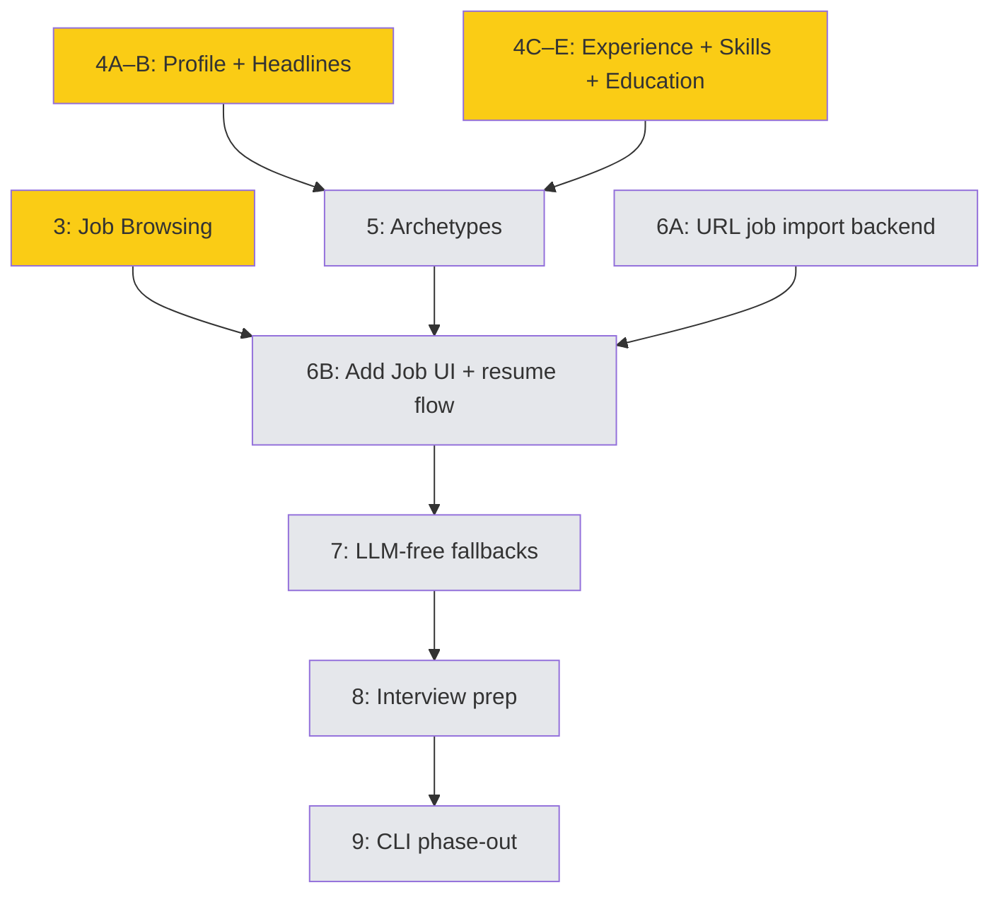

# GOALS.md

Product ceiling for TailoredIn — what it will become at most.

## What TailoredIn Is

TailoredIn is a web application that automates the job search pipeline for software engineers. It discovers relevant openings across job boards, generates ATS-optimized resumes tailored to each posting, and prepares company research briefs for interviews. It is designed for anyone to self-host and run locally via a browser-based interface.

## Three Pillars

These are the product's three capabilities. Everything TailoredIn does should serve one of them.

### 1. Job Discovery

Scrape job boards, auto-filter by configurable criteria (salary, location, posting age, applicant count), and score/rank matches against a personal skill profile. LinkedIn is the starting point; the scraper port is designed so additional boards (Indeed, Greenhouse, Lever, etc.) can be added over time.

### 2. Resume Tailoring

Generate company-branded PDF resumes tailored to each job posting. Resume content is authored by the user through an iterative definition process — the tool never fabricates experience or skills. LLM analysis of job postings extracts keywords and insights that guide how the user's real data is presented. The output is an ATS-optimized document with the user's content, embedded keywords, a template selected by detected archetype, and the company's brand color applied automatically.

### 3. Interview Prep

Auto-generate company research briefs for jobs the user is actively pursuing: product overview, tech stack, engineering culture, recent news, and key people.

## What TailoredIn Is Not

- **Not an auto-applier.** TailoredIn never submits applications on the user's behalf. The pipeline ends at resume PDF generation.
- **Not a SaaS product.** No auth, user accounts, or hosted infrastructure. Designed for self-hosted local execution.
- **Not a mock-interview platform.** Interview prep means research briefs, not interactive practice sessions or AI-scored answers.
- **Not an ATS/CRM.** Job funnel tracking exists to support the three pillars, but building a full applicant tracking system is not a goal.

## Design Principles

- **Web-first.** The primary interface is a browser-based UI backed by the Elysia API. CLI tools are transitional and will be phased out as the web UI matures.
- **Multi-source ready.** The scraper port abstracts job boards behind a common interface. New sources plug in without touching the core pipeline.
- **LLM-assisted, not LLM-dependent.** AI enhances the pipeline (insight extraction, keyword matching, company research) but the tool should remain functional without it — manual job entry, generic resume templates.
- **Truthful.** Resume content comes from the user, not the AI. The LLM's role is to analyze job postings and optimize presentation of the user's real experience — never to generate or embellish qualifications.
- **Dogfooded.** The author is the primary user. Features ship when they solve a real problem in an active job search.

## Parallel Execution Strategy

Multiple Claude Code sessions can work on different steps simultaneously using git worktrees. Each session gets its own branch and worktree under `.claude/worktrees/`.

### Wave 1 — all `web/` only, safe to parallelize

| Session | Steps | Branch | Worktree |
|---|---|---|---|
| 1 | **3A–3C** (job browsing) | `feat/milestone-3` | `.claude/worktrees/milestone-3` |
| 2 | **4A–4B** (profile + headlines) | `feat/milestone-4ab` | `.claude/worktrees/milestone-4ab` |
| 3 | **4C–4E** (experience + skills + education) | `feat/milestone-4cde` | `.claude/worktrees/milestone-4cde` |

### Wave 2 — after M4 merges

| Session | Steps | Branch | Worktree |
|---|---|---|---|
| 1 | **5A–5B** (archetypes) | `feat/milestone-5` | `.claude/worktrees/milestone-5` |
| 2 | **6A** (URL job import backend) | `feat/milestone-6a` | `.claude/worktrees/milestone-6a` |

### Wave 3 — after M3 + M5 + 6A merge

| Session | Steps | Branch | Worktree |
|---|---|---|---|
| 1 | **6B** (add job UI + resume flow) | `feat/milestone-6b` | `.claude/worktrees/milestone-6b` |

### Wave 4+ — sequential from here

M7 → M8 → M9, one at a time.

### Dependency graph

Yellow = next up. Grey = future.

## Completed Milestones

Milestone 1 — Database-Driven Resume Generation (PRs #4, #6, #9)

Replaced hardcoded TypeScript templates with database-backed resume content.

- [x] **1A.** Domain + application layer for resume data — PR #4
- [x] **1B.** Infrastructure: repository implementations — PR #6
- [x] **1C.** DatabaseResumeContentFactory — PR #9

Milestone 2 — Resume Data API (PRs #7, #10)

CRUD endpoints for all resume content.

- [x] **2A.** User profile endpoints — PR #7
- [x] **2B.** Work experience endpoints — PR #10
- [x] **2C.** Education + headline endpoints — PR #7
- [x] **2D.** Skill category + item endpoints — PR #10
- [x] **2E.** Archetype endpoints — PR #10

## Milestones

### Milestone 3 — Job Browsing
> Branch: `feat/milestone-3` · Worktree: `.claude/worktrees/milestone-3`

Browse and manage the 11k+ scraped jobs in the web UI.

- [ ] **3A. Job list page**
  - [ ] Paginated table with score, company, title, status badge, posted date
  - [ ] Sort by score (default), posted date
  - [ ] Filter by status (NEW, APPLIED, etc.)
- [ ] **3B. Job detail page**
  - [ ] Full posting info: description, company, location, salary, LinkedIn link
  - [ ] Status controls: move job through the funnel (NEW → APPLIED → …)
- [ ] **3C. Resume download on job detail**
  - [ ] "Generate Resume" button triggers `PUT /jobs/:id/generate-resume`
  - [ ] Progress indicator while generating
  - [ ] Download resulting PDF

### Milestone 4 — Profile & Resume Editing
> Branch: `feat/milestone-4ab` (profile + headlines) + `feat/milestone-4cde` (experience + skills + education)

Edit all resume content that feeds into PDF generation.

- [ ] **4A. Profile page**
  - [ ] Inline-editable form for user fields (name, email, phone, GitHub, LinkedIn, location)
- [ ] **4B. Headlines page**
  - [ ] List headlines with add/edit/delete
- [ ] **4C. Work experience page**
  - [ ] Company list with expand/collapse for bullets and locations
  - [ ] Add/edit/remove companies, bullets, locations
  - [ ] Drag-to-reorder bullets
- [ ] **4D. Skills page**
  - [ ] Skill categories with nested items, add/edit/remove for both levels
  - [ ] Drag-to-reorder categories and items
- [ ] **4E. Education page**
  - [ ] Education entries: add/edit/remove

### Milestone 5 — Archetypes
> Branch: `feat/milestone-5` · Worktree: `.claude/worktrees/milestone-5`

Configure which resume content appears for each archetype.

- [ ] **5A. Archetype list page**
  - [ ] List archetypes with create/delete
- [ ] **5B. Archetype detail page**
  - [ ] Edit archetype metadata (name, headline selection)
  - [ ] Select positions (company refs + bullet overrides)
  - [ ] Select skill categories/items
  - [ ] Select education entries

### Milestone 6 — Single-URL Job Import + Resume Generation
> Branch: `feat/milestone-6a` (backend) + `feat/milestone-6b` (UI)

Paste a LinkedIn job URL → scrape → generate a tailored PDF. The end-to-end payoff.

- [ ] **6A. URL-based job import (backend)**
  - [ ] `POST /jobs` endpoint accepts a LinkedIn URL (or manual fields as fallback)
  - [ ] `IngestJobByUrl` use case: scrape single posting, run election + scoring
- [ ] **6B. "Add Job" UI + resume generation flow**
  - [ ] "Add Job" form on jobs page: paste URL or enter fields manually
  - [ ] After import, navigate to job detail → generate resume → download PDF

### Milestone 7 — LLM-Free Fallbacks
> Branch: `feat/milestone-7` · Worktree: `.claude/worktrees/milestone-7`

Make the tool usable without an OpenAI key.

- [ ] **7A. Generic resume generation**
  - [ ] Fallback path in `GenerateResume`: skip insight extraction when no LLM key
  - [ ] Use user-supplied archetype + default keywords
- [ ] **7B. LLM-free UI**
  - [ ] Archetype picker + keyword input on job detail when generating without LLM

### Milestone 8 — Interview Prep
> Branch: `feat/milestone-8` · Worktree: `.claude/worktrees/milestone-8`

Auto-generate company research briefs for active job pursuits.

- [ ] **8A. Domain + backend**
  - [ ] `CompanyBrief` domain entity (product overview, tech stack, culture, recent news, key people)
  - [ ] `GenerateCompanyBrief` use case, `CompanyBriefRepository` port
  - [ ] ORM entity, migration, repository implementation
  - [ ] `POST /jobs/:id/generate-brief`, `GET /jobs/:id/brief` endpoints
- [ ] **8B. Web UI**
  - [ ] Brief panel on job detail page
  - [ ] Generate/refresh button, structured display of brief sections

### Milestone 9 — CLI Phase-Out
> Branch: `feat/milestone-9` · Worktree: `.claude/worktrees/milestone-9`

Remove CLI tools once the web app covers their functionality.

- [ ] **9A. Migrate robot to background service**
  - [ ] Move scraping loop into a background worker started by the API process
  - [ ] `POST /robot/start`, `POST /robot/stop`, `GET /robot/status` endpoints
  - [ ] Web UI controls for the scraping daemon
- [ ] **9B. Remove CLI packages**
  - [ ] Delete `cli/` package
  - [ ] Remove CLI scripts from root `package.json`
  - [ ] Update CLAUDE.md
