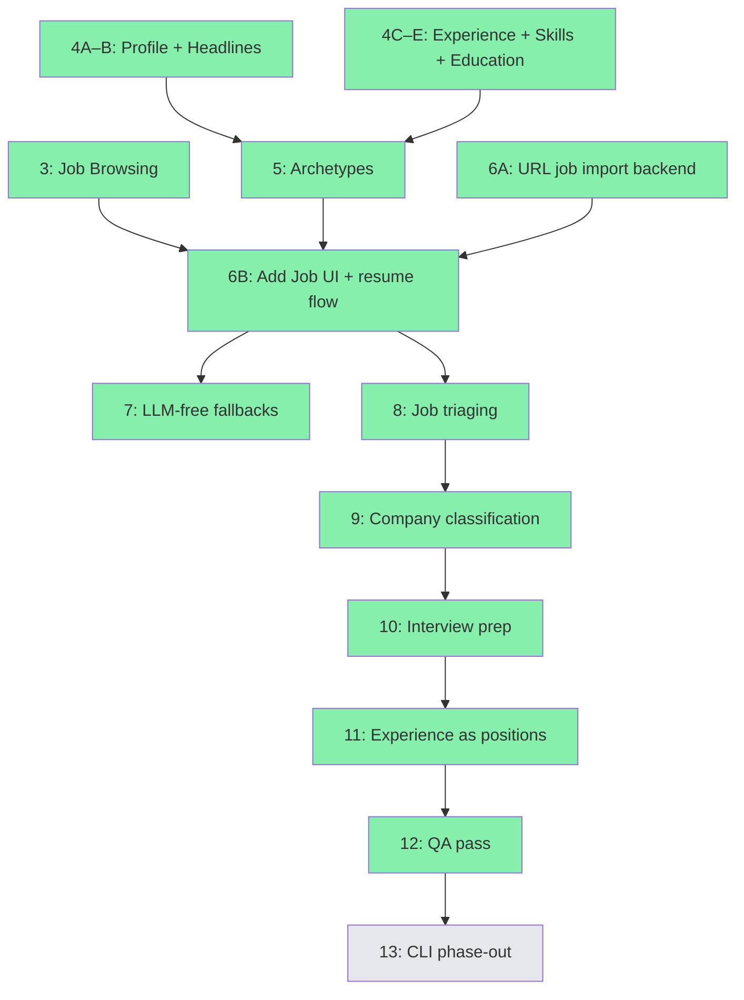

# GOALS.md

Product ceiling for TailoredIn — what it will become at most.

## What TailoredIn Is

TailoredIn is a web application that automates the job search pipeline for software engineers. It discovers relevant openings across job boards, generates ATS-optimized resumes tailored to each posting, and prepares company research briefs for interviews. It is designed for anyone to self-host and run locally via a browser-based interface.

## Three Pillars

These are the product's three capabilities. Everything TailoredIn does should serve one of them.

### 1. Job Discovery

Scrape job boards, auto-filter by configurable criteria (salary, location, posting age, applicant count), and score/rank matches against a personal skill profile. LinkedIn is the starting point; the scraper port is designed so additional boards (Indeed, Greenhouse, Lever, etc.) can be added over time.

### 2. Resume Tailoring

Generate company-branded PDF resumes tailored to each job posting. Resume content is authored by the user through an iterative definition process — the tool never fabricates experience or skills. LLM analysis of job postings extracts keywords and insights that guide how the user's real data is presented. The output is an ATS-optimized document with the user's content, embedded keywords, a template selected by detected archetype, and the company's brand color applied automatically.

### 3. Interview Prep

Auto-generate company research briefs for jobs the user is actively pursuing: product overview, tech stack, engineering culture, recent news, and key people.

## What TailoredIn Is Not

- **Not an auto-applier.** TailoredIn never submits applications on the user's behalf. The pipeline ends at resume PDF generation.
- **Not a SaaS product.** No auth, user accounts, or hosted infrastructure. Designed for self-hosted local execution.
- **Not a mock-interview platform.** Interview prep means research briefs, not interactive practice sessions or AI-scored answers.
- **Not an ATS/CRM.** Job funnel tracking exists to support the three pillars, but building a full applicant tracking system is not a goal.

## Design Principles

- **Web-first.** The primary interface is a browser-based UI backed by the Elysia API. CLI tools are transitional and will be phased out as the web UI matures.
- **Multi-source ready.** The scraper port abstracts job boards behind a common interface. New sources plug in without touching the core pipeline.
- **LLM-assisted, not LLM-dependent.** AI enhances the pipeline (insight extraction, keyword matching, company research) but the tool should remain functional without it — manual job entry, generic resume templates.
- **Truthful.** Resume content comes from the user, not the AI. The LLM's role is to analyze job postings and optimize presentation of the user's real experience — never to generate or embellish qualifications.
- **Dogfooded.** The author is the primary user. Features ship when they solve a real problem in an active job search.

## Parallel Execution Strategy

Multiple Claude Code sessions can work on different steps simultaneously using git worktrees. Each session gets its own branch and worktree under `.claude/worktrees/`.

### ~~Wave 1~~ ✅ Complete

### Wave 2 — ← CURRENT

| Session | Steps | Branch | Worktree |
|---|---|---|---|
| 1 | **5A–5B** (archetypes) | `feat/milestone-5` | `.claude/worktrees/milestone-5` |
| 2 | **6A** (URL job import backend) | `feat/milestone-6a` | `.claude/worktrees/milestone-6a` |
| 3 | **9** (company classification) | `feat/milestone-9` | `.claude/worktrees/milestone-9` |

### Wave 3 — after M5 + M6A merge

| Session | Steps | Branch | Worktree |
|---|---|---|---|
| 1 | **6B** (add job UI + resume flow) | `feat/milestone-6b` | `.claude/worktrees/milestone-6b` |
| 2 | **8** (job triaging) | `feat/milestone-8` | `.claude/worktrees/milestone-8` |

### Wave 4 — after M6B + M9 merge

| Session | Steps | Branch | Worktree |
|---|---|---|---|
| 1 | **7** (LLM-free fallbacks) | `feat/milestone-7` | `.claude/worktrees/milestone-7` |
| 2 | **10** (interview prep) | `feat/milestone-10` | `.claude/worktrees/milestone-10` |

### Wave 5 — ← CURRENT

| Session | Steps | Branch | Worktree |
|---|---|---|---|
| 1 | **12** (QA pass) | `feat/milestone-12` | `.claude/worktrees/milestone-12` |

### Wave 6+

M13 (CLI phase-out), sequential.

### Dependency graph

Green = done. Yellow = next up. Grey = future.

## Completed Milestones

Milestone 1 — Database-Driven Resume Generation (PRs #4, #6, #9)

Replaced hardcoded TypeScript templates with database-backed resume content.

- [x] **1A.** Domain + application layer for resume data — PR #4
- [x] **1B.** Infrastructure: repository implementations — PR #6
- [x] **1C.** DatabaseResumeContentFactory — PR #9

Milestone 2 — Resume Data API (PRs #7, #10)

CRUD endpoints for all resume content.

- [x] **2A.** User profile endpoints — PR #7
- [x] **2B.** Work experience endpoints — PR #10
- [x] **2C.** Education + headline endpoints — PR #7
- [x] **2D.** Skill category + item endpoints — PR #10
- [x] **2E.** Archetype endpoints — PR #10

Milestone 3 — Job Browsing (PR #11)

Browse and manage the 11k+ scraped jobs in the web UI.

- [x] **3A.** Job list page — paginated table with score, company, title, status badge, posted date; sort/filter
- [x] **3B.** Job detail page — full posting info, status controls
- [x] **3C.** Resume download on job detail — generate + download PDF

Milestone 4 — Profile & Resume Editing (PRs #12, #13)

Edit all resume content that feeds into PDF generation.

- [x] **4A.** Profile page — PR #13
- [x] **4B.** Headlines page — PR #13
- [x] **4C.** Work experience page — PR #12
- [x] **4D.** Skills page — PR #12
- [x] **4E.** Education page — PR #12

## Milestones

Milestone 5 — Archetypes (PR #15)

- [x] **5A.** Archetype list page — list with create/delete
- [x] **5B.** Archetype detail page — metadata, headline selection, positions, skills, education
- [x] Default headline fallback when archetype doesn't specify one

Milestone 6 — Single-URL Job Import + Resume Generation (PRs #16, #17)

- [x] **6A.** URL-based job import backend — `POST /jobs`, `IngestJobByUrl` use case
- [x] **6B.** "Add Job" UI + resume generation flow

Milestone 7 — LLM-Free Fallbacks (PR #19)

- [x] **7A.** Generic resume generation — fallback when no LLM key
- [x] **7B.** LLM-free UI — archetype picker + keyword input

Milestone 8 — Job Triaging (PR #20)

- [x] **8A.** Triaging UI — triage view, bulk actions
- [x] **8B.** Lifecycle views — status-based filters, reopen archived
- [x] **8C.** Apply button — shows underlying platform
- [x] **8D.** Experience titles — job titles on experience page

Milestone 9 — Company Classification (PR #18)

- [x] **9A.** Domain model — BusinessType, Industry, Stage enums + migration
- [x] **9B.** Classification UI — company detail/edit, job list filtering

Milestone 10 — Interview Prep (PR #21)

- [x] **10A.** Domain + backend — CompanyBrief entity, GenerateCompanyBrief use case, endpoints
- [x] **10B.** Web UI — brief panel on job detail, generate/refresh

Milestone 11 — Experience as Positions (PR #22)

- [x] **11A.** Domain model refactor — ResumePosition entity, bullets under positions, migration
- [x] **11B.** Application + infrastructure — use cases, DTOs, ArchetypePosition references ResumePosition
- [x] **11C.** Experience page — positions grouped by company, CRUD, archetype references

### Milestone 12 — QA Pass
> Branch: `feat/milestone-12` · Worktree: `.claude/worktrees/milestone-12`

Systematic walkthrough of the entire UI after rapid M5–M11 merges. Test every page, report bugs, fix issues, and note UX improvements.

- [ ] **12A. Job browsing**
  - [ ] Job list — pagination, sorting, filtering by status, score display
  - [ ] Job detail — full info, status changes, resume generation, download PDF
  - [ ] Add job — LinkedIn URL import, manual entry fallback
  - [ ] Triage view — bulk actions, lifecycle views
  - [ ] Company classification — badges, filters, edit dialog
- [ ] **12B. Resume editing**
  - [ ] Profile page — user info CRUD
  - [ ] Headlines page — CRUD, default headline fallback
  - [ ] Experience page — companies with positions, CRUD for both, bullets, locations
  - [ ] Skills page — categories + items CRUD
  - [ ] Education page — CRUD
- [ ] **12C. Archetypes**
  - [ ] Archetype list — create, edit, delete
  - [ ] Archetype detail — headline selection, position selection (references resume positions), skill/education selection
- [ ] **12D. Interview prep**
  - [ ] Company brief generation — generate, refresh, display sections
- [ ] **12E. Cross-cutting**
  - [ ] LLM-free mode — resume generation without OpenAI key
  - [ ] Navigation — sidebar links, routing, breadcrumbs
  - [ ] Error handling — 404s, API errors, loading states
  - [ ] Responsive behavior — basic viewport checks

### Milestone 13 — CLI Phase-Out
> Branch: `feat/milestone-13` · Worktree: `.claude/worktrees/milestone-13`

Remove CLI tools once the web app covers their functionality.

- [ ] **13A. Migrate robot to background service**
  - [ ] Move scraping loop into a background worker started by the API process
  - [ ] `POST /robot/start`, `POST /robot/stop`, `GET /robot/status` endpoints
  - [ ] Web UI controls for the scraping daemon
- [ ] **13B. Remove CLI packages**
  - [ ] Delete `cli/` package
  - [ ] Remove CLI scripts from root `package.json`
  - [ ] Update CLAUDE.md
