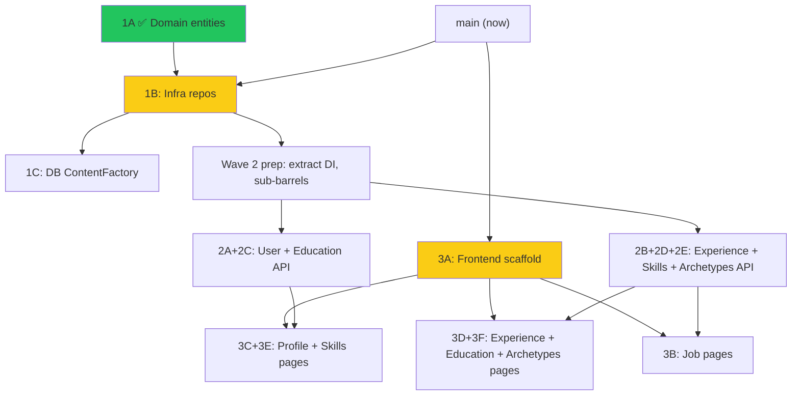

# GOALS.md

Product ceiling for TailoredIn — what it will become at most.

## What TailoredIn Is

TailoredIn is a web application that automates the job search pipeline for software engineers. It discovers relevant openings across job boards, generates ATS-optimized resumes tailored to each posting, and prepares company research briefs for interviews. It is designed for anyone to self-host and run locally via a browser-based interface.

## Three Pillars

These are the product's three capabilities. Everything TailoredIn does should serve one of them.

### 1. Job Discovery

Scrape job boards, auto-filter by configurable criteria (salary, location, posting age, applicant count), and score/rank matches against a personal skill profile. LinkedIn is the starting point; the scraper port is designed so additional boards (Indeed, Greenhouse, Lever, etc.) can be added over time.

### 2. Resume Tailoring

Generate company-branded PDF resumes tailored to each job posting. Resume content is authored by the user through an iterative definition process — the tool never fabricates experience or skills. LLM analysis of job postings extracts keywords and insights that guide how the user's real data is presented. The output is an ATS-optimized document with the user's content, embedded keywords, a template selected by detected archetype, and the company's brand color applied automatically.

### 3. Interview Prep

Auto-generate company research briefs for jobs the user is actively pursuing: product overview, tech stack, engineering culture, recent news, and key people.

## What TailoredIn Is Not

- **Not an auto-applier.** TailoredIn never submits applications on the user's behalf. The pipeline ends at resume PDF generation.
- **Not a SaaS product.** No auth, user accounts, or hosted infrastructure. Designed for self-hosted local execution.
- **Not a mock-interview platform.** Interview prep means research briefs, not interactive practice sessions or AI-scored answers.
- **Not an ATS/CRM.** Job funnel tracking exists to support the three pillars, but building a full applicant tracking system is not a goal.

## Design Principles

- **Web-first.** The primary interface is a browser-based UI backed by the Elysia API. CLI tools are transitional and will be phased out as the web UI matures.
- **Multi-source ready.** The scraper port abstracts job boards behind a common interface. New sources plug in without touching the core pipeline.
- **LLM-assisted, not LLM-dependent.** AI enhances the pipeline (insight extraction, keyword matching, company research) but the tool should remain functional without it — manual job entry, generic resume templates.
- **Truthful.** Resume content comes from the user, not the AI. The LLM's role is to analyze job postings and optimize presentation of the user's real experience — never to generate or embellish qualifications.
- **Dogfooded.** The author is the primary user. Features ship when they solve a real problem in an active job search.

## Parallel Execution Strategy

Multiple Claude Code sessions can work on different steps simultaneously using git worktrees. Each session gets its own branch and worktree under `.claude/worktrees/`.

### Merge conflict hotspots

Three append-only registry files that every backend branch touches:

| File | What grows | Mitigation |
|---|---|---|
| `api/src/index.ts` | DI bindings + `.use()` route registration | Extract into `api/src/container.ts` before Wave 2 |
| `infrastructure/src/DI.ts` | Token list | Namespace tokens by domain |
| `application/src/index.ts` | Barrel re-exports | Add sub-barrels (`use-cases/index.ts`, `ports/index.ts`, `dtos/index.ts`) before Wave 2 |

### Wave 1 — zero file overlap, safe to run now

| Session | Step | Branch | Worktree | Packages touched |
|---|---|---|---|---|
| 1 | **1B** | `feat/milestone-1b` | `.claude/worktrees/milestone-1b` | `infrastructure/` |
| 2 | **3A** | `feat/milestone-3a` | `.claude/worktrees/milestone-3a` | `web/` (new), root `package.json` |

### Wave 2 — after 1B merges, prep then parallelize

First commit on main: extract DI container, add sub-barrels, namespace DI tokens. Then:

| Session | Steps | Branch | Worktree | Packages touched |
|---|---|---|---|---|
| 1 | **1C** | `feat/milestone-1c` | `.claude/worktrees/milestone-1c` | `infrastructure/` (new factory, DI swap) |
| 2 | **2A + 2C** | `feat/milestone-2ac` | `.claude/worktrees/milestone-2ac` | `api/src/routes/user.*`, `education.*`, `headlines.*` |
| 3 | **2B + 2D + 2E** | `feat/milestone-2bde` | `.claude/worktrees/milestone-2bde` | `api/src/routes/companies.*`, `skills.*`, `archetypes.*` |

### Wave 3 — after 3A + relevant M2 endpoints merge

All work lives inside `web/` — low conflict risk, 2-3 sessions:

| Session | Steps | Branch | Worktree |
|---|---|---|---|
| 1 | **3B** (jobs) | `feat/milestone-3b` | `.claude/worktrees/milestone-3b` |
| 2 | **3C + 3E** (profile, skills) | `feat/milestone-3ce` | `.claude/worktrees/milestone-3ce` |
| 3 | **3D + 3F** (experience, education, archetypes) | `feat/milestone-3df` | `.claude/worktrees/milestone-3df` |

### Dependency graph

Yellow = next up. Green = done.

## Milestones

### Milestone 1 — Database-Driven Resume Generation

Replace hardcoded TypeScript templates with database-backed resume content so archetypes and resume data are editable without code changes.

- [x] **1A. Domain + application layer for resume data** *(session 1)* — PR #4
  - [x] Add domain entities: `User`, `ResumeCompany`, `ResumeBullet`, `ResumeEducation`, `ResumeSkillCategory`, `ResumeSkillItem`, `ResumeHeadline`, `Archetype` (with positions, bullets, skill/education selections)
  - [x] Add repository ports: `UserRepository`, `ResumeCompanyRepository`, `ResumeEducationRepository`, `ResumeSkillCategoryRepository`, `ResumeHeadlineRepository`, `ArchetypeRepository`
  - [x] Add DTOs for resume data read/write in `application/`
- [ ] **1B. Infrastructure: repository implementations** *(session 2, after 1A)*
  - [ ] Implement each resume repository against the existing ORM entities and migration
  - [ ] Add DI tokens for all new repositories
  - [ ] Wire repositories into the API composition root
  - [ ] Verify with a smoke test: seed data → repository read → assert correctness
- [ ] **1C. DatabaseResumeContentFactory** *(session 3, after 1B)*
  - [ ] Implement `DatabaseResumeContentFactory` that reads from repositories + archetype to build `ResumeContentDto`
  - [ ] Replace `TemplateResumeContentFactory` binding in DI with the new implementation
  - [ ] Verify: `GenerateResume` use case produces identical PDFs from DB data as from the old templates
  - [ ] Remove `LeadICResumeTemplate.ts` and all hardcoded company data files in `infrastructure/src/resume/`

### Milestone 2 — Resume Data API

CRUD endpoints for all resume content. Each step is independent and can run in parallel worktrees.

- [ ] **2A. User profile endpoints** *(session, parallel)*
  - [ ] `GET /user` — return the single user profile
  - [ ] `PUT /user` — update personal info (name, email, phone, GitHub, LinkedIn, location)
- [ ] **2B. Work experience endpoints** *(session, parallel)*
  - [ ] `GET /resume/companies` — list all companies with nested locations and bullets
  - [ ] `POST /resume/companies` — create a company entry
  - [ ] `PUT /resume/companies/:id` — update company metadata (name, website, domain, dates)
  - [ ] `DELETE /resume/companies/:id` — remove a company and cascade
  - [ ] `POST /resume/companies/:id/bullets` — add a bullet
  - [ ] `PUT /resume/companies/:id/bullets/:bulletId` — update a bullet
  - [ ] `DELETE /resume/companies/:id/bullets/:bulletId` — remove a bullet
  - [ ] `PUT /resume/companies/:id/locations` — replace locations for a company
- [ ] **2C. Education + headline endpoints** *(session, parallel)*
  - [ ] `GET /resume/education` — list education entries
  - [ ] `POST /resume/education` — create
  - [ ] `PUT /resume/education/:id` — update
  - [ ] `DELETE /resume/education/:id` — remove
  - [ ] `GET /resume/headlines` — list headlines
  - [ ] `POST /resume/headlines` — create
  - [ ] `PUT /resume/headlines/:id` — update
  - [ ] `DELETE /resume/headlines/:id` — remove
- [ ] **2D. Skill category + item endpoints** *(session, parallel)*
  - [ ] `GET /resume/skills` — list categories with nested items
  - [ ] `POST /resume/skills` — create a category
  - [ ] `PUT /resume/skills/:id` — update category (name, order)
  - [ ] `DELETE /resume/skills/:id` — remove category and its items
  - [ ] `POST /resume/skills/:id/items` — add item to category
  - [ ] `PUT /resume/skills/:id/items/:itemId` — update item
  - [ ] `DELETE /resume/skills/:id/items/:itemId` — remove item
- [ ] **2E. Archetype endpoints** *(session, parallel)*
  - [ ] `GET /archetypes` — list archetypes with nested positions, bullets, skills, education
  - [ ] `POST /archetypes` — create archetype
  - [ ] `PUT /archetypes/:id` — update archetype metadata
  - [ ] `DELETE /archetypes/:id` — remove archetype and cascade
  - [ ] `PUT /archetypes/:id/positions` — set position selections (company refs + bullet overrides)
  - [ ] `PUT /archetypes/:id/skills` — set skill category/item selections
  - [ ] `PUT /archetypes/:id/education` — set education selections

### Milestone 3 — Frontend Foundation

Stand up a web frontend and implement the core pages.

- [ ] **3A. Frontend scaffold** *(session 1)*
  - [x] Choose framework (React 19 + Vite 6 + Eden Treaty + shadcn/ui + TanStack) — decision doc in `.claude/plans/frontend-framework-decision.md`
  - [ ] Set up build tooling, dev server with API proxy to port 8000
  - [ ] Add to monorepo workspace, wire `bun run web` and `bun run web:dev` scripts
  - [ ] Create shell layout: sidebar nav, content area, toast notifications
  - [ ] Set up routing: `/jobs`, `/resume`, `/resume/experience`, `/resume/skills`, `/resume/education`, `/archetypes`
- [ ] **3B. Job browsing pages** *(session, after 3A, parallel with 3C–3F)*
  - [ ] Job list page: ranked list with score, company, title, status badge, posted date
  - [ ] Job detail page: full posting info, status controls, "Generate Resume" button
  - [ ] PDF download: trigger generation, show progress, download resulting PDF
- [ ] **3C. Profile + headlines page** *(session, after 3A, parallel)*
  - [ ] Inline-editable form for user profile fields
  - [ ] Headlines list with add/edit/delete
- [ ] **3D. Work experience page** *(session, after 3A, parallel)*
  - [ ] Company list with expand/collapse for bullets and locations
  - [ ] Add/edit/remove companies, bullets, locations
  - [ ] Drag-to-reorder bullets
- [ ] **3E. Skills page** *(session, after 3A, parallel)*
  - [ ] Skill categories with nested items, add/edit/remove for both levels
  - [ ] Drag-to-reorder categories and items
- [ ] **3F. Education + archetypes pages** *(session, after 3A, parallel)*
  - [ ] Education CRUD page
  - [ ] Archetype list page: view/create/edit archetypes
  - [ ] Archetype detail: select positions, override bullets, select skills/education from the user's master data

### Milestone 4 — LLM-Free Fallbacks

Make the tool usable without an OpenAI key or LinkedIn credentials.

- [ ] **4A. Manual job entry** *(session, parallel)*
  - [ ] `POST /jobs` endpoint — create a job posting by hand (title, company, description, URL)
  - [ ] Web UI: "Add Job" form on the jobs page
  - [ ] `IngestManualJob` use case that skips scraping, runs election + scoring
- [ ] **4B. Generic resume generation without LLM** *(session, parallel)*
  - [ ] Fallback path in `GenerateResume`: if no LLM key, skip insight extraction, use user-supplied archetype + default keywords
  - [ ] Web UI: archetype picker + keyword input on the job detail page when generating without LLM

### Milestone 5 — Interview Prep (Pillar 3)

Auto-generate company research briefs for active job pursuits.

- [ ] **5A. Domain + application layer** *(session 1)*
  - [ ] `CompanyBrief` domain entity (product overview, tech stack, culture, recent news, key people)
  - [ ] `GenerateCompanyBrief` use case, `CompanyBriefRepository` port
  - [ ] LLM prompt for brief generation via `LlmService`
- [ ] **5B. Infrastructure + API** *(session 2, after 5A)*
  - [ ] ORM entity, migration, repository implementation
  - [ ] `POST /jobs/:id/generate-brief`, `GET /jobs/:id/brief` endpoints
- [ ] **5C. Web UI** *(session 3, after 5B)*
  - [ ] Brief panel on job detail page
  - [ ] Generate/refresh button, structured display of brief sections

### Milestone 6 — CLI Phase-Out

Remove CLI tools once the web app fully covers their functionality.

- [ ] **6A. Migrate robot to background service** *(session 1)*
  - [ ] Move scraping loop from `cli/src/robot/` into a background worker started by the API process
  - [ ] Add API endpoints: `POST /robot/start`, `POST /robot/stop`, `GET /robot/status`
  - [ ] Web UI controls for the scraping daemon
- [ ] **6B. Remove CLI packages** *(session 2, after 6A and all web UI covers CLI functionality)*
  - [ ] Delete `cli/` package entirely
  - [ ] Remove CLI-related scripts from root `package.json`
  - [ ] Update CLAUDE.md and any docs
