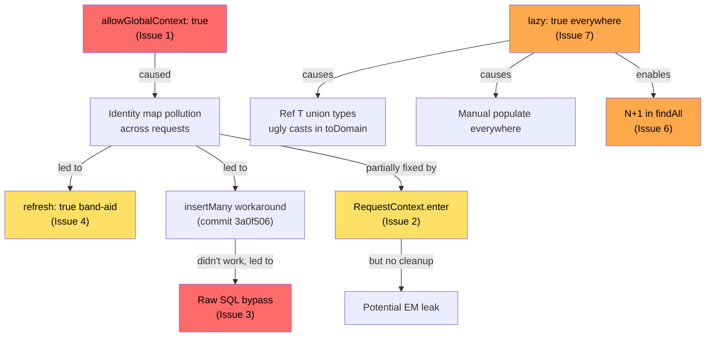

# MikroORM Audit: Unit of Work, Identity Map & Lazy Loading

## Context

The codebase has accumulated progressive workarounds for MikroORM identity map and Unit of Work issues. The recent commit history tells the story clearly — four commits in rapid succession on Apr 7, each attempting a different fix for the same root problem (ResumeContent saves silently failing):

1. `310a8c0` — add `refresh: true` to force DB re-reads
2. `3a0f506` — switch to `em.insertMany()` to bypass identity map
3. `a8acff0` — add `RequestContext.enter()` per request
4. `084e0aa` — give up on ORM, use raw SQL INSERT

This audit identifies every issue, explains the root causes, and proposes a clean fix for each.

---

## Causal Chain



---

## Issue 1: `allowGlobalContext: true` — the root of all evil

**File:** `infrastructure/src/db/orm-config.ts:37`

```typescript
allowGlobalContext: true,
```

**Problem:** This flag suppresses MikroORM's safety check that prevents using the global EntityManager outside a RequestContext. With this enabled, if `RequestContext.enter()` fails or is missed, MikroORM silently falls back to the global EM — sharing one identity map across ALL requests. This was likely the original cause of the ResumeContent bug: entities from request A pollute request B's identity map.

**Fix:** Set `allowGlobalContext: false`. This will cause MikroORM to throw immediately if code runs outside a RequestContext, making bugs loud instead of silent.

---

## Issue 2: `RequestContext.enter()` without cleanup

**File:** `api/src/index.ts:79-82`

```typescript
.derive(() => {
  RequestContext.enter(orm.em);
  return {};
})
```

**Problem:** `RequestContext.enter()` creates a forked EM and enters an AsyncLocalStorage context, but there is **no corresponding cleanup**. The MikroORM docs recommend `RequestContext.create(em, next)` (which wraps a callback and auto-cleans) or explicitly calling the dispose function returned by `enter()`. Without cleanup, the forked EM may leak.

**Fix:** Move `RequestContext.enter()` into `onRequest` instead of `derive`. MikroORM 7's `enter()` uses `AsyncLocalStorage.enterWith()` which is designed specifically for Elysia-style middlewares without a `next` callback — no dispose function needed, the context is scoped to the async execution.

---

## Issue 3: Raw SQL INSERT bypassing UoW entirely

**File:** `infrastructure/src/repositories/PostgresResumeContentRepository.ts:25-69`

```typescript
public async save(resumeContent: DomainResumeContent): Promise<void> {
  // Creates an ORM entity (lines 29-45) but NEVER persists it
  const ormEntity = new OrmResumeContent({ ... });

  // Instead, raw SQL:
  await this.orm.em.getConnection().execute(
    `INSERT INTO resume_contents (...) VALUES (?, ?, ?, ?, ?::jsonb, ...)`,
    [...]
  );
}
```

**Problem:** The ORM entity is constructed (line 29) but thrown away. The actual insert uses raw SQL, completely bypassing the Unit of Work, identity map, and change tracking. The entity will NOT be in the identity map after save, so a subsequent `findOne` in the same request may or may not find it depending on whether the identity map or DB is consulted first.

**Root cause:** This was a workaround for Issue 1 (global EM pollution). With a proper per-request EM fork, standard `em.persist()` + `em.flush()` should work.

**Fix:** Once Issues 1 and 2 are fixed, revert to standard ORM persist:

```typescript
public async save(resumeContent: DomainResumeContent): Promise<void> {
  const profileRef = this.orm.em.getReference(OrmProfile, resumeContent.profileId);
  const jdRef = this.orm.em.getReference(OrmJobDescription, resumeContent.jobDescriptionId);
  const ormEntity = new OrmResumeContent({ ... });
  this.orm.em.persist(ormEntity);
  await this.orm.em.flush();
}
```

---

## Issue 4: `refresh: true` as a band-aid

**File:** `infrastructure/src/repositories/PostgresResumeContentRepository.ts:20`

```typescript
{ populate: ['profile', 'jobDescription'], orderBy: { createdAt: 'DESC' }, refresh: true }
```

**Problem:** `refresh: true` forces MikroORM to bypass the identity map and hit the database. This was added because the identity map was returning stale data — a symptom of the global EM issue (Issue 1). With proper request isolation, each request gets a fresh identity map, so `refresh: true` becomes unnecessary overhead.

**Fix:** Remove `refresh: true` once Issues 1 and 2 are resolved.

---

## Issue 5: Raw SQL in `getProfileId()` helper

**File:** `api/src/helpers/profile-id.ts:4`

```typescript
const result = await orm.em.getConnection().execute<[{ id: string }]>('SELECT id FROM profiles LIMIT 1');
```

**Problem:** Bypasses ORM for a simple query. Uses the **connection** directly (not even the EM), so it's completely outside identity map and UoW tracking. Minor issue since it's read-only, but it's symptomatic of distrust in the ORM.

**Fix:** Replace with `orm.em.findOne(Profile, {})` or keep as-is (low priority — it's a temporary single-user helper).

---

## Issue 6: N+1 query in `toDomain()` for Experience → Accomplishments

**File:** `infrastructure/src/repositories/PostgresExperienceRepository.ts:135-144`

```typescript
private async toDomain(orm: OrmExperience): Promise<DomainExperience> {
  // Separate query for EACH experience's accomplishments
  const ormAccomplishments = await this.orm.em.find(
    OrmAccomplishment,
    { experience: orm.id },
    { orderBy: { ordinal: 'ASC' } }
  );
  ...
}
```

**And the caller at line 37:**
```typescript
public async findAll(): Promise<DomainExperience[]> {
  const ormEntities = await this.orm.em.find(OrmExperience, {}, { ... });
  return Promise.all(ormEntities.map(e => this.toDomain(e)));  // N+1!
}
```

**Problem:** `findAll()` loads N experiences, then `toDomain()` fires a separate query for each experience's accomplishments. With 10 experiences, that's 11 queries instead of 2.

**Fix:** Use `populate: ['accomplishments']` in the initial query and access `orm.accomplishments.getItems()` in `toDomain()`:

```typescript
const ormEntities = await this.orm.em.find(OrmExperience, {}, {
  orderBy: { ordinal: 'ASC' },
  populate: ['profile', 'company', 'accomplishments']
});
```

---

## Issue 7: All relationships are `lazy: true` — then manually populated everywhere

Every single `@ManyToOne` and `@OneToMany` in the codebase uses `lazy: true`:

| Entity | File | Lazy relations |
|--------|------|---------------|
| Education | `entities/education/Education.ts:27` | profile |
| Experience | `entities/experience/Experience.ts:31,46,67` | profile, company, accomplishments |
| Accomplishment | `entities/experience/Accomplishment.ts:21` | experience |
| ExperienceGenerationOverride | `entities/experience/ExperienceGenerationOverride.ts:20` | experience |
| JobDescription | `entities/job-description/JobDescription.ts:12` | company |
| Application | `entities/application/Application.ts:14,17,20` | profile, company, jobDescription |
| GenerationSettings | `entities/generation-settings/GenerationSettings.ts:23,38` | profile, prompts |
| GenerationPrompt | `entities/generation-settings/GenerationPrompt.ts:20` | generationSettings |
| ResumeContent | `entities/resume-content/ResumeContent.ts:20,23` | profile, jobDescription |

**Total: 15 lazy relations, 0 eager relations.**

Then every repository query manually specifies `populate: [...]` to eagerly load what it needs.

**Problem:** This is backwards. `lazy: true` on `@ManyToOne` means accessing `experience.profile` returns a `Ref<Profile>` proxy. Every `toDomain()` must then handle the `Ref<T> | T` union type (visible in the ugly casts at `PostgresExperienceRepository.ts:136-138` and `PostgresResumeContentRepository.ts:86-88`):

```typescript
const profileId = typeof orm.profile === 'string'
  ? orm.profile
  : (orm.profile as { id: string }).id;
```

**Fix:** Remove `lazy: true` from `@ManyToOne` relations. MikroORM `@ManyToOne` is already loaded efficiently via JOINs by default. Only keep `lazy: true` on `@OneToMany` collections where you genuinely don't want to load children. This eliminates the `Ref<T> | T` union types and the need for explicit `populate` on every query.

---

## Issue 8: Redundant `em.persist()` on managed entities

**File:** `infrastructure/src/repositories/PostgresExperienceRepository.ts:55,114`

```typescript
// Entity loaded via findOne — already managed
existing.title = experience.title;
// ...
this.orm.em.persist(existing);  // Unnecessary — already in identity map
```

**Problem:** Entities loaded via `em.findOne()` or `em.find()` are already managed by the Unit of Work. Calling `em.persist()` on them is a no-op but signals confusion about how MikroORM change tracking works.

**Fix:** Remove `em.persist()` calls on entities that were loaded from the database. Only call `persist()` on **newly created** entities.

---

## Issue 9: `implicitTransactions: false` without explicit transaction boundaries

**File:** `infrastructure/src/db/orm-config.ts:61`

```typescript
implicitTransactions: false,
```

**Problem:** With implicit transactions disabled, each `em.flush()` executes its SQL statements without a wrapping transaction. In `PostgresExperienceRepository.save()`, the experience UPDATE and accomplishment INSERT/UPDATE/DELETE happen in a single flush — but without a transaction, a failure mid-flush could leave partial state.

**Fix:** Either:
- Re-enable `implicitTransactions: true` (MikroORM wraps each flush in a transaction), or
- Use `em.transactional()` for operations that modify multiple entities

---

## Summary: Severity & Priority

| # | Issue | Severity | Fix Effort |
|---|-------|----------|------------|
| 1 | `allowGlobalContext: true` | **Critical** — root cause | Trivial (1 line) |
| 2 | `RequestContext.enter()` no cleanup | **High** — potential EM leak | Small |
| 3 | Raw SQL INSERT in ResumeContent | **High** — bypasses UoW entirely | Small (revert to persist+flush) |
| 4 | `refresh: true` band-aid | **Medium** — unnecessary DB hit | Trivial (remove after fix 1+2) |
| 5 | Raw SQL in `getProfileId()` | **Low** — read-only, temporary | Trivial |
| 6 | N+1 query Experience→Accomplishments | **Medium** — perf issue | Small (add populate) |
| 7 | All relations `lazy: true` | **Medium** — causes ugly code | Medium (entity + repo changes) |
| 8 | Redundant `persist()` on managed entities | **Low** — no-op but confusing | Trivial |
| 9 | No transaction boundaries | **Medium** — partial state risk | Small |

## Recommended Fix Order

1. **Fix Issue 1** (`allowGlobalContext: false`) + **Fix Issue 2** (RequestContext cleanup) — these are the foundation
2. **Fix Issue 3** (revert raw SQL to persist+flush) + **Fix Issue 4** (remove `refresh: true`) — these are consequences of Issue 1
3. **Fix Issue 7** (remove `lazy: true` from ManyToOne) + **Fix Issue 6** (populate accomplishments) — cleaner code
4. **Fix Issues 8, 9** — polish

## Verification

After each fix:
- `bun run typecheck` — no type errors
- `bun run test` — unit tests pass
- `bun run --cwd infrastructure test:integration` — integration tests pass against real Postgres
- `bun e2e:test` — end-to-end tests pass
- Manual test: generate a resume, verify ResumeContent is saved and retrievable
