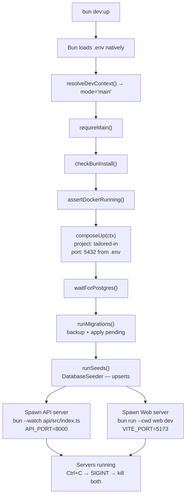
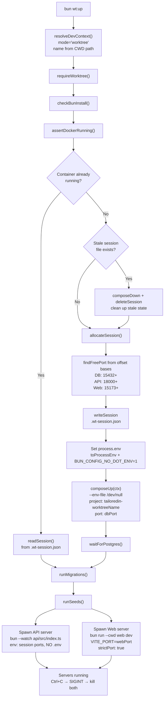
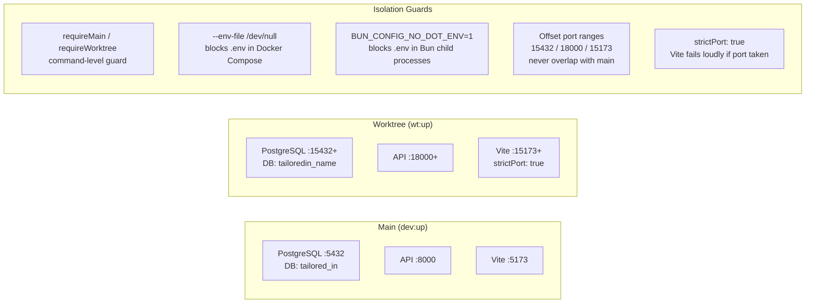

# Dev Infrastructure

How the local development environment works for both main-branch and worktree contexts.

## Two Modes, Fully Isolated

| | **Main** (`dev:up`) | **Worktree** (`wt:up`) |
|---|---|---|
| Config source | `.env` file | `.wt-session.json` (generated) |
| DB port | 5432 (fixed) | 15432+ (scanned) |
| API port | 8000 (fixed) | 18000+ (scanned) |
| Web port | 5173 (fixed) | 15173+ (scanned) |
| Docker project | `tailored-in` | `tailoredin-{worktreeName}` |
| DB name | `tailored_in` | `tailoredin_{worktreeName}` |
| Docker volume | `tailored-in_pg-data` | `tailoredin-{name}_pg-data` |
| Env isolation | Bun loads `.env` natively | `BUN_CONFIG_NO_DOT_ENV=1` + `--env-file /dev/null` |
| Guard | `requireMain()` blocks `wt:*` | `requireWorktree()` blocks `dev:*` |

## Key Files

All located in `infrastructure/dev/`.

| File | Role |
|---|---|
| `DevContext.ts` | Detects mode (`main` vs `worktree`) from CWD path, builds all naming/paths |
| `ContextGuard.ts` | `requireMain()` / `requireWorktree()` — prevents cross-mode commands |
| `WorktreeSession.ts` | Allocates ports (offset ranges), reads/writes `.wt-session.json`, converts to env/ORM config |
| `PortFinder.ts` | `findFreePort(base)` — scans from base, tests each with temporary socket |
| `DockerCompose.ts` | `composeUp/Down`, `waitForPostgres`, `isContainerRunning` — worktree mode forces `--env-file /dev/null` |
| `MigrationRunner.ts` | Runs pending migrations, creates pg_dump backup first |
| `SeedRunner.ts` | Runs `DatabaseSeeder` (upserts reference data) |
| `BunInstall.ts` | Ensures `node_modules` matches `bun.lock` |
| `DatabaseBackup.ts` | Creates pg_dump backup before migrations |

## `dev:up` Flow (Main Branch)



**Teardown:** `dev:down` kills API+Web processes, stops Docker Compose (preserves volume).
**Fresh:** `dev:fresh` = `dev:down && dev:up`.

## `wt:up` Flow (Worktree)



**Teardown:** `wt:down` kills API+Web processes, stops Docker Compose **and removes volume**, deletes `.wt-session.json`.
**Fresh:** `wt:fresh` = `wt:down && wt:up`.

## Isolation Mechanisms



### Six layers of isolation

1. **Command guards** — `requireMain()` / `requireWorktree()` prevent running the wrong command set.
2. **Env file blocking** — Docker gets `--env-file /dev/null`, Bun children get `BUN_CONFIG_NO_DOT_ENV=1`. No `.env` leakage.
3. **Port range offset** — Worktrees scan from 15432/18000/15173 (main uses 5432/8000/5173). Zero collision even if main isn't running.
4. **Strict port binding** — Vite's `strictPort: true` fails immediately if the allocated port is taken, instead of silently picking another.
5. **Docker namespace isolation** — Each worktree gets its own Docker Compose project name, container name, and volume. No shared state with main.
6. **PID-scoped teardown** — `wt:up` stores child server PIDs in `.wt-session.json`. `wt:down` kills only those PIDs via `process.kill(pid)` — never uses broad `pkill` patterns that could hit main's servers.

## E2E Tests (Separate From Both)

E2E tests (`bun e2e:test`) use **Testcontainers** — a completely ephemeral PostgreSQL container with random ports. No Docker Compose, no `.env`, no `.wt-session.json`. The flow:

1. `e2e-start-servers.ts` boots a Testcontainers Postgres (port 17-alpine)
2. Runs migrations + `E2eSeeder` (destructive — truncates all tables, re-seeds fixtures)
3. Starts API on random port (18000+), Vite on random port (15173+)
4. Writes state to `e2e/.server-state.json`
5. Playwright reads the state and runs tests

Fully self-contained, no interaction with main or worktree environments.

## Docker Compose

Single `compose.yaml` at repo root, parameterized via environment variables:

```yaml
name: ${COMPOSE_PROJECT_NAME:-tailored-in}

services:
  postgres:
    image: postgres:17-alpine
    ports:
      - "${POSTGRES_PORT:-5432}:5432"
    volumes:
      - pg-data:/var/lib/postgresql/data
    environment:
      POSTGRES_PASSWORD: ${POSTGRES_PASSWORD:-postgres}
      POSTGRES_USER: ${POSTGRES_USER:-postgres}
      POSTGRES_DB: ${POSTGRES_DB:-tailored_in}

volumes:
  pg-data:
```

- **Main** uses defaults (or `.env` overrides)
- **Worktree** sets all variables via `process.env` and blocks `.env` with `--env-file /dev/null`

## Script Reference

### Main branch only (`dev:*`)

| Command | What it does |
|---|---|
| `bun dev:up` | Start everything: install, Docker, migrate, seed, API + web servers |
| `bun dev:down` | Stop servers + Docker (preserves volume) |
| `bun dev:fresh` | `dev:down && dev:up` |
| `bun dev:migration:create` | Create a new migration file |
| `bun dev:migration:up` | Run pending migrations |
| `bun dev:seed` | Run DatabaseSeeder |
| `bun dev:diagram` | Regenerate DATABASE.mmd (needs DB running) |

### Worktree only (`wt:*`)

| Command | What it does |
|---|---|
| `bun wt:up` | Start isolated env: allocate ports, Docker, migrate, seed, servers |
| `bun wt:down` | Stop servers + Docker + remove volume + delete session |
| `bun wt:fresh` | `wt:down && wt:up` |
| `bun wt:migration:up` | Run pending migrations in worktree DB |
| `bun wt:seed` | Seed the worktree database |

### Context-free

| Command | What it does |
|---|---|
| `bun run typecheck` | Type-check all packages |
| `bun run check` | Biome lint + format check |
| `bun run test` | Unit tests across all workspaces |
| `bun run dep:check` | Architecture boundary enforcement |
| `bun e2e:test` | Playwright E2E tests (Testcontainers, fully ephemeral) |
