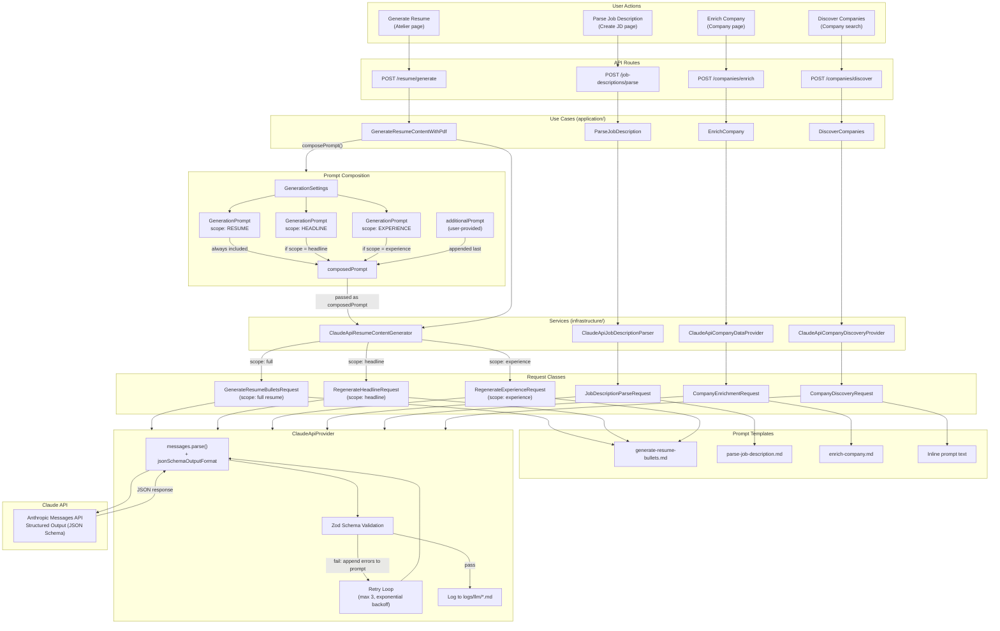

# LLM Schemas & Prompts Reference

Complete reference for all LLM requests in TailoredIn: prompt templates, input types, output schemas, and infrastructure.

## Overview

| # | Scope | Request Class | Prompt Source | Default Model | Timeout |
|---|-------|--------------|---------------|---------------|---------|
| 1 | Full Resume | `GenerateResumeBulletsRequest` | `generate-resume-bullets.md` | Per `ModelTier` setting | 300s |
| 2 | Headline Only | `RegenerateHeadlineRequest` | `generate-resume-bullets.md` + suffix | Per `ModelTier` setting | 300s |
| 3 | Experience Only | `RegenerateExperienceRequest` | `generate-resume-bullets.md` + suffix | Per `ModelTier` setting | 300s |
| 4 | Parse Job Description | `JobDescriptionParseRequest` | `parse-job-description.md` | `claude-sonnet-4-6` | 60s |
| 5 | Enrich Company | `CompanyEnrichmentRequest` | `enrich-company.md` | `claude-sonnet-4-6` | 60s |
| 6 | Discover Companies | `CompanyDiscoveryRequest` | Inline (no template file) | `claude-sonnet-4-6` | 60s |

### Model Tier Mapping

| Tier | Model ID |
|------|----------|
| `fast` | `claude-haiku-4-5` |
| `balanced` | `claude-sonnet-4-6` |
| `best` | `claude-opus-4-6` |

### Resume Constraints

| Field | Min Length | Max Length |
|-------|-----------|-----------|
| Headline | 150 chars | 300 chars |
| Bullet | 80 chars | 220 chars |
| Summary | 20 chars | 220 chars |

---

## Class Diagram

```mermaid
classDiagram
    direction TB

    class LlmJsonRequest~T~ {
        <<abstract>>
        +prompt: string
        +schema: T
        +model: string?
        +maxTokens: number?
        +previousValidationErrors: string[]
        +getInput(): Record~string, unknown~?
        +getJsonSchema(): Record~string, unknown~
        #buildValidationErrorsSuffix(): string
    }

    class GenerateResumeBulletsRequest {
        -input: ResumeContentGeneratorInput
        -requestModel: Anthropic.Messages.Model
        +schema: generateResumeBulletsSchema
        +prompt: string
        +getInput(): Record~string, unknown~
    }

    class RegenerateHeadlineRequest {
        -input: ResumeContentGeneratorInput
        -requestModel: Anthropic.Messages.Model
        +schema: regenerateHeadlineSchema
        +prompt: string
        +getInput(): Record~string, unknown~
    }

    class RegenerateExperienceRequest {
        -input: ResumeContentGeneratorInput
        -experienceId: string
        -requestModel: Anthropic.Messages.Model
        +schema: regenerateExperienceSchema
        +prompt: string
        +getInput(): Record~string, unknown~
    }

    class JobDescriptionParseRequest {
        -text: string
        +schema: jobDescriptionParseSchema
        +prompt: string
        +getInput(): Record~string, unknown~
    }

    class CompanyEnrichmentRequest {
        -url: string
        -context: string?
        +schema: companyEnrichmentSchema
        +prompt: string
        +getInput(): Record~string, unknown~
    }

    class CompanyDiscoveryRequest {
        -query: string
        +schema: companyDiscoverySchema
        +prompt: string
        +getInput(): Record~string, unknown~
    }

    class BaseLlmApiProvider {
        <<abstract>>
        #log: Logger
        #defaultModel: string
        #providerName: string
        +request(request, options): Promise~Result~
        #callApi(prompt, schema, model, maxTokens, timeoutMs): Promise~T~
        -executeOnce(request, options): Promise~Result~
        -isRetryable(error): boolean
        -logToFile(request, model, maxTokens, duration, result): void
    }

    class ClaudeApiProvider {
        #defaultModel: "claude-sonnet-4-6"
        #providerName: "claude-api"
        -apiKey: string
        #callApi(prompt, schema, model, maxTokens, timeoutMs): Promise~T~
    }

    class ClaudeApiResumeContentGenerator {
        -provider: ClaudeApiProvider
        +generate(input): Promise~ResumeContentGeneratorResult~
        -resolveModel(model): Anthropic.Messages.Model
        -generateFull(input, model): Promise
        -generateHeadline(input, model): Promise
        -generateExperience(input, experienceId, model): Promise
    }

    class ClaudeApiJobDescriptionParser {
        -provider: ClaudeApiProvider
        +parseFromText(text): Promise~JobDescriptionParseResult~
    }

    class ClaudeApiCompanyDataProvider {
        -provider: ClaudeApiProvider
        +enrichFromUrl(url, context?): Promise~CompanyEnrichmentResult~
        -applyLogo(result): Promise~CompanyEnrichmentResult~
    }

    class ClaudeApiCompanyDiscoveryProvider {
        -provider: ClaudeApiProvider
        +discover(query): Promise~CompanyDiscoveryResult[]~
    }

    class ResumeContentGenerator {
        <<interface>>
        +generate(input): Promise~ResumeContentGeneratorResult~
    }

    class JobDescriptionParser {
        <<interface>>
        +parseFromText(text): Promise~JobDescriptionParseResult~
    }

    class CompanyDataProvider {
        <<interface>>
        +enrichFromUrl(url, context?): Promise~CompanyEnrichmentResult~
    }

    class CompanyDiscoveryProvider {
        <<interface>>
        +discover(query): Promise~CompanyDiscoveryResult[]~
    }

    class GenerationScope {
        <<enum>>
        RESUME = "resume"
        HEADLINE = "headline"
        EXPERIENCE = "experience"
    }

    class ModelTier {
        <<enum>>
        FAST = "fast"
        BALANCED = "balanced"
        BEST = "best"
    }

    class ResumeConstraints {
        <<namespace>>
        HEADLINE_MIN_LENGTH = 150
        HEADLINE_MAX_LENGTH = 300
        BULLET_MIN_LENGTH = 80
        BULLET_MAX_LENGTH = 220
        SUMMARY_MIN_LENGTH = 20
        SUMMARY_MAX_LENGTH = 220
    }

    LlmJsonRequest <|-- GenerateResumeBulletsRequest
    LlmJsonRequest <|-- RegenerateHeadlineRequest
    LlmJsonRequest <|-- RegenerateExperienceRequest
    LlmJsonRequest <|-- JobDescriptionParseRequest
    LlmJsonRequest <|-- CompanyEnrichmentRequest
    LlmJsonRequest <|-- CompanyDiscoveryRequest

    BaseLlmApiProvider <|-- ClaudeApiProvider

    ResumeContentGenerator <|.. ClaudeApiResumeContentGenerator
    JobDescriptionParser <|.. ClaudeApiJobDescriptionParser
    CompanyDataProvider <|.. ClaudeApiCompanyDataProvider
    CompanyDiscoveryProvider <|.. ClaudeApiCompanyDiscoveryProvider

    ClaudeApiResumeContentGenerator --> ClaudeApiProvider : uses
    ClaudeApiJobDescriptionParser --> ClaudeApiProvider : uses
    ClaudeApiCompanyDataProvider --> ClaudeApiProvider : uses
    ClaudeApiCompanyDiscoveryProvider --> ClaudeApiProvider : uses

    ClaudeApiResumeContentGenerator ..> GenerateResumeBulletsRequest : creates
    ClaudeApiResumeContentGenerator ..> RegenerateHeadlineRequest : creates
    ClaudeApiResumeContentGenerator ..> RegenerateExperienceRequest : creates
    ClaudeApiJobDescriptionParser ..> JobDescriptionParseRequest : creates
    ClaudeApiCompanyDataProvider ..> CompanyEnrichmentRequest : creates
    ClaudeApiCompanyDiscoveryProvider ..> CompanyDiscoveryRequest : creates

    GenerateResumeBulletsRequest --> ResumeConstraints : uses limits
    RegenerateHeadlineRequest --> ResumeConstraints : uses limits
    RegenerateExperienceRequest --> ResumeConstraints : uses limits

    ClaudeApiResumeContentGenerator --> ModelTier : resolves model
```



## Flow Diagram



---

## Scope 1: Full Resume Generation

**Request class:** `GenerateResumeBulletsRequest`
**File:** `infrastructure/src/services/llm/GenerateResumeBulletsRequest.ts`
**Prompt template:** `infrastructure/src/services/prompts/generate-resume-bullets.md`

### Input

```typescript
type ResumeContentGeneratorInput = {
  profile: {
    firstName: string;
    lastName: string;
    about: string | null;
  };
  jobDescription: {
    title: string;
    description: string;
    rawText: string | null;
  };
  experiences: ResumeContentGeneratorExperience[];
  additionalPrompt?: string;    // User-provided free-text instructions
  scope?: undefined;            // undefined = full resume
  model?: string;               // ModelTier value or model ID
  composedPrompt?: string;      // Built from GenerationSettings prompts
};

type ResumeContentGeneratorExperience = {
  id: string;
  title: string;
  companyName: string;
  summary: string | null;
  accomplishments: Array<{
    title: string;
    narrative: string | null;
  }>;
  minBullets: number;
  maxBullets: number;
};
```

### Template Variables

| Variable | Source | Description |
|----------|--------|-------------|
| `{{firstName}}` | `input.profile.firstName` | Candidate first name |
| `{{lastName}}` | `input.profile.lastName` | Candidate last name |
| `{{about}}` | `input.profile.about` | Candidate About section (or "(not provided)") |
| `{{jdTitle}}` | `input.jobDescription.title` | Target job title |
| `{{jdDescription}}` | `input.jobDescription.description` | Target job description |
| `{{jdRawText}}` | `input.jobDescription.rawText` | Raw text section (prefixed with "Raw Text:\n" or empty) |
| `{{experiencesBlock}}` | Built from `input.experiences` | Formatted block with ID, role, accomplishments, bullet range |
| `{{headlineMinLength}}` | `ResumeConstraints.HEADLINE_MIN_LENGTH` (150) | Headline minimum characters |
| `{{headlineMaxLength}}` | `ResumeConstraints.HEADLINE_MAX_LENGTH` (300) | Headline maximum characters |
| `{{bulletMinLength}}` | `ResumeConstraints.BULLET_MIN_LENGTH` (80) | Bullet minimum characters |
| `{{bulletMaxLength}}` | `ResumeConstraints.BULLET_MAX_LENGTH` (220) | Bullet maximum characters |
| `{{summaryMinLength}}` | `ResumeConstraints.SUMMARY_MIN_LENGTH` (20) | Summary minimum characters |
| `{{summaryMaxLength}}` | `ResumeConstraints.SUMMARY_MAX_LENGTH` (220) | Summary maximum characters |

### Experiences Block Format

Each experience is rendered as:

```
### Experience ID: {id}
Role: {title} at {companyName}
{summary (if present)}
Accomplishments:
- {accomplishment.title}: {accomplishment.narrative}
- {accomplishment.title}
Generate between {minBullets} and {maxBullets} bullets for this experience.
```

### Prompt Suffixes

After template rendering, the following are appended in order:

1. **composedPrompt** (if present) - built from `GenerationSettings` prompts by scope
2. **additionalPrompt** (if present) - prefixed with `"Additional instructions: "`
3. **validationErrorsSuffix** (on retries) - lists previous Zod validation failures

### Output Schema

```typescript
const generateResumeBulletsSchema = z.object({
  headline: z.string().min(150).max(300),
  experiences: z.array(
    z.object({
      experienceId: z.string(),
      summary: z.string().min(20).max(220),
      bullets: z.array(z.string().min(80).max(220))
    })
  )
});
```

### Prompt Template

```
You are a professional resume writer. Given a candidate's profile, a target job
description, and a set of work experiences with accomplishments, generate impactful
resume bullet points for each experience.

## Rules

- **Strict derivation:** Bullets MUST be derived strictly from the experience they
  belong to - do NOT borrow facts, metrics, skills, or achievements from other experiences.
- **No invention:** Do NOT invent any competency, metric, or achievement not present
  in the source data. If an accomplishment lacks specific metrics, write a strong
  qualitative bullet instead.
- **Metrics first:** When the accomplishment data contains specific numbers, percentages,
  dollar amounts, timelines, or scale figures, you MUST include them in the bullet.
  Quantified impact is more compelling - never drop a metric that is present in the source.
- **Bullet count:** Generate between `minBullets` and `maxBullets` bullets for each
  experience. Aim for the midpoint of the range. Only approach `maxBullets` when the
  experience has exceptionally rich accomplishment data. Prefer fewer, stronger bullets
  over more, weaker ones.
- **Tone:** The candidate's About section informs the voice and tone. Mirror their
  style and personality where possible.
- **Relevance:** Frame bullets to highlight relevance to the target job description.
  Lead with impact and action verbs.
- **Role alignment:** Prioritize accomplishments that reflect what the role title implies.
  A management title should lead with people management, team building, and strategic
  decisions. An IC title should lead with technical depth and delivery.
- **No repetition:** Within a single experience, each bullet must convey a distinct fact.
  Do not repeat the same metric, tool, team size, or outcome across multiple bullets.
- **Length:** Each bullet must be between {{bulletMinLength}} and {{bulletMaxLength}}
  characters. This is a hard system limit.
- **Tense:** Use past tense for all experiences.
- **Summary:** For each experience, write a one-sentence role summary
  ({{summaryMinLength}}-{{summaryMaxLength}} characters) that contextualises the
  position. Must end with a period.
- **Headline:** Generate a professional headline ({{headlineMinLength}}-{{headlineMaxLength}}
  characters) placed at the top of the resume. Must span multiple lines. Guidelines:
  - Lead with a professional title (JD title only if candidate actually held it)
  - Follow with rounded years-of-experience figure
  - Senior/executive roles: richer narrative sentence(s) highlighting domain expertise,
    scale, and achievements
  - IC roles: slightly more concise - title, experience, technical specialties
  - Keep grounded, concise, and natural. No buzzwords or superlatives.
  - Derive ALL claims from provided data.

## Candidate Profile

Name: {{firstName}} {{lastName}}

About:
{{about}}

## Target Job Description

Title: {{jdTitle}}

Description:
{{jdDescription}}

{{jdRawText}}

## Work Experiences

{{experiencesBlock}}

## Output format

Return ONLY a valid JSON object with this structure:

{
  "headline": "string - professional headline",
  "experiences": [
    {
      "experienceId": "string - the exact experience ID provided above",
      "summary": "string - one-sentence role summary ending with a period",
      "bullets": ["string - one resume bullet per entry"]
    }
  ]
}

- Include one entry per experience in the same order as provided above.
- The headline MUST be between {{headlineMinLength}} and {{headlineMaxLength}} characters.
- Each summary MUST be between {{summaryMinLength}} and {{summaryMaxLength}} characters.
- Each bullet MUST be between {{bulletMinLength}} and {{bulletMaxLength}} characters.
- Use a hyphen (-) instead of an em dash (--) anywhere in bullet text.
- Counting hint: reference strings at boundary lengths are provided for calibration.
- Do NOT include markdown, explanations, or code fences - return ONLY the JSON object.
```

---

## Scope 2: Headline Regeneration

**Request class:** `RegenerateHeadlineRequest`
**File:** `infrastructure/src/services/llm/RegenerateHeadlineRequest.ts`
**Prompt template:** Same as Scope 1 (`generate-resume-bullets.md`)

### Input

Same as Scope 1 (`ResumeContentGeneratorInput`) with `scope: { type: 'headline' }`.

### Differences from Scope 1

The prompt is identical to Scope 1 except:

1. A **scope suffix** is appended after the template:
   ```
   IMPORTANT: Only regenerate the headline. Do NOT include experiences in your response.
   ```
2. The composedPrompt includes the `HEADLINE` scope prompt (in addition to `RESUME`).

### Output Schema

```typescript
const regenerateHeadlineSchema = z.object({
  headline: z.string().min(150).max(300)
});
```

---

## Scope 3: Experience Regeneration

**Request class:** `RegenerateExperienceRequest`
**File:** `infrastructure/src/services/llm/RegenerateExperienceRequest.ts`
**Prompt template:** Same as Scope 1 (`generate-resume-bullets.md`)

### Input

Same as Scope 1 (`ResumeContentGeneratorInput`) with `scope: { type: 'experience', experienceId: string }`.

Additional constructor parameter: `experienceId: string`.

### Differences from Scope 1

The prompt is identical to Scope 1 except:

1. A **scope suffix** is appended after the template:
   ```
   IMPORTANT: Only regenerate the experience with ID "{experienceId}". Return exactly
   one experience entry in your response. Do NOT include a headline.
   ```
2. The composedPrompt includes the `EXPERIENCE` scope prompt (in addition to `RESUME`).

### Output Schema

```typescript
const regenerateExperienceSchema = z.object({
  experiences: z
    .array(
      z.object({
        experienceId: z.string(),
        summary: z.string().min(20).max(220),
        bullets: z.array(z.string().min(80).max(220))
      })
    )
    .length(1) // Exactly one experience
});
```

---

## Scope 4: Job Description Parsing

**Request class:** `JobDescriptionParseRequest`
**File:** `infrastructure/src/services/ClaudeApiJobDescriptionParser.ts`
**Prompt template:** `infrastructure/src/services/prompts/parse-job-description.md`

### Input

```typescript
{
  text: string; // Raw job posting text
}
```

### Template Variables

| Variable | Source | Description |
|----------|--------|-------------|
| `{{text}}` | `text` parameter | Raw job posting text to parse |

### Output Schema

```typescript
const jobDescriptionParseSchema = z.object({
  title: z.string().nullable(),
  description: z.string().nullable(),
  url: z.string().nullable(),
  location: z.string().nullable(),
  salaryMin: z.number().nullable(),
  salaryMax: z.number().nullable(),
  salaryCurrency: z.string().nullable(),
  level: z.nativeEnum(JobLevel).nullable(),        // intern | junior | mid | senior | staff | principal | lead | manager | director | vp | c_level
  locationType: z.nativeEnum(LocationType).nullable(), // remote | hybrid | on_site
  postedAt: z.string().nullable(),                  // ISO 8601 (YYYY-MM-DD)
  soughtHardSkills: z.array(z.string()).nullable(),
  soughtSoftSkills: z.array(z.string()).nullable()
});
```

### Prompt Template

```
You are a job description parsing assistant. Given raw text from a job posting,
extract structured data.

## Rules

- **Only return fields you are highly confident about.** Use `null` for anything uncertain.
- Do NOT guess or hallucinate. If you cannot extract a field from the text, return `null`.
- For salary, extract numeric values only (no currency symbols). Infer the currency
  from context (default to "USD" if ambiguous).
- For posted date, return an ISO 8601 date string (YYYY-MM-DD). If only a relative
  date is given (e.g., "2 weeks ago"), return `null`.
- The description should be a clean summary of the role's responsibilities and
  requirements, not the entire raw text.
- For sought skills, extract distinct, specific skills mentioned or strongly implied.
  Hard skills are technical (languages, tools, frameworks, methodologies, domain expertise).
  Soft skills are behavioral (communication, leadership, collaboration, adaptability).
  Return `null` if the job description doesn't mention any.

## Input

Job description text:

{{text}}

## Output format

Return ONLY a valid JSON object with these fields:

{
  "title": "string or null",
  "description": "string or null - clean summary of the role",
  "url": "string or null - URL to the original posting if mentioned",
  "location": "string or null - work location",
  "salaryMin": "number or null - minimum annual salary",
  "salaryMax": "number or null - maximum annual salary",
  "salaryCurrency": "string or null - three-letter currency code",
  "level": "seniority level enum or null",
  "locationType": "work arrangement enum or null",
  "postedAt": "string or null - ISO 8601 date",
  "soughtHardSkills": "array of strings or null",
  "soughtSoftSkills": "array of strings or null"
}

Return ONLY the JSON object. No markdown, no explanation, no code fences.
```

---

## Scope 5: Company Enrichment

**Request class:** `CompanyEnrichmentRequest`
**File:** `infrastructure/src/services/ClaudeApiCompanyDataProvider.ts`
**Prompt template:** `infrastructure/src/services/prompts/enrich-company.md`

### Input

```typescript
{
  url: string;        // Company website URL
  context?: string;   // Optional additional context from user
}
```

### Template Variables

| Variable | Source | Description |
|----------|--------|-------------|
| `{{url}}` | `url` parameter | Company website URL |
| `{{#context}}...{{/context}}` | Conditional block | Included only when `context` is provided |
| `{{context}}` | `context` parameter | User-provided additional context |

### Output Schema

```typescript
const companyEnrichmentSchema = z.object({
  name: z.string().nullable(),
  description: z.string().nullable(),
  website: z.string().url().nullable(),
  linkedinLink: z
    .string()
    .regex(/^https:\/\/(www\.)?linkedin\.com\/company\/.+/)
    .nullable(),
  logoUrl: z.string().url().nullable(),
  businessType: z.nativeEnum(BusinessType).nullable(),   // b2b | b2c | b2b2c | marketplace | platform | internal_tools | infrastructure | other
  industry: z.nativeEnum(Industry).nullable(),           // technology | finance | healthcare | ... (see domain enum)
  stage: z.nativeEnum(CompanyStage).nullable(),          // seed | series_a | series_b | series_c | series_d_plus | growth | public | bootstrapped
  status: z.nativeEnum(CompanyStatus).nullable()         // running | acquired | defunct
});
```

### Post-Processing

After LLM response, the service:
1. Normalizes URLs (adds `https://` if missing)
2. Validates the `logoUrl` via HTTP HEAD request (must return `image/*` content type)
3. Falls back to logo providers if LLM logo URL is invalid:
   - `https://logos.hunter.io/{domain}`
   - `https://companyenrich.com/api/logo/{domain}`

### Prompt Template

```
You are a company data enrichment assistant. Given a company website URL, research
the company and return structured data.

## Rules

- **Only return fields you are highly confident about.** Use `null` for anything uncertain.
- Do NOT guess or hallucinate. If you cannot verify a field, return `null`.
- URLs must be real, publicly accessible URLs. Do not fabricate URLs.
- The LinkedIn URL must be a valid `www.linkedin.com/company/...` page.
- The website URL must be the company's primary domain.

## Funding stage (`stage` field)

Only set `stage` if you know the company's actual funding stage from reliable public
information (Crunchbase, press releases, etc.). Do NOT infer stage from company age,
size, revenue, or employee count.

- `seed` - raised seed or pre-seed funding
- `series_a` - completed Series A
- `series_b` - completed Series B
- `series_c` - completed Series C
- `series_d_plus` - completed Series D or later
- `growth` - post-Series C/D growth equity, still private
- `public` - publicly traded
- `bootstrapped` - self-funded, no institutional VC

Use `null` if you are not confident.

## Operational status (`status` field)

- `running` - actively operating
- `acquired` - acquired by another company
- `defunct` - shut down, dissolved

Use `null` if you are not confident.

## Logo URL (`logoUrl` field)

- Must be a direct URL to an image file (ends in .png, .jpg, .svg, .webp).
- Do NOT return URLs to web pages or social media profiles.
- If you cannot find a direct image URL you are certain about, return `null`.

## Input

URL: {{url}}
{{#context}}

Additional context from the user: {{context}}
{{/context}}
```

---

## Scope 6: Company Discovery

**Request class:** `CompanyDiscoveryRequest`
**File:** `infrastructure/src/services/ClaudeApiCompanyDiscoveryProvider.ts`
**Prompt template:** None (inline)

### Input

```typescript
{
  query: string; // Company name or website URL
}
```

### Output Schema

```typescript
const companyDiscoverySchema = z.object({
  companies: z
    .array(
      z.object({
        name: z.string(),
        website: z.string().url().nullable(),
        description: z.string().nullable()
      })
    )
    .max(3) // Maximum 3 results
});
```

### Prompt Text (Inline)

```
Given this query: "{query}"
Find between 0 and 3 real companies that best match this query.
The query may be a company name or a website URL.
Return only companies you are confident actually exist. If uncertain, return fewer results or an empty list.
Order by likelihood of match (best match first).
```

---

## Composed Prompt Assembly

For resume generation (Scopes 1-3), the use case builds a `composedPrompt` from `GenerationSettings`:

```
composePrompt(settings, scope, additionalPrompt):
  parts = []

  // 1. Always include the base RESUME prompt
  resumePrompt = settings.getPrompt(GenerationScope.RESUME)
  if resumePrompt -> parts.push(resumePrompt)

  // 2. Include scope-specific prompt
  if scope == 'headline':
    headlinePrompt = settings.getPrompt(GenerationScope.HEADLINE)
    if headlinePrompt -> parts.push(headlinePrompt)
  else if scope == 'experience':
    experiencePrompt = settings.getPrompt(GenerationScope.EXPERIENCE)
    if experiencePrompt -> parts.push(experiencePrompt)

  // 3. Append user's additional prompt
  if additionalPrompt -> parts.push(additionalPrompt)

  return parts.join('\n\n') or null
```

The `composedPrompt` is appended to the rendered template in the request class. The `additionalPrompt` is also appended separately with a prefix of `"Additional instructions: "`.

---

## Shared Infrastructure

### LlmJsonRequest Base Class

`infrastructure/src/services/llm/LlmJsonRequest.ts`

All 6 request classes extend this abstract base. It provides:

- `prompt` (abstract) - rendered prompt text
- `schema` (abstract) - Zod schema for output validation
- `model` (optional override) - defaults to provider's `defaultModel`
- `maxTokens` (optional override) - defaults to 4096
- `getInput()` - structured input data for logging
- `getJsonSchema()` - converts Zod schema to OpenAPI 3.0 JSON Schema via `zodToJsonSchema()`
- `previousValidationErrors: string[]` - populated by retry loop
- `buildValidationErrorsSuffix()` - generates retry prompt suffix

### Retry & Validation Loop

`infrastructure/src/services/llm/BaseLlmApiProvider.ts`

| Parameter | Default |
|-----------|---------|
| Max retries | 3 |
| Retry delay base | 2,000ms |
| Backoff | Exponential: `2000 * 2^(attempt-1)` |
| Default max tokens | 4,096 |
| Default timeout | 60,000ms |

**Retryable errors:**
- API call timed out
- API connection failed
- API service overloaded (529)
- API server error
- API rate limit (429)
- Schema validation failed

On schema validation failure, the error details are appended to the prompt for the next attempt via `buildValidationErrorsSuffix()`:

```
## IMPORTANT: Previous attempt was rejected

Your previous response failed validation with these errors:
- {error1}
- {error2}

Fix ALL of the above issues in this attempt. Pay close attention to character length limits.
```

### Claude API Provider

`infrastructure/src/services/llm/ClaudeApiProvider.ts`

- SDK: `@anthropic-ai/sdk`
- Method: `client.messages.parse()` with `jsonSchemaOutputFormat()`
- Schema conversion: `zodToJsonSchema(schema, { target: 'openApi3' })`
- SDK retries: 0 (handled by `BaseLlmApiProvider`)

### Logging

Every LLM call is logged to `logs/llm/{timestamp}_{RequestClassName}.md` (gitignored) with sections:

1. **Header** - date, model, max tokens, duration, status
2. **Input** - structured input data as JSON
3. **Output Schema** - JSON Schema used for structured output
4. **Prompt** - full rendered prompt text
5. **Response** - parsed JSON on success, or error + raw response on failure
