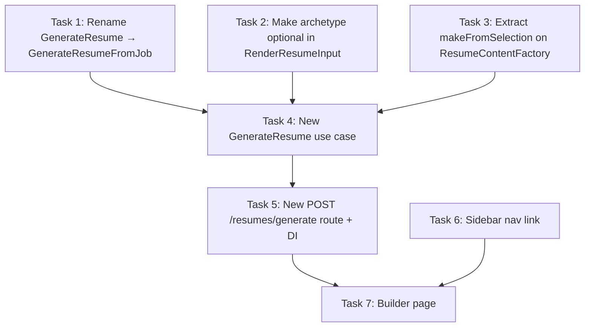

# Resume Builder Implementation Plan

> **For agentic workers:** REQUIRED SUB-SKILL: Use superpowers:subagent-driven-development (recommended) or superpowers:executing-plans to implement this plan task-by-task. Steps use checkbox (`- [ ]`) syntax for tracking.

**Goal:** Enable standalone resume generation where users cherry-pick content (headline, experiences, education, skills) and download a PDF — no job posting or archetype required.

**Architecture:** Rename existing `GenerateResume` → `GenerateResumeFromJob` to free the name. Add `makeFromSelection()` to `ResumeContentFactory` so content assembly accepts explicit selections instead of an archetype lookup. New lightweight `GenerateResume` use case orchestrates the builder flow. New `POST /resumes/generate` route. New `/resume/builder` frontend page with checkbox-driven content selection and controls panel.

**Tech Stack:** Bun, Elysia, MikroORM, Needle-DI, React 19, TanStack Router/Query, shadcn/ui, Typst

---

## Context

Resume generation is currently coupled to a job posting (`PUT /jobs/:id/generate-resume`). The spec calls for a standalone builder page where users directly select which content to include and generate a PDF. This unlocks resume creation for networking, speculative applications, or portfolio use — not just in response to a specific job.

## Design Decisions

1. **`RenderResumeInput.archetype` becomes optional.** The renderer only uses it for the PDF filename. When omitted, the renderer uses `templateStyle` instead. Backward-compatible — existing job-based flow still passes archetype.

2. **`makeFromSelection()` on same port.** The existing `make()` delegates to `makeFromSelection()` after resolving archetype content selection. No new class needed.

3. **No `Resume` domain entity in builder flow.** The builder is stateless PDF generation — no job to associate. The new use case returns just `{ pdfPath }` (new `BuildResumeOutputDto`).

4. **Raw `fetch` for PDF download.** Eden Treaty doesn't handle binary blob responses well. The frontend uses `fetch` directly for the generate endpoint.

## Dependency Graph



**Parallelizable:** Tasks 1, 2, 3 can run concurrently. Task 6 can run concurrently with Task 5.

---

## Task 1: Rename `GenerateResume` → `GenerateResumeFromJob`

Mechanical rename across 8 files to free the `GenerateResume` name for the new use case.

**Files:**
- Rename: `application/src/use-cases/GenerateResume.ts` → `GenerateResumeFromJob.ts`
- Rename: `application/src/dtos/GenerateResumeDto.ts` → `GenerateResumeFromJobDto.ts`
- Rename: `api/src/routes/GenerateResumeRoute.ts` → `GenerateResumeFromJobRoute.ts`
- Modify: `application/src/use-cases/index.ts`
- Modify: `application/src/dtos/index.ts`
- Modify: `infrastructure/src/DI.ts`
- Modify: `api/src/container.ts`
- Modify: `api/src/index.ts`

- [ ] **Step 1: Rename use case file and class**

Rename `application/src/use-cases/GenerateResume.ts` → `GenerateResumeFromJob.ts`. Inside, rename class `GenerateResume` → `GenerateResumeFromJob`. Update the logger name to `GenerateResumeFromJob.name`.

```typescript
// application/src/use-cases/GenerateResumeFromJob.ts
import { Logger } from '@tailoredin/core';
import {
  ArchetypeKey,
  type ArchetypeRepository,
  err,
  type JobPosting,
  type JobRepository,
  ok,
  type ProfileRepository,
  type Result,
  Resume,
  TailoringStrategyService
} from '@tailoredin/domain';
import type { GenerateResumeFromJobDto } from '../dtos/GenerateResumeFromJobDto.js';
import type { ResumeOutputDto } from '../dtos/ResumeOutputDto.js';
import type { LlmService } from '../ports/LlmService.js';
import type { ResumeContentFactory } from '../ports/ResumeContentFactory.js';
import type { ResumeRenderer } from '../ports/ResumeRenderer.js';
import type { WebColorService } from '../ports/WebColorService.js';

const DEFAULT_AWESOME_COLOR = '#0395DE';

export class GenerateResumeFromJob {
  private readonly log = Logger.create(GenerateResumeFromJob.name);

  public constructor(
    private readonly jobRepository: JobRepository,
    private readonly profileRepository: ProfileRepository,
    private readonly archetypeRepository: ArchetypeRepository,
    private readonly llmService: LlmService | null,
    private readonly webColorService: WebColorService,
    private readonly resumeRenderer: ResumeRenderer,
    private readonly resumeContentFactory: ResumeContentFactory
  ) {}

  public async execute(input: GenerateResumeFromJobDto): Promise<Result<ResumeOutputDto, Error>> {
    let job: JobPosting;
    try {
      job = await this.jobRepository.findByIdOrFail(input.jobId);
    } catch {
      return err(new Error(`Job not found: ${input.jobId}`));
    }

    const profile = await this.profileRepository.findSingle();
    const allArchetypes = await this.archetypeRepository.findAll();

    if (!input.archetype) {
      return err(new Error('Archetype is required'));
    }

    const archetype: ArchetypeKey = input.archetype;
    const keywords: string[] = input.keywords ?? [];
    let awesomeColor = DEFAULT_AWESOME_COLOR;

    if (this.llmService) {
      try {
        const postingInsights = await this.llmService.extractJobPostingInsights({
          jobDescription: job.description,
          companyName: job.companyId,
          jobTitle: job.title,
          jobLocation: job.locationRaw
        });

        if (postingInsights.website) {
          this.log.info('Extracting website colors...');
          const primaryColor = await this.webColorService.findPrimaryColor(postingInsights.website);
          if (primaryColor) awesomeColor = primaryColor;
        }
      } catch (e) {
        this.log.warn(`LLM color extraction failed, using default color: ${e}`);
      }
    }

    const archetypeRecord = allArchetypes.find(a => a.key === archetype) ?? allArchetypes[0];

    const content = await this.resumeContentFactory.make({
      profileId: profile.id.value,
      archetypeId: archetypeRecord.id.value,
      awesomeColor,
      keywords
    });

    this.log.info('Rendering resume PDF...');

    const tailoringStrategy = new TailoringStrategyService();
    const templateStyle = tailoringStrategy.resolveTemplateStyle(archetype);

    const pdfPath = await this.resumeRenderer.render({
      content,
      companyName: job.companyId,
      archetype,
      templateStyle
    });

    const resume = Resume.create({
      jobId: job.id.value,
      archetype,
      keywords,
      outputPath: pdfPath
    });

    return ok({ pdfPath, resumeId: resume.id.value });
  }
}
```

- [ ] **Step 2: Rename DTO file and type**

Rename `application/src/dtos/GenerateResumeDto.ts` → `GenerateResumeFromJobDto.ts`. Rename the type.

```typescript
// application/src/dtos/GenerateResumeFromJobDto.ts
import type { ArchetypeKey } from '@tailoredin/domain';

export type GenerateResumeFromJobDto = {
  jobId: string;
  archetype?: ArchetypeKey;
  keywords?: string[];
};
```

- [ ] **Step 3: Update barrel exports**

In `application/src/use-cases/index.ts`, change line 44:
```typescript
// Old:
export { GenerateResume } from './GenerateResume.js';
// New:
export { GenerateResumeFromJob } from './GenerateResumeFromJob.js';
```

In `application/src/dtos/index.ts`, change the GenerateResumeDto line:
```typescript
// Old:
export type { GenerateResumeDto } from './GenerateResumeDto.js';
// New:
export type { GenerateResumeFromJobDto } from './GenerateResumeFromJobDto.js';
```

- [ ] **Step 4: Update DI token**

In `infrastructure/src/DI.ts`:
- Change the import from `GenerateResume` to `GenerateResumeFromJob`
- Rename token `GenerateResume` → `GenerateResumeFromJob` on line 94:

```typescript
// Old:
GenerateResume: new InjectionToken<GenerateResume>('DI.Resume.GenerateResume')
// New:
GenerateResumeFromJob: new InjectionToken<GenerateResumeFromJob>('DI.Resume.GenerateResumeFromJob')
```

- [ ] **Step 5: Update container binding**

In `api/src/container.ts`:
- Change import from `GenerateResume` to `GenerateResumeFromJob`
- Update binding (lines 178-190):

```typescript
container.bind({
  provide: DI.Resume.GenerateResumeFromJob,
  useFactory: () =>
    new GenerateResumeFromJob(
      container.get(DI.Job.Repository),
      container.get(DI.Profile.Repository),
      container.get(DI.Archetype.Repository),
      container.get(DI.Resume.LlmService),
      container.get(DI.Resume.WebColorService),
      container.get(DI.Resume.Renderer),
      container.get(DI.Resume.ContentFactory)
    )
});
```

- [ ] **Step 6: Rename route file and class**

Rename `api/src/routes/GenerateResumeRoute.ts` → `GenerateResumeFromJobRoute.ts`. Update class name, import, and DI token reference:

```typescript
// api/src/routes/GenerateResumeFromJobRoute.ts
import { readFileSync } from 'node:fs';
import { inject, injectable } from '@needle-di/core';
import type { GenerateResumeFromJob } from '@tailoredin/application';
import { ArchetypeKey } from '@tailoredin/domain';
import { DI } from '@tailoredin/infrastructure';
import { Elysia, t } from 'elysia';

@injectable()
export class GenerateResumeFromJobRoute {
  public constructor(
    private readonly generateResumeFromJob: GenerateResumeFromJob = inject(DI.Resume.GenerateResumeFromJob)
  ) {}

  public plugin() {
    return new Elysia().put(
      '/jobs/:id/generate-resume',
      async ({ params, body, set }) => {
        const result = await this.generateResumeFromJob.execute({
          jobId: params.id,
          archetype: body?.archetype as ArchetypeKey | undefined,
          keywords: body?.keywords
        });

        if (!result.isOk) {
          set.status = 400;
          return { error: { code: 'GENERATION_FAILED', message: result.error.message } };
        }

        const pdfPath = result.value.pdfPath;
        const fileName = pdfPath.split('/').pop() ?? 'resume.pdf';
        const pdfBuffer = readFileSync(pdfPath);
        set.headers['content-type'] = 'application/pdf';
        set.headers['content-disposition'] = `attachment; filename="${fileName}"`;
        return pdfBuffer;
      },
      {
        params: t.Object({ id: t.String({ format: 'uuid' }) }),
        body: t.Optional(
          t.Object({
            archetype: t.Optional(t.Enum(ArchetypeKey)),
            keywords: t.Optional(t.Array(t.String()))
          })
        )
      }
    );
  }
}
```

- [ ] **Step 7: Update API index**

In `api/src/index.ts`:
- Change import from `GenerateResumeRoute` to `GenerateResumeFromJobRoute`
- Update `.use()` call on line 90:

```typescript
// Old:
import { GenerateResumeRoute } from './routes/GenerateResumeRoute.js';
.use(container.get(GenerateResumeRoute).plugin())
// New:
import { GenerateResumeFromJobRoute } from './routes/GenerateResumeFromJobRoute.js';
.use(container.get(GenerateResumeFromJobRoute).plugin())
```

- [ ] **Step 8: Verify rename**

Run: `bun run check && bun run --cwd application typecheck && bun run --cwd infrastructure typecheck && bun run --cwd api typecheck`
Expected: All pass with no references to old `GenerateResume` name (except the new use case we haven't created yet).

- [ ] **Step 9: Commit**

```bash
git add application/src/use-cases/GenerateResumeFromJob.ts application/src/dtos/GenerateResumeFromJobDto.ts api/src/routes/GenerateResumeFromJobRoute.ts application/src/use-cases/index.ts application/src/dtos/index.ts infrastructure/src/DI.ts api/src/container.ts api/src/index.ts
git rm application/src/use-cases/GenerateResume.ts application/src/dtos/GenerateResumeDto.ts api/src/routes/GenerateResumeRoute.ts
git commit -m "refactor: rename GenerateResume to GenerateResumeFromJob"
```

---

## Task 2: Make `archetype` Optional in `RenderResumeInput`

**Files:**
- Modify: `application/src/ports/ResumeRenderer.ts`
- Modify: `infrastructure/src/services/TypstResumeRenderer.ts`

- [ ] **Step 1: Update the port type**

In `application/src/ports/ResumeRenderer.ts`, make `archetype` optional:

```typescript
export type RenderResumeInput = {
  content: ResumeContentDto;
  companyName: string;
  archetype?: ArchetypeKey;
  templateStyle: TemplateStyle;
};
```

- [ ] **Step 2: Update the renderer to handle missing archetype**

In `infrastructure/src/services/TypstResumeRenderer.ts`, fall back to `templateStyle` for filename:

```typescript
public async render(input: RenderResumeInput): Promise<string> {
  const { content, companyName, archetype, templateStyle } = input;
  const layoutConfig = TEMPLATE_LAYOUTS[templateStyle];
  const outputDir = Path.resolve(RESUMES_DIR, snakeCase(companyName.toLowerCase()));
  const date = format(new Date(), 'yyyy_MM_dd');
  const label = archetype ?? templateStyle;
  const pdfPath = Path.resolve(outputDir, `Sylvain_Estevez_${label}_${date}.pdf`);

  await FS.mkdir(outputDir, { recursive: true });
  await TypstFileGenerator.generate(content, TYPST_DIR, layoutConfig);
  execSync(`typst compile cv.typ "${pdfPath}"`, { cwd: TYPST_DIR, stdio: 'pipe' });

  return pdfPath;
}
```

- [ ] **Step 3: Verify**

Run: `bun run --cwd application typecheck && bun run --cwd infrastructure typecheck`
Expected: PASS — existing callers still pass `archetype`, new callers can omit it.

- [ ] **Step 4: Commit**

```bash
git add application/src/ports/ResumeRenderer.ts infrastructure/src/services/TypstResumeRenderer.ts
git commit -m "refactor: make archetype optional in RenderResumeInput"
```

---

## Task 3: Extract `makeFromSelection()` on `ResumeContentFactory`

Refactor the content factory so the mapping logic lives in `makeFromSelection()` and the existing `make()` delegates to it.

**Files:**
- Modify: `application/src/ports/ResumeContentFactory.ts`
- Modify: `application/src/ports/index.ts`
- Modify: `infrastructure/src/services/DatabaseResumeContentFactory.ts`
- Test: `infrastructure/test/services/DatabaseResumeContentFactory.test.ts` (new)

- [ ] **Step 1: Add the new input type and method to the port**

```typescript
// application/src/ports/ResumeContentFactory.ts
import type { ExperienceSelection } from '@tailoredin/domain';
import type { ResumeContentDto } from '../dtos/ResumeContentDto.js';

export type MakeResumeContentInput = {
  profileId: string;
  archetypeId: string;
  awesomeColor: string;
  keywords: string[];
};

export type MakeResumeContentFromSelectionInput = {
  profileId: string;
  headlineId: string;
  experienceSelections: ExperienceSelection[];
  educationIds: string[];
  skillCategoryIds: string[];
  skillItemIds: string[];
  awesomeColor: string;
  keywords: string[];
};

export interface ResumeContentFactory {
  make(input: MakeResumeContentInput): Promise<ResumeContentDto>;
  makeFromSelection(input: MakeResumeContentFromSelectionInput): Promise<ResumeContentDto>;
}
```

- [ ] **Step 2: Export the new type from ports barrel**

In `application/src/ports/index.ts`, update the ResumeContentFactory export:

```typescript
// Old:
export type { MakeResumeContentInput, ResumeContentFactory } from './ResumeContentFactory.js';
// New:
export type {
  MakeResumeContentFromSelectionInput,
  MakeResumeContentInput,
  ResumeContentFactory
} from './ResumeContentFactory.js';
```

- [ ] **Step 3: Implement `makeFromSelection()` in `DatabaseResumeContentFactory`**

Extract the mapping logic from `make()` into `makeFromSelection()`. Then `make()` delegates.

```typescript
// infrastructure/src/services/DatabaseResumeContentFactory.ts
import type {
  MakeResumeContentFromSelectionInput,
  MakeResumeContentInput,
  ResumeContentDto,
  ResumeContentFactory
} from '@tailoredin/application';
import { StringUtil } from '@tailoredin/core';
import type {
  ArchetypeRepository,
  EducationRepository,
  ExperienceRepository,
  HeadlineRepository,
  ProfileRepository,
  SkillCategoryRepository
} from '@tailoredin/domain';
import { formatDateRange } from '../resume/dateFormatter.js';

export class DatabaseResumeContentFactory implements ResumeContentFactory {
  public constructor(
    private readonly profileRepo: ProfileRepository,
    private readonly headlineRepo: HeadlineRepository,
    private readonly archetypeRepo: ArchetypeRepository,
    private readonly experienceRepo: ExperienceRepository,
    private readonly educationRepo: EducationRepository,
    private readonly skillCategoryRepo: SkillCategoryRepository
  ) {}

  public async make(input: MakeResumeContentInput): Promise<ResumeContentDto> {
    const archetype = await this.archetypeRepo.findByIdOrFail(input.archetypeId);
    const cs = archetype.contentSelection;

    const headlines = await this.headlineRepo.findAll();
    const headlineId = archetype.headlineId
      ? (headlines.find(h => h.id.value === archetype.headlineId) ? archetype.headlineId : headlines[0]?.id.value)
      : headlines[0]?.id.value;

    if (!headlineId) {
      throw new Error('No headlines found');
    }

    return this.makeFromSelection({
      profileId: input.profileId,
      headlineId,
      experienceSelections: cs.experienceSelections,
      educationIds: cs.educationIds,
      skillCategoryIds: cs.skillCategoryIds,
      skillItemIds: cs.skillItemIds,
      awesomeColor: input.awesomeColor,
      keywords: input.keywords
    });
  }

  public async makeFromSelection(input: MakeResumeContentFromSelectionInput): Promise<ResumeContentDto> {
    const [profile, headlines, allExperiences, allEducation, allCategories] = await Promise.all([
      this.profileRepo.findSingle(),
      this.headlineRepo.findAll(),
      this.experienceRepo.findAll(),
      this.educationRepo.findAll(),
      this.skillCategoryRepo.findAll()
    ]);

    // Headline
    const headline = headlines.find(h => h.id.value === input.headlineId) ?? headlines[0];
    if (!headline) {
      throw new Error('No headlines found');
    }

    // Personal
    const personal = {
      first_name: profile.firstName,
      last_name: profile.lastName,
      email: profile.email,
      phone: profile.phone ?? '',
      github: profile.githubUrl ?? '',
      linkedin: profile.linkedinUrl ?? '',
      location: profile.location ?? '',
      header_quote: headline.summaryText
    };

    // Experience
    const experienceMap = new Map(allExperiences.map(e => [e.id.value, e]));
    const variantMap = new Map<string, { text: string; bulletOrdinal: number }>();
    for (const exp of allExperiences) {
      for (const bullet of exp.bullets) {
        for (const variant of bullet.variants) {
          variantMap.set(variant.id.value, {
            text: variant.text,
            bulletOrdinal: bullet.ordinal
          });
        }
      }
    }

    const experience = input.experienceSelections.map(sel => {
      const exp = experienceMap.get(sel.experienceId);
      if (!exp) {
        throw new Error(`Experience not found: ${sel.experienceId}`);
      }

      const highlights: string[] = [];
      for (const variantId of sel.bulletVariantIds) {
        const entry = variantMap.get(variantId);
        if (!entry) {
          continue;
        }
        highlights.push(StringUtil.ensureEndsWith(entry.text, '.'));
      }

      return {
        title: exp.title,
        society: exp.companyName,
        date: formatDateRange(exp.startDate, exp.endDate),
        location: exp.location,
        summary: exp.summary ?? '',
        highlights
      };
    });

    // Education
    const educationMap = new Map(allEducation.map(e => [e.id.value, e]));
    const education = input.educationIds.map(id => {
      const edu = educationMap.get(id);
      if (!edu) {
        throw new Error(`Education not found: ${id}`);
      }
      return {
        title: edu.degreeTitle,
        society: edu.institutionName,
        date: String(edu.graduationYear),
        location: edu.location ?? ''
      };
    });

    // Skills
    const categoryMap = new Map(allCategories.map(c => [c.id.value, c]));
    const selectedItemIds = new Set(input.skillItemIds);

    const skills = input.skillCategoryIds.map(catId => {
      const cat = categoryMap.get(catId);
      if (!cat) {
        throw new Error(`Skill category not found: ${catId}`);
      }

      const filteredItems = cat.items
        .filter(item => selectedItemIds.has(item.id.value))
        .sort((a, b) => a.ordinal - b.ordinal);

      const info = filteredItems.map(item => item.name.replace(/#/g, '\\#')).join(' #h-bar() ');

      return { type: cat.name, info };
    });

    return {
      personal,
      awesome_color: input.awesomeColor,
      keywords: input.keywords,
      experience,
      skills,
      education
    };
  }
}
```

- [ ] **Step 4: Verify**

Run: `bun run check && bun run --cwd application typecheck && bun run --cwd infrastructure typecheck`
Expected: PASS

- [ ] **Step 5: Commit**

```bash
git add application/src/ports/ResumeContentFactory.ts application/src/ports/index.ts infrastructure/src/services/DatabaseResumeContentFactory.ts
git commit -m "feat: add makeFromSelection to ResumeContentFactory"
```

---

## Task 4: New `GenerateResume` Use Case

The lightweight standalone builder use case — no job, no archetype, no LLM, no color extraction.

**Files:**
- Create: `application/src/use-cases/GenerateResume.ts`
- Create: `application/src/dtos/GenerateResumeDto.ts`
- Create: `application/src/dtos/BuildResumeOutputDto.ts`
- Modify: `application/src/use-cases/index.ts`
- Modify: `application/src/dtos/index.ts`

- [ ] **Step 1: Create the new DTO**

```typescript
// application/src/dtos/GenerateResumeDto.ts
import type { ExperienceSelection, TemplateStyle } from '@tailoredin/domain';

export type GenerateResumeDto = {
  headlineId: string;
  experienceSelections: ExperienceSelection[];
  educationIds: string[];
  skillCategoryIds: string[];
  skillItemIds: string[];
  templateStyle: TemplateStyle;
  keywords?: string[];
};
```

- [ ] **Step 2: Create the output DTO**

```typescript
// application/src/dtos/BuildResumeOutputDto.ts
export type BuildResumeOutputDto = {
  pdfPath: string;
};
```

- [ ] **Step 3: Create the use case**

```typescript
// application/src/use-cases/GenerateResume.ts
import { Logger } from '@tailoredin/core';
import { type ProfileRepository, type Result, ok } from '@tailoredin/domain';
import type { BuildResumeOutputDto } from '../dtos/BuildResumeOutputDto.js';
import type { GenerateResumeDto } from '../dtos/GenerateResumeDto.js';
import type { ResumeContentFactory } from '../ports/ResumeContentFactory.js';
import type { ResumeRenderer } from '../ports/ResumeRenderer.js';

const DEFAULT_AWESOME_COLOR = '#0395DE';

export class GenerateResume {
  private readonly log = Logger.create(GenerateResume.name);

  public constructor(
    private readonly profileRepository: ProfileRepository,
    private readonly resumeContentFactory: ResumeContentFactory,
    private readonly resumeRenderer: ResumeRenderer
  ) {}

  public async execute(input: GenerateResumeDto): Promise<Result<BuildResumeOutputDto, Error>> {
    const profile = await this.profileRepository.findSingle();

    const content = await this.resumeContentFactory.makeFromSelection({
      profileId: profile.id.value,
      headlineId: input.headlineId,
      experienceSelections: input.experienceSelections,
      educationIds: input.educationIds,
      skillCategoryIds: input.skillCategoryIds,
      skillItemIds: input.skillItemIds,
      awesomeColor: DEFAULT_AWESOME_COLOR,
      keywords: input.keywords ?? []
    });

    this.log.info('Rendering resume PDF...');

    const pdfPath = await this.resumeRenderer.render({
      content,
      companyName: 'Generic',
      templateStyle: input.templateStyle
    });

    return ok({ pdfPath });
  }
}
```

- [ ] **Step 4: Update barrel exports**

In `application/src/use-cases/index.ts`, add after the `GenerateResumeFromJob` export:

```typescript
export { GenerateResume } from './GenerateResume.js';
```

In `application/src/dtos/index.ts`, add:

```typescript
export type { BuildResumeOutputDto } from './BuildResumeOutputDto.js';
export type { GenerateResumeDto } from './GenerateResumeDto.js';
```

- [ ] **Step 5: Verify**

Run: `bun run check && bun run --cwd application typecheck`
Expected: PASS

- [ ] **Step 6: Commit**

```bash
git add application/src/use-cases/GenerateResume.ts application/src/dtos/GenerateResumeDto.ts application/src/dtos/BuildResumeOutputDto.ts application/src/use-cases/index.ts application/src/dtos/index.ts
git commit -m "feat: add standalone GenerateResume use case"
```

---

## Task 5: New `POST /resumes/generate` Route + DI Wiring

**Files:**
- Create: `api/src/routes/GenerateResumeRoute.ts`
- Modify: `infrastructure/src/DI.ts`
- Modify: `api/src/container.ts`
- Modify: `api/src/index.ts`

- [ ] **Step 1: Add DI token**

In `infrastructure/src/DI.ts`, add the new token to `DI.Resume` (alongside `GenerateResumeFromJob`). Update the import to include both:

```typescript
// In the import block, add GenerateResume alongside GenerateResumeFromJob
import type {
  // ... existing imports ...
  GenerateResume,
  GenerateResumeFromJob,
  // ...
} from '@tailoredin/application';

// In DI.Resume:
Resume: {
  LlmService: new InjectionToken<LlmService | null>('DI.Resume.LlmService'),
  WebColorService: new InjectionToken<WebColorService>('DI.Resume.WebColorService'),
  Renderer: new InjectionToken<ResumeRenderer>('DI.Resume.Renderer'),
  ContentFactory: new InjectionToken<ResumeContentFactory>('DI.Resume.ContentFactory'),
  GenerateResumeFromJob: new InjectionToken<GenerateResumeFromJob>('DI.Resume.GenerateResumeFromJob'),
  GenerateResume: new InjectionToken<GenerateResume>('DI.Resume.GenerateResume')
},
```

- [ ] **Step 2: Add container binding**

In `api/src/container.ts`, import `GenerateResume` and add the binding after the `GenerateResumeFromJob` binding:

```typescript
import {
  // ... add GenerateResume to the existing import list ...
  GenerateResume,
  GenerateResumeFromJob,
  // ...
} from '@tailoredin/application';

// After the GenerateResumeFromJob binding:
container.bind({
  provide: DI.Resume.GenerateResume,
  useFactory: () =>
    new GenerateResume(
      container.get(DI.Profile.Repository),
      container.get(DI.Resume.ContentFactory),
      container.get(DI.Resume.Renderer)
    )
});
```

- [ ] **Step 3: Create the route**

```typescript
// api/src/routes/GenerateResumeRoute.ts
import { readFileSync } from 'node:fs';
import { inject, injectable } from '@needle-di/core';
import type { GenerateResume } from '@tailoredin/application';
import { TemplateStyle } from '@tailoredin/domain';
import { DI } from '@tailoredin/infrastructure';
import { Elysia, t } from 'elysia';

@injectable()
export class GenerateResumeRoute {
  public constructor(private readonly generateResume: GenerateResume = inject(DI.Resume.GenerateResume)) {}

  public plugin() {
    return new Elysia().post(
      '/resumes/generate',
      async ({ body, set }) => {
        const result = await this.generateResume.execute({
          headlineId: body.headline_id,
          experienceSelections: body.experience_selections.map(s => ({
            experienceId: s.experience_id,
            bulletVariantIds: s.bullet_variant_ids
          })),
          educationIds: body.education_ids,
          skillCategoryIds: body.skill_category_ids,
          skillItemIds: body.skill_item_ids,
          templateStyle: body.template_style as TemplateStyle,
          keywords: body.keywords
        });

        if (!result.isOk) {
          set.status = 400;
          return { error: { code: 'GENERATION_FAILED', message: result.error.message } };
        }

        const pdfPath = result.value.pdfPath;
        const fileName = pdfPath.split('/').pop() ?? 'resume.pdf';
        const pdfBuffer = readFileSync(pdfPath);
        set.headers['content-type'] = 'application/pdf';
        set.headers['content-disposition'] = `attachment; filename="${fileName}"`;
        return pdfBuffer;
      },
      {
        body: t.Object({
          headline_id: t.String({ format: 'uuid' }),
          experience_selections: t.Array(
            t.Object({
              experience_id: t.String({ format: 'uuid' }),
              bullet_variant_ids: t.Array(t.String({ format: 'uuid' }))
            })
          ),
          education_ids: t.Array(t.String({ format: 'uuid' })),
          skill_category_ids: t.Array(t.String({ format: 'uuid' })),
          skill_item_ids: t.Array(t.String({ format: 'uuid' })),
          template_style: t.Enum(TemplateStyle),
          keywords: t.Optional(t.Array(t.String()))
        })
      }
    );
  }
}
```

- [ ] **Step 4: Wire route in API index**

In `api/src/index.ts`, add import and `.use()`:

```typescript
// Add import:
import { GenerateResumeRoute } from './routes/GenerateResumeRoute.js';

// Add after the GenerateResumeFromJobRoute .use() line, in the Jobs section or a new Resume section:
// Resume Builder
.use(container.get(GenerateResumeRoute).plugin())
```

- [ ] **Step 5: Verify**

Run: `bun run check && bun run --cwd api typecheck`
Expected: PASS

- [ ] **Step 6: Commit**

```bash
git add api/src/routes/GenerateResumeRoute.ts infrastructure/src/DI.ts api/src/container.ts api/src/index.ts
git commit -m "feat: add POST /resumes/generate route"
```

---

## Task 6: Sidebar Nav Link

**Files:**
- Modify: `web/src/components/layout/sidebar.tsx`

- [ ] **Step 1: Add Builder to resume nav**

In `web/src/components/layout/sidebar.tsx`, add `FileText` to the lucide imports and add the Builder entry to `resumeNav`:

```typescript
// Add to imports:
import {
  // ... existing icons ...
  FileText,
  // ...
} from 'lucide-react';

// Add as last item in resumeNav array:
const resumeNav: NavItem[] = [
  { label: 'Profile', to: '/resume/profile', icon: User },
  { label: 'Headlines', to: '/resume/headlines', icon: Heading },
  { label: 'Experience', to: '/resume/experience', icon: ScrollText },
  { label: 'Skills', to: '/resume/skills', icon: Wrench },
  { label: 'Education', to: '/resume/education', icon: GraduationCap },
  { label: 'Builder', to: '/resume/builder', icon: FileText }
];
```

- [ ] **Step 2: Verify**

Run: `bun run --cwd web typecheck`
Expected: PASS (route doesn't need to exist yet for the Link to compile)

- [ ] **Step 3: Commit**

```bash
git add web/src/components/layout/sidebar.tsx
git commit -m "feat: add Resume Builder link to sidebar"
```

---

## Task 7: Builder Page

The main frontend deliverable — a two-panel page where users select resume content and generate a PDF.

**Files:**
- Create: `web/src/routes/resume/builder.tsx`

This task creates a single route file. The page is self-contained — selection state is local, data comes from existing hooks, and PDF generation uses raw `fetch`.

- [ ] **Step 1: Create the builder route**

```tsx
// web/src/routes/resume/builder.tsx
import { createFileRoute } from '@tanstack/react-router';
import { useState, useMemo, useCallback } from 'react';
import { toast } from 'sonner';
import { ChevronDown, ChevronRight, Download, Loader2 } from 'lucide-react';
import { useHeadlines } from '@/hooks/use-headlines';
import { useExperiences } from '@/hooks/use-experiences';
import { useEducations, type Education } from '@/hooks/use-education';
import { useSkillCategories } from '@/hooks/use-skills';
import type { Experience, Bullet, BulletVariant } from '@/components/resume/experience/types';
import { formatDateRange } from '@/components/resume/experience/types';
import { Skeleton } from '@/components/ui/skeleton';

export const Route = createFileRoute('/resume/builder')({
  component: BuilderPage
});

// ── Types ─────────────────────────────────────────────────────────

type ExperienceSelection = {
  experienceId: string;
  bulletVariantIds: string[];
};

type TemplateStyle = 'ic' | 'architect' | 'executive';

const TEMPLATE_STYLES: { value: TemplateStyle; label: string }[] = [
  { value: 'ic', label: 'IC' },
  { value: 'architect', label: 'Architect' },
  { value: 'executive', label: 'Executive' }
];

// ── Main Component ────────────────────────────────────────────────

function BuilderPage() {
  // Data fetching
  const { data: headlines, isLoading: headlinesLoading } = useHeadlines();
  const { data: rawExperiences, isLoading: experiencesLoading } = useExperiences();
  const { data: rawEducations, isLoading: educationsLoading } = useEducations();
  const { data: rawSkillCategories, isLoading: skillsLoading } = useSkillCategories();

  const experiences = useMemo(
    () => ((rawExperiences ?? []) as Experience[]).sort((a, b) => b.startDate.localeCompare(a.startDate)),
    [rawExperiences]
  );
  const educations = useMemo(
    () => ((rawEducations ?? []) as Education[]).sort((a, b) => a.ordinal - b.ordinal),
    [rawEducations]
  );
  const skillCategories = useMemo(
    () => ((rawSkillCategories ?? []) as SkillCategory[]).sort((a, b) => a.ordinal - b.ordinal),
    [rawSkillCategories]
  );

  // Selection state
  const [selectedHeadlineId, setSelectedHeadlineId] = useState<string>('');
  const [selectedExperiences, setSelectedExperiences] = useState<Map<string, Set<string>>>(new Map());
  const [expandedExperiences, setExpandedExperiences] = useState<Set<string>>(new Set());
  const [selectedEducationIds, setSelectedEducationIds] = useState<Set<string>>(new Set());
  const [selectedCategoryIds, setSelectedCategoryIds] = useState<Set<string>>(new Set());
  const [selectedItemIds, setSelectedItemIds] = useState<Set<string>>(new Set());

  // Controls state
  const [templateStyle, setTemplateStyle] = useState<TemplateStyle>('ic');
  const [keywords, setKeywords] = useState('');
  const [generating, setGenerating] = useState(false);

  // Auto-select first headline when data loads
  useMemo(() => {
    if (headlines?.length && !selectedHeadlineId) {
      setSelectedHeadlineId((headlines as Headline[])[0].id);
    }
  }, [headlines, selectedHeadlineId]);

  // ── Experience Selection Handlers ──

  const toggleExperience = useCallback((expId: string, exp: Experience) => {
    setSelectedExperiences(prev => {
      const next = new Map(prev);
      if (next.has(expId)) {
        next.delete(expId);
      } else {
        // Select all approved variants by default
        const variantIds = new Set<string>();
        for (const bullet of exp.bullets) {
          for (const variant of bullet.variants) {
            if (variant.approvalStatus === 'APPROVED') {
              variantIds.add(variant.id);
            }
          }
        }
        next.set(expId, variantIds);
      }
      return next;
    });
  }, []);

  const toggleVariant = useCallback((expId: string, variantId: string) => {
    setSelectedExperiences(prev => {
      const next = new Map(prev);
      const variants = new Set(next.get(expId) ?? []);
      if (variants.has(variantId)) {
        variants.delete(variantId);
      } else {
        variants.add(variantId);
      }
      next.set(expId, variants);
      return next;
    });
  }, []);

  const toggleExpandExperience = useCallback((expId: string) => {
    setExpandedExperiences(prev => {
      const next = new Set(prev);
      if (next.has(expId)) next.delete(expId);
      else next.add(expId);
      return next;
    });
  }, []);

  // ── Education Selection Handlers ──

  const toggleEducation = useCallback((id: string) => {
    setSelectedEducationIds(prev => {
      const next = new Set(prev);
      if (next.has(id)) next.delete(id);
      else next.add(id);
      return next;
    });
  }, []);

  // ── Skills Selection Handlers ──

  const toggleCategory = useCallback((catId: string, items: SkillItem[]) => {
    setSelectedCategoryIds(prev => {
      const next = new Set(prev);
      if (next.has(catId)) {
        next.delete(catId);
        // Remove all items in this category
        setSelectedItemIds(prevItems => {
          const nextItems = new Set(prevItems);
          for (const item of items) nextItems.delete(item.id);
          return nextItems;
        });
      } else {
        next.add(catId);
        // Select all items in this category
        setSelectedItemIds(prevItems => {
          const nextItems = new Set(prevItems);
          for (const item of items) nextItems.add(item.id);
          return nextItems;
        });
      }
      return next;
    });
  }, []);

  const toggleSkillItem = useCallback((itemId: string) => {
    setSelectedItemIds(prev => {
      const next = new Set(prev);
      if (next.has(itemId)) next.delete(itemId);
      else next.add(itemId);
      return next;
    });
  }, []);

  // ── Generate Handler ──

  const handleGenerate = async () => {
    if (!selectedHeadlineId) {
      toast.error('Please select a headline');
      return;
    }

    const experienceSelections: { experience_id: string; bullet_variant_ids: string[] }[] = [];
    for (const [expId, variantIds] of selectedExperiences) {
      experienceSelections.push({
        experience_id: expId,
        bullet_variant_ids: [...variantIds]
      });
    }

    const body = {
      headline_id: selectedHeadlineId,
      experience_selections: experienceSelections,
      education_ids: [...selectedEducationIds],
      skill_category_ids: [...selectedCategoryIds],
      skill_item_ids: [...selectedItemIds],
      template_style: templateStyle,
      keywords: keywords
        .split(',')
        .map(k => k.trim())
        .filter(Boolean)
    };

    setGenerating(true);
    try {
      const response = await fetch('/api/resumes/generate', {
        method: 'POST',
        headers: { 'Content-Type': 'application/json' },
        body: JSON.stringify(body)
      });

      if (!response.ok) {
        const err = await response.json();
        throw new Error(err?.error?.message ?? 'Generation failed');
      }

      const blob = await response.blob();
      const url = URL.createObjectURL(blob);
      const a = document.createElement('a');
      a.href = url;
      a.download =
        response.headers.get('content-disposition')?.match(/filename="(.+)"/)?.[1] ?? 'resume.pdf';
      a.click();
      URL.revokeObjectURL(url);
      toast.success('Resume downloaded');
    } catch (e) {
      toast.error(e instanceof Error ? e.message : 'Generation failed');
    } finally {
      setGenerating(false);
    }
  };

  // ── Loading State ──

  const isLoading = headlinesLoading || experiencesLoading || educationsLoading || skillsLoading;

  if (isLoading) {
    return (
      <div className="flex flex-col">
        <div className="flex items-center justify-between px-6 py-4 border-b border-[#e5e7eb]">
          <div>
            <h1 className="text-xl font-bold text-[#111]">Resume Builder</h1>
            <p className="text-[13px] text-[#6b7280] mt-0.5">
              Select content and generate a standalone resume
            </p>
          </div>
        </div>
        <div className="flex flex-col gap-4 p-6">
          <Skeleton className="h-32 w-full rounded-xl" />
          <Skeleton className="h-32 w-full rounded-xl" />
          <Skeleton className="h-32 w-full rounded-xl" />
        </div>
      </div>
    );
  }

  // ── Render ──

  return (
    <div className="flex flex-col h-full">
      {/* Page header */}
      <div className="flex items-center justify-between px-6 py-4 border-b border-[#e5e7eb]">
        <div>
          <h1 className="text-xl font-bold text-[#111]">Resume Builder</h1>
          <p className="text-[13px] text-[#6b7280] mt-0.5">
            Select content and generate a standalone resume
          </p>
        </div>
      </div>

      <div className="flex flex-1 overflow-hidden">
        {/* Left panel — Content Selection */}
        <div className="flex-1 overflow-y-auto p-6 space-y-6">
          {/* Headline */}
          <section>
            <h2 className="text-[13px] font-semibold text-[#6b7280] uppercase tracking-wide mb-3">
              Headline
            </h2>
            <div className="space-y-2">
              {(headlines as Headline[])?.map(h => (
                <label
                  key={h.id}
                  className={`flex items-start gap-3 p-3 rounded-md border cursor-pointer transition-colors ${
                    selectedHeadlineId === h.id
                      ? 'border-[#6366f1] bg-[#eef2ff]'
                      : 'border-[#e5e7eb] hover:border-[#c7d2fe]'
                  }`}
                >
                  <input
                    type="radio"
                    name="headline"
                    checked={selectedHeadlineId === h.id}
                    onChange={() => setSelectedHeadlineId(h.id)}
                    className="mt-0.5 accent-[#6366f1]"
                  />
                  <span className="text-[13px] text-[#374151] italic leading-relaxed">
                    {h.summaryText}
                  </span>
                </label>
              ))}
            </div>
          </section>

          {/* Professional Experience */}
          <section>
            <h2 className="text-[13px] font-semibold text-[#6b7280] uppercase tracking-wide mb-3">
              Professional Experience
            </h2>
            <div className="space-y-1">
              {experiences.map(exp => {
                const isSelected = selectedExperiences.has(exp.id);
                const isExpanded = expandedExperiences.has(exp.id);
                const selectedVariants = selectedExperiences.get(exp.id) ?? new Set();

                return (
                  <div key={exp.id} className={`rounded-md border ${isSelected ? 'border-[#e5e7eb]' : 'border-[#f0f0f0]'}`}>
                    {/* Experience header */}
                    <div className="flex items-center gap-3 px-4 py-3">
                      <input
                        type="checkbox"
                        checked={isSelected}
                        onChange={() => toggleExperience(exp.id, exp)}
                        className="accent-[#6366f1]"
                      />
                      <button
                        type="button"
                        className="text-[#9ca3af] hover:text-[#6b7280]"
                        onClick={() => toggleExpandExperience(exp.id)}
                      >
                        {isExpanded ? <ChevronDown className="h-4 w-4" /> : <ChevronRight className="h-4 w-4" />}
                      </button>
                      <div className={`flex-1 ${!isSelected ? 'opacity-40' : ''}`}>
                        <div className="text-[15px] font-bold text-[#111]">{exp.title}</div>
                        <div className="text-[13px] text-[#374151]">
                          {exp.companyName} &middot; {formatDateRange(exp.startDate, exp.endDate)}
                        </div>
                      </div>
                    </div>

                    {/* Expanded variant selection */}
                    {isExpanded && (
                      <div className="px-4 pb-3 ml-11 space-y-2">
                        {exp.bullets.map(bullet => (
                          <div key={bullet.id} className="space-y-1">
                            <div className="text-[13px] text-[#6b7280]">{bullet.content}</div>
                            <div className="ml-4 space-y-1 border-l-2 border-[#c7d2fe] pl-3">
                              {bullet.variants.map(variant => (
                                <label
                                  key={variant.id}
                                  className="flex items-start gap-2 cursor-pointer"
                                >
                                  <input
                                    type="checkbox"
                                    checked={selectedVariants.has(variant.id)}
                                    onChange={() => toggleVariant(exp.id, variant.id)}
                                    disabled={!isSelected}
                                    className="mt-0.5 accent-[#6366f1]"
                                  />
                                  <span className={`text-[13px] leading-relaxed ${
                                    variant.approvalStatus === 'APPROVED' ? 'text-[#374151]' : 'text-[#9ca3af]'
                                  }`}>
                                    {variant.text}
                                  </span>
                                </label>
                              ))}
                            </div>
                          </div>
                        ))}
                      </div>
                    )}
                  </div>
                );
              })}
            </div>
          </section>

          {/* Education */}
          <section>
            <h2 className="text-[13px] font-semibold text-[#6b7280] uppercase tracking-wide mb-3">
              Education
            </h2>
            <div className="space-y-2">
              {educations.map(edu => (
                <label
                  key={edu.id}
                  className="flex items-center gap-3 p-3 rounded-md border border-[#e5e7eb] cursor-pointer hover:border-[#c7d2fe]"
                >
                  <input
                    type="checkbox"
                    checked={selectedEducationIds.has(edu.id)}
                    onChange={() => toggleEducation(edu.id)}
                    className="accent-[#6366f1]"
                  />
                  <div className={!selectedEducationIds.has(edu.id) ? 'opacity-40' : ''}>
                    <div className="text-[15px] font-bold text-[#111]">{edu.degreeTitle}</div>
                    <div className="text-[13px] text-[#374151]">
                      {edu.institutionName} &middot; {edu.graduationYear}
                    </div>
                  </div>
                </label>
              ))}
            </div>
          </section>

          {/* Skills */}
          <section>
            <h2 className="text-[13px] font-semibold text-[#6b7280] uppercase tracking-wide mb-3">
              Skills
            </h2>
            <div className="space-y-3">
              {skillCategories.map(cat => {
                const items = (cat.items ?? []) as SkillItem[];
                const isCatSelected = selectedCategoryIds.has(cat.id);

                return (
                  <div key={cat.id} className="rounded-md border border-[#e5e7eb] p-3">
                    <label className="flex items-center gap-3 cursor-pointer">
                      <input
                        type="checkbox"
                        checked={isCatSelected}
                        onChange={() => toggleCategory(cat.id, items)}
                        className="accent-[#6366f1]"
                      />
                      <span className={`text-[15px] font-bold text-[#111] ${!isCatSelected ? 'opacity-40' : ''}`}>
                        {cat.name}
                      </span>
                    </label>
                    {isCatSelected && items.length > 0 && (
                      <div className="ml-7 mt-2 flex flex-wrap gap-2">
                        {items.map(item => (
                          <label
                            key={item.id}
                            className={`flex items-center gap-1.5 px-2 py-1 rounded-[3px] text-[13px] cursor-pointer border ${
                              selectedItemIds.has(item.id)
                                ? 'bg-[#eef2ff] border-[#e0e7ff] text-[#374151]'
                                : 'bg-[#fafafa] border-[#f0f0f0] text-[#9ca3af]'
                            }`}
                          >
                            <input
                              type="checkbox"
                              checked={selectedItemIds.has(item.id)}
                              onChange={() => toggleSkillItem(item.id)}
                              className="accent-[#6366f1] h-3 w-3"
                            />
                            {item.name}
                          </label>
                        ))}
                      </div>
                    )}
                  </div>
                );
              })}
            </div>
          </section>
        </div>

        {/* Right panel — Controls */}
        <div className="w-64 border-l border-[#e5e7eb] p-4 flex flex-col gap-4">
          {/* Template Style */}
          <div>
            <label className="text-[13px] font-semibold text-[#6b7280] uppercase tracking-wide block mb-1.5">
              Template
            </label>
            <select
              value={templateStyle}
              onChange={e => setTemplateStyle(e.target.value as TemplateStyle)}
              className="w-full rounded-md border border-[#e5e7eb] px-3 py-2 text-[13px] text-[#111] bg-white"
            >
              {TEMPLATE_STYLES.map(s => (
                <option key={s.value} value={s.value}>
                  {s.label}
                </option>
              ))}
            </select>
          </div>

          {/* Keywords */}
          <div>
            <label className="text-[13px] font-semibold text-[#6b7280] uppercase tracking-wide block mb-1.5">
              Keywords
            </label>
            <input
              type="text"
              value={keywords}
              onChange={e => setKeywords(e.target.value)}
              placeholder="node, typescript, aws"
              className="w-full rounded-md border border-[#e5e7eb] px-3 py-2 text-[13px] text-[#111] placeholder:text-[#9ca3af]"
            />
            <p className="text-[11px] text-[#9ca3af] mt-1">Comma-separated</p>
          </div>

          {/* Spacer */}
          <div className="flex-1" />

          {/* Generate */}
          <button
            type="button"
            onClick={handleGenerate}
            disabled={generating}
            className="w-full bg-[#111] text-white px-4 py-2.5 rounded-md text-[13px] font-medium cursor-pointer hover:bg-[#333] disabled:opacity-50 disabled:cursor-not-allowed flex items-center justify-center gap-2"
          >
            {generating ? (
              <>
                <Loader2 className="h-4 w-4 animate-spin" />
                Generating...
              </>
            ) : (
              <>
                <Download className="h-4 w-4" />
                Generate Resume
              </>
            )}
          </button>
        </div>
      </div>
    </div>
  );
}

// ── Inline types for API response shapes ──────────────────────────

type Headline = { id: string; summaryText: string };
type SkillItem = { id: string; name: string; ordinal: number };
type SkillCategory = { id: string; name: string; ordinal: number; items: SkillItem[] };
```

- [ ] **Step 2: Regenerate route tree**

Run: `bun run --cwd web generate-routes` (or whatever the TanStack Router codegen command is — check `web/package.json` for the script name, it may be `bun run --cwd web routes:generate` or happen automatically with the dev server)

If no explicit codegen command exists, start the dev server briefly: `bun run web:dev` — TanStack Router generates `routeTree.gen.ts` on startup.

- [ ] **Step 3: Verify**

Run: `bun run --cwd web typecheck`
Expected: PASS

- [ ] **Step 4: Manual smoke test**

Run: `bun run dev`
1. Navigate to `/resume/builder` — page renders with sections for headline, experience, education, skills
2. Select a headline, check some experiences, expand to see variants
3. Check some education and skill categories
4. Click "Generate Resume" — PDF downloads

- [ ] **Step 5: Commit**

```bash
git add web/src/routes/resume/builder.tsx web/src/routeTree.gen.ts
git commit -m "feat: add /resume/builder page with content selection and PDF generation"
```

---

## Verification

After all tasks are complete:

1. **Lint + typecheck:** `bun run check && bun run --cwd application typecheck && bun run --cwd infrastructure typecheck && bun run --cwd api typecheck && bun run --cwd web typecheck`
2. **Dead code:** `bun run knip` — no leftover references to old `GenerateResume` names
3. **Dependency boundaries:** `bun run dep:check`
4. **Existing flow still works:** `PUT /jobs/:id/generate-resume` with archetype and keywords generates a PDF as before
5. **New flow works:** Navigate to `/resume/builder`, select content, click Generate — PDF downloads
6. **Sidebar:** "Builder" link appears in Resume nav group and highlights when active
