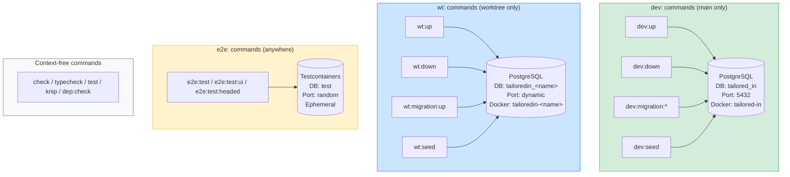

# Infrastructure Isolation: Scoped Commands & Database Separation

## Context

Three execution contexts need isolated databases: **dev** (main branch), **wt** (worktrees), and **e2e** (Playwright tests). Today, isolation exists but is fragile:

- Worktrees rely on generating `.env` files — brittle and confusing
- Worktrees can't run e2e tests (missing env vars since `.env` is gitignored)
- `bun up` does different things depending on context — no explicit scoping
- Dev database uses the default `postgres` name
- Nothing prevents running `dev:` commands from a worktree or vice versa

This plan restructures the infrastructure into clearly scoped command groups with proper guards and eliminates `.env` as the isolation mechanism for worktrees.



## Configuration Strategy

| Context | How config is provided | .env file needed? |
|---------|----------------------|-------------------|
| **dev:** | `--env-file=.env` (Bun loads it) | Yes (user's `.env`) |
| **wt:** | Programmatic `process.env` + `.wt-session.json` for state | No |
| **e2e:** | Testcontainers + `process.env` + `BUN_CONFIG_NO_DOT_ENV=1` | No |

---

## Step 1: Context Guard Module

**Create** `infrastructure/dev/ContextGuard.ts`

Two exports:
- `requireMain(ctx: DevContext): void` — throws if `ctx.mode !== 'main'` with message: `"This command is for main branch only. In a worktree, use wt:<command> instead."`
- `requireWorktree(ctx: DevContext): void` — throws if `ctx.mode !== 'worktree'` with message: `"This command is for worktrees only. On main, use dev:<command> instead."`

**Create** `infrastructure/dev/guard-main.ts` — tiny script: `resolveDevContext()` → `requireMain()`. Exit 0 or 1. Used for chaining in package.json where we can't use a full entrypoint.

---

## Step 2: Worktree Session Config (replaces EnvFile.ts)

**Create** `infrastructure/dev/WorktreeSession.ts`

Replaces the `.env`-file-based worktree isolation with a structured JSON state file (`.wt-session.json`).

```typescript
export type WorktreeSession = {
  dbPort: number;
  apiPort: number;
  webPort: number;
  dbName: string;
  projectName: string;
  containerName: string;
};

export async function allocateSession(ctx: DevContext): Promise<WorktreeSession>
// Calls findFreePort() for db/api/web, computes dbName as tailoredin_<worktreeName>

export async function readSession(): Promise<WorktreeSession>
// Reads from .wt-session.json, throws if missing

export async function writeSession(session: WorktreeSession): Promise<void>
// Writes to .wt-session.json

export function deleteSession(): void
// Deletes .wt-session.json

export function sessionExists(): boolean
// Checks if .wt-session.json exists

export function toOrmConfig(session: WorktreeSession): OrmDbConfig
// Converts session to OrmDbConfig with hardcoded user/password/schema/timezone

export function toProcessEnv(session: WorktreeSession): Record<string, string>
// Returns all env vars needed for child processes (POSTGRES_*, API_PORT, VITE_PORT, etc.)
```

Key difference from `EnvFile.ts`: this file is **never loaded by Bun's `--env-file`** mechanism. It's a plain JSON state file read only by our scripts.

---

## Step 3: Split Entrypoints

### 3a. `infrastructure/dev/dev-up.ts` (main-only `dev:up`)

Extract the main-branch path from current `up.ts`:
1. `resolveDevContext()` → `requireMain(ctx)`
2. `checkBunInstall()`
3. `assertDockerRunning()`
4. `composeUp(ctx)` / `waitForPostgres(ctx.containerName)`
5. `runMigrations(getOrmConfig())` — reads from `.env` via Bun's env-file loading
6. `runSeeds(getOrmConfig())`
7. Spawn API + web with `--env-file=.env`

### 3b. `infrastructure/dev/dev-down.ts` (main-only `dev:down`)

1. `resolveDevContext()` → `requireMain(ctx)`
2. Kill dev servers
3. `composeDown(ctx)` — preserves volume

### 3c. `infrastructure/dev/wt-up.ts` (worktree-only `wt:up`)

**No `.env` dependency at all.**

1. `resolveDevContext()` → `requireWorktree(ctx)`
2. `checkBunInstall()`
3. `assertDockerRunning()`
4. If container running: `readSession()` to recover state
5. Else: `allocateSession(ctx)` → `writeSession(session)`
6. Set `process.env` from `toProcessEnv(session)` for docker compose variable substitution
7. `composeUp(ctx)` / `waitForPostgres(ctx.containerName)`
8. `runMigrations(toOrmConfig(session))` — explicit config, no env lookup
9. `runSeeds(toOrmConfig(session))` — explicit config, no env lookup
10. Spawn API + web with explicit env: `Bun.spawn([...], { env: { ...process.env, BUN_CONFIG_NO_DOT_ENV: '1', ...toProcessEnv(session) } })`

### 3d. `infrastructure/dev/wt-down.ts` (worktree-only `wt:down`)

1. `resolveDevContext()` → `requireWorktree(ctx)`
2. Kill dev servers
3. If `sessionExists()`: read session, set `process.env` from it for docker compose
4. `composeDown(ctx)` with `-v` (removes volume)
5. `deleteSession()`

### 3e. `infrastructure/dev/wt-migration-up.ts` and `infrastructure/dev/wt-seed.ts`

Small scripts:
1. `requireWorktree(ctx)`
2. `readSession()` to get DB config
3. Call `runMigrations(toOrmConfig(session))` or `runSeeds(toOrmConfig(session))`

---

## Step 4: Rename Dev Database

1. **Update `.env.example`**: `POSTGRES_DB=tailored_in`
2. **Update `compose.yaml`**: `POSTGRES_DB: ${POSTGRES_DB:-tailored_in}`
3. **User updates their `.env`**: `POSTGRES_DB=tailored_in`

MikroORM's `ensureDatabase: true` will `CREATE DATABASE tailored_in` automatically. The old `postgres` DB remains but is unused. No migration needed — just `bun dev:fresh` to pick up the change.

---

## Step 5: Update package.json Scripts

```json
{
  "dev:up": "bun --env-file=.env run infrastructure/dev/dev-up.ts",
  "dev:down": "bun --env-file=.env run infrastructure/dev/dev-down.ts",
  "dev:fresh": "bun dev:down && bun dev:up",
  "dev:migration:create": "bun run infrastructure/dev/guard-main.ts && bun --env-file=.env run --cwd infrastructure migration:create",
  "dev:migration:up": "bun run infrastructure/dev/guard-main.ts && bun --env-file=.env run --cwd infrastructure migration:up",
  "dev:seed": "bun run infrastructure/dev/guard-main.ts && bun --env-file=.env run --cwd infrastructure seed:run",
  "dev:diagram": "bun run infrastructure/dev/guard-main.ts && bun --env-file=.env run infrastructure/scripts/generate-database-diagram.ts",

  "wt:up": "bun run infrastructure/dev/wt-up.ts",
  "wt:down": "bun run infrastructure/dev/wt-down.ts",
  "wt:fresh": "bun wt:down && bun wt:up",
  "wt:migration:up": "bun run infrastructure/dev/wt-migration-up.ts",
  "wt:seed": "bun run infrastructure/dev/wt-seed.ts",

  "e2e:test": "bun run --cwd e2e test",
  "e2e:test:ui": "bun run --cwd e2e test:ui",
  "e2e:test:headed": "bun run --cwd e2e test:headed",

}
```

**Remove**: `up`, `down`, `fresh`, `db:migration:create`, `db:migration:up`, `db:seed`, `db:seed:e2e`, `test:e2e`, `test:e2e:ui`, `test:e2e:headed`

**Keep as-is** (context-free): `check`, `check:fix`, `format`, `lint`, `typecheck`, `test`, `test:coverage`, `knip`, `dep:check`, `dep:graph`, `domain:diagram`, `api:dev`, `web:dev`, `dev`

---

## Step 6: Housekeeping

1. **`.gitignore`**: Add `.wt-session.json`
2. **Delete**: `infrastructure/dev/up.ts`, `infrastructure/dev/down.ts`, `infrastructure/dev/EnvFile.ts`
3. **Update `CLAUDE.md`**: Rewrite Commands section to reflect `dev:*` / `wt:*` / `e2e:*` structure
---

## Files Summary

| Action | File |
|--------|------|
| **Create** | `infrastructure/dev/ContextGuard.ts` |
| **Create** | `infrastructure/dev/guard-main.ts` |
| **Create** | `infrastructure/dev/WorktreeSession.ts` |
| **Create** | `infrastructure/dev/dev-up.ts` |
| **Create** | `infrastructure/dev/dev-down.ts` |
| **Create** | `infrastructure/dev/wt-up.ts` |
| **Create** | `infrastructure/dev/wt-down.ts` |
| **Create** | `infrastructure/dev/wt-migration-up.ts` |
| **Create** | `infrastructure/dev/wt-seed.ts` |
| **Modify** | `package.json` — new scoped scripts, remove old aliases |
| **Modify** | `compose.yaml` — default `POSTGRES_DB` → `tailored_in` |
| **Modify** | `.gitignore` — add `.wt-session.json` |
| **Modify** | `CLAUDE.md` — update Commands section |
| **Delete** | `infrastructure/dev/up.ts` |
| **Delete** | `infrastructure/dev/down.ts` |
| **Delete** | `infrastructure/dev/EnvFile.ts` |

---

## Verification

1. **Context guards**: `bun dev:up` from a worktree errors; `bun wt:up` from main errors
2. **Dev flow**: `bun dev:up` → DB is `tailored_in` on port 5432, servers start → `bun dev:down` stops cleanly
3. **Worktree flow**: `bun wt:up` → dynamic ports, isolated container, no `.env` created → `bun wt:down` removes volume + session file
4. **E2E from worktree**: `bun e2e:test` from a worktree works (Testcontainers, no `.env` needed)
5. **E2E from main**: `bun e2e:test` from main also works
6. **Old commands gone**: `bun up`, `bun down`, `bun fresh` fail with "Script not found"
8. **DB naming**: `docker exec tailored-in-postgres-1 psql -U postgres -l` shows `tailored_in`
