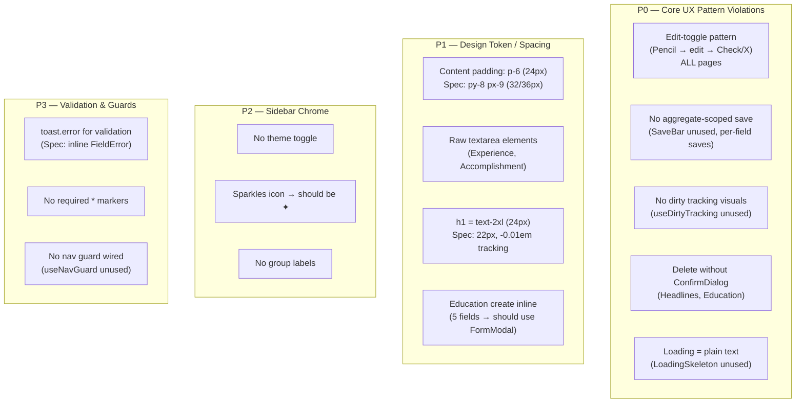
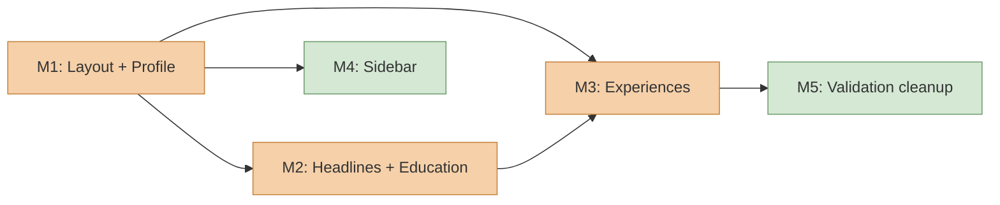

# UI/UX Consistency Refactor Plan

## Context

An audit of the web UI against `web/design/design-system.md` and `web/design/ux-guidelines.md` reveals that while the design tokens (colors, radius, fonts) are correctly implemented in `app.css`, **none of the core UX behavioral patterns are actually used by any page**. The shared components (`EditableField`, `SaveBar`, `LoadingSkeleton`, `ConfirmDialog`, `EmptyState`, `FormModal`, `FieldError`) and hooks (`useDirtyTracking`, `useNavGuard`) were built but never wired into the pages. Every page still uses a legacy edit-toggle pattern with per-field saves.

## Audit Findings



### Shared infrastructure that exists but is unused

| Component/Hook | File | Status |
|---|---|---|
| `EditableField` | `web/src/components/shared/EditableField.tsx` | Built, has `isDirty`/`error` props, supports text/textarea/select — **not used by any page** |
| `SaveBar` | `web/src/components/shared/SaveBar.tsx` | Built, shows dirty count + Save/Discard — **not used** |
| `LoadingSkeleton` | `web/src/components/shared/LoadingSkeleton.tsx` | Built, 4 variants (card/list/form/detail) — **not used** |
| `ConfirmDialog` | `web/src/components/shared/ConfirmDialog.tsx` | Built, trigger-based AlertDialog — **not used** |
| `EmptyState` | `web/src/components/shared/EmptyState.tsx` | Built, message + optional CTA — **not used** |
| `FormModal` | `web/src/components/shared/FormModal.tsx` | Built, dirty-cancel guard, Save/Cancel — **not used** |
| `FieldError` | `web/src/components/shared/FieldError.tsx` | Built — **only used inside EditableField (which itself is unused)** |
| `useDirtyTracking` | `web/src/hooks/use-dirty-tracking.ts` | Built, snapshot-based dirty comparison — **not used** |
| `useNavGuard` | `web/src/hooks/use-nav-guard.ts` | Built, TanStack Router blocker + beforeunload — **not used** |

---

## Milestones

### Milestone 1: Global Layout + Profile Page (pattern template)

**Goal:** Fix global spacing/typography and rewrite the Profile page as the reference implementation for always-editable + SaveBar + dirty tracking. All subsequent pages copy this pattern.

#### 1a. Global layout & typography

**Files:**
- `web/src/routes/__root.tsx` — change `p-6` → `px-9 py-8`
- `web/src/app.css` — add utility class in `@layer base`:
  ```css
  .page-heading { font-size: 1.375rem; font-weight: 500; letter-spacing: -0.01em; line-height: 1.3; }
  ```
- All 4 route pages — replace `text-2xl font-medium` with `page-heading` on `<h1>`

#### 1b. Profile page rewrite

**File:** `web/src/routes/profile/index.tsx`

Delete `NameField`, `ProfileField`, `AboutField`, `buildUpdatePayload` — the entire edit-toggle machinery.

Replace with:
1. `useMemo` to build `savedState` from query data (9 fields: firstName, lastName, email, phone, location, linkedinUrl, githubUrl, websiteUrl, about)
2. `useDirtyTracking(savedState)` → `current`, `setField`, `isDirtyField`, `isDirty`, `dirtyCount`, `reset`
3. `useNavGuard({ isDirty })`
4. Render all fields as `<EditableField>` (always-editable, no toggle):
   - First Name, Last Name, Email: `required`
   - About: `type="textarea"`
   - All: `isDirty={isDirtyField('fieldName')}`, `error={errors.fieldName}`
5. `<SaveBar dirtyCount={dirtyCount} onSave={handleSave} onDiscard={reset} isSaving={...} />`
6. `handleSave`: validate (inline errors, not toast), then mutate
7. Loading: `<LoadingSkeleton variant="form" />`
8. No profile: `<EmptyState message="No profile found." />`

#### 1c. Validation utility

**New file:** `web/src/lib/validation.ts`

```typescript
type ValidationErrors<T> = Partial<Record<keyof T, string>>;
function validateProfile(values): ValidationErrors { ... }
// Exported for each aggregate; added to in later milestones
```

**EditableField enhancement:** Add `type="number"` support (needed for Education graduation year in M2). Small change to `EditableField.tsx`.

---

### Milestone 2: Headlines + Education (list-of-aggregates pattern)

**Goal:** Convert list pages to always-editable cards, each with its own SaveBar. Introduce ConfirmDialog for delete and FormModal for Education create.

#### 2a. HeadlineList rewrite

**File:** `web/src/components/resume/headlines/HeadlineList.tsx`

Each `HeadlineCard`:
- Remove `editing` state and Pencil/Check/X buttons
- Always render `<EditableField>` for label and summaryText
- Own `useDirtyTracking({ label, summaryText })` → own `<SaveBar>`
- Delete button wrapped in `<ConfirmDialog title="Delete headline?" ...>`
- Validation: label required → inline error, not toast

`HeadlineList`:
- Loading: `<LoadingSkeleton variant="list" count={3} />`
- Empty: `<EmptyState message="No headline variants yet." actionLabel="Add headline variant" onAction={...} />`
- Create form: inline is OK (2 fields < 3 threshold)

#### 2b. EducationList rewrite

**File:** `web/src/components/resume/education/EducationList.tsx`

Each `EducationCard`:
- Same pattern as HeadlineCard: always-editable fields, own SaveBar, ConfirmDialog for delete
- Fields: institutionName, degreeTitle, graduationYear (number), location, honors
- Validation: institution, degree, year required

`EducationList`:
- Loading: `<LoadingSkeleton variant="list" count={2} />`
- Empty: `<EmptyState message="No education entries yet." actionLabel="Add education" onAction={...} />`
- **Create via `<FormModal>`** (5 fields ≥ 3 threshold): "Add education" button opens FormModal with 5 EditableFields, own `useDirtyTracking`, Save/Cancel

#### 2c. Page-level nav guard for list pages

**New file:** `web/src/hooks/use-aggregate-dirty-registry.ts`

Thin hook wrapping a `Set<string>` to track which aggregate IDs on the page are dirty:
```typescript
function useAggregateDirtyRegistry(): {
  register: (id: string, isDirty: boolean) => void;
  isDirty: boolean;
}
```

Each card calls `register(id, isDirty)` via effect. The route page wires `useNavGuard({ isDirty: registry.isDirty })`.

Wire into Headlines and Education route pages.

---

### Milestone 3: Experiences + Accomplishments (nested aggregates)

**Goal:** Convert the most complex page. Fix raw textareas, extract inline API call to proper hook.

#### 3a. Extract `useUpdateExperience` hook

**File:** `web/src/hooks/use-experiences.ts`

The current ExperienceList does a raw `api.experiences(...).put(...)` call inline. Extract to a proper `useUpdateExperience()` mutation hook matching the pattern of `useUpdateHeadline`/`useUpdateEducation`.

#### 3b. ExperienceCard rewrite

**File:** `web/src/components/resume/experience/ExperienceList.tsx`

- Keep collapsible pattern (practical for many experiences)
- Collapsed: read-only summary line (company · title · date range) — this is acceptable since the "always-editable" guidance applies to the editing surface, not the collapsed preview
- Expanded: all fields rendered as `<EditableField>` (title, companyName, location, startDate, endDate, summary, narrative)
- Replace raw `<textarea>` with `<EditableField type="textarea">`
- **Remove `onBlur={saveNarrative}`** — narrative saves with everything else via SaveBar
- Own `useDirtyTracking` covering all experience fields → own `<SaveBar>`
- Loading: `<LoadingSkeleton variant="list" count={3} />`

#### 3c. AccomplishmentEditor rewrite

**File:** `web/src/components/resume/experience/AccomplishmentEditor.tsx`

- Remove edit toggle (Pencil → edit mode)
- Always show title as `<EditableField type="text">` and narrative as `<EditableField type="textarea">`
- Replace raw `<textarea>` with EditableField
- Own `useDirtyTracking({ title, narrative })` → own `<SaveBar>`
- Delete wrapped in `<ConfirmDialog>`
- Validation: title required

#### 3d. Page-level nav guard

Wire `useAggregateDirtyRegistry` in the Experiences route page, aggregating dirty state from all expanded ExperienceCards and their AccomplishmentEditors.

---

### Milestone 4: Sidebar Chrome

**Goal:** Fix brand, add group labels, add theme toggle. All changes in one file.

**File:** `web/src/components/layout/sidebar.tsx`

1. **Brand:** Replace `<Sparkles>` + `<span>TailoredIn</span>` with `<span className="text-sidebar-primary text-lg font-medium">✦ TailoredIn</span>`
2. **Group label:** Add `SidebarGroupLabel` with "Resume" above the nav items. Use `text-[10px] uppercase tracking-widest text-sidebar-foreground` styling
3. **Theme toggle:** Add `SidebarFooter` with a Sun/Moon toggle button. Uses `getEffectiveTheme()` + `applyTheme()` from `@/lib/theme`. Track current theme in `useState`.

---

### Milestone 5: Final Validation & Guard Cleanup

**Goal:** Ensure all validation uses inline errors, all required fields marked, nav guards wired everywhere.

1. **Audit all `toast.error` calls** — any that are field validation (not network errors) must be converted to inline `FieldError` via EditableField's `error` prop
2. **Add `required` prop** to all required EditableFields (firstName, lastName, email, headline label, education institution/degree/year, accomplishment title)
3. **Verify nav guards** work on all 4 pages via manual testing
4. **Add validation functions** to `web/src/lib/validation.ts` for each aggregate (headline, education, experience, accomplishment)

---

## Dependency Graph



- **M1** is the foundation — establishes the pattern all others copy
- **M2** and **M3** depend on M1 for the pattern template and global layout fixes
- **M3** depends on M2 for `useAggregateDirtyRegistry`
- **M4** is independent (sidebar only)
- **M5** is a cleanup pass after all pages are converted

## Files Modified Summary

| Milestone | Modified | Created |
|---|---|---|
| M1 | `__root.tsx`, `app.css`, 4 route pages, `profile/index.tsx`, `EditableField.tsx` | `validation.ts` |
| M2 | `HeadlineList.tsx`, `EducationList.tsx`, `headlines/index.tsx`, `education/index.tsx`, `validation.ts` | `use-aggregate-dirty-registry.ts` |
| M3 | `ExperienceList.tsx`, `AccomplishmentEditor.tsx`, `use-experiences.ts`, `experiences/index.tsx`, `validation.ts` | — |
| M4 | `sidebar.tsx` | — |
| M5 | Various (audit pass) | — |

## Verification

After each milestone:
1. `bun run typecheck` — no type errors
2. `bun run check` — Biome lint/format passes
3. `bun run test` — unit tests pass
4. Visual check in browser — confirm always-editable fields render, SaveBar appears on edit, dirty indicators show, ConfirmDialog appears on delete, skeletons show during load
5. After M5: `bun verify` — full project health check
