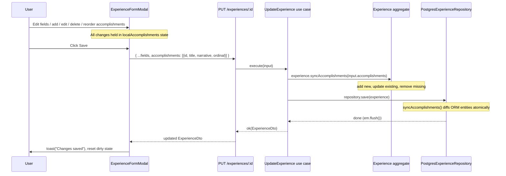

# Experience Aggregate-Level Save Implementation Plan

> **For agentic workers:** REQUIRED SUB-SKILL: Use superpowers:subagent-driven-development (recommended) or superpowers:executing-plans to implement this plan task-by-task. Steps use checkbox (`- [ ]`) syntax for tracking.

**Goal:** Fix the DDD transactional boundary violation by saving all experience + accomplishment changes atomically through a single `PUT /experiences/:id` request.

**Architecture:** A new `Experience.syncAccomplishments()` domain method diffs the incoming accomplishment list (add/update/delete/reorder). `UpdateExperience` use case accepts the full list and calls this method. The API route schema and frontend hook extend accordingly. `ExperienceFormModal` owns local accomplishment state; `AccomplishmentListEditor` and `AccomplishmentEditor` become callback-driven (no direct API calls).

**Tech Stack:** Bun/TypeScript, DDD (domain aggregates), MikroORM, Elysia HTTP, React 19 + TanStack Query

---

## Data Flow Diagram



---

## File Map

| File | Change |
|---|---|
| `domain/src/entities/Experience.ts` | Add `syncAccomplishments()` method |
| `domain/test/entities/Experience.test.ts` | Add tests for `syncAccomplishments` |
| `application/src/use-cases/experience/UpdateExperience.ts` | Extend input with `accomplishments`, call `syncAccomplishments` |
| `application/test/use-cases/experience/UpdateExperience.test.ts` | New test file — test accomplishment diff scenarios |
| `api/src/routes/experience/UpdateExperienceRoute.ts` | Extend body schema with `accomplishments` array |
| `web/src/hooks/use-experiences.ts` | Add `accomplishments` to `useUpdateExperience` input + return updated `Experience` from mutationFn |
| `web/src/components/resume/experience/ExperienceFormModal.tsx` | Own `LocalAccomplishment[]` state; remove `onAccomplishmentDirtyChange` prop |
| `web/src/components/resume/experience/AccomplishmentListEditor.tsx` | Callback-driven: remove API hooks, add `onAdd`/`onChange`/`onDelete`/`onMoveUp`/`onMoveDown` |
| `web/src/components/resume/experience/AccomplishmentEditor.tsx` | Controlled: remove `SaveBar`, API hooks, `useDirtyTracking`; add `onChange`/`onDelete` |
| `web/src/routes/experiences/$experienceId.tsx` | Remove `onAccomplishmentDirtyChange` prop |
| `web/src/components/resume/experience/ExperienceList.tsx` | Remove `onAccomplishmentDirtyChange` prop |

**Infrastructure note:** `PostgresExperienceRepository.syncAccomplishments()` already handles insert/update/delete diffs correctly — no infrastructure changes needed.

---

## Task 1: Add `syncAccomplishments()` to Experience domain entity

**Files:**
- Modify: `/Users/sylvainestevez/Documents/Code Projects/TailoredIn/.claude/worktrees/dazzling-foraging-glacier/domain/src/entities/Experience.ts`
- Modify: `/Users/sylvainestevez/Documents/Code Projects/TailoredIn/.claude/worktrees/dazzling-foraging-glacier/domain/test/entities/Experience.test.ts`

- [ ] **Step 1: Write the failing tests**

In `domain/test/entities/Experience.test.ts`, add a `describe('syncAccomplishments')` block after the existing tests:

```typescript
describe('syncAccomplishments', () => {
  function makeExperienceWithAccomplishments() {
    const exp = Experience.create({
      profileId: 'p1',
      title: 'Engineer',
      companyName: 'ACME',
      companyWebsite: null,
      companyId: null,
      location: 'Remote',
      startDate: '2020-01',
      endDate: '2023-01',
      summary: null,
      ordinal: 0
    });
    exp.addAccomplishment({ title: 'First', narrative: 'Narrative 1', ordinal: 0 });
    exp.addAccomplishment({ title: 'Second', narrative: 'Narrative 2', ordinal: 1 });
    return exp;
  }

  it('adds a new accomplishment when id is null', () => {
    const exp = makeExperienceWithAccomplishments();
    const existingIds = exp.accomplishments.map(a => a.id.value);
    exp.syncAccomplishments([
      { id: existingIds[0], title: 'First', narrative: 'Narrative 1', ordinal: 0 },
      { id: existingIds[1], title: 'Second', narrative: 'Narrative 2', ordinal: 1 },
      { id: null, title: 'New', narrative: 'New narrative', ordinal: 2 }
    ]);
    expect(exp.accomplishments).toHaveLength(3);
    expect(exp.accomplishments[2].title).toBe('New');
  });

  it('updates title and narrative of an existing accomplishment', () => {
    const exp = makeExperienceWithAccomplishments();
    const id0 = exp.accomplishments[0].id.value;
    const id1 = exp.accomplishments[1].id.value;
    exp.syncAccomplishments([
      { id: id0, title: 'Updated title', narrative: 'Updated narrative', ordinal: 0 },
      { id: id1, title: 'Second', narrative: 'Narrative 2', ordinal: 1 }
    ]);
    expect(exp.accomplishments[0].title).toBe('Updated title');
    expect(exp.accomplishments[0].narrative).toBe('Updated narrative');
  });

  it('removes accomplishments absent from input', () => {
    const exp = makeExperienceWithAccomplishments();
    const id0 = exp.accomplishments[0].id.value;
    exp.syncAccomplishments([
      { id: id0, title: 'First', narrative: 'Narrative 1', ordinal: 0 }
    ]);
    expect(exp.accomplishments).toHaveLength(1);
    expect(exp.accomplishments[0].id.value).toBe(id0);
  });

  it('handles reorder by updating ordinals', () => {
    const exp = makeExperienceWithAccomplishments();
    const id0 = exp.accomplishments[0].id.value;
    const id1 = exp.accomplishments[1].id.value;
    exp.syncAccomplishments([
      { id: id1, title: 'Second', narrative: 'Narrative 2', ordinal: 0 },
      { id: id0, title: 'First', narrative: 'Narrative 1', ordinal: 1 }
    ]);
    const a = exp.accomplishments.find(a => a.id.value === id1)!;
    expect(a.ordinal).toBe(0);
  });

  it('clears all accomplishments when given empty list', () => {
    const exp = makeExperienceWithAccomplishments();
    exp.syncAccomplishments([]);
    expect(exp.accomplishments).toHaveLength(0);
  });

  it('updates experience updatedAt', () => {
    const exp = makeExperienceWithAccomplishments();
    const before = exp.updatedAt;
    exp.syncAccomplishments([]);
    expect(exp.updatedAt.getTime()).toBeGreaterThanOrEqual(before.getTime());
  });

  it('throws when updating with unknown id', () => {
    const exp = makeExperienceWithAccomplishments();
    expect(() =>
      exp.syncAccomplishments([{ id: 'unknown-id', title: 'X', narrative: 'Y', ordinal: 0 }])
    ).toThrow();
  });
});
```

- [ ] **Step 2: Run tests to confirm they fail**

```bash
bun test domain/test/entities/Experience.test.ts
```

Expected: FAIL — "syncAccomplishments is not a function"

- [ ] **Step 3: Implement `syncAccomplishments` in Experience.ts**

Add the method after `unlinkCompany()`:

```typescript
public syncAccomplishments(
  items: { id: string | null; title: string; narrative: string; ordinal: number }[]
): void {
  const inputIds = new Set(items.filter(i => i.id !== null).map(i => i.id as string));

  // Remove accomplishments absent from the input list
  const toRemove = this.accomplishments.filter(a => !inputIds.has(a.id.value));
  for (const acc of toRemove) {
    this.accomplishments.splice(this.accomplishments.indexOf(acc), 1);
  }

  // Add new (id === null) or update existing
  for (const item of items) {
    if (item.id === null) {
      this.accomplishments.push(
        Accomplishment.create({
          experienceId: this.id.value,
          title: item.title,
          narrative: item.narrative,
          ordinal: item.ordinal
        })
      );
    } else {
      this.findAccomplishmentOrFail(item.id).update({
        title: item.title,
        narrative: item.narrative,
        ordinal: item.ordinal
      });
    }
  }

  this.updatedAt = new Date();
}
```

- [ ] **Step 4: Run tests to confirm they pass**

```bash
bun test domain/test/entities/Experience.test.ts
```

Expected: all tests PASS

- [ ] **Step 5: Commit**

```bash
git add domain/src/entities/Experience.ts domain/test/entities/Experience.test.ts
git commit -m "feat(domain): add Experience.syncAccomplishments() for aggregate-level updates"
```

---

## Task 2: Extend UpdateExperience use case + tests

**Files:**
- Modify: `/Users/sylvainestevez/Documents/Code Projects/TailoredIn/.claude/worktrees/dazzling-foraging-glacier/application/src/use-cases/experience/UpdateExperience.ts`
- Create: `/Users/sylvainestevez/Documents/Code Projects/TailoredIn/.claude/worktrees/dazzling-foraging-glacier/application/test/use-cases/experience/UpdateExperience.test.ts`

- [ ] **Step 1: Write the failing tests**

Create `application/test/use-cases/experience/UpdateExperience.test.ts`:

```typescript
import { describe, expect, it, mock } from 'bun:test';
import { Experience, type ExperienceRepository } from '@tailoredin/domain';
import { UpdateExperience } from '../../../src/use-cases/experience/UpdateExperience.js';

function makeExperience() {
  const exp = Experience.create({
    profileId: 'p1',
    title: 'Engineer',
    companyName: 'ACME',
    companyWebsite: null,
    companyId: null,
    location: 'Remote',
    startDate: '2020-01',
    endDate: '2023-01',
    summary: null,
    ordinal: 0
  });
  exp.addAccomplishment({ title: 'Old one', narrative: 'Old narrative', ordinal: 0 });
  return exp;
}

function mockRepo(exp: Experience) {
  return {
    findByIdOrFail: mock(async () => exp),
    findAll: mock(async () => []),
    save: mock(async () => {}),
    delete: mock(async () => {})
  } as unknown as ExperienceRepository;
}

const baseInput = {
  experienceId: 'ignored',
  title: 'Senior Engineer',
  companyName: 'ACME',
  companyWebsite: null,
  location: 'Remote',
  startDate: '2020-01',
  endDate: '2024-01',
  summary: null,
  ordinal: 0
};

describe('UpdateExperience', () => {
  it('returns updated experience dto', async () => {
    const exp = makeExperience();
    const uc = new UpdateExperience(mockRepo(exp));
    const result = await uc.execute({ ...baseInput, accomplishments: [] });
    expect(result.isOk).toBe(true);
    if (result.isOk) expect(result.value.title).toBe('Senior Engineer');
  });

  it('keeps existing accomplishment when passed with its id', async () => {
    const exp = makeExperience();
    const accId = exp.accomplishments[0].id.value;
    const uc = new UpdateExperience(mockRepo(exp));
    const result = await uc.execute({
      ...baseInput,
      accomplishments: [{ id: accId, title: 'Old one', narrative: 'Old narrative', ordinal: 0 }]
    });
    expect(result.isOk).toBe(true);
    if (result.isOk) expect(result.value.accomplishments).toHaveLength(1);
  });

  it('deletes accomplishment when omitted from list', async () => {
    const exp = makeExperience();
    const uc = new UpdateExperience(mockRepo(exp));
    const result = await uc.execute({ ...baseInput, accomplishments: [] });
    expect(result.isOk).toBe(true);
    if (result.isOk) expect(result.value.accomplishments).toHaveLength(0);
  });

  it('adds new accomplishment when id is null', async () => {
    const exp = makeExperience();
    const accId = exp.accomplishments[0].id.value;
    const uc = new UpdateExperience(mockRepo(exp));
    const result = await uc.execute({
      ...baseInput,
      accomplishments: [
        { id: accId, title: 'Old one', narrative: 'Old narrative', ordinal: 0 },
        { id: null, title: 'New one', narrative: 'New narrative', ordinal: 1 }
      ]
    });
    expect(result.isOk).toBe(true);
    if (result.isOk) {
      expect(result.value.accomplishments).toHaveLength(2);
      expect(result.value.accomplishments[1].title).toBe('New one');
    }
  });

  it('calls repository.save once', async () => {
    const exp = makeExperience();
    const repo = mockRepo(exp);
    const uc = new UpdateExperience(repo);
    await uc.execute({ ...baseInput, accomplishments: [] });
    expect((repo.save as ReturnType<typeof mock>).mock.calls).toHaveLength(1);
  });

  it('returns NOT_FOUND error when experience does not exist', async () => {
    const { EntityNotFoundError } = await import('@tailoredin/domain');
    const repo = {
      findByIdOrFail: mock(async () => { throw new EntityNotFoundError('Experience', 'x'); }),
      findAll: mock(async () => []),
      save: mock(async () => {}),
      delete: mock(async () => {})
    } as unknown as ExperienceRepository;
    const uc = new UpdateExperience(repo);
    const result = await uc.execute({ ...baseInput, accomplishments: [] });
    expect(result.isOk).toBe(false);
  });
});
```

- [ ] **Step 2: Run tests to confirm they fail**

```bash
bun test application/test/use-cases/experience/UpdateExperience.test.ts
```

Expected: FAIL — `accomplishments` property does not exist on type `UpdateExperienceInput`

- [ ] **Step 3: Extend UpdateExperienceInput and use case**

Replace the contents of `application/src/use-cases/experience/UpdateExperience.ts`:

```typescript
import {
  EntityNotFoundError,
  type Experience,
  type ExperienceRepository,
  err,
  ok,
  type Result
} from '@tailoredin/domain';
import type { ExperienceDto } from '../../dtos/ExperienceDto.js';
import { toExperienceDto } from './ListExperiences.js';

export type AccomplishmentInput = {
  id: string | null;
  title: string;
  narrative: string;
  ordinal: number;
};

export type UpdateExperienceInput = {
  experienceId: string;
  title: string;
  companyName: string;
  companyWebsite: string | null;
  location: string;
  startDate: string;
  endDate: string;
  summary: string | null;
  ordinal: number;
  accomplishments: AccomplishmentInput[];
};

export class UpdateExperience {
  public constructor(private readonly experienceRepository: ExperienceRepository) {}

  public async execute(input: UpdateExperienceInput): Promise<Result<ExperienceDto, Error>> {
    let experience: Experience;
    try {
      experience = await this.experienceRepository.findByIdOrFail(input.experienceId);
    } catch (e) {
      if (e instanceof EntityNotFoundError) return err(e);
      throw e;
    }

    experience.title = input.title;
    experience.companyName = input.companyName;
    experience.companyWebsite = input.companyWebsite;
    experience.location = input.location;
    experience.startDate = input.startDate;
    experience.endDate = input.endDate;
    experience.summary = input.summary;
    experience.ordinal = input.ordinal;
    experience.syncAccomplishments(input.accomplishments);

    await this.experienceRepository.save(experience);
    return ok(toExperienceDto(experience));
  }
}
```

- [ ] **Step 4: Run tests to confirm they pass**

```bash
bun test application/test/use-cases/experience/UpdateExperience.test.ts
```

Expected: all tests PASS

- [ ] **Step 5: Typecheck the application package**

```bash
bun run typecheck
```

Expected: no errors

- [ ] **Step 6: Commit**

```bash
git add application/src/use-cases/experience/UpdateExperience.ts \
        application/test/use-cases/experience/UpdateExperience.test.ts
git commit -m "feat(application): extend UpdateExperience to accept and diff accomplishments"
```

---

## Task 3: Extend UpdateExperienceRoute body schema

**Files:**
- Modify: `/Users/sylvainestevez/Documents/Code Projects/TailoredIn/.claude/worktrees/dazzling-foraging-glacier/api/src/routes/experience/UpdateExperienceRoute.ts`

- [ ] **Step 1: Update the route**

Replace the full content of `api/src/routes/experience/UpdateExperienceRoute.ts`:

```typescript
import { inject, injectable } from '@needle-di/core';
import type { UpdateExperience } from '@tailoredin/application';
import { DI } from '@tailoredin/infrastructure';
import { Elysia, t } from 'elysia';

@injectable()
export class UpdateExperienceRoute {
  public constructor(private readonly updateExperience: UpdateExperience = inject(DI.Experience.Update)) {}

  public plugin() {
    return new Elysia().put(
      '/experiences/:id',
      async ({ params, body, set }) => {
        const result = await this.updateExperience.execute({
          experienceId: params.id,
          title: body.title,
          companyName: body.company_name,
          companyWebsite: body.company_website ?? null,
          location: body.location,
          startDate: body.start_date,
          endDate: body.end_date,
          summary: body.summary ?? null,
          ordinal: body.ordinal,
          accomplishments: body.accomplishments.map(a => ({
            id: a.id ?? null,
            title: a.title,
            narrative: a.narrative,
            ordinal: a.ordinal
          }))
        });
        if (!result.isOk) {
          set.status = 404;
          return { error: { code: 'NOT_FOUND', message: result.error.message } };
        }
        return { data: result.value };
      },
      {
        params: t.Object({ id: t.String({ format: 'uuid' }) }),
        body: t.Object({
          title: t.String({ minLength: 1 }),
          company_name: t.String({ minLength: 1 }),
          company_website: t.Optional(t.String()),
          location: t.String({ minLength: 1 }),
          start_date: t.String({ minLength: 1 }),
          end_date: t.String({ minLength: 1 }),
          summary: t.Optional(t.String()),
          ordinal: t.Integer({ minimum: 0 }),
          accomplishments: t.Array(
            t.Object({
              id: t.Nullable(t.String()),
              title: t.String({ minLength: 1 }),
              narrative: t.String(),
              ordinal: t.Integer({ minimum: 0 })
            })
          )
        })
      }
    );
  }
}
```

- [ ] **Step 2: Typecheck API package**

```bash
bun run typecheck
```

Expected: no errors

- [ ] **Step 3: Commit**

```bash
git add api/src/routes/experience/UpdateExperienceRoute.ts
git commit -m "feat(api): extend UpdateExperienceRoute body schema with accomplishments array"
```

---

## Task 4: Update `useUpdateExperience` hook

**Files:**
- Modify: `/Users/sylvainestevez/Documents/Code Projects/TailoredIn/.claude/worktrees/dazzling-foraging-glacier/web/src/hooks/use-experiences.ts`

- [ ] **Step 1: Update the hook**

Replace the `useUpdateExperience` function (lines 77–99) in `web/src/hooks/use-experiences.ts`:

```typescript
export function useUpdateExperience() {
  const queryClient = useQueryClient();
  return useMutation({
    mutationFn: async (input: {
      id: string;
      title: string;
      company_name: string;
      company_website?: string;
      location: string;
      start_date: string;
      end_date: string;
      summary?: string;
      ordinal: number;
      accomplishments: { id: string | null; title: string; narrative: string; ordinal: number }[];
    }) => {
      const { id, ...body } = input;
      const { data, error } = await api.experiences({ id }).put(body);
      if (error) throw new Error((error as AnyRouteSegment).value?.error?.message ?? 'Failed to update experience');
      return (data as AnyRouteSegment)?.data as Experience;
    },
    onSuccess: () => {
      queryClient.invalidateQueries({ queryKey: queryKeys.experiences.list() });
    }
  });
}
```

- [ ] **Step 2: Typecheck the web package**

```bash
bun run typecheck
```

Expected: errors at call sites of `useUpdateExperience` (missing `accomplishments` — that's expected, we fix them in Task 7)

- [ ] **Step 3: Commit**

```bash
git add web/src/hooks/use-experiences.ts
git commit -m "feat(web): extend useUpdateExperience to include accomplishments in payload"
```

---

## Task 5: Refactor AccomplishmentEditor to controlled component

**Files:**
- Modify: `/Users/sylvainestevez/Documents/Code Projects/TailoredIn/.claude/worktrees/dazzling-foraging-glacier/web/src/components/resume/experience/AccomplishmentEditor.tsx`

This component becomes purely presentational: it displays fields, calls back on change/delete, has no internal state or API calls.

- [ ] **Step 1: Replace AccomplishmentEditor.tsx**

```typescript
import { ChevronDown, ChevronUp, Trash2 } from 'lucide-react';
import { ConfirmDialog } from '@/components/shared/ConfirmDialog.js';
import { EditableField } from '@/components/shared/EditableField.js';
import { Button } from '@/components/ui/button';

export interface AccomplishmentItem {
  id: string | null;
  tempId: string;
  title: string;
  narrative: string;
  ordinal: number;
}

interface Props {
  readonly accomplishment: AccomplishmentItem;
  readonly isFirst: boolean;
  readonly isLast: boolean;
  readonly onMoveUp: () => void;
  readonly onMoveDown: () => void;
  readonly onChange: (tempId: string, field: 'title' | 'narrative', value: string) => void;
  readonly onDelete: (tempId: string) => void;
  readonly disabled?: boolean;
}

export function AccomplishmentEditor({
  accomplishment,
  isFirst,
  isLast,
  onMoveUp,
  onMoveDown,
  onChange,
  onDelete,
  disabled
}: Props) {
  return (
    <div className="border rounded-lg p-3 space-y-3">
      <div className="flex items-start gap-2">
        <div className="flex flex-col gap-0.5 shrink-0 pt-5">
          <Button
            size="icon"
            variant="ghost"
            className="h-6 w-6"
            disabled={isFirst || disabled}
            onClick={onMoveUp}
            aria-label="Move up"
          >
            <ChevronUp className="h-3.5 w-3.5" />
          </Button>
          <Button
            size="icon"
            variant="ghost"
            className="h-6 w-6"
            disabled={isLast || disabled}
            onClick={onMoveDown}
            aria-label="Move down"
          >
            <ChevronDown className="h-3.5 w-3.5" />
          </Button>
        </div>
        <div className="flex-1 space-y-3">
          <EditableField
            type="text"
            label="Title"
            required
            value={accomplishment.title}
            onChange={v => onChange(accomplishment.tempId, 'title', v)}
            disabled={disabled}
            placeholder="Accomplishment title"
          />
          <EditableField
            type="textarea"
            label="Narrative"
            value={accomplishment.narrative}
            onChange={v => onChange(accomplishment.tempId, 'narrative', v)}
            rows={3}
            disabled={disabled}
            placeholder="Describe what you did, why, and the outcome in detail..."
          />
        </div>
        <ConfirmDialog
          title="Delete accomplishment?"
          description="This accomplishment will be removed when you save."
          onConfirm={() => onDelete(accomplishment.tempId)}
          trigger={
            <Button size="icon" variant="ghost" className="h-7 w-7 text-destructive shrink-0" disabled={disabled}>
              <Trash2 className="h-3 w-3" />
            </Button>
          }
        />
      </div>
    </div>
  );
}
```

- [ ] **Step 2: Typecheck**

```bash
bun run typecheck
```

Expected: errors at AccomplishmentListEditor (still uses old interface) — those are fixed in Task 6.

- [ ] **Step 3: Commit**

```bash
git add web/src/components/resume/experience/AccomplishmentEditor.tsx
git commit -m "refactor(web): AccomplishmentEditor — controlled component, remove API calls and SaveBar"
```

---

## Task 6: Refactor AccomplishmentListEditor to callback-driven

**Files:**
- Modify: `/Users/sylvainestevez/Documents/Code Projects/TailoredIn/.claude/worktrees/dazzling-foraging-glacier/web/src/components/resume/experience/AccomplishmentListEditor.tsx`

- [ ] **Step 1: Replace AccomplishmentListEditor.tsx**

```typescript
import { Plus, X } from 'lucide-react';
import { useState } from 'react';
import { EditableField } from '@/components/shared/EditableField.js';
import { Button } from '@/components/ui/button';
import {
  type AccomplishmentFormState,
  hasErrors,
  type ValidationErrors,
  validateAccomplishment
} from '@/lib/validation.js';
import { AccomplishmentEditor, type AccomplishmentItem } from './AccomplishmentEditor.js';

interface Props {
  readonly accomplishments: AccomplishmentItem[];
  readonly onAdd: (title: string, narrative: string) => void;
  readonly onChange: (tempId: string, field: 'title' | 'narrative', value: string) => void;
  readonly onDelete: (tempId: string) => void;
  readonly onMoveUp: (index: number) => void;
  readonly onMoveDown: (index: number) => void;
  readonly disabled?: boolean;
}

export function AccomplishmentListEditor({
  accomplishments,
  onAdd,
  onChange,
  onDelete,
  onMoveUp,
  onMoveDown,
  disabled
}: Props) {
  return (
    <div className="space-y-2">
      <p className="text-xs font-medium text-muted-foreground uppercase tracking-wide">Accomplishments</p>
      {accomplishments.map((acc, index) => (
        <AccomplishmentEditor
          key={acc.tempId}
          accomplishment={acc}
          isFirst={index === 0}
          isLast={index === accomplishments.length - 1}
          onMoveUp={() => onMoveUp(index)}
          onMoveDown={() => onMoveDown(index)}
          onChange={onChange}
          onDelete={onDelete}
          disabled={disabled}
        />
      ))}
      <AddAccomplishmentForm onAdd={onAdd} disabled={disabled} />
    </div>
  );
}

function AddAccomplishmentForm({
  onAdd,
  disabled
}: {
  readonly onAdd: (title: string, narrative: string) => void;
  readonly disabled?: boolean;
}) {
  const [isAdding, setIsAdding] = useState(false);
  const [title, setTitle] = useState('');
  const [narrative, setNarrative] = useState('');
  const [errors, setErrors] = useState<ValidationErrors<AccomplishmentFormState>>({});

  function handleConfirm() {
    const validationErrors = validateAccomplishment({ title, narrative });
    setErrors(validationErrors);
    if (hasErrors(validationErrors)) return;
    onAdd(title.trim(), narrative.trim());
    setTitle('');
    setNarrative('');
    setErrors({});
    setIsAdding(false);
  }

  function handleCancel() {
    setTitle('');
    setNarrative('');
    setErrors({});
    setIsAdding(false);
  }

  if (!isAdding) {
    return (
      <Button
        variant="outline"
        size="sm"
        className="w-full border-dashed"
        onClick={() => setIsAdding(true)}
        disabled={disabled}
      >
        <Plus className="h-3 w-3 mr-1" />
        Add accomplishment
      </Button>
    );
  }

  return (
    <div className="border rounded-lg p-3 space-y-3 border-dashed">
      <div className="flex items-center justify-between">
        <p className="text-sm font-medium">New accomplishment</p>
        <Button size="icon" variant="ghost" className="h-6 w-6" onClick={handleCancel} disabled={disabled}>
          <X className="h-3.5 w-3.5" />
        </Button>
      </div>
      <EditableField
        type="text"
        label="Title"
        required
        value={title}
        onChange={setTitle}
        error={errors.title}
        disabled={disabled}
        placeholder="Accomplishment title"
      />
      <EditableField
        type="textarea"
        label="Narrative"
        value={narrative}
        onChange={setNarrative}
        error={errors.narrative}
        rows={3}
        disabled={disabled}
        placeholder="Describe what you did, why, and the outcome in detail..."
      />
      <div className="flex justify-end gap-2">
        <Button variant="ghost" size="sm" onClick={handleCancel} disabled={disabled}>
          Cancel
        </Button>
        <Button size="sm" onClick={handleConfirm} disabled={disabled}>
          Add
        </Button>
      </div>
    </div>
  );
}
```

- [ ] **Step 2: Typecheck**

```bash
bun run typecheck
```

Expected: errors at ExperienceFormModal (still passes old props to AccomplishmentListEditor) — fixed in Task 7.

- [ ] **Step 3: Commit**

```bash
git add web/src/components/resume/experience/AccomplishmentListEditor.tsx
git commit -m "refactor(web): AccomplishmentListEditor — callback-driven, no direct API calls"
```

---

## Task 7: Update ExperienceFormModal to own local accomplishment state

**Files:**
- Modify: `/Users/sylvainestevez/Documents/Code Projects/TailoredIn/.claude/worktrees/dazzling-foraging-glacier/web/src/components/resume/experience/ExperienceFormModal.tsx`

- [ ] **Step 1: Replace ExperienceFormModal.tsx**

```typescript
import { useMemo, useState } from 'react';
import { toast } from 'sonner';
import { EditableField } from '@/components/shared/EditableField.js';
import { FieldError } from '@/components/shared/FieldError.js';
import { FormModal } from '@/components/shared/FormModal.js';
import { Label } from '@/components/ui/label';
import { MonthYearPicker } from '@/components/ui/month-year-picker';
import type { Company } from '@/hooks/use-companies';
import { useDirtyTracking } from '@/hooks/use-dirty-tracking.js';
import {
  type Experience,
  useCreateExperience,
  useLinkCompany,
  useUnlinkCompany,
  useUpdateExperience
} from '@/hooks/use-experiences';
import { cn } from '@/lib/utils';
import { type ExperienceFormState, hasErrors, type ValidationErrors, validateExperience } from '@/lib/validation.js';
import type { AccomplishmentItem } from './AccomplishmentEditor.js';
import { AccomplishmentListEditor } from './AccomplishmentListEditor.js';
import { CompanySearchPopover } from './CompanySearchPopover.js';

type ModalMode = { mode: 'create'; experienceCount: number } | { mode: 'edit'; experience: Experience };

interface Props {
  readonly open: boolean;
  readonly onOpenChange: (open: boolean) => void;
  readonly modalMode: ModalMode;
}

function emptyState(): ExperienceFormState {
  return {
    title: '',
    companyName: '',
    companyWebsite: '',
    location: '',
    startDate: '',
    endDate: '',
    summary: ''
  };
}

function stateFromExperience(exp: Experience): ExperienceFormState {
  return {
    title: exp.title,
    companyName: exp.companyName,
    companyWebsite: exp.companyWebsite ?? '',
    location: exp.location,
    startDate: exp.startDate,
    endDate: exp.endDate,
    summary: exp.summary ?? ''
  };
}

function toLocalAccomplishments(accomplishments: Experience['accomplishments']): AccomplishmentItem[] {
  return accomplishments.map(acc => ({
    id: acc.id,
    tempId: acc.id,
    title: acc.title,
    narrative: acc.narrative,
    ordinal: acc.ordinal
  }));
}

export function ExperienceFormModal({ open, onOpenChange, modalMode }: Props) {
  const isCreate = modalMode.mode === 'create';
  const experience = modalMode.mode === 'edit' ? modalMode.experience : null;

  const createExperience = useCreateExperience();
  const updateExperience = useUpdateExperience();
  const linkCompany = useLinkCompany();
  const unlinkCompany = useUnlinkCompany();

  const [nestedModalOpen, setNestedModalOpen] = useState(false);

  const [linkedCompany, setLinkedCompany] = useState<Company | null>(
    modalMode.mode === 'edit' ? modalMode.experience.company : null
  );

  // Local accomplishment list — initialized once from server data
  const [localAccomplishments, setLocalAccomplishments] = useState<AccomplishmentItem[]>(
    () => toLocalAccomplishments(experience?.accomplishments ?? [])
  );

  const isSaving =
    createExperience.isPending || updateExperience.isPending || linkCompany.isPending || unlinkCompany.isPending;

  const savedState = useMemo(() => (experience ? stateFromExperience(experience) : emptyState()), [experience]);

  const { current, setField, isDirtyField, dirtyCount, reset } = useDirtyTracking(savedState);
  const [errors, setErrors] = useState<ValidationErrors<ExperienceFormState>>({});

  // Track whether accomplishments differ from server state
  const initialAccomplishments = useMemo(
    () => toLocalAccomplishments(experience?.accomplishments ?? []),
    // eslint-disable-next-line react-hooks/exhaustive-deps
    [] // intentionally empty: snapshot on mount only
  );

  const accomplishmentsDirty = useMemo(() => {
    if (localAccomplishments.length !== initialAccomplishments.length) return true;
    return localAccomplishments.some((acc, i) => {
      const orig = initialAccomplishments[i];
      return !orig || acc.tempId !== orig.tempId || acc.title !== orig.title || acc.narrative !== orig.narrative;
    });
  }, [localAccomplishments, initialAccomplishments]);

  const totalDirtyCount = dirtyCount + (accomplishmentsDirty ? 1 : 0);

  // Accomplishment callbacks
  function handleAccomplishmentAdd(title: string, narrative: string) {
    setLocalAccomplishments(prev => [
      ...prev,
      {
        id: null,
        tempId: crypto.randomUUID(),
        title,
        narrative,
        ordinal: prev.length
      }
    ]);
  }

  function handleAccomplishmentChange(tempId: string, field: 'title' | 'narrative', value: string) {
    setLocalAccomplishments(prev =>
      prev.map(acc => (acc.tempId === tempId ? { ...acc, [field]: value } : acc))
    );
  }

  function handleAccomplishmentDelete(tempId: string) {
    setLocalAccomplishments(prev => prev.filter(acc => acc.tempId !== tempId));
  }

  function handleMoveUp(index: number) {
    if (index === 0) return;
    setLocalAccomplishments(prev => {
      const next = [...prev];
      [next[index - 1], next[index]] = [next[index], next[index - 1]];
      return next.map((acc, i) => ({ ...acc, ordinal: i }));
    });
  }

  function handleMoveDown(index: number) {
    setLocalAccomplishments(prev => {
      if (index >= prev.length - 1) return prev;
      const next = [...prev];
      [next[index], next[index + 1]] = [next[index + 1], next[index]];
      return next.map((acc, i) => ({ ...acc, ordinal: i }));
    });
  }

  function handleLinkCompany(company: Company) {
    if (!experience) return;
    linkCompany.mutate(
      { experienceId: experience.id, companyId: company.id },
      {
        onSuccess: () => {
          setLinkedCompany(company);
          toast.success(`Linked to ${company.name}`);
        },
        onError: () => toast.error('Failed to link company')
      }
    );
  }

  function handleUnlinkCompany() {
    if (!experience) return;
    unlinkCompany.mutate(experience.id, {
      onSuccess: () => {
        setLinkedCompany(null);
        toast.success('Company unlinked');
      },
      onError: () => toast.error('Failed to unlink company')
    });
  }

  function handleSave() {
    const validationErrors = validateExperience(current);
    setErrors(validationErrors);
    if (hasErrors(validationErrors)) return;

    const invalidAccomplishments = localAccomplishments.filter(a => !a.title.trim());
    if (invalidAccomplishments.length > 0) {
      toast.error('All accomplishments must have a title.');
      return;
    }

    if (isCreate) {
      createExperience.mutate(
        {
          title: current.title.trim(),
          company_name: current.companyName.trim(),
          company_website: current.companyWebsite.trim() || undefined,
          location: current.location.trim(),
          start_date: current.startDate.trim(),
          end_date: current.endDate.trim(),
          summary: current.summary.trim() || undefined,
          ordinal: modalMode.mode === 'create' ? modalMode.experienceCount : 0
        },
        {
          onSuccess: () => {
            setErrors({});
            reset();
            onOpenChange(false);
            toast.success('Experience created');
          },
          onError: () => toast.error('Failed to create experience')
        }
      );
    } else if (experience) {
      const savedAccomplishments = localAccomplishments.map((acc, index) => ({
        ...acc,
        ordinal: index
      }));

      updateExperience.mutate(
        {
          id: experience.id,
          title: current.title.trim(),
          company_name: current.companyName.trim(),
          company_website: current.companyWebsite.trim() || undefined,
          location: current.location.trim(),
          start_date: current.startDate.trim(),
          end_date: current.endDate.trim(),
          summary: current.summary.trim() || undefined,
          ordinal: experience.ordinal,
          accomplishments: savedAccomplishments.map(acc => ({
            id: acc.id,
            title: acc.title.trim(),
            narrative: acc.narrative.trim(),
            ordinal: acc.ordinal
          }))
        },
        {
          onSuccess: updatedExperience => {
            setErrors({});
            reset();
            // Re-sync local accomplishments from server response (picks up real IDs for new items)
            if (updatedExperience) {
              setLocalAccomplishments(toLocalAccomplishments(updatedExperience.accomplishments));
            }
            toast.success('Changes saved');
          },
          onError: () => toast.error('Failed to save. Please try again.')
        }
      );
    }
  }

  function handleDiscard() {
    reset();
    setErrors({});
    setLocalAccomplishments(toLocalAccomplishments(experience?.accomplishments ?? []));
  }

  return (
    <FormModal
      open={open}
      onOpenChange={onOpenChange}
      title={isCreate ? 'Add Experience' : 'Edit Experience'}
      description={isCreate ? 'Add a new work experience to your profile.' : undefined}
      dirtyCount={totalDirtyCount}
      isSaving={isSaving}
      onSave={handleSave}
      onDiscard={handleDiscard}
      externalStacked={nestedModalOpen}
    >
      <div className="grid grid-cols-2 gap-3">
        <EditableField
          type="text"
          label="Role / Title"
          required
          value={current.title}
          onChange={v => setField('title', v)}
          isDirty={isDirtyField('title')}
          error={errors.title}
          disabled={isSaving}
          placeholder="e.g. Senior Software Engineer"
        />
        <div>
          <div className="flex items-end gap-1">
            <div className="flex-1">
              <EditableField
                type="text"
                label="Company"
                required
                value={current.companyName}
                onChange={v => setField('companyName', v)}
                isDirty={isDirtyField('companyName')}
                error={errors.companyName}
                disabled={isSaving}
                placeholder="e.g. Acme Corp"
              />
            </div>
            {experience && (
              <CompanySearchPopover
                linkedCompany={linkedCompany}
                companyName={current.companyName}
                onLink={handleLinkCompany}
                onUnlink={handleUnlinkCompany}
                disabled={isSaving}
                onNestedModalChange={setNestedModalOpen}
              />
            )}
          </div>
          {linkedCompany && linkedCompany.name !== current.companyName && (
            <button
              type="button"
              className="mt-1 text-xs text-primary hover:underline"
              onClick={() => setField('companyName', linkedCompany.name)}
            >
              Use "{linkedCompany.name}"?
            </button>
          )}
        </div>
      </div>

      <EditableField
        type="text"
        label="Company Website"
        value={current.companyWebsite}
        onChange={v => setField('companyWebsite', v)}
        isDirty={isDirtyField('companyWebsite')}
        disabled={isSaving}
        placeholder="https://..."
      />
      {linkedCompany?.website && linkedCompany.website !== current.companyWebsite && (
        <button
          type="button"
          className="mt-1 text-xs text-primary hover:underline"
          onClick={() => setField('companyWebsite', linkedCompany.website!)}
        >
          Use "{linkedCompany.website}"?
        </button>
      )}

      <EditableField
        type="text"
        label="Location"
        required
        value={current.location}
        onChange={v => setField('location', v)}
        isDirty={isDirtyField('location')}
        error={errors.location}
        disabled={isSaving}
        placeholder="e.g. San Francisco, CA"
      />

      <div className="grid grid-cols-2 gap-3">
        <div className={cn('space-y-1.5', isDirtyField('startDate') && 'border-l-2 border-primary/30 pl-3')}>
          <Label>
            Start Date
            <span className="text-destructive ml-0.5">*</span>
          </Label>
          <MonthYearPicker value={current.startDate} onChange={v => setField('startDate', v)} />
          <FieldError message={errors.startDate} />
        </div>
        <div className={cn('space-y-1.5', isDirtyField('endDate') && 'border-l-2 border-primary/30 pl-3')}>
          <Label>
            End Date
            <span className="text-destructive ml-0.5">*</span>
          </Label>
          <MonthYearPicker value={current.endDate} onChange={v => setField('endDate', v)} />
          <FieldError message={errors.endDate} />
        </div>
      </div>

      <EditableField
        type="textarea"
        label="Summary"
        value={current.summary}
        onChange={v => setField('summary', v)}
        isDirty={isDirtyField('summary')}
        rows={2}
        disabled={isSaving}
        placeholder="Brief role summary..."
      />

      {experience && (
        <div className="pt-2 border-t">
          <AccomplishmentListEditor
            accomplishments={localAccomplishments}
            onAdd={handleAccomplishmentAdd}
            onChange={handleAccomplishmentChange}
            onDelete={handleAccomplishmentDelete}
            onMoveUp={handleMoveUp}
            onMoveDown={handleMoveDown}
            disabled={isSaving}
          />
        </div>
      )}
    </FormModal>
  );
}
```

- [ ] **Step 2: Remove `onAccomplishmentDirtyChange` from callers**

In `web/src/routes/experiences/$experienceId.tsx`, remove lines 25 and 178:
- Delete the `const handleAccomplishmentDirtyChange = useCallback(...)` declaration (line 25)
- Remove `onAccomplishmentDirtyChange={handleAccomplishmentDirtyChange}` from the `<ExperienceFormModal>` JSX (line 178)
- Remove unused `useCallback` import if it becomes unused

In `web/src/components/resume/experience/ExperienceList.tsx`, remove `onAccomplishmentDirtyChange={() => {}}` from the `<ExperienceFormModal>` JSX (line 53).

- [ ] **Step 3: Run typecheck**

```bash
bun run typecheck
```

Expected: no errors

- [ ] **Step 4: Run all tests**

```bash
bun run test
```

Expected: all pass

- [ ] **Step 5: Run lint check**

```bash
bun run check
```

Fix any lint issues with:
```bash
bun run check:fix
```

- [ ] **Step 6: Commit**

```bash
git add web/src/components/resume/experience/ExperienceFormModal.tsx \
        web/src/routes/experiences/\$experienceId.tsx \
        web/src/components/resume/experience/ExperienceList.tsx
git commit -m "feat(web): ExperienceFormModal owns local accomplishment state, atomic save"
```

---

## Task 8: Verify & clean up dead code

**Files:**
- Check: `/Users/sylvainestevez/Documents/Code Projects/TailoredIn/.claude/worktrees/dazzling-foraging-glacier/web/src/hooks/use-accomplishments.ts`

- [ ] **Step 1: Run knip to detect unused exports**

```bash
bun run knip
```

If `useAddAccomplishment`, `useUpdateAccomplishment`, `useDeleteAccomplishment` are flagged as unused:
- Confirm they are no longer imported anywhere:
  ```bash
  grep -r "use-accomplishments" web/src/
  ```
- If nothing imports them, delete `web/src/hooks/use-accomplishments.ts`
- Run `bun run knip` again to confirm it's clean

If they are still imported elsewhere, leave the file as-is.

- [ ] **Step 2: Final typecheck + test run**

```bash
bun run typecheck && bun run test && bun run check
```

Expected: all pass, no errors

- [ ] **Step 3: Commit (if use-accomplishments.ts was deleted)**

```bash
git add -A
git commit -m "chore(web): remove unused useAddAccomplishment, useUpdateAccomplishment, useDeleteAccomplishment hooks"
```

---

## Verification

### Manual end-to-end test

1. Start the worktree dev environment: `bun wt:up`
2. Open an experience detail page → click Edit
3. **Add accomplishment**: type title + narrative, click Add → confirm it appears in the list but no network request is made
4. **Edit an accomplishment**: change its title → confirm no immediate API call
5. **Delete an accomplishment**: click delete → confirm it disappears locally
6. **Reorder**: use the up/down arrows → confirm order changes locally
7. **Click Discard**: confirm everything reverts to the server state (including restored deleted item)
8. **Repeat steps 3–6**, then **click Save**: confirm a single `PUT /experiences/:id` fires with all accomplishments
9. Verify the saved state in the UI matches what was submitted
10. **Click Edit again**: verify the form shows the post-save state correctly (new accomplishments have real IDs)

### Test commands

```bash
bun run test                        # all unit tests
bun run typecheck                   # TypeScript
bun run check                       # Biome lint + format
bun run dep:check                   # architecture boundaries
bun run knip                        # no dead exports
```
