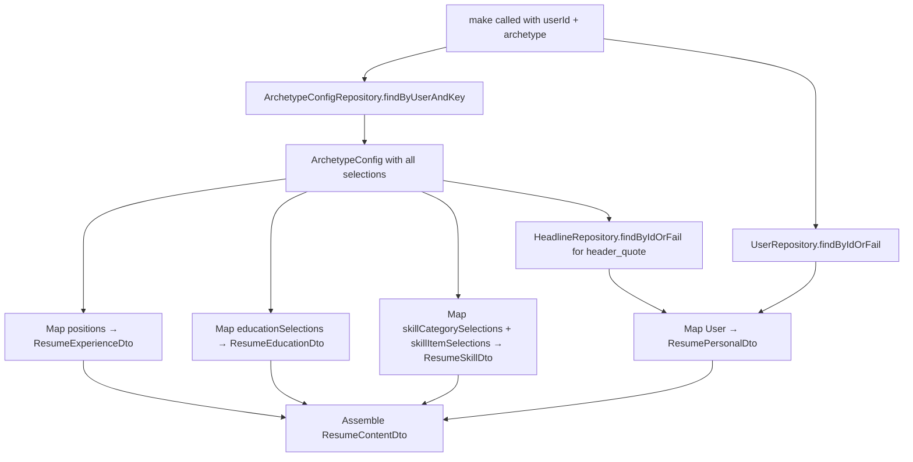

# DatabaseResumeContentFactory — Milestone 1C Design Spec

Replace `TemplateResumeContentFactory` (hardcoded resume templates) with `DatabaseResumeContentFactory` that assembles `ResumeContentDto` from database-backed resume data via the archetype config.

## Port Changes

### ResumeContentFactory (application/src/ports/ResumeContentFactory.ts)

`make()` becomes async. Input gains `userId` to keep the contract explicit (even though it's a single-user system).

```typescript
export type MakeResumeContentInput = {
  userId: string;
  archetype: Archetype;
  awesomeColor: string;
  keywords: string[];
};

export interface ResumeContentFactory {
  make(input: MakeResumeContentInput): Promise<ResumeContentDto>;
}
```

### GenerateResume (application/src/use-cases/GenerateResume.ts)

Both `resumeContentFactory.make()` calls become awaited. The use case needs the user ID — it should call `UserRepository.findSingle()` to get it early in the flow and pass it into the factory.

New constructor dependency: `UserRepository`.

## DatabaseResumeContentFactory

**Location:** `infrastructure/src/services/DatabaseResumeContentFactory.ts`

**Constructor dependencies:**
- `UserRepository`
- `ResumeCompanyRepository`
- `ResumeHeadlineRepository`
- `ResumeEducationRepository`
- `ResumeSkillCategoryRepository`
- `ArchetypeConfigRepository`

### Data Flow



### Mapping Rules

**Personal data** — from `User` entity + `ResumeHeadline` (selected by archetype config's `headlineId`):
- `first_name` ← `user.firstName`
- `last_name` ← `user.lastName`
- `github` ← `user.githubHandle`
- `linkedin` ← `user.linkedinHandle`
- `email` ← `user.email`
- `phone` ← `user.phoneNumber`
- `location` ← `user.locationLabel`
- `header_quote` ← `headline.summaryText`

**Experience** — from `ArchetypePosition[]` (ordered by `ordinal`):
- `title` ← `position.jobTitle`
- `society` ← `position.displayCompanyName`
- `date` ← formatted from `position.startDate` / `position.endDate`
- `location` ← `position.locationLabel`
- `summary` ← `position.roleSummary`
- `highlights` ← `position.bullets[]` ordered by ordinal, mapped to content strings. These reference original `ResumeBullet` entities but the archetype may override content.

**Education** — from `ArchetypeEducationSelection[]` (ordered by `ordinal`), each references a `ResumeEducation` by ID:
- `title` ← `education.degreeTitle`
- `society` ← `education.institutionName`
- `date` ← `education.graduationYear`
- `location` ← `education.locationLabel`

**Skills** — from `ArchetypeSkillCategorySelection[]` (ordered by `ordinal`), each references a `ResumeSkillCategory`. Items within each category are filtered to those present in `ArchetypeSkillItemSelection[]` (ordered by their ordinal):
- `type` ← `category.categoryName`
- `info` ← joined skill item names (comma-separated or formatted per renderer expectations)

## DI Changes

In `api/src/container.ts` and `cli/src/cvs/container.ts`:
- Bind `DI.Resume.ContentFactory` → `DatabaseResumeContentFactory` (replacing `TemplateResumeContentFactory`)
- Add `ArchetypeConfigRepository` binding if not already present (`DI.Resume.ArchetypeConfigRepository`)
- Update `GenerateResume` factory to inject `UserRepository`

## Deletions

After the swap is verified:
- `infrastructure/src/services/TemplateResumeContentFactory.ts`
- `infrastructure/src/resume/templates/LeadICResumeTemplate.ts`
- `infrastructure/src/resume/templates/ResumeTemplateParser.ts`
- `infrastructure/src/resume/data/*.ts` (Lantern, Brightflow, Volvo, Luxe, Planorama, StreamNation, LuckyCart)
- Any shared types only used by the above (e.g., `CompanyConfig`, `ResumeTemplate`)

## Verification

Seed the database with data matching the current hardcoded templates, then run `GenerateResume` and confirm the output PDF matches the old template-based output. This is a manual smoke test — compare visually.

## Scope Boundaries

- No new API endpoints (that's Milestone 2)
- No new domain entities (those were added in 1A)
- No migration changes (schema was added in 1B)
- The factory is the only new class; everything else is port/use-case adjustments and deletions
