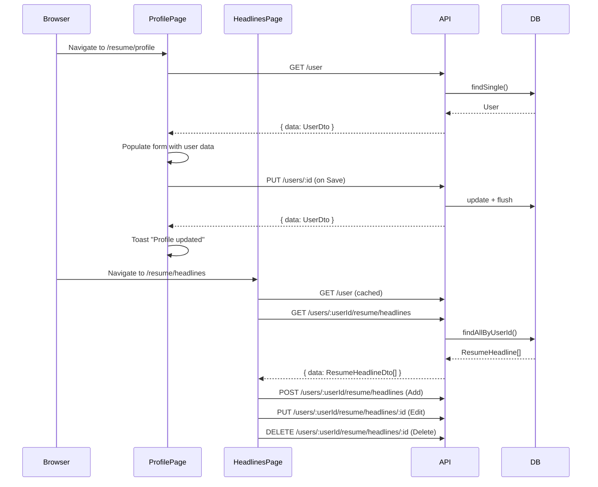

# Milestone 4A–4B: Profile & Headlines Pages

## Context

TailoredIn's resume data CRUD API (Milestone 2) is complete but has no frontend. Users currently have no way to view or edit their profile or headlines through the web UI. This spec covers the two simplest resume-editing pages — profile (4A) and headlines (4B) — as the first frontend pages that consume the resume API.

## Decisions

| Decision | Choice | Rationale |
|----------|--------|-----------|
| Profile editing pattern | Always-editable form with Save/Cancel | Simple, familiar settings-page UX |
| Headlines editing pattern | Table list + dialog for add/edit | Compact, scales well, separates viewing from editing |
| User ID resolution | New `GET /user` convenience endpoint | Avoids hardcoding; `findSingle()` already exists on the repo port |
| Sidebar navigation | Add "Headlines" link under Resume group | Currently missing from sidebar nav |

## Backend: `GET /user` Endpoint

A thin convenience route — no new use case needed.

### New files

**`api/src/routes/GetSingleUserRoute.ts`** — Elysia route:
- Path: `GET /user` (no `:id` param)
- Injects `GetUser` use case (reuse) but first calls `UserRepository.findSingle()` to get the ID, then delegates to `GetUser.execute()`
- Alternative: create a `GetSingleUser` use case in the application layer that calls `findSingle()` directly and maps to `UserDto`. This is cleaner — avoids coupling two repo calls in the route.

**Recommended approach:** New `GetSingleUser` use case in `application/src/use-cases/`:
```
class GetSingleUser {
  constructor(private readonly userRepository: UserRepository) {}
  async execute(): Promise<UserDto> {
    const user = await this.userRepository.findSingle();
    // map to UserDto (same mapping as GetUser)
  }
}
```

Register in `infrastructure/src/DI.ts` as `DI.Resume.GetSingleUser`, wire in `api/src/container.ts`, register route in `api/src/index.ts`.

### Response shape
```json
{ "data": { "id": "uuid", "email": "...", "firstName": "...", ... } }
```

Same `UserDto` shape as `GET /users/:id`.

## Frontend

### Shared: User ID hook

**`web/src/hooks/use-user.ts`** — custom hook wrapping `useQuery`:
```ts
function useUser() {
  return useQuery({
    queryKey: queryKeys.user.profile(),
    queryFn: () => api.user.get().then(r => r.data)
  });
}
```

Both pages use this to get the user (including `id` for headline API calls).

### 4A: Profile Page

**File:** `web/src/routes/resume/profile.tsx` (replace placeholder)

**Layout:**
- Page title: "Profile" with subtitle "Your personal information for resume generation."
- Card containing the form
- Two-column grid for name fields (first/last), handles (GitHub/LinkedIn)
- Single column for email, phone, location
- Save and Cancel buttons at bottom-right of card

**Form:**
- React Hook Form with Zod schema validation
- Fields: firstName, lastName, email (required), phoneNumber, githubHandle, linkedinHandle, locationLabel (optional)
- Zod schema mirrors the `PUT /users/:id` body validation (email format, minLength on names)
- `defaultValues` populated from `useUser()` query data
- `reset()` called when query data loads (via `useEffect` or RHF's `values` prop)

**Mutations:**
- `useMutation` calling `api.users({ id }).put(body)`
- On success: invalidate `queryKeys.user.profile()`, show success toast via Sonner
- On error: show error toast

**States:**
- Loading: Skeleton placeholders in form area
- Dirty tracking: Save button disabled when form is pristine
- Submitting: Save button shows loading state

### 4B: Headlines Page

**File:** `web/src/routes/resume/headlines.tsx` (new route file)

**Layout:**
- Page title: "Headlines" with subtitle "Resume headline and summary variations for different archetypes."
- Card with header containing "Headlines" title and "+ Add Headline" button
- shadcn Table inside the card: columns = Label, Summary (truncated), Actions

**Table:**
- Columns: Label (font-medium), Summary (text-muted-foreground, truncated to ~80 chars), Actions (edit + delete icon buttons)
- Empty state: centered message "No headlines yet. Add your first headline."

**Dialog (add/edit):**
- shadcn Dialog component
- Title: "Add Headline" or "Edit Headline"
- Form fields: headline_label (Input), summary_text (textarea — use a standard `<textarea>` styled with Tailwind since shadcn doesn't include one)
- React Hook Form + Zod validation (both fields required, minLength: 1)
- Save button in dialog footer

**Delete:**
- Click trash icon → confirmation dialog ("Delete this headline?") with Cancel/Delete buttons
- `useMutation` calling `api.users({ userId }).resume.headlines({ id }).delete()`
- On success: invalidate `queryKeys.resume.headlines()`, show toast

**Mutations:**
- Create: `api.users({ userId }).resume.headlines.post(body)` → invalidate headlines query
- Update: `api.users({ userId }).resume.headlines({ id }).put(body)` → invalidate headlines query
- Delete: as above

**States:**
- Loading: Skeleton rows in table
- Empty: message with prompt to add first headline
- Dialog open/close: controlled state for add vs edit mode

### Sidebar Update

**File:** `web/src/components/layout/sidebar.tsx`

Add a "Headlines" entry to `resumeNav` array:
```ts
{ label: 'Headlines', to: '/resume/headlines', icon: Heading }
```

Place it after "Profile" since headlines are closely related to profile data. Import `Heading` from `lucide-react`.

### Route Registration

Creating `web/src/routes/resume/headlines.tsx` is sufficient — TanStack Router's file-based routing auto-generates the route. Run `bun run --cwd web dev` to regenerate `routeTree.gen.ts`.

## Data Flow



## Files to Create/Modify

| Action | File | Purpose |
|--------|------|---------|
| Create | `application/src/use-cases/GetSingleUser.ts` | Use case wrapping `findSingle()` |
| Modify | `application/src/index.ts` | Export new use case |
| Create | `api/src/routes/GetSingleUserRoute.ts` | `GET /user` route |
| Modify | `infrastructure/src/DI.ts` | Add `DI.Resume.GetSingleUser` token |
| Modify | `api/src/container.ts` | Wire `GetSingleUser` |
| Modify | `api/src/index.ts` | Register `GetSingleUserRoute` |
| Create | `web/src/hooks/use-user.ts` | `useUser()` hook |
| Modify | `web/src/routes/resume/profile.tsx` | Profile form page |
| Create | `web/src/routes/resume/headlines.tsx` | Headlines table + dialog page |
| Modify | `web/src/components/layout/sidebar.tsx` | Add Headlines nav item |

## Verification

1. **Backend:** `curl http://localhost:8000/user` returns the single user's data
2. **Profile page:** Navigate to `/resume/profile`, verify fields load, edit a field, save, refresh — changes persist
3. **Headlines page:** Navigate to `/resume/headlines`, add a headline via dialog, verify it appears in table, edit it, delete it
4. **Navigation:** Sidebar shows "Headlines" link, active state highlights correctly
5. **Dark mode:** Both pages render correctly in light and dark themes
6. **Validation:** Submit profile with empty first name — shows validation error. Submit headline with empty label — shows validation error.
