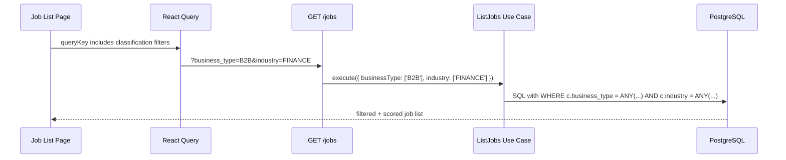
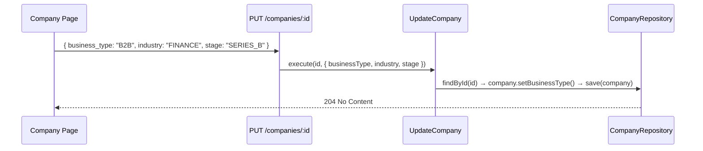

# Milestone 9 — Company Classification

## Context

Companies in TailoredIn are currently flat records: name, website, logo, LinkedIn link. When browsing 11k+ jobs, users have no way to filter by the *kind* of company — its business model, industry, or funding stage. This milestone adds structured classification metadata to the Company aggregate and exposes it through the UI for editing and filtering.

## Decisions

| Decision | Choice | Rationale |
|----------|--------|-----------|
| Enum representation | TypeScript `enum` in `domain/src/value-objects/` | Matches existing patterns (JobStatus, Archetype, SkillName) |
| All three fields nullable | Yes — `null` means "unclassified" | Existing ~11k companies have no classification; backfill is manual |
| DB column type | `text` (not pg enum) | Matches existing pattern for JobStatus; avoids migration pain when adding values |
| Company detail location | Section on job detail page + dedicated `/companies/:id` route | Job detail gives quick context; company page gives full editing |
| Filtering approach | Dropdowns on job list, wired same as status filter | Proven pattern, minimal new code |

## Enums

### BusinessType

`B2B`, `B2C`, `B2B2C`, `B2G`, `D2C`, `MARKETPLACE`, `PLATFORM`

### Industry

`AUTOMOBILE`, `SECURITY`, `FINANCE`, `HEALTHCARE`, `EDUCATION`, `E_COMMERCE`, `REAL_ESTATE`, `MEDIA`, `LOGISTICS`, `ENERGY`, `AGRICULTURE`, `TRAVEL`, `FOOD`, `LEGAL`, `HR`, `MARKETING`, `SAAS`, `AI_ML`, `GAMING`, `TELECOM`, `INSURANCE`, `RETAIL`, `CONSTRUCTION`, `GOVERNMENT`

### CompanyStage

`SEED`, `SERIES_A`, `SERIES_B`, `SERIES_C`, `SERIES_D_PLUS`, `GROWTH`, `PUBLIC`, `BOOTSTRAPPED`, `ACQUIRED`

## 9A — Domain Model + Backend

### Domain Layer

**New files:**
- `domain/src/value-objects/BusinessType.ts` — enum
- `domain/src/value-objects/Industry.ts` — enum
- `domain/src/value-objects/CompanyStage.ts` — enum

**Modified files:**
- `domain/src/entities/Company.ts` — add three nullable fields + setters:
  ```typescript
  readonly businessType: BusinessType | null;
  readonly industry: Industry | null;
  readonly stage: CompanyStage | null;
  ```
  Setters: `setBusinessType()`, `setIndustry()`, `setStage()` — each updates `updatedAt`.
  `CompanyCreateProps` gains optional `businessType`, `industry`, `stage`.
- `domain/src/index.ts` — re-export new enums

**Modified port:**
- `domain/src/ports/CompanyRepository.ts` — add `findById(id: CompanyId): Promise<Company | null>`

### Infrastructure Layer

**New file:**
- Migration: `Migration_YYYYMMDD_add_company_classification.ts`
  ```sql
  ALTER TABLE companies ADD COLUMN business_type TEXT NULL;
  ALTER TABLE companies ADD COLUMN industry TEXT NULL;
  ALTER TABLE companies ADD COLUMN stage TEXT NULL;
  ```

**Modified files:**
- `infrastructure/src/db/entities/companies/Company.ts` — three new nullable `@Property` fields
- `infrastructure/src/repositories/PostgresCompanyRepository.ts`:
  - `toDomain()` maps the three new fields
  - `save()` persists the three new fields
  - New `findById()` method: queries ORM entity, returns domain entity or null
- `infrastructure/src/db/entities/jobs/JobScoringQueries.ts` — extend `findPaginatedScoredJobs()`:
  - Accept optional `businessType`, `industry`, `stage` filter params
  - Add conditional WHERE clauses: `AND c.business_type = ANY(...)` (same pattern as status filter)

### Application Layer

**New files:**
- `application/src/use-cases/GetCompany.ts` — fetches company by ID via `CompanyRepository.findById()`
- `application/src/use-cases/UpdateCompany.ts` (for the scraping Company, not ResumeCompany) — updates classification fields via `CompanyRepository.save()`
- `application/src/dtos/CompanyDto.ts` — DTO with id, name, website, logoUrl, linkedinLink, businessType, industry, stage

**Modified files:**
- `application/src/use-cases/ListJobs.ts` — accept classification filter params, pass through to repository
- `application/src/use-cases/GetJob.ts` — return full company DTO instead of just `companyName` string
- `application/src/index.ts` — re-export new use cases and DTO

### API Layer

**New files:**
- `api/src/routes/GetCompanyRoute.ts` — `GET /companies/:id` → returns `CompanyDto`
- `api/src/routes/UpdateCompanyRoute.ts` (for scraping Company) — `PUT /companies/:id` → accepts partial classification fields, returns 204

**Modified files:**
- `api/src/routes/ListJobsRoute.ts` — add optional query params: `business_type`, `industry`, `stage` (each accepts single value or array, matching status pattern)
- `api/src/routes/GetJobRoute.ts` — include full company object in response (not just name string)
- `api/src/index.ts` — register new routes
- DI wiring: new tokens for `GetCompany` and `UpdateCompany` use cases in `infrastructure/src/DI.ts`

## 9B — Classification UI

### Job Detail Page — Company Section

**Modified file:** `web/src/routes/jobs/$jobId.tsx`

Add a collapsible "Company" section below the job title area:
- Shows: company name (linked to `/companies/:id`), website link, classification badges (business type, industry, stage — each as a colored badge or "Unclassified" in muted text)
- "View Company →" link to the dedicated company page

### Company Page

**New files:**
- `web/src/routes/companies/$companyId.tsx` — dedicated company detail page
  - Displays: name, website, LinkedIn link, logo (if available), classification fields
  - "Edit Classification" button opens a dialog
- `web/src/components/companies/classification-edit-dialog.tsx` — form dialog with three Select dropdowns (business type, industry, stage) + "Unclassified" option for each
  - Uses existing `Select` component from `web/src/components/ui/select.tsx`
  - react-hook-form + Zod validation
  - Calls `PUT /companies/:id` on submit

**New hooks:**
- `web/src/hooks/use-company.ts` — `useCompany(id)` query hook, `useUpdateCompanyClassification()` mutation hook

**Modified query keys:**
- `web/src/lib/query-keys.ts` — add `companies` namespace: `companies.detail(id)`

### Job List Page — Classification Filters

**Modified file:** `web/src/routes/jobs/index.tsx`

Add three filter dropdowns in the filter bar alongside the status dropdown:
- Business Type (with "All" option)
- Industry (with "All" option)
- Stage (with "All" option)

Each wired to URL search params via TanStack Router (same pattern as status filter). Query key includes all filter params. API call passes them through.

**Modified Zod search schema** — add optional `businessType`, `industry`, `stage` params with `'all'` default.

## Data Flow




