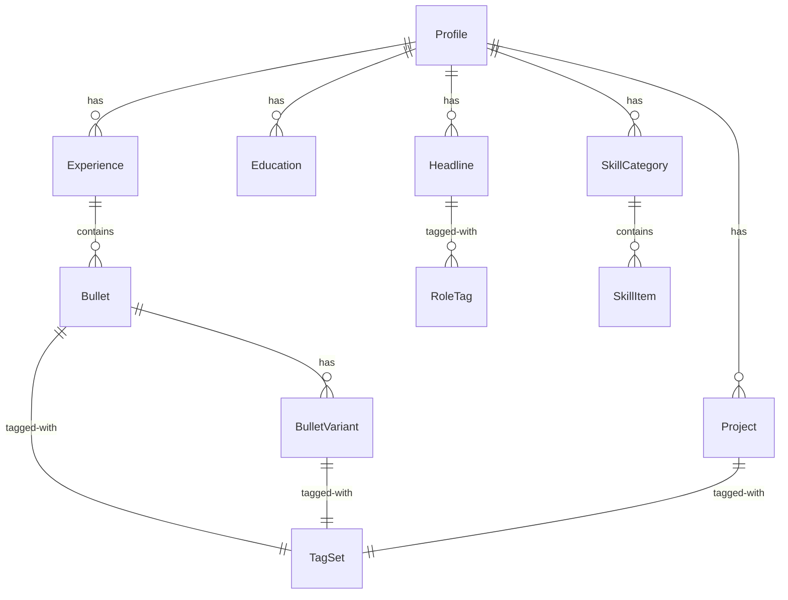
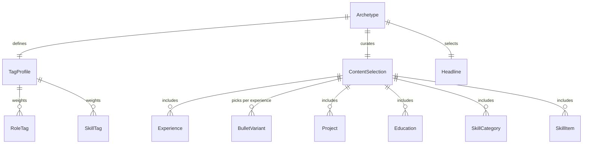
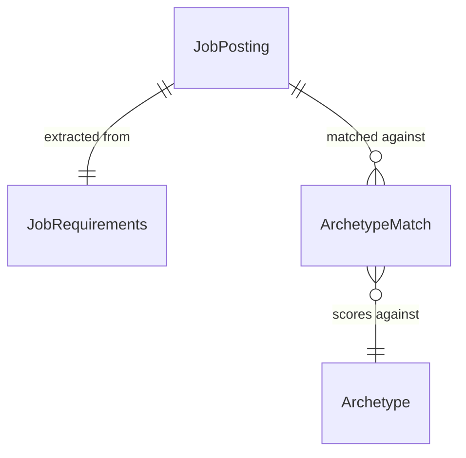

# Domain Rethink: Engineer-Centric Job Search

## Overview

Redesign TailoredIn's domain model from a clean slate to center on what a software engineer looking for a job actually needs: rich experience management with LLM-assisted enrichment, tag-based classification, archetype-driven resume curation, and intelligent job-to-archetype matching.

### Approach: Tags as Structure, LLM as Advisor

Tags provide the quantitative backbone — every bullet variant carries role tags and skill tags, archetypes define tag profiles, and job-to-archetype matching uses tag overlap. The LLM operates as an advisor at two points: content enrichment (suggest variants, auto-tag) and job analysis (extract requirements, recommend archetype fit, suggest tuning). The engineer always has the final word. The system works without the LLM (manual tagging, manual archetype selection), but is significantly better with it.

### Key Principles

1. **Engineer is always in control** — LLM suggests, never decides
2. **Works without LLM** — manual tagging, manual archetype curation, manual job analysis are all valid paths
3. **Tags are the connective tissue** — role tags connect bullets to archetypes, skill tags connect bullets to job requirements
4. **Archetypes are the unit of curation** — the engineer's curated story, with job-specific tuning layered on top
5. **Clean separation** — domain has no LLM awareness; the LLM is an infrastructure service behind a port
6. **LLM via Claude CLI** — all LLM interactions use the Claude CLI with JSON schema outputs, not OpenAI

---

## Domain Model

### Profile Subdomain (the engineer's story)



| Entity | Type | Purpose |
|---|---|---|
| **Profile** | Aggregate Root | The engineer: name, email, contact info, social links |
| **Experience** | Aggregate Root | A role at a company: title, company name, company website, location, start/end dates, summary |
| **Bullet** | Entity (under Experience) | A single achievement statement. The canonical version written by the engineer. Carries its own TagSet for un-enriched bullets |
| **BulletVariant** | Entity (under Bullet) | An LLM-proposed or engineer-written alternative phrasing. Each variant carries its own TagSet. Must be approved by the engineer before it's usable |
| **Project** | Aggregate Root | A standalone project (open source, side project) not tied to employment: name, description, url, dates. Carries a TagSet |
| **Education** | Aggregate Root | Degree, institution, graduation year, location, honors |
| **Headline** | Aggregate Root | A professional summary/headline. Carries role tags only |
| **SkillCategory** | Aggregate Root | A grouping of skills (e.g., "Languages", "Cloud & Infrastructure") |
| **SkillItem** | Entity (under SkillCategory) | A single skill within a category |

### Tagging Subdomain (the classification system)

| Concept | Type | Purpose |
|---|---|---|
| **RoleTag** | Value Object | A tag on the role dimension: `leadership`, `ic`, `architecture`, `mentoring`, `hands-on`, `strategy`, `cross-functional`, `founding`, `management`, `stakeholder-management` |
| **SkillTag** | Value Object | A tag on the skill dimension: `typescript`, `distributed-systems`, `react`, `system-design`, etc. |
| **TagSet** | Value Object | A pair of `RoleTag[]` + `SkillTag[]` attached to a BulletVariant, canonical Bullet, Headline, or Project |

**Tag taxonomy:**
- Two orthogonal dimensions — role (how you contributed) and skill (what technologies/domains)
- Controlled vocabulary that grows over time
- Role tags have a predefined starter set; engineer can add custom ones
- Skill tags are seeded from the engineer's SkillItems; grow as LLM suggests new tags from job descriptions or bullet analysis
- Every new tag requires engineer approval before entering the vocabulary
- Tags are immutable once created (rename = create new + migrate)

**Where tags live:**
- **BulletVariant** — primary tag carrier. Different phrasings of the same achievement carry different tags (IC-angled variant gets `ic, hands-on`; leadership-angled gets `leadership, mentoring`)
- **Canonical Bullet** — carries a TagSet for bullets that haven't been enriched with variants yet
- **Headline** — role tags only (headlines describe posture, not specific skills)
- **Project** — both role tags and skill tags
- **Experience** — does NOT carry tags. The bullets underneath it do. Avoids double-counting and keeps tagging granular

### Archetype Subdomain (resume personas)



| Entity | Type | Purpose |
|---|---|---|
| **Archetype** | Aggregate Root | A resume persona: key, label, tag profile, selected headline, content selection |
| **TagProfile** | Value Object | The archetype's "ideal" tag distribution — weighted role tags (0–1) and skill tags (0–1) that define what this persona emphasizes. Curated by the engineer |
| **ContentSelection** | Value Object | Which Experiences (and which BulletVariants per experience), Projects, Education entries, SkillCategories, and SkillItems are included in this archetype |

The engineer curates content selection manually per archetype. The system can suggest selections based on tag alignment, but never auto-includes.

### Job Subdomain (opportunity matching)



| Entity | Type | Purpose |
|---|---|---|
| **JobPosting** | Aggregate Root | A scraped job: title, company name, company website, company logo, company industry, company size, location, salary, description, LinkedIn URL, scraped date |
| **JobRequirements** | Value Object | Extracted from description — required/preferred skill tags + role tags + seniority signal |
| **ArchetypeMatch** | Value Object | A match between a JobPosting and an Archetype: tag overlap, LLM reasoning, suggested content tuning |

---

## Data Flows

### Flow 1: Engineer Enters Experience

```
Engineer writes a Bullet under an Experience
  → Bullet saved as canonical text (no LLM yet)
  → Bullet has no tags until engineer triggers enrichment or tags manually
```

No LLM on entry. Content is inert until enriched.

### Flow 2: LLM Enrichment (On-Demand, Iterative)

Triggered explicitly by the engineer on any Bullet (or set of Bullets). Can be re-triggered at any time for fresh suggestions.

**Suggest Variants:**
```
Engineer triggers "Suggest Variants" on a Bullet
  → Claude CLI call with JSON schema output:
    Input: { bullet, experienceContext (title, company, dates) }
    Output schema: { variants: [{ text, angle, roleTags[], skillTags[] }] }
  → 2-3 BulletVariants proposed, each with suggested tags and an angle label
    (e.g., angle: "leadership", angle: "technical depth")
  → Engineer reviews each: approve as-is / edit then approve / reject
  → Approved variants persisted with their TagSets
```

**Auto-Tag:**
```
Engineer triggers "Auto-Tag" on a Bullet or BulletVariant
  → Claude CLI call:
    Input: { text, experienceContext (title, company) }
    Output schema: { roleTags[], skillTags[] }
  → Tags proposed → engineer approves/edits/rejects
```

### Flow 3: Job Import & Analysis

```
Engineer pastes a LinkedIn job URL
  → Playwright scrapes public job page: title, company, location, salary, description
  → Optionally scrapes public company page: logo, website, industry, size
  → If LinkedIn credentials provided, scrapes richer authenticated data
  → JobPosting saved

Engineer triggers "Analyze Job"
  → Claude CLI call:
    Input: { jobDescription, jobTitle, company, archetypes: [{ key, label, tagProfile }] }
    Output schema: {
      requirements: { skillTags[], roleTags[], senioritySignal },
      archetypeMatches: [{
        archetypeKey,
        reasoning,
        suggestedTuning: {
          swapVariants: [{ bulletId, preferredVariantAngle }],
          emphasize: string[]
        }
      }]
    }
  → Tag overlap computed mechanically (deterministic)
  → LLM reasoning + tuning suggestions overlaid
  → Engineer sees ranked archetype matches with explanations
  → Engineer picks one → system pre-selects content from that archetype's ContentSelection
  → Engineer can accept/modify/ignore LLM's tuning suggestions
  → Note: LLM suggests tuning by angle/tag preference, not by ID.
    The system resolves "prefer the leadership-angled variant for bullet X"
    to the specific BulletVariant matching that angle.
```

### Flow 4: Resume Generation

```
Engineer confirms archetype + any job-specific tuning
  → ResumeContentFactory assembles: headline, experiences (with selected variants),
    projects, education, skills
  → ResumeRenderer (Typst) compiles to PDF
  → No LLM in the render path — content was already curated
```

---

## LLM Integration

### Infrastructure

All LLM interactions go through a single port:

```typescript
interface ClaudeService {
  prompt<T>(input: string, outputSchema: JsonSchema): Promise<T>
}
```

The infrastructure implementation shells out to the Claude CLI:

```bash
echo '<input>' | claude --output-format json --schema '<json-schema>'
```

- No OpenAI dependency
- Structured, typed outputs via JSON schema
- Works with whatever Claude model the user has configured locally

### LLM Operations

**1. Suggest Variants**

```typescript
// Input
{ bullet: string, title: string, company: string, startDate: string, endDate: string }

// Output schema
{
  variants: [{
    text: string,
    angle: string,           // e.g., "leadership", "technical depth", "impact"
    roleTags: string[],
    skillTags: string[]
  }]
}
```

**2. Auto-Tag**

```typescript
// Input
{ text: string, title: string, company: string }

// Output schema
{
  roleTags: string[],
  skillTags: string[]
}
```

**3. Analyze Job**

```typescript
// Input
{
  jobDescription: string,
  jobTitle: string,
  company: string,
  archetypes: [{ key: string, label: string, tagProfile: TagProfile }]
}

// Output schema
{
  requirements: {
    skillTags: string[],
    roleTags: string[],
    senioritySignal: string
  },
  archetypeMatches: [{
    archetypeKey: string,
    reasoning: string,
    suggestedTuning: {
      swapVariants: [{ bulletId: string, preferredVariantAngle: string }],
      emphasize: string[]
    }
  }]
}
```

### Design Principles

- **No LLM in the render path** — all content is pre-curated by the time we hit Typst
- **Every LLM output requires engineer approval** — suggestions, never decisions
- **Works without LLM** — engineer can write variants and assign tags manually
- **Idempotent** — re-running an LLM operation adds new suggestions, doesn't overwrite approved ones

---

## Scope

### In Scope

- Profile subdomain: Profile, Experience, Bullet, BulletVariant, Project, Education, Headline, SkillCategory, SkillItem
- Tagging subdomain: RoleTag, SkillTag, TagSet. Controlled vocabulary with engineer approval for new tags
- Archetype subdomain: Archetype with TagProfile and ContentSelection. Job-specific tuning as a diff on base selection
- Job subdomain: JobPosting (scraped from public LinkedIn URL + optional company page + optional auth), JobRequirements, ArchetypeMatch
- LLM via Claude CLI: three operations (Suggest Variants, Auto-Tag, Analyze Job), all with JSON schema outputs, all advisory/engineer-approved
- Resume generation: archetype selection + optional tuning → content assembly → Typst PDF

### Out of Scope

- Job discovery/search scraping (separate effort, later)
- Scoring logic (being removed in another session)
- Auto-apply or application tracking
- Multi-user / auth
