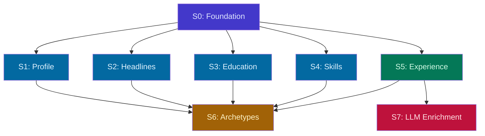

# Domain Rethink: Vertical Slice Delivery

## Overview

Restructure the domain rethink (originally 23 backend-only tasks) into 8 full-stack vertical slices. Each slice delivers domain → application → infrastructure → API → web UI as a single unit. Replace-in-place: each slice rewrites the existing page to use the new domain model.

**Base spec:** `docs/superpowers/specs/2026-03-31-domain-rethink-design.md`
**Original task plan:** `docs/superpowers/plans/2026-03-31-domain-rethink.md`

### Key Decisions

- **Replace in-place** — each slice rewrites the existing UI page. Old code is deleted.
- **Non-LLM first** — Experience slice (S5) delivers manual variants + manual tags. LLM enrichment (S7) is a follow-up.
- **Defer job slice** — existing job/scraping infrastructure keeps working. Job rethink is a future phase.
- **One migration upfront** — S0 creates all new tables. Later slices add ORM entities + repos for already-existing tables.
- **Per-worktree dev environment** — each worktree runs `bun dev:up` for independent Docker + port allocation.

---

## Slices

### S0: Foundation

**Delivers:** Shared domain building blocks + database schema. No UI.

**Domain:**
- Value objects: TagSet, ApprovalStatus, TagProfile, ContentSelection
- ID value objects: ExperienceId, BulletId, BulletVariantId, ProjectId, ProfileId, HeadlineId, EducationId, ArchetypeId, TagId, JobPostingId, SkillCategoryId, SkillItemId
- Entity: Tag (with TagDimension, name normalization)
- Port: TagRepository

**Infrastructure:**
- Migration: `Migration_20260404000000_domain_rethink` — creates ALL 17 new tables
- ORM entity: Tag
- Repository: PostgresTagRepository
- DI token: Tag.Repository

**Tests:**
- Unit: TagSet, TagProfile, Tag entity
- Integration: PostgresTagRepository (Testcontainers)

**Verify:**
- `cd domain && bun test` — all VO/entity tests pass
- `bun run check` — clean
- `bun dev:up && cd infrastructure && bun run db:migration:up` — migration applies
- Connect to DB, verify all 17 tables exist

---

### S1: Profile

**Replaces:** `/resume/profile` (User entity → Profile entity)

**Domain:**
- Entity: Profile (email, firstName, lastName, phone, location, linkedinUrl, githubUrl, websiteUrl)
- Port: ProfileRepository

**Application:**
- Use cases: GetProfile, UpdateProfile
- DTO: ProfileDto

**Infrastructure:**
- ORM entity: Profile
- Repository: PostgresProfileRepository
- DI tokens: Profile.Repository, Profile.GetProfile, Profile.UpdateProfile

**API:**
- `GET /profile` — returns current profile
- `PUT /profile` — update profile fields

**Web:**
- Rewrite `/resume/profile` route to call new endpoints
- Update form fields (add websiteUrl, rename handles to full URLs)
- Update `use-user.ts` hook → `use-profile.ts`

**UI Testing:**
- Open `/resume/profile`
- Edit all fields, save
- Reload — data persists
- Clear optional fields, save — nulls handled

---

### S2: Headlines

**Replaces:** `/resume/headlines` (ResumeHeadline → Headline with role tags)

**Domain:**
- Entity: Headline (label, summaryText, roleTags[])
- Port: HeadlineRepository

**Application:**
- Use cases: CreateHeadline, UpdateHeadline, DeleteHeadline, ListHeadlines
- DTO: HeadlineDto

**Infrastructure:**
- ORM entities: Headline, HeadlineTag (join table)
- Repository: PostgresHeadlineRepository
- DI tokens

**API:**
- `GET /headlines` — list all
- `POST /headlines` — create
- `PUT /headlines/:id` — update
- `DELETE /headlines/:id` — delete

**Web:**
- Rewrite `/resume/headlines` route
- Add role tag multi-select (populated from Tag vocabulary via `GET /tags?dimension=ROLE`)
- Update `use-headlines.ts` hook

**UI Testing:**
- Create headline with label + summary + role tags
- Edit — change tags, verify persistence
- Delete — confirm removal
- Create headline without tags — works fine

---

### S3: Education

**Replaces:** `/resume/education` (ResumeEducation → Education)

**Domain:**
- Entity: Education (degreeTitle, institutionName, graduationYear, location, honors, ordinal)
- Port: EducationRepository

**Application:**
- Use cases: CreateEducation, UpdateEducation, DeleteEducation, ListEducation
- DTO: EducationDto

**Infrastructure:**
- ORM entity: Education
- Repository: PostgresEducationRepository
- DI tokens

**API:**
- `GET /educations` — list all
- `POST /educations` — create
- `PUT /educations/:id` — update
- `DELETE /educations/:id` — delete

**Web:**
- Rewrite `/resume/education` route with new endpoints
- Same card layout, updated field names

**UI Testing:**
- CRUD on education entries
- Verify ordinal ordering

---

### S4: Skills

**Replaces:** `/resume/skills` (ResumeSkillCategory/Item → SkillCategory/Item)

**Domain:**
- Entities: SkillCategory (with items collection), SkillItem
- Port: SkillCategoryRepository

**Application:**
- Use cases: CreateSkillCategory, UpdateSkillCategory, DeleteSkillCategory, ListSkillCategories, AddSkillItem, UpdateSkillItem, DeleteSkillItem
- DTO: SkillCategoryDto

**Infrastructure:**
- ORM entities: SkillCategory, SkillItem
- Repository: PostgresSkillCategoryRepository
- DI tokens

**API:**
- `GET /skill-categories` — list with items
- `POST /skill-categories` — create
- `PUT /skill-categories/:id` — update
- `DELETE /skill-categories/:id` — delete
- `POST /skill-categories/:id/items` — add item
- `PUT /skill-items/:id` — update item
- `DELETE /skill-items/:id` — delete item

**Web:**
- Rewrite `/resume/skills` route
- Keep drag-and-drop reordering
- Update hooks

**UI Testing:**
- Create category, add items
- Drag to reorder categories
- Edit/delete items and categories

---

### S5: Experience

**Replaces:** `/resume/experience` (ResumeCompany/Position/Bullet → Experience/Bullet/BulletVariant)

This is the biggest slice. The old 3-level hierarchy (Company → Position → Bullet) becomes a 3-level hierarchy (Experience → Bullet → BulletVariant) but with tags and approval workflow.

**Domain:**
- Entities: Experience (aggregate root), Bullet (with TagSet), BulletVariant (with TagSet, ApprovalStatus, source)
- Port: ExperienceRepository

**Application:**
- Use cases: CreateExperience, UpdateExperience, DeleteExperience, ListExperiences, AddBullet, UpdateBullet, DeleteBullet, AddBulletVariant, UpdateBulletVariant, DeleteBulletVariant, ApproveBulletVariant
- DTO: ExperienceDto (nested BulletDto, BulletVariantDto)

**Infrastructure:**
- ORM entities: Experience, Bullet, BulletTag, BulletVariant, BulletVariantTag
- Repository: PostgresExperienceRepository
- DI tokens

**API:**
- Experience CRUD: `GET/POST /experiences`, `PUT/DELETE /experiences/:id`
- Bullet CRUD: `POST /experiences/:id/bullets`, `PUT/DELETE /bullets/:id`
- Variant CRUD: `POST /bullets/:id/variants`, `PUT/DELETE /variants/:id`
- Approval: `PUT /variants/:id/approve`, `PUT /variants/:id/reject`

**Web:**
- Rewrite `/resume/experience` route completely
- Experience cards (title, company, dates, location)
- Nested bullet list per experience
- Expandable variant list per bullet with approval badges (PENDING/APPROVED/REJECTED)
- Manual "Add Variant" form (text, angle, tags)
- Tag display on bullets and variants (role tags + skill tags as badges)
- Approve/reject buttons on pending variants

**UI Testing:**
- Create experience with title, company, dates
- Add bullet — appears in list
- Add manual variant to bullet — shows as APPROVED (manual source)
- Approve/reject LLM variants (create one via API to test)
- Tags display as colored badges
- Delete bullet — cascades variant removal
- Delete experience — cascades everything

---

### S6: Archetypes

**Replaces:** `/archetypes/` list + `/archetypes/$archetypeId` detail

**Domain:**
- Entity: Archetype (key, label, headlineId, TagProfile, ContentSelection)
- Port: ArchetypeRepository

**Application:**
- Use cases: CreateArchetype, UpdateArchetype, DeleteArchetype, ListArchetypes, SetArchetypeContent
- DTO: ArchetypeDto

**Infrastructure:**
- ORM entities: ArchetypeV2, ArchetypeTagWeight
- Repository: PostgresArchetypeRepository
- DI tokens

**API:**
- `GET /archetypes` — list all
- `POST /archetypes` — create
- `PUT /archetypes/:id` — update metadata
- `DELETE /archetypes/:id` — delete
- `PUT /archetypes/:id/content` — replace content selection
- `PUT /archetypes/:id/tag-profile` — replace tag profile

**Web:**
- Rewrite `/archetypes/` list — free-form key/label (no predefined enum), create/edit/delete
- Rewrite `/archetypes/$id` detail:
  - Metadata section: key, label, headline picker
  - Tag profile editor: role tag weights (sliders 0-1), skill tag weights (sliders 0-1)
  - Content selection: checkboxes for experiences (with per-experience variant picker), projects, education entries, skill categories/items

**UI Testing:**
- Create archetype with key + label
- Set headline
- Add tag weights — verify persistence
- Select experiences + specific variants, education, skills
- Deselect items — verify they're removed from selection
- Delete archetype

---

### S7: LLM Enrichment

**Adds to:** `/resume/experience` (S5's page). No page replacement — new buttons + backend.

**Application:**
- Port: ClaudeService (suggestVariants, autoTag)
- Use cases: SuggestBulletVariants, AutoTagBullet

**Infrastructure:**
- Service: ClaudeCliService (calls `claude` CLI with JSON schema output)
- DI token: Claude.Service

**API:**
- `POST /bullets/:id/suggest-variants` — LLM generates 2-3 variants
- `POST /bullets/:id/auto-tag` — LLM classifies bullet with tags

**Web:**
- "Suggest Variants" button on each bullet card → calls API → new PENDING variants appear
- "Auto-Tag" button on each bullet/variant → calls API → tags populated
- Loading states while LLM runs
- Graceful degradation if Claude CLI not available (buttons hidden or disabled)

**UI Testing:**
- Click "Suggest Variants" on a bullet → spinner → 2-3 PENDING variants appear
- Approve one → status changes to APPROVED
- Click "Auto-Tag" on a bullet → tags populated
- If Claude CLI unavailable → button disabled with tooltip

---

## Parallel Execution



### Wave Schedule

| Wave | Sessions | Worktrees |
|---|---|---|
| **Wave 1** | S0 | 1 worktree |
| **Wave 2** | S1, S2, S3, S4 | 4 worktrees (parallel) |
| **Wave 3** | S5 | 1 worktree |
| **Wave 4** | S6, S7 | 2 worktrees (parallel) |

### Worktree + Branch Assignments

| Slice | Branch | Worktree |
|---|---|---|
| S0 | `feat/dr-s0-foundation` | `.claude/worktrees/dr-s0-foundation` |
| S1 | `feat/dr-s1-profile` | `.claude/worktrees/dr-s1-profile` |
| S2 | `feat/dr-s2-headlines` | `.claude/worktrees/dr-s2-headlines` |
| S3 | `feat/dr-s3-education` | `.claude/worktrees/dr-s3-education` |
| S4 | `feat/dr-s4-skills` | `.claude/worktrees/dr-s4-skills` |
| S5 | `feat/dr-s5-experience` | `.claude/worktrees/dr-s5-experience` |
| S6 | `feat/dr-s6-archetypes` | `.claude/worktrees/dr-s6-archetypes` |
| S7 | `feat/dr-s7-llm` | `.claude/worktrees/dr-s7-llm` |

### Per-Session Dev Environment

Each worktree runs independently:
```bash
cd .claude/worktrees/<name>
bun dev:up          # starts Docker (Postgres) + API + web on unique ports
# ... implement slice ...
# UI testing at the local URL printed by dev:up
bun dev:down        # cleanup
```

---

## Future Work (not in this plan)

- Job rethink (new JobPosting model with tag-based matching, archetype recommendations)
- Data migration from old schema to new schema
- Removing old entities/tables/code
- Resume generation integration with new content model (Typst templates)
- CLI phase-out
