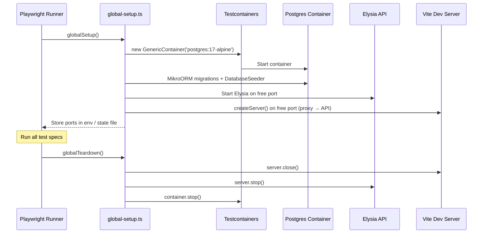

# Playwright E2E Tests

## Context

TailoredIn has good backend test coverage (unit tests in application/domain, Testcontainers integration tests in infrastructure) but **zero frontend or end-to-end tests**. The web package has no test runner at all. A manual QA test plan exists (`docs/qa/milestone-12-test-plan.md`) but nothing is automated. As the app grows through the Domain Rethink vertical slices (S0–S7), regressions in form CRUD, drag-drop reordering, and page interactions are caught late. Playwright e2e tests will catch these automatically, both locally and in CI.

## Goals

- Self-contained e2e test suite runnable with a single command (`bun run test:e2e`)
- Fully isolated: Testcontainers Postgres + programmatic API/Vite servers — no manual setup
- Focused interaction tests per page (CRUD, drag-drop, validation)
- Cross-page journey tests for critical user flows
- CI integration in GitHub Actions

## Non-Goals

- Cross-browser testing (Chromium only — internal tool)
- Visual regression testing (screenshots/snapshots)
- Performance/load testing
- Testing the LinkedIn scraper or CLI tools

---

## Architecture

### Package structure

```
e2e/                          ← New directory at repo root (NOT a workspace package)
  package.json                ← @playwright/test + dev dependencies
  playwright.config.ts        ← Playwright configuration
  support/
    global-setup.ts           ← Boot Testcontainers + API + Vite
    global-teardown.ts        ← Cleanup
    test-server.ts            ← Programmatic server lifecycle helpers
  tests/
    resume/
      profile.spec.ts
      headlines.spec.ts
      education.spec.ts
      skills.spec.ts
      experience.spec.ts
    jobs/
      job-list.spec.ts
      job-detail.spec.ts
    archetypes/
      archetype-list.spec.ts
    journeys/
      resume-builder.spec.ts  ← Cross-page flow
```

### Test infrastructure lifecycle



### global-setup.ts

1. **Postgres via Testcontainers** — reuses the same `GenericContainer('postgres:17-alpine')` pattern from `infrastructure/test-integration/support/TestDatabase.ts`
2. **Migrations + seeds** — `MikroORM.init()` → `orm.migrator.up()` → `orm.seeder.seed(DatabaseSeeder)`
3. **API server** — imports and starts Elysia programmatically with env vars pointing to the Testcontainers DB, on a free port
4. **Vite dev server** — `createServer()` from `vite` with proxy config pointing to the API port
5. **Port sharing** — writes `{ dbPort, apiPort, webPort }` to a temp JSON file that `playwright.config.ts` reads for `baseURL`

### global-teardown.ts

Reads the same state file, stops Vite → API → container in order, deletes the state file.

---

## Playwright Configuration

```typescript
// playwright.config.ts (key settings)
{
  testDir: './tests',
  fullyParallel: true,
  forbidOnly: !!process.env.CI,
  retries: process.env.CI ? 1 : 0,
  workers: process.env.CI ? 2 : undefined,
  reporter: process.env.CI
    ? [['html', { open: 'never' }], ['github']]
    : [['html', { open: 'on-failure' }]],
  globalSetup: './support/global-setup.ts',
  globalTeardown: './support/global-teardown.ts',
  use: {
    baseURL: '<read from state file>',
    trace: 'on-first-retry',
    screenshot: 'only-on-failure',
  },
  projects: [
    { name: 'chromium', use: { ...devices['Desktop Chrome'] } }
  ]
}
```

---

## Test Plan

### Focused interaction tests

Each test file targets a single page and verifies its CRUD lifecycle:

| Test file | Route | What it tests |
|---|---|---|
| `resume/profile.spec.ts` | `/resume/profile` | Load profile form, edit fields, save, reload and verify persistence |
| `resume/headlines.spec.ts` | `/resume/headlines` | Create headline, edit inline, delete, verify list updates |
| `resume/education.spec.ts` | `/resume/education` | Create education entry, edit, delete, cascading delete verification |
| `resume/skills.spec.ts` | `/resume/skills` | Create category, add items, drag-drop reorder categories, delete |
| `resume/experience.spec.ts` | `/resume/experience` | Create company → position → bullets, nested CRUD, delete cascades |
| `jobs/job-list.spec.ts` | `/jobs` | List loads with seeded data, status filtering, bulk status change |
| `jobs/job-detail.spec.ts` | `/jobs/:id` | View job detail, company info displays, status change |
| `archetypes/archetype-list.spec.ts` | `/archetypes` | Create archetype, edit, assign positions/skills/education, delete |

### Cross-page journey tests

| Test file | Flow |
|---|---|
| `journeys/resume-builder.spec.ts` | Navigate sidebar: Profile → Headlines → Education → Skills → Experience. Verify data entered in each step persists. |

### Test conventions

- Tests use `test.describe` blocks grouped by feature
- Each `test()` is independent — uses unique names/data to avoid collisions with seeded data
- Selectors: prefer `getByRole`, `getByText`, `getByLabel` (accessible selectors) over CSS selectors
- No `page.waitForTimeout()` — use Playwright's auto-waiting and `expect().toBeVisible()` / `expect().toHaveText()`

---

## CI Integration

New job in `.github/workflows/ci.yaml`:

```yaml
test-e2e:
  name: E2E Tests
  needs: changes
  if: needs.changes.outputs.src == 'true' || needs.changes.outputs.deps == 'true'
  runs-on: ubuntu-latest
  steps:
    - uses: actions/checkout@v4
    - uses: ./.github/actions/setup-bun
    - run: cd e2e && bun install
    - run: cd e2e && bunx playwright install chromium --with-deps
    - run: bun run test:e2e
    - uses: actions/upload-artifact@v4
      if: ${{ !cancelled() }}
      with:
        name: playwright-report
        path: e2e/playwright-report/
        retention-days: 14
```

The `changes` filter will pick up e2e changes automatically since `**/*.ts` already matches.

---

## Scripts

Root `package.json`:

```json
"test:e2e": "bun run --cwd e2e test",
"test:e2e:ui": "bun run --cwd e2e test:ui"
```

`e2e/package.json`:

```json
"test": "bunx playwright test",
"test:ui": "bunx playwright test --ui"
```

---

## Dependencies

`e2e/package.json` devDependencies:

- `@playwright/test` — test runner + assertions + browser management
- `testcontainers` — Postgres container lifecycle
- `@mikro-orm/postgresql` + `@mikro-orm/seeder` — migrations + seeding (imported from infrastructure)
- `vite` — programmatic Vite dev server

Note: `e2e/` imports from `infrastructure/` and `api/` for server setup — this is acceptable since e2e tests sit outside the Onion Architecture boundary. These are test-time imports only.

---

## Key Decisions

1. **Playwright Test runner** (not Playwright library) — gives us parallel workers, retries, traces, HTML reporter, and `--ui` mode for debugging
2. **Single global DB per run** — `DatabaseSeeder` creates known state; tests create additional data with unique names. Avoids per-test container overhead.
3. **Programmatic server start** (not `webServer` config) — gives full control over DB connection, port allocation, and lifecycle ordering
4. **Chromium only** — cross-browser adds CI time with minimal value for a self-hosted internal tool
5. **Separate `e2e/` directory** (not inside `web/`) — tests cross the web/api boundary and don't belong to a single package
6. **Not a Bun workspace member** — avoids `bun run test` accidentally running e2e tests (they're slow); must be explicitly invoked via `test:e2e`
