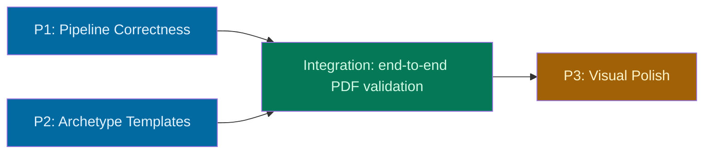

# Resume Tailoring — Parallel Execution Coordination

**Date:** 2026-04-01
**Goal:** Each archetype produces a distinct, polished PDF — ready to send to a recruiter.

## Plans Overview

| Plan | Spec | Scope | Effort |
|---|---|---|---|
| **P1: Pipeline Correctness** | `2026-04-01-pipeline-correctness.md` | Fix `DatabaseResumeContentFactory` to use `bulletVariantIds` | Small — 1 file change + tests |
| **P2: Archetype Templates** | `2026-04-01-archetype-templates.md` | `TemplateStyle` enum, layout configs, parameterized Typst generation | Medium — new domain VO, refactor generator, wire through use case |
| **P3: Visual Polish** | `2026-04-01-visual-polish.md` | Typography, spacing, color contrast, page-fit validation | Medium — tuning + test infrastructure |

## Dependency Graph



**P1 and P2 can run in parallel.** They touch different parts of the pipeline:
- P1 = content assembly (which variant texts become highlights)
- P2 = rendering (how content is laid out visually)

**P3 waits for both** — it's a refinement pass on the combined output.

## File Ownership

| File | P1 | P2 | Conflict? |
|---|---|---|---|
| `infrastructure/src/services/DatabaseResumeContentFactory.ts` | **modify** | — | No |
| `infrastructure/src/resume/TypstFileGenerator.ts` | — | **modify** | No |
| `infrastructure/src/services/TypstResumeRenderer.ts` | — | **modify** | No |
| `application/src/use-cases/GenerateResume.ts` | — | **modify** | No |
| `application/src/ports/ResumeRenderer.ts` | — | **modify** | No |
| `domain/src/value-objects/TemplateStyle.ts` | — | **new** | No |
| `domain/src/domain-services/TailoringStrategyService.ts` | — | **modify** | No |
| `infrastructure/src/resume/TemplateLayoutConfig.ts` | — | **new** | No |
| `infrastructure/src/resume/templateLayouts.ts` | — | **new** | No |
| `infrastructure/src/services/PlaywrightWebColorService.ts` | — | — | P3 only |
| `core/src/ColorUtil.ts` | — | — | P3 only |

**No file conflicts between P1 and P2.** Clean parallel execution.

## Branch Strategy

Each plan gets its own worktree per repo convention:

```bash
# P1
git worktree add .claude/worktrees/resume-pipeline-fix -b feat/resume-pipeline-fix

# P2
git worktree add .claude/worktrees/archetype-templates -b feat/archetype-templates

# P3 (after P1 + P2 merge)
git worktree add .claude/worktrees/visual-polish -b feat/visual-polish
```

## Merge Order

1. **P1** merges to `main` first (smaller, no shared files)
2. **P2** rebases on `main` after P1 merges, then merges (the only shared touchpoint is `GenerateResume.ts` if P1 touched it — it doesn't, so clean merge)
3. **Integration checkpoint** — generate a PDF from each archetype on `main` and verify:
   - Content uses selected bullet variants (P1)
   - Layout differs per archetype (P2)
4. **P3** branches from `main` after both are merged

Either P1 or P2 can merge first — there are no file conflicts. The order above is recommended because P1 is smaller and validates the content pipeline independently.

## Integration Checkpoint (between P2 and P3)

Before starting P3, verify on `main`:

- [ ] Create 2+ archetypes with different content selections (different bulletVariantIds)
- [ ] Generate a resume for each — confirm PDFs contain different bullet text
- [ ] Confirm PDFs use different layout parameters (IC vs EXECUTIVE density)
- [ ] `bun run check` — clean
- [ ] `bun run knip` — no dead code

This checkpoint confirms the pipeline is correct and parameterized before the polish pass begins.

## Session Handoff Checklist

Each session receives:

| Item | Where |
|---|---|
| Product vision | `GOALS.md` (Now section) |
| Detailed spec for their plan | `docs/superpowers/specs/2026-04-01-<plan>.md` |
| This coordination doc | `docs/superpowers/specs/2026-04-01-resume-tailoring-coordination.md` |
| Architecture reference | `CLAUDE.md` |

Each session should:
1. Read the spec and `CLAUDE.md`
2. Create a worktree using the branch name above
3. Create an implementation plan from the spec
4. Implement with tests
5. Open a PR to `main`
