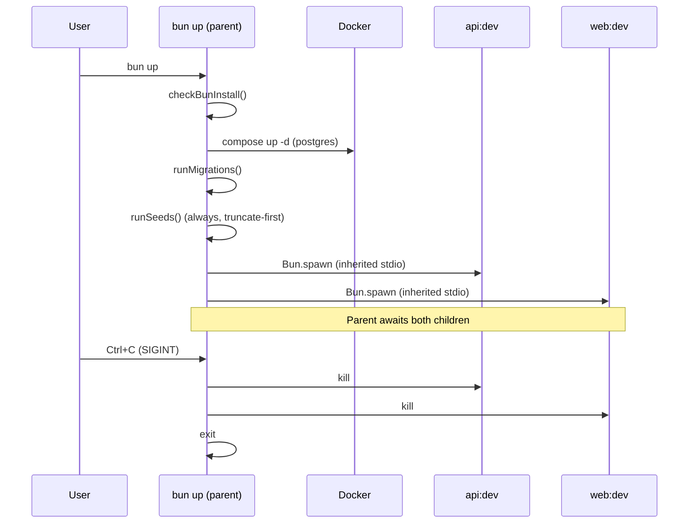

# Unified `up` / `down` Dev Commands

## Context

The current dev setup requires 3-4 commands to go from zero to running (`wt:up` or `dev:up`, then `bun dev`), the naming is confusing (`dev` vs `dev:up` vs `wt:up`), seeds only run on fresh worktree databases, and there's no automatic `bun install` check. This spec replaces the multi-command workflow with an idempotent `bun up` / `bun down` pair that handles everything.

## Command Surface

| Command | Behavior |
|---------|----------|
| `bun up` | Check deps -> Docker -> migrations -> seeds -> start API + web servers |
| `bun down` | Kill servers -> stop Docker -> clean up worktree env/volumes |

Old scripts (`dev:up`, `dev:down`, `wt:up`) are removed. The standalone `dev` script is kept for server-only starts.

## Process Model

`up.ts` is a long-running foreground parent process. Ctrl+C kills everything.



## Always-Seed via Truncate

`DatabaseSeeder.run()` executes a single `TRUNCATE ... CASCADE` before calling sub-seeders. This makes seeds safe to run on every `up`, on main or worktree.

Tables to truncate (all seeded tables, excludes `mikro_orm_migrations`):

```sql
TRUNCATE
  -- Archetype system
  archetype_position_bullets, archetype_positions, archetype_educations,
  archetype_skill_categories, archetype_skill_items, archetypes,
  -- Resume data
  resume_bullets, resume_positions, resume_company_locations, resume_companies,
  resume_skill_items, resume_skill_categories, resume_educations, resume_headlines,
  -- New domain model tables
  skill_items, skill_categories, profiles,
  -- User
  users,
  -- Job data
  job_status_updates, jobs, companies,
  -- Skills
  skills
CASCADE
```

SkillsSeeder currently uses `repo.refreshAll()` which is already idempotent, but truncating `skills` first keeps the approach uniform and avoids stale data.

## Dependency Freshness Check

Before all other steps, compare `bun.lock` mtime vs `node_modules` directory mtime. If lockfile is newer or `node_modules` is missing, run `bun install`. No overhead when deps are current.

## `down` Server Cleanup

`down.ts` kills server processes before stopping Docker. Uses `pkill -f` with command-line patterns:
- `pkill -f 'bun.*api/src/index.ts'`
- `pkill -f 'bun.*--cwd web dev'`

Idempotent: no error if processes aren't found (pkill exit code 1 is ignored).

## Files Modified

| File | Change |
|------|--------|
| `infrastructure/dev/up.ts` | Add install check, always-seed, server spawning, signal handlers. Remove `process.exit(0)` from already-running path. |
| `infrastructure/dev/down.ts` | Add `pkill` of server processes before Docker stop |
| `infrastructure/src/db/seeds/DatabaseSeeder.ts` | Add `TRUNCATE ... CASCADE` at start of `run()` |
| `package.json` | Add `up`/`down` scripts, remove `dev:up`/`dev:down`/`wt:up` |

No new files created. Existing DevContext, DockerCompose, EnvFile, MigrationRunner, PortFinder are reused unchanged.

## Worktree Behavior (unchanged)

- **Main**: static ports from `.env`, named Docker volume (persists), seeds always refresh
- **Worktree**: dynamic port allocation, ephemeral volume, isolated `.env` generated

The only behavioral change vs today: main now always re-seeds (previously it never did).

## Verification

1. On main: `bun up` starts Docker, runs migrations, truncates+seeds, starts API+web. Ctrl+C stops servers. `bun down` stops Docker.
2. In a worktree: `bun up` installs deps, allocates ports, starts isolated Docker, migrates, seeds, starts servers on allocated ports.
3. Idempotency: running `bun up` twice in a row works (re-migrates, re-seeds, re-spawns servers).
4. `bun down` when nothing is running: exits cleanly with "Nothing to tear down."
