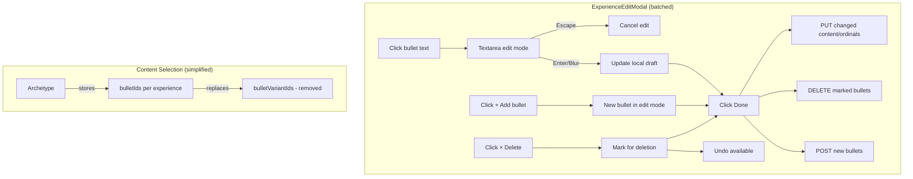

# Inline Bullet Editing + Remove Bullet Variants

## Context

The resume builder currently has a `BulletVariant` system where each bullet can have multiple alternative phrasings, with approval status tracking. In practice, this adds complexity without clear value — users just want to write and edit bullets directly. The `ExperienceEditModal` only supports toggling visibility and drag-to-reorder; there's no way to edit bullet text, add new bullets, or delete them.

This spec removes the variant system entirely and adds inline bullet editing to the `ExperienceEditModal`.

## Scope

Two related changes:

1. **Remove bullet variants** — collapse the `Bullet → BulletVariant[]` indirection across all layers. Each bullet is just `{ id, content, ordinal, tags }`. Archetype content selection switches from `bulletVariantIds` to `bulletIds`.
2. **Inline bullet editing** — click bullet text to edit, add new bullets, delete bullets. All changes are local drafts batched on "Done".

## Data Migration

A new MikroORM migration handles the schema transition:

1. **Copy variant text to bullet content**: For each bullet with an approved variant, overwrite `bullets.content` with the approved variant's `text`. If multiple approved variants exist, use the first. If none approved, keep existing `bullets.content`.
2. **Rewrite content_selection JSON**: In every `archetypes.content_selection` blob, for each `experienceSelections[].bulletVariantIds`, look up the parent `bullet_id` for each variant ID, deduplicate, and store as `bulletIds`.
3. **Drop** `bullet_variant_tags` table, then `bullet_variants` table.

## Domain Changes

### Remove `BulletVariant`

Delete `domain/src/entities/BulletVariant.ts`.

### Simplify `Bullet`

In `domain/src/entities/Bullet.ts`:
- Remove `variants` property and all variant methods (`addVariant`, `removeVariant`, `findVariantOrFail`, `approvedVariants`)
- Remove imports of `BulletVariant`, `ApprovalStatus`, `BulletVariantSource`
- Constructor and `create()` no longer accept/initialize `variants`

### Update `ContentSelection`

In `domain/src/value-objects/ContentSelection.ts`:
- Rename `ExperienceSelection.bulletVariantIds` → `bulletIds`

## Application Changes

### Delete variant use cases

Remove 4 files:
- `application/src/use-cases/experience/AddBulletVariant.ts`
- `application/src/use-cases/experience/UpdateBulletVariant.ts`
- `application/src/use-cases/experience/DeleteBulletVariant.ts`
- `application/src/use-cases/experience/ApproveBulletVariant.ts`

### Update DTOs

- `application/src/dtos/ExperienceDto.ts`: Remove `BulletVariantDto`, remove `variants` from `BulletDto`
- `application/src/dtos/ArchetypeDto.ts`: Rename `bulletVariantIds` → `bulletIds` in `ContentSelectionDto`

### Update use cases

- `ListExperiences`: Stop mapping variants in DTO construction
- `SetArchetypeContent`: Input now receives `bulletIds`

## Infrastructure Changes

### ORM entities

- Delete `infrastructure/src/db/entities/experience/BulletVariant.ts`
- `infrastructure/src/db/entities/experience/Bullet.ts`: Remove `@OneToMany` variants collection
- Remove `BulletVariant` from ORM config entity list

### Repositories

- `PostgresExperienceRepository`: Remove all variant persistence/loading logic. Simplify `toDomain` to not construct variants array.
- `PostgresArchetypeRepository`: Rename `bulletVariantIds` ↔ `bulletIds` in JSON serialization/deserialization.

### Resume content factory

`DatabaseResumeContentFactory.ts` (lines 64-74): Replace the `variantMap` with a `bulletMap`:

```typescript
const bulletMap = new Map<string, { text: string; ordinal: number }>();
for (const exp of allExperiences) {
  for (const bullet of exp.bullets) {
    bulletMap.set(bullet.id.value, { text: bullet.content, ordinal: bullet.ordinal });
  }
}
```

Then iterate `sel.bulletIds` instead of `sel.bulletVariantIds` (lines 82-89).

### DI tokens

`infrastructure/src/DI.ts`: Remove the 4 variant DI tokens.

### Seeds

`infrastructure/src/db/seeds/ResumeDataSeeder.ts`: Remove any variant seeding logic. Update content_selection seeds to use `bulletIds`.

## API Changes

### Delete variant routes (5 files)

- `api/src/routes/experience/AddBulletVariantRoute.ts`
- `api/src/routes/experience/UpdateBulletVariantRoute.ts`
- `api/src/routes/experience/DeleteBulletVariantRoute.ts`
- `api/src/routes/experience/ApproveBulletVariantRoute.ts`
- `api/src/routes/experience/RejectBulletVariantRoute.ts`

### Update existing routes

- `SetArchetypeContentRoute.ts`: Rename `bullet_variant_ids` → `bullet_ids` in body schema and mapping
- `GenerateResumeRoute.ts`: Same rename
- `api/src/index.ts` + `api/src/container.ts`: Remove variant route registrations and use case bindings

### Existing bullet CRUD routes (kept as-is)

These already exist and need no changes:
- `POST /experiences/:id/bullets` — create bullet
- `PUT /bullets/:id` — update content + ordinal
- `DELETE /bullets/:id` — delete bullet

## Frontend Changes

### Remove variant types

`web/src/components/resume/experience/types.ts`:
- Delete `BulletVariant` type
- Remove `variants` from `Bullet` type

### Update builder state (`web/src/routes/resume/builder.tsx`)

- Rename `visibleBulletVariantIds` → `visibleBulletIds` (still `Map<string, Set<string>>`, but values are now bullet IDs)
- Update `saveContent` to send `bullet_ids` instead of `bullet_variant_ids`
- Update `handleGenerate` similarly
- Derive visible bullet IDs from archetype `contentSelection.bulletIds`

### Update `ResumePreview.tsx`

- Rename `visibleBulletVariantIds` prop → `visibleBulletIds`
- In `groupByCompany`: check `bulletIds.has(bullet.id)` directly, use `bullet.content` as display text
- Simplify `visibleBullets` to `{ id: bullet.id, text: bullet.content }`

### Update `ExperienceEditModal.tsx` — variant removal + inline editing

This is the primary UI change. The modal gains three new capabilities:

#### State additions

```typescript
editingBulletId: string | null       // which bullet is in edit mode
bulletDraft: string                  // draft text for the editing bullet
deletedBulletIds: Set<string>        // bullets marked for deletion
newBullets: Map<string, { expId: string; content: string; ordinal: number }>  // temp-ID → new bullet draft
```

#### Click-to-edit

Replace the static `<span>` showing bullet text with a conditional:
- If `editingBulletId === bullet.id` → render `<textarea>` prefilled with content
- Otherwise → render clickable `<span>` that sets editing state on click
- **Enter** confirms edit (updates local `positions` state with new content)
- **Escape** cancels (restores original text, clears editing state)
- **Blur** confirms (same as Enter)
- Pattern matches existing headline editing in `ResumePreview.tsx` (lines 115-187)

#### Delete bullet

- Small `×` button on each bullet row
- Clicking adds bullet ID to `deletedBulletIds` set
- Bullet renders struck-through with red background and an "Undo" link
- Undo removes from `deletedBulletIds`

#### Add bullet

- `+ Add bullet` dashed button below the `SortableList` per position
- Creates a temporary entry in `newBullets` map with a temp ID (e.g., `temp-${crypto.randomUUID()}`)
- New bullet renders with green left border, opens in edit mode immediately
- Visible in the sortable list alongside existing bullets

#### Save flow (handleSave)

On "Done", the existing save logic is extended:

1. **Create** new bullets: `POST /experiences/:id/bullets` for each entry in `newBullets`
2. **Delete** marked bullets: `DELETE /bullets/:id` for each ID in `deletedBulletIds`. Also remove from the active archetype's visible bullet IDs.
3. **Update** changed content + ordinals: `PUT /bullets/:id` for existing bullets with text or ordinal changes (same as today, extended to include content diffs)
4. Invalidate experience queries, show success toast, close modal

### Update `$archetypeId.tsx`

- Remove variant checkboxes, replace with bullet-level checkboxes
- Show `bullet.content` directly instead of variant text/angle

### Update `use-archetypes.ts`

- `useSetArchetypeContent`: rename `bullet_variant_ids` → `bullet_ids` in the mutation body

## Architecture Diagram



## Files to Modify/Delete

### Delete (14 files)

| Layer | File |
|-------|------|
| Domain | `domain/src/entities/BulletVariant.ts` |
| Domain | `domain/src/value-objects/BulletVariantId.ts` |
| Domain | `domain/test/entities/BulletVariant.test.ts` |
| Application | `application/src/use-cases/experience/AddBulletVariant.ts` |
| Application | `application/src/use-cases/experience/UpdateBulletVariant.ts` |
| Application | `application/src/use-cases/experience/DeleteBulletVariant.ts` |
| Application | `application/src/use-cases/experience/ApproveBulletVariant.ts` |
| Infrastructure | `infrastructure/src/db/entities/experience/BulletVariant.ts` |
| API | `api/src/routes/experience/AddBulletVariantRoute.ts` |
| API | `api/src/routes/experience/UpdateBulletVariantRoute.ts` |
| API | `api/src/routes/experience/DeleteBulletVariantRoute.ts` |
| API | `api/src/routes/experience/ApproveBulletVariantRoute.ts` |
| API | `api/src/routes/experience/RejectBulletVariantRoute.ts` |

### Modify (key files)

| Layer | File | Change |
|-------|------|--------|
| Domain | `domain/src/entities/Bullet.ts` | Remove variants property + methods |
| Domain | `domain/src/value-objects/ContentSelection.ts` | `bulletVariantIds` → `bulletIds` |
| Application | `application/src/dtos/ExperienceDto.ts` | Remove `BulletVariantDto`, simplify `BulletDto` |
| Application | `application/src/dtos/ArchetypeDto.ts` | Rename field |
| Infrastructure | `infrastructure/src/repositories/PostgresExperienceRepository.ts` | Remove variant persistence |
| Infrastructure | `infrastructure/src/repositories/PostgresArchetypeRepository.ts` | Rename in JSON serde |
| Infrastructure | `infrastructure/src/services/DatabaseResumeContentFactory.ts` | `variantMap` → `bulletMap` |
| Infrastructure | `infrastructure/src/DI.ts` | Remove variant tokens |
| Infrastructure | `infrastructure/src/db/seeds/ResumeDataSeeder.ts` | Remove variant seeds |
| API | `api/src/routes/archetype/SetArchetypeContentRoute.ts` | Rename body field |
| API | `api/src/routes/GenerateResumeRoute.ts` | Rename body field |
| API | `api/src/index.ts` | Remove variant route registrations |
| Frontend | `web/src/components/resume/experience/types.ts` | Remove `BulletVariant`, simplify `Bullet` |
| Frontend | `web/src/routes/resume/builder.tsx` | Rename visible IDs, update save/generate |
| Frontend | `web/src/components/resume/builder/ResumePreview.tsx` | Use `bullet.content` directly |
| Frontend | `web/src/components/resume/builder/ExperienceEditModal.tsx` | Inline editing + add/delete |
| Frontend | `web/src/routes/archetypes/$archetypeId.tsx` | Bullet checkboxes instead of variant checkboxes |
| Frontend | `web/src/hooks/use-archetypes.ts` | Rename mutation body field |
| Domain | `domain/src/index.ts` | Remove variant exports |
| Application | `application/src/use-cases/index.ts` | Remove variant use case exports |
| Application | `application/src/dtos/index.ts` | Remove `BulletVariantDto` export |
| Application | `application/src/use-cases/experience/ListExperiences.ts` | Stop mapping variants |
| Infrastructure | `infrastructure/src/db/orm-config.ts` | Remove BulletVariant entity |
| Infrastructure | `infrastructure/test/services/DatabaseResumeContentFactory.test.ts` | Update to use bulletIds |
| API | `api/src/container.ts` | Remove variant bindings |

## Verification

1. **DB migration**: Run migration on dev DB. Verify bullets have correct content, archetype JSON uses `bulletIds`.
2. **Typecheck**: `bun run --cwd domain typecheck && bun run --cwd application typecheck && bun run --cwd infrastructure typecheck && bun run --cwd api typecheck && bun run --cwd web typecheck`
3. **Lint**: `bun run check`
4. **Dead code**: `bun run knip` — variant-related exports should be gone
5. **Manual test — resume builder**:
   - Open builder, click an experience → modal opens
   - Click bullet text → textarea appears, edit text, Enter to confirm
   - Click `+ Add bullet` → new bullet in edit mode with green border
   - Click `×` on a bullet → struck-through with undo
   - Click Done → changes persist, preview updates
   - Generate PDF → correct bullet text appears
6. **Manual test — archetype page**: `/archetypes/:id` shows bullet checkboxes (not variant checkboxes)
7. **Existing tests**: Run `bun test` across packages, fix any broken variant-related tests
