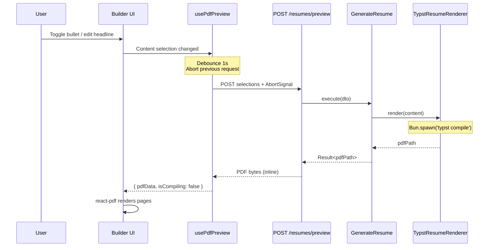
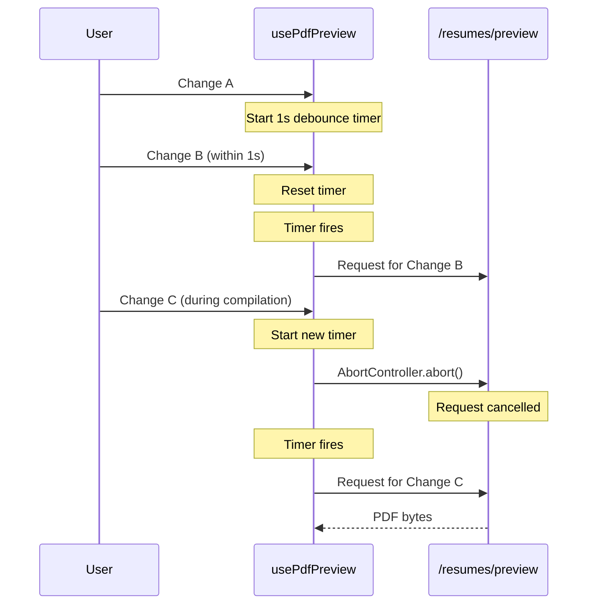

# Live PDF Preview in Resume Builder

## Context

The resume builder currently renders an HTML-based preview that approximates the final PDF output. Because the HTML preview uses browser rendering while the actual PDF is compiled by Typst with the `brilliant-cv` package, page boundaries cannot be accurately predicted in the preview. The user wants to see real page breaks as guides while editing.

The solution: compile the Typst resume on the fly and display the actual PDF alongside the interactive builder, giving pixel-perfect page boundaries.

## Design

### Layout

Two-column split in the builder page:

```
┌─────────────────────────────────────────────────────┐
│  Resume Builder                                      │
│  [Nerd] [Creative] [+]              [Generate PDF ↓] │
├──────────────────────┬──────────────────────────────┤
│  Interactive Preview │         PDF Preview          │
│  (existing HTML)     │     ┌──────────────────┐     │
│                      │     │   Page 1          │     │
│  ┌ Personal Info ──┐ │     │                   │     │
│  │ Name, contact   │ │     │   (actual Typst   │     │
│  └─────────────────┘ │     │    output)        │     │
│                      │     │                   │     │
│  ┌ Headline ───────┐ │     └──────────────────┘     │
│  │ Editable text   │ │     ┌──────────────────┐     │
│  └─────────────────┘ │     │   Page 2          │     │
│                      │     │                   │     │
│  ┌ Experience ─────┐ │     │                   │     │
│  │ Toggle bullets  │ │     └──────────────────┘     │
│  │ Click to edit   │ │                              │
│  └─────────────────┘ │      ◌ Compiling...          │
│                      │                              │
│  ┌ Education ──────┐ │                              │
│  │ Toggle entries  │ │                              │
│  └─────────────────┘ │                              │
└──────────────────────┴──────────────────────────────┘
```

- **Left column**: The existing `ResumePreview` component — unchanged. All toggles, inline editing, hover effects remain.
- **Right column**: New `PdfPreviewPanel` — renders the compiled PDF pages with `react-pdf`. Grey background, subtle drop shadows on pages to clearly show page boundaries.

### Data Flow



### Cancellation Flow



## Implementation

### 1. Async Typst Compilation

**File**: `infrastructure/src/services/TypstResumeRenderer.ts`

Replace `execSync` with `Bun.spawn` to unblock the event loop during compilation. The method signature already returns `Promise<string>`, so no interface change is needed.

```typescript
// Before
execSync(`typst compile cv.typ "${pdfPath}"`, { cwd: TYPST_DIR, stdio: 'pipe' });

// After
const proc = Bun.spawn(['typst', 'compile', 'cv.typ', pdfPath], {
  cwd: TYPST_DIR,
  stdio: ['pipe', 'pipe', 'pipe'],
});
const exitCode = await proc.exited;
if (exitCode !== 0) {
  const stderr = await new Response(proc.stderr).text();
  throw new Error(`Typst compilation failed: ${stderr}`);
}
```

### 2. Preview API Endpoint

**New file**: `api/src/routes/PreviewResumeRoute.ts`

Same request body schema as `GenerateResumeRoute`. Same use case. Only difference: returns PDF bytes with `Content-Disposition: inline` instead of `attachment`.

- Reuses the existing `GenerateResume` use case and `DI.Resume.GenerateResume` token
- Returns `application/pdf` with inline disposition
- Wire into Elysia app in `api/src/index.ts`

### 3. `usePdfPreview` Hook

**New file**: `web/src/hooks/use-pdf-preview.ts`

Inputs: headline text, content selection (experience selections, education IDs, skill category/item IDs)

Behavior:
- Serializes inputs to a stable string for change detection
- Debounces changes by 1 second (`setTimeout` + cleanup in `useEffect`)
- Manages an `AbortController` ref — aborts previous request before starting new one
- Calls `fetch('/api/resumes/preview', { method: 'POST', body, signal })`
- Converts response to `Uint8Array` via `response.arrayBuffer()`
- Returns `{ pdfData: Uint8Array | null, isCompiling: boolean, error: string | null, pageCount: number }`
- Triggers initial compilation on mount
- Skips compilation when content selection is empty (no experiences, no education)

### 4. `PdfPreviewPanel` Component

**New file**: `web/src/components/resume/builder/PdfPreviewPanel.tsx`

Uses `react-pdf` (`Document` + `Page` components) to render PDF pages as canvases.

Features:
- Renders all pages vertically in a scrollable container
- Grey background (`bg-muted/30`) with subtle drop shadows on each page
- Semi-transparent loading overlay during compilation (previous PDF stays visible underneath)
- Preserves scroll position across re-renders via `scrollTop` ref
- Page count indicator (e.g., "1 page" / "2 pages") in the panel header
- Empty state: "Edit your resume to see a preview" placeholder

### 5. Builder Page Layout Change

**File**: `web/src/routes/resume/builder.tsx`

Change the document area from single-column to two-column grid:

```
grid grid-cols-2 gap-0
```

- Left column: existing `ResumePreview` in a scrollable container
- Right column: `PdfPreviewPanel` in a scrollable container with sticky behavior
- Both columns fill the available viewport height

### 6. Lazy-Load react-pdf

Wrap `PdfPreviewPanel` in `React.lazy()` + `Suspense` so the pdfjs worker (~500KB) is only loaded on the builder page, not in the initial bundle.

### 7. Download from Preview

Add a download button on the `PdfPreviewPanel` header that uses the already-compiled `pdfData` bytes — no second compilation needed. This supplements the existing "Generate PDF" button.

## Dependencies

| Package | Purpose | Size Impact |
|---------|---------|-------------|
| `react-pdf` | Render PDF pages as canvas elements | ~500KB (pdfjs worker, lazy-loaded) |

## Files Changed

| File | Change |
|------|--------|
| `infrastructure/src/services/TypstResumeRenderer.ts` | `execSync` → `Bun.spawn` |
| `api/src/routes/PreviewResumeRoute.ts` | New — POST /resumes/preview |
| `api/src/index.ts` | Wire PreviewResumeRoute |
| `web/package.json` | Add `react-pdf` |
| `web/src/hooks/use-pdf-preview.ts` | New — debounced PDF preview hook |
| `web/src/components/resume/builder/PdfPreviewPanel.tsx` | New — PDF rendering panel |
| `web/src/routes/resume/builder.tsx` | Two-column layout + integrate PdfPreviewPanel |

## Edge Cases

- **First load**: Trigger initial compilation when builder mounts with current archetype selections
- **Empty selection**: Show placeholder instead of compiling an empty resume
- **Compilation error**: Show error banner with Typst error message in the preview panel
- **Rapid toggling**: AbortController cancels stale requests; only the latest selection compiles
- **No Typst binary**: Graceful fallback — show error in panel, interactive preview still works

## Verification

1. Start dev servers (`bun run dev`)
2. Navigate to `/resume/builder`
3. Verify two-column layout: interactive preview left, PDF preview right
4. Toggle a bullet → PDF should recompile after ~1s and show updated output
5. Rapidly toggle multiple bullets → only final state should compile
6. Verify page boundaries are visible (page shadows/gaps in multi-page resumes)
7. Click download button on PDF panel → should download without recompilation
8. Run `bun run --cwd web typecheck` — no type errors
9. Run `bun run check` — no lint/format issues
