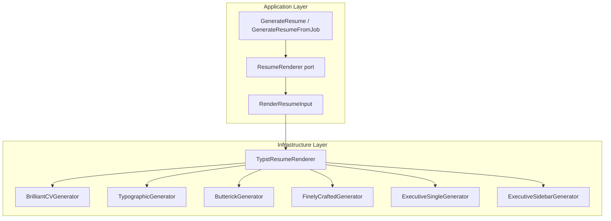

# Resume Template System Design

## Context

TailoredIn currently has a single Typst resume template (brilliant-cv v3.3.0). The system's archetype mechanism controls **what content** appears but not **how it looks**. As we target Head of Engineering and VP of Engineering roles, we need templates with executive-appropriate aesthetics — understated elegance, strategic narrative sections, and typography that signals seniority.

After evaluating all 59 resume packages on the Typst registry and compiling the top candidates, no community package fully meets the executive resume need. The decision is to support **all viable options** as selectable templates, independent from archetype selection.

## Design

### Template Registry

Introduce a `TemplateKey` enum in the domain layer, parallel to `ArchetypeKey`:

```typescript
export enum TemplateKey {
  BRILLIANT_CV = 'brilliant_cv',           // Current template (brilliant-cv v3.3.0)
  TYPOGRAPHIC = 'typographic',             // typographic-resume v0.1.0 (two-column sidebar)
  BUTTERICK = 'butterick',                 // butterick-resume v0.1.0 (Butterick typography)
  FINELY_CRAFTED = 'finely_crafted',       // finely-crafted-cv v0.2.0 (company/role hierarchy)
  EXECUTIVE_SINGLE = 'executive_single',   // Custom single-column executive template
  EXECUTIVE_SIDEBAR = 'executive_sidebar', // Custom two-column sidebar executive template
}
```

Template selection is **independent from archetype** — any archetype can use any template. The user picks both when generating a resume.

### Template Descriptions

| Template | Style | Best For | Layout |
|---|---|---|---|
| `brilliant_cv` | Clean ATS-friendly, bullet-oriented | IC / Staff / Lead roles | Single-column |
| `typographic` | Three-font serif/sans hierarchy, charcoal gray | Senior leadership, narrative-heavy | Two-column sidebar |
| `butterick` | Butterick's *Practical Typography*, zero decoration | Executive with sparse content | Single-column, wide margins |
| `finely_crafted` | Company-first hierarchy, roman numeral sections | Multi-promotion career paths | Single-column |
| `executive_single` | Custom: Butterick-inspired typography, controlled spacing | Head/VP roles, ATS-compatible | Single-column |
| `executive_sidebar` | Custom: sidebar competencies + main experience | Head/VP roles, distinctive | Two-column sidebar |

### Architecture Changes



#### 1. Domain: `TemplateKey` enum

**File:** `domain/src/value-objects/Template.ts`

New enum with 6 template keys. Exported via domain barrel.

#### 2. Application: Extend `RenderResumeInput`

**File:** `application/src/ports/ResumeRenderer.ts`

Add `templateKey: TemplateKey` to `RenderResumeInput`. Default to `BRILLIANT_CV` for backward compatibility.

**File:** `application/src/dtos/GenerateResumeDto.ts` and `GenerateResumeFromJobDto.ts`

Add optional `templateKey?: TemplateKey` field to both DTOs.

**File:** `application/src/use-cases/GenerateResume.ts` and `GenerateResumeFromJob.ts`

Pass `templateKey` through to `resumeRenderer.render()`.

#### 3. Infrastructure: Template Generator Interface + Dispatch

**File:** `infrastructure/src/resume/TemplateGenerator.ts`

```typescript
export interface TemplateGenerator {
  generate(content: ResumeContentDto, workDir: string): Promise<void>;
}
```

Each template gets its own generator class implementing this interface. The generators are responsible for:
- Writing all necessary Typst files (`.typ`, `.toml`, etc.) to the work directory
- The main entry point file must be named `cv.typ`

**File:** `infrastructure/src/services/TypstResumeRenderer.ts`

The renderer dispatches to the correct generator based on `templateKey`:

```typescript
private readonly generators: Record<TemplateKey, TemplateGenerator> = {
  [TemplateKey.BRILLIANT_CV]: new BrilliantCVGenerator(),
  [TemplateKey.TYPOGRAPHIC]: new TypographicGenerator(),
  [TemplateKey.BUTTERICK]: new ButterickGenerator(),
  [TemplateKey.FINELY_CRAFTED]: new FinelyCraftedGenerator(),
  [TemplateKey.EXECUTIVE_SINGLE]: new ExecutiveSingleGenerator(),
  [TemplateKey.EXECUTIVE_SIDEBAR]: new ExecutiveSidebarGenerator(),
};
```

Each generator maps `ResumeContentDto` to the target package's expected format.

#### 4. Infrastructure: Template Generators

Each generator class lives in its own file under `infrastructure/src/resume/generators/`:

```
infrastructure/src/resume/generators/
  BrilliantCVGenerator.ts      ← extracted from current TypstFileGenerator
  TypographicGenerator.ts      ← maps to @preview/typographic-resume:0.1.0
  ButterickGenerator.ts        ← maps to @preview/butterick-resume:0.1.0
  FinelyCraftedGenerator.ts    ← maps to @preview/finely-crafted-cv:0.2.0
  ExecutiveSingleGenerator.ts  ← custom Typst template (no package dependency)
  ExecutiveSidebarGenerator.ts ← custom Typst template (no package dependency)
```

**BrilliantCVGenerator:** Extracted from existing `TypstFileGenerator` — identical behavior, just moved behind the interface.

**TypographicGenerator:** Maps `ResumeContentDto` to:
- `resume.with(first-name, last-name, profession, bio, aside, ...)` show rule
- `work-entry(timeframe, title, organization, location, body)` for experience
- Sidebar: contact-entry, competencies as bullet list, education-entry
- Bio from `header_quote` (or a new summary field)

**ButterickGenerator:** Maps to:
- `template` show rule + `introduction(name, details)`
- `two-grid(left, right)` for company/date headers
- Freeform sections for Executive Summary, Strategic Competencies
- Override page margins to be less extreme than default

**FinelyCraftedGenerator:** Maps to:
- `resume.with(name, tagline, email, linkedin-username)` show rule
- `company-heading(name, start, end)` + `job-heading(title, start, end)` for grouped roles
- `school-heading` + `degree-heading` for education

**ExecutiveSingleGenerator:** Custom Typst with:
- Butterick-inspired typography: small-caps letterspaced section headers, fine horizontal rules
- Configurable margins (default 1.2cm, not 1.5in)
- Sections: Executive Summary, Experience, Strategic Competencies, Education
- Serif headers (Source Serif 4) + sans body (Source Sans 3)
- Charcoal gray accent (#333333)
- Single-page optimized spacing

**ExecutiveSidebarGenerator:** Custom Typst with:
- Two-column layout: 30% sidebar + 70% main
- Sidebar: name, title, contact, competencies, education, languages
- Main: executive summary, experience (narrative paragraphs, not bullet-heavy)
- Same typography as ExecutiveSingle
- Subtle separator between columns

#### 5. Content Model Extension

The current `ResumeContentDto` is shaped for brilliant-cv. The other templates need slightly different data. Rather than changing the DTO (which would require changes across the content factory), each generator will **adapt** the existing DTO fields:

| DTO field | brilliant_cv | typographic | butterick | finely_crafted | executive_* |
|---|---|---|---|---|---|
| `personal.header_quote` | Subtitle | Bio/summary | Executive Summary | Tagline | Executive Summary |
| `experience[].summary` | Italic intro | Narrative body | Not used (bullets only) | Narrative body | Narrative body |
| `experience[].highlights` | Bullet list | Appended to body | Bullet list | Bullet list | Bullet list |
| `skills[].type` | Category label | Competency domain | Category label | Column header | Competency domain |
| `skills[].info` | Tech items `#h-bar()` joined | Bullet items | `bold — items` | Table row | Bullet items |

No DTO changes needed. Generators interpret existing fields according to their template's conventions.

#### 6. API + Web Changes

**API route:** The existing `PUT /jobs/:id/generate-resume` and resume builder endpoints gain an optional `templateKey` query/body parameter. Defaults to `brilliant_cv`.

**Web UI:** The resume builder sidebar gets a template selector dropdown alongside the existing archetype selector.

### Custom Template Design Details

#### Executive Single-Column

```
┌────────────────────────────────────────────────┐
│           SYLVAIN ESTEVEZ                       │
│  New York, NY · email · LinkedIn · GitHub       │
│  ─────────────────────────────────────────────  │
│  EXECUTIVE SUMMARY                              │
│  Engineering executive with 15+ years...        │
│  ─────────────────────────────────────────────  │
│  EXPERIENCE                                     │
│  Company Name                     2021–Present   │
│  Vice President of Engineering                   │
│  · Bullet with scope/impact                     │
│  · Bullet with scope/impact                     │
│                                                  │
│  Company Name                     2017–2021      │
│  Director of Engineering                         │
│  · Bullet with scope/impact                     │
│  ─────────────────────────────────────────────  │
│  STRATEGIC COMPETENCIES                          │
│  Leadership — items  |  Strategy — items         │
│  Operations — items  |  Talent — items           │
│  ─────────────────────────────────────────────  │
│  EDUCATION                                       │
│  University                            Year      │
└────────────────────────────────────────────────┘
```

Typography:
- Name: 24pt, small-caps, letterspaced (0.15em), Source Serif 4
- Section headers: 9pt, small-caps, letterspaced (0.2em), charcoal gray, fine rule below
- Body: 10pt, Source Sans 3
- Company names: 11pt, bold
- Titles: 10pt, italic
- Margins: 1.2cm all sides
- Line spacing: 0.7em

#### Executive Two-Column Sidebar

```
┌──────────────┬─────────────────────────────────┐
│  SYLVAIN     │  EXPERIENCE                      │
│  ESTEVEZ     │                                   │
│  VP of Eng   │  Company Name          2021–Now   │
│              │  Vice President of Engineering    │
│  ──────────  │  Led 120-person org across...     │
│  CONTACT     │  · Key achievement                │
│  Email       │  · Key achievement                │
│  LinkedIn    │                                   │
│  Location    │  Company Name          2017–2021  │
│              │  Director of Engineering          │
│  ──────────  │  Built platform division...       │
│  COMPETENCIES│  · Key achievement                │
│  · Org design│                                   │
│  · Strategy  │  Company Name          2013–2017  │
│  · M&A       │  Senior Engineering Manager       │
│  · Platform  │  Managed three teams...           │
│              │  · Key achievement                │
│  ──────────  │                                   │
│  EDUCATION   │                                   │
│  Columbia    │                                   │
│  M.S. CS     │                                   │
└──────────────┴─────────────────────────────────┘
```

Typography:
- Same font choices as single-column variant
- Sidebar background: white (no color block — understated)
- Subtle vertical rule or whitespace gutter between columns
- Sidebar text: 9pt
- Main column text: 10pt

### File Changes Summary

| File | Change |
|---|---|
| `domain/src/value-objects/Template.ts` | New: `TemplateKey` enum |
| `domain/src/value-objects/index.ts` | Export `TemplateKey` |
| `application/src/ports/ResumeRenderer.ts` | Add `templateKey` to `RenderResumeInput` |
| `application/src/dtos/GenerateResumeDto.ts` | Add optional `templateKey` |
| `application/src/dtos/GenerateResumeFromJobDto.ts` | Add optional `templateKey` |
| `application/src/use-cases/GenerateResume.ts` | Pass `templateKey` through |
| `application/src/use-cases/GenerateResumeFromJob.ts` | Pass `templateKey` through |
| `infrastructure/src/resume/TemplateGenerator.ts` | New: interface |
| `infrastructure/src/resume/generators/BrilliantCVGenerator.ts` | Extracted from `TypstFileGenerator` |
| `infrastructure/src/resume/generators/TypographicGenerator.ts` | New: maps to typographic-resume |
| `infrastructure/src/resume/generators/ButterickGenerator.ts` | New: maps to butterick-resume |
| `infrastructure/src/resume/generators/FinelyCraftedGenerator.ts` | New: maps to finely-crafted-cv |
| `infrastructure/src/resume/generators/ExecutiveSingleGenerator.ts` | New: custom template |
| `infrastructure/src/resume/generators/ExecutiveSidebarGenerator.ts` | New: custom template |
| `infrastructure/src/services/TypstResumeRenderer.ts` | Dispatch by `templateKey` |
| `infrastructure/src/resume/TypstFileGenerator.ts` | Kept as delegate (or removed if fully extracted) |
| `api/src/routes/jobs.ts` | Accept `templateKey` parameter |
| `web/src/...` | Template selector in resume builder |

### Verification

1. **Unit tests:** Each generator has a test that verifies it produces valid Typst files for a sample `ResumeContentDto`
2. **Compilation tests:** Each template compiles to a PDF without Typst errors
3. **Visual review:** Generate all 6 templates with the same content and visually compare the PDFs
4. **Backward compatibility:** Omitting `templateKey` defaults to `brilliant_cv` — existing behavior unchanged
5. **Web UI:** Template selector appears in resume builder, generates correct template on selection
