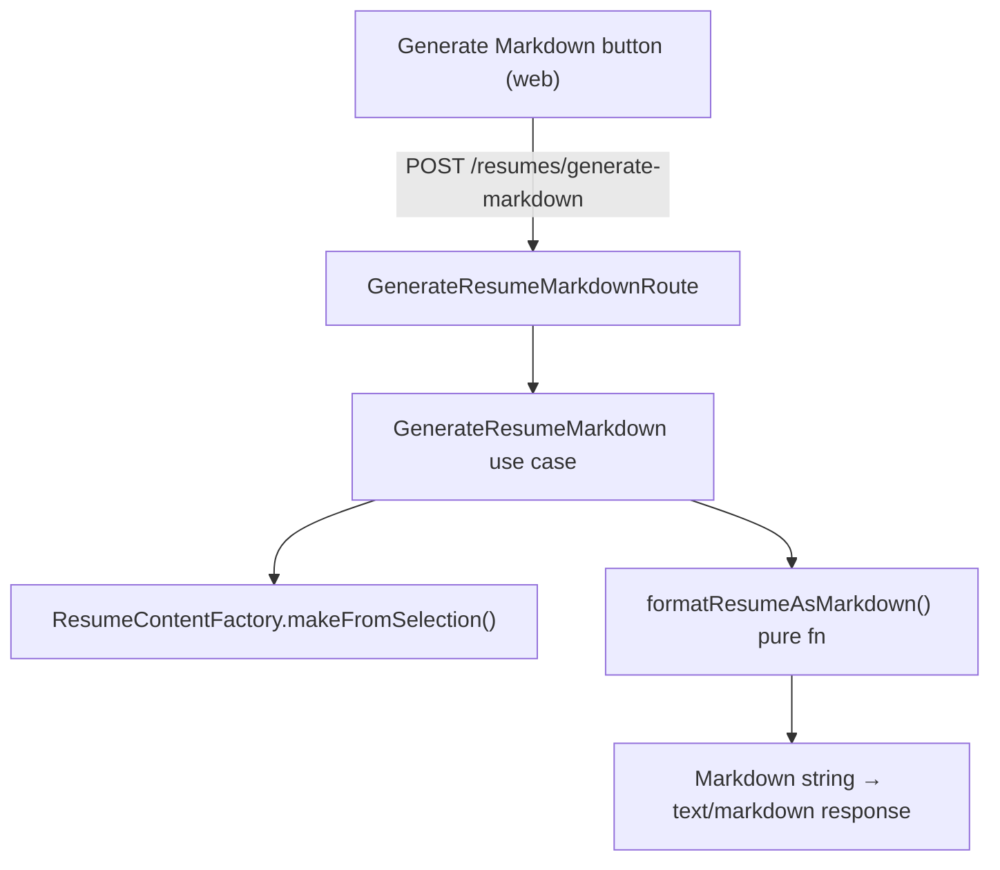

# Generate Markdown Resume

## Context

The resume builder currently generates PDF output via Typst compilation. Users also need a markdown version of their resume for copy-pasting into job application forms, editing in text editors, and ATS-friendly plain-text submission.

## Architecture

Markdown formatting is a pure string transformation of `ResumeContentDto` — no external tools, no file system, no processes. It lives as a plain function in the application layer, not behind a port.



## Components

### 1. `formatResumeAsMarkdown` (application/src/services/formatResumeAsMarkdown.ts)

Pure function: `(content: ResumeContentDto) => string`

Output format:

```markdown
# First Last

> Header quote

Location · email@example.com · (555) 123-4567 · [GitHub](https://github.com/user) · [LinkedIn](https://linkedin.com/in/user)

---

## Experience

### Job Title — Company
*Jan 2024 – Present · San Francisco, CA*

Summary text

- Bullet highlight 1.
- Bullet highlight 2.

### Another Title — Another Company
*Mar 2021 – Dec 2023 · Remote*

- Highlight here.

---

## Skills

**Languages:** TypeScript, Python, Go
**Frameworks:** React, Node.js, Django

---

## Education

### M.S. Computer Science — Stanford University
*2019 – 2021 · Stanford, CA*

### B.S. Computer Science — UC Berkeley
*2015 – 2019 · Berkeley, CA*
```

Design decisions:
- `·` (middle dot) separators in the contact line for readability
- `---` horizontal rules between major sections
- Summary text rendered as a plain paragraph (no bullet) when present
- Highlights as unordered list items
- Skills use bold category name followed by comma-separated items (the `info` field from `ResumeSkillDto` already contains joined items)
- No keywords section — keywords are for PDF layout, not markdown

### 2. `GenerateResumeMarkdown` use case (application/src/use-cases/GenerateResumeMarkdown.ts)

Constructor dependencies (subset of `GenerateResume`):
- `ProfileRepository`
- `ResumeContentFactory`

No `ResumeRenderer` needed.

```typescript
class GenerateResumeMarkdown {
  async execute(input: GenerateResumeDto): Promise<Result<{ markdown: string }, Error>>
}
```

Flow:
1. `profileRepository.findSingle()` → get profile ID
2. `resumeContentFactory.makeFromSelection({ profileId, ...input })` → `ResumeContentDto`
3. `formatResumeAsMarkdown(content)` → markdown string
4. Return `ok({ markdown })`

### 3. API Route (api/src/routes/GenerateResumeMarkdownRoute.ts)

- Endpoint: `POST /resumes/generate-markdown`
- Request body: identical to `POST /resumes/generate` (same Elysia schema)
- Response: `text/markdown` body with `Content-Disposition: attachment; filename="resume.md"`
- Error shape: same `{ error: { code, message } }` as other routes

### 4. DI Wiring

- New token: `DI.Resume.GenerateResumeMarkdown` in `infrastructure/src/DI.ts`
- Container binding in `api/src/container.ts`: `new GenerateResumeMarkdown(profileRepo, contentFactory)`
- Route registration in `api/src/index.ts`

### 5. Web UI (VersionTabs + builder page)

**VersionTabs changes:**
- New prop: `onGenerateMarkdown: () => void`
- New outlined button with `FileText` icon, label "Generate Markdown", placed left of the "Generate PDF" button
- Uses a neutral style (border + text, no filled background) to visually distinguish from the primary "Generate PDF" action
- Shares the `generating` / disabled state with PDF generation

**Builder page changes:**
- New `generatingMarkdown` state (independent from PDF `generating`)
- `handleGenerateMarkdown` function: same body construction as `handleGenerate`, POSTs to `/api/resumes/generate-markdown`, downloads response as `.md` file
- Both buttons can be disabled independently

## Files to Create

| File | Layer |
|------|-------|
| `application/src/services/formatResumeAsMarkdown.ts` | application |
| `application/src/use-cases/GenerateResumeMarkdown.ts` | application |
| `api/src/routes/GenerateResumeMarkdownRoute.ts` | api |

## Files to Modify

| File | Change |
|------|--------|
| `application/src/index.ts` | Export `GenerateResumeMarkdown` and `formatResumeAsMarkdown` |
| `infrastructure/src/DI.ts` | Add `DI.Resume.GenerateResumeMarkdown` token |
| `api/src/container.ts` | Bind `GenerateResumeMarkdown` use case |
| `api/src/index.ts` | Register `GenerateResumeMarkdownRoute` |
| `web/src/components/resume/builder/VersionTabs.tsx` | Add "Generate Markdown" button + prop |
| `web/src/routes/resume/builder.tsx` | Add `handleGenerateMarkdown` + state |

## Verification

1. Start dev servers: `bun run dev`
2. Open resume builder at `/resume/builder`
3. Click "Generate Markdown" — should download a `.md` file
4. Verify markdown content matches the PDF content (same experiences, bullets, skills, education)
5. Verify markdown renders correctly in a markdown viewer
6. Run `bun run check` — no lint/format errors
7. Run `bun run --cwd application typecheck` and `bun run --cwd api typecheck` and `bun run --cwd web typecheck`
