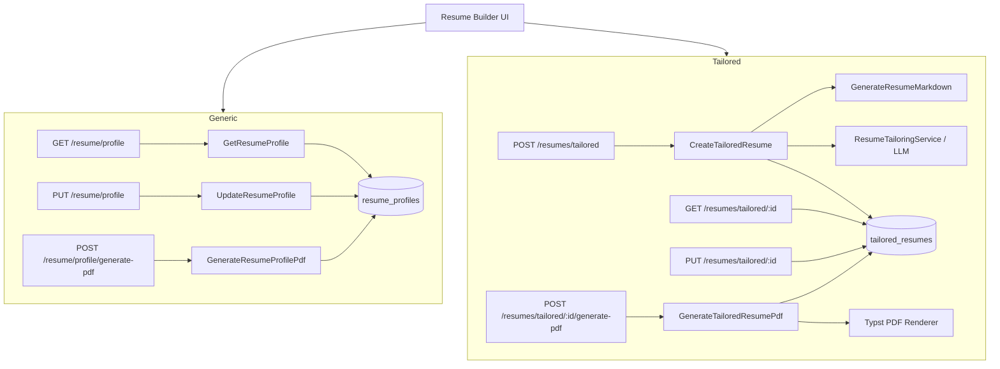

# Resume Archetype Redesign — Design Spec

**Date:** 2026-04-03

## Context

The current `Archetype` system was designed to let a single user maintain multiple named "personas" (Nerd, Lead IC, IC, Hands-On Manager, Leader Manager), each manually pre-selecting which experience bullets, education, and skills appear in the generated resume. Archetypes also carry `TagProfile` weights used to score job compatibility.

This model has two problems:
1. There is no clean concept of a **generic resume** — a single curated "best of" version to distribute when no job description is available.
2. There is no **job-description-driven tailoring** — the LLM currently receives keywords but not a full JD, and bullets are pre-selected by archetype rather than ranked by relevance to a specific role.

This redesign removes archetypes entirely and replaces them with two distinct concepts that map cleanly to the user's two real needs.

## What Gets Removed

- `Archetype` domain entity, `ArchetypeId`, `ArchetypeKey` enum
- `TagProfile` value object
- `ArchetypeTagWeight` ORM entity and `archetype_tag_weights` DB table
- `archetypes` DB table
- Use cases: `SetArchetypeContent`, `SetArchetypeTagProfile`, `GetArchetypes`, `GenerateResumeFromJob`
- API routes: all `/archetypes/*`
- CLI `--archetype` flag
- DB seeds: all five named archetype seed records

## What Gets Preserved

- `ContentSelection` value object (unchanged) — still drives PDF rendering
- `BulletVariant` concept — unchanged
- Typst PDF rendering pipeline — unchanged
- `GenerateResumeMarkdown` use case — repurposed as internal detail of `CreateTailoredResume`

## Domain Model

### `ResumeProfile` — new aggregate

One per user. Manually curated. Identified by `profileId` (no separate ID — one-to-one with Profile).

```
ResumeProfile
  profileId: string          ← FK to Profile (PK, one-to-one)
  contentSelection: ContentSelection
  headlineText: string
  updatedAt: Date
```

DB table: `resume_profiles` (`profile_id` PK, `content_selection` JSONB, `headline_text`, `updated_at`)

### `TailoredResume` — new aggregate

Created from a JD. Goes through draft → finalized lifecycle.

```
TailoredResume
  id: TailoredResumeId       ← UUID
  profileId: string
  jdContent: string          ← raw markdown (pasted or uploaded)
  llmProposals: LlmProposal  ← stored as JSONB, drives builder display
  contentSelection: ContentSelection  ← user-adjusted in builder
  headlineText: string       ← user-picked from proposals
  status: 'draft' | 'finalized'
  pdfPath: string | null
  createdAt: Date
  updatedAt: Date
```

DB table: `tailored_resumes` (`id` UUID PK, `profile_id`, `jd_content` TEXT, `llm_proposals` JSONB, `content_selection` JSONB, `headline_text`, `status`, `pdf_path`, `created_at`, `updated_at`)

### `LlmProposal` — value object (JSONB)

```typescript
interface LlmProposal {
  headlineOptions: string[]          // 1–3 proposals
  rankedExperiences: Array<{
    experienceId: string
    rankedBulletIds: string[]        // ordered most → least impactful
  }>
  rankedSkillIds: string[]
  assessment: string                 // strengths/weaknesses narrative
}
```

## Application Layer

### New ports

- `ResumeProfileRepository`: `findByProfileId(profileId): ResumeProfile | null`, `save(profile): void`
- `TailoredResumeRepository`: `findById(id)`, `findByProfileId(profileId)`, `save(resume)`
- `ResumeTailoringService`: `tailorFromJd(jdContent: string, rawMarkdown: string): LlmProposal`

The `ResumeTailoringService` sends the LLM this prompt structure:
- System: instructions to output structured JSON matching `LlmProposal`
- User: JD markdown + raw resume markdown (all bullets, generated via existing `GenerateResumeMarkdown` logic)
- Output: `LlmProposal` parsed from structured JSON response

### New use cases

| Use Case | Inputs | Description |
|---|---|---|
| `GetResumeProfile` | `profileId` | Returns `ResumeProfile` (or empty default if not set) |
| `UpdateResumeProfile` | `profileId`, `contentSelection`, `headlineText` | Upserts the generic resume |
| `GenerateResumeProfilePdf` | `profileId` | Renders PDF from `ResumeProfile.contentSelection` |
| `CreateTailoredResume` | `profileId`, `jdContent` | Generates raw markdown → calls LLM → creates draft `TailoredResume` with proposals |
| `GetTailoredResume` | `resumeId` | Returns resume + proposals for builder |
| `ListTailoredResumes` | `profileId` | Returns all tailored resumes (for history) |
| `UpdateTailoredResume` | `resumeId`, `contentSelection`, `headlineText` | Saves builder adjustments |
| `GenerateTailoredResumePdf` | `resumeId` | Renders PDF, sets `pdfPath`, sets `status=finalized` |

## API Routes

```
GET    /resume/profile                    → GetResumeProfile
PUT    /resume/profile                    → UpdateResumeProfile
POST   /resume/profile/generate-pdf       → GenerateResumeProfilePdf

GET    /resumes/tailored                  → ListTailoredResumes
POST   /resumes/tailored                  → CreateTailoredResume  { jdContent: string }
GET    /resumes/tailored/:id              → GetTailoredResume
PUT    /resumes/tailored/:id              → UpdateTailoredResume
POST   /resumes/tailored/:id/generate-pdf → GenerateTailoredResumePdf
```

Removed: all `/archetypes/*` routes, `/resumes/generate-markdown` (internal only).

## Web UI (Resume Builder)

**Generic Resume flow:**
1. Builder opens with `ResumeProfile` content loaded (GET `/resume/profile`)
2. User toggles bullets/skills, edits headline
3. Save → PUT `/resume/profile`
4. Generate PDF → POST `/resume/profile/generate-pdf`

**Tailored Resume flow:**
1. User pastes or uploads JD markdown → POST `/resumes/tailored`
2. Builder loads with proposals (GET `/resumes/tailored/:id`):
   - Headline picker: radio among 1–3 options, editable
   - Bullets shown in ranked order per experience, top N pre-selected, toggleable
   - Skills in ranked order, pre-selected
   - Assessment displayed as read-only sidebar panel
3. User adjusts → PUT `/resumes/tailored/:id` (auto-save or explicit)
4. PDF preview → POST `/resumes/tailored/:id/generate-pdf`

Both `llmProposals` (LLM's ranking) and `contentSelection` (user's final picks) are stored so the builder can distinguish "suggested" from "your selection."

## Architecture Diagram


