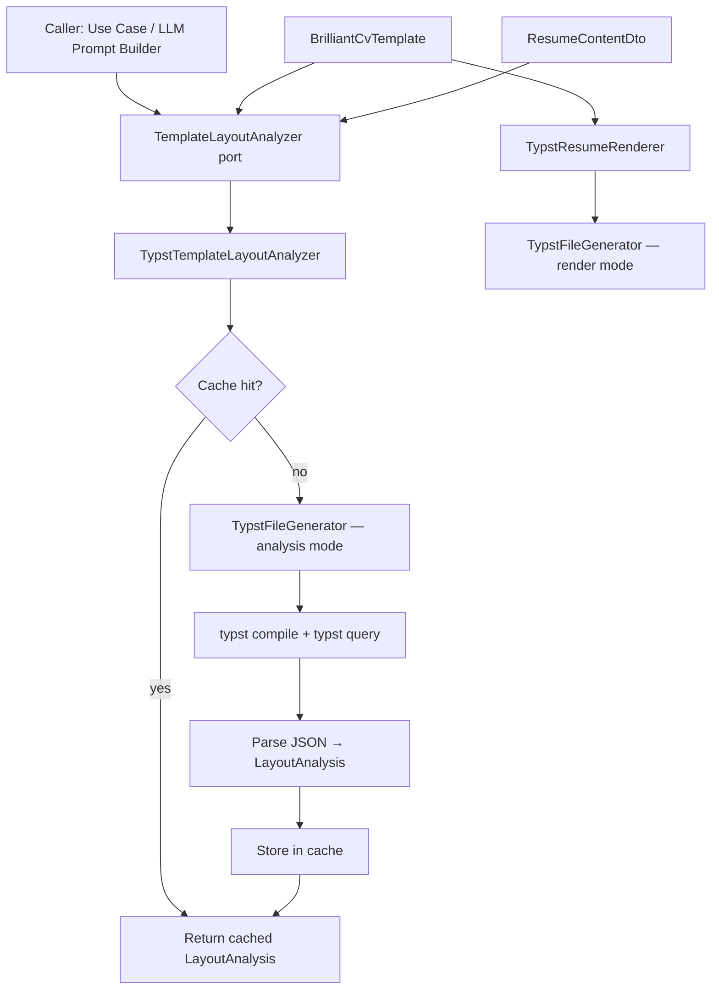

# Template Layout Analyzer — Design Spec

**Date:** 2026-04-03  
**Status:** Approved

## Context

The resume renderer currently hardcodes all layout constants inside `TypstFileGenerator` and has no concept of which template it is using. There is no mechanism to know whether a given `ResumeContentDto` will fit within a page budget before rendering. As multi-template support is coming, templates need to become first-class objects the whole stack can reference.

This service provides a **constraint oracle**: given a template and content, it returns a precise per-block layout analysis (line counts, page numbers) that upstream layers (LLM prompt construction, content selection, use cases) can use to make trimming and ranking decisions. The service is **read-only** — it does not trim or modify content.

## Architecture Overview



## Domain Layer: `ResumeTemplate`

New value object in `domain/src/value-objects/ResumeTemplate.ts`:

```typescript
type ResumeTemplate = {
  id: string;                    // e.g. "brilliant-cv"
  pageSize: "us-letter" | "a4";
  margins: { top: number; bottom: number; left: number; right: number }; // cm
  bodyFontSizePt: number;
  lineHeightEm: number;
  headerFontSizePt: number;
  sectionSpacingPt: number;
  entrySpacingPt: number;
};
```

## Domain Layer: `LayoutAnalysis`

New type in `domain/src/value-objects/LayoutAnalysis.ts`:

```typescript
type BlockLayout = {
  lineCount: number;
  pageNumbers: number[];
};

type LayoutAnalysis = {
  totalPages: number;
  header: {
    name: BlockLayout;
    headline: BlockLayout;
    infoLine: BlockLayout;
  };
  experiences: Array<{
    company: BlockLayout;
    roles: Array<{
      title: BlockLayout;
      bullets: BlockLayout[];
    }>;
  }>;
  education: BlockLayout[];
  skills: BlockLayout[];
};
```

Indices in `experiences`, `education`, and `skills` map 1:1 to the corresponding arrays in `ResumeContentDto`, so callers can correlate every analysis node back to the content item that produced it.

## Application Layer: Port

New port at `application/src/ports/TemplateLayoutAnalyzer.ts`:

```typescript
export interface TemplateLayoutAnalyzer {
  analyze(template: ResumeTemplate, content: ResumeContentDto): Promise<LayoutAnalysis>;
}
```

## Infrastructure Layer: Implementation

### `TypstTemplateLayoutAnalyzer`

Location: `infrastructure/src/services/TypstTemplateLayoutAnalyzer.ts`

**Technique:** Typst's introspection API. The `TypstFileGenerator` in analysis mode injects `#metadata(here()) <label>` markers at the start and end of every block. `here()` returns a `Location` (page number + y-position). After compile, `typst query` extracts all markers as JSON:

```bash
typst query cv.typ "<layout-marker>" --field value
```

From paired start/end markers, the implementation computes:
- `pageNumbers` — unique pages spanned by the block
- `lineCount` — `(endY - startY) / (bodyFontSizePt × lineHeightEm × pxPerPt)`

The labelling scheme encodes block identity: `exp-0-role-1-bullet-2-start` / `exp-0-role-1-bullet-2-end`.

**Caching:**

An in-memory LRU cache (max 50 entries) is keyed on `{templateId}:{contentHash}` where `contentHash` is a stable hash of the serialized `ResumeContentDto`. The analyzer is bound as a DI singleton, so the cache is warm for the lifetime of the process. No persistence is required.

### `TypstFileGenerator` — analysis mode

The existing generator gets an opt-in `mode: "render" | "analysis"` flag. In analysis mode, it emits `#metadata(here()) <label>` markers around every block. The render path is unchanged.

### `BrilliantCvTemplate`

Location: `infrastructure/src/templates/BrilliantCvTemplate.ts`

Concrete `ResumeTemplate` instance carrying the layout constants currently hardcoded in `TypstFileGenerator`. This is the single source of truth for brilliant-cv layout parameters.

### `TemplateRegistry`

Location: `infrastructure/src/templates/TemplateRegistry.ts`

Simple `Map<string, ResumeTemplate>` for future multi-template lookup by ID. Seeded with `BrilliantCvTemplate` at startup.

## Renderer Refactor

`RenderResumeInput` gains a `template: ResumeTemplate` field. `TypstResumeRenderer` and `TypstFileGenerator` consume it instead of hardcoded constants. Callers always provide a template explicitly:

```typescript
const template = BrilliantCvTemplate;
const analysis = await layoutAnalyzer.analyze(template, content);
// upstream uses analysis to trim/rank content
const pdf = await renderer.render({ template, content, companyName });
```

## DI Wiring

- New token `TEMPLATE_LAYOUT_ANALYZER: InjectionToken<TemplateLayoutAnalyzer>` in `infrastructure/src/DI.ts`
- Bound in `api/src/container.ts` to `TypstTemplateLayoutAnalyzer`

## Testing

| Test | Type | Location | What it asserts |
|------|------|----------|-----------------|
| JSON → `LayoutAnalysis` parser | Unit | `infrastructure/test/` | Correct mapping from `typst query` output to nested result |
| Known fixture render | Integration | `infrastructure/test-integration/` | One-liner headline → `lineCount: 1`; known-long bullet → `lineCount: 2`; full resume → `totalPages: 1` |
| Cache behaviour | Integration | `infrastructure/test-integration/` | Two identical `analyze()` calls spawn Typst exactly once |

Unit tests for the parser use no Typst. Integration tests live in `infrastructure/test-integration/` (60s timeout, existing pattern) but need no database — they exercise the real Typst binary against fixture content.

## Key Files

| Path | Change |
|------|--------|
| `domain/src/value-objects/ResumeTemplate.ts` | New |
| `domain/src/value-objects/LayoutAnalysis.ts` | New |
| `application/src/ports/TemplateLayoutAnalyzer.ts` | New |
| `application/src/dtos/ResumeContentDto.ts` | No change |
| `infrastructure/src/templates/BrilliantCvTemplate.ts` | New |
| `infrastructure/src/templates/TemplateRegistry.ts` | New |
| `infrastructure/src/services/TypstTemplateLayoutAnalyzer.ts` | New |
| `infrastructure/src/resume/TypstFileGenerator.ts` | Add analysis mode + consume `ResumeTemplate` |
| `infrastructure/src/services/TypstResumeRenderer.ts` | Consume `ResumeTemplate` from input |
| `application/src/ports/ResumeRenderer.ts` | Add `template` field to `RenderResumeInput` |
| `infrastructure/src/DI.ts` | Add `TEMPLATE_LAYOUT_ANALYZER` token |
| `api/src/container.ts` | Bind `TypstTemplateLayoutAnalyzer` |
