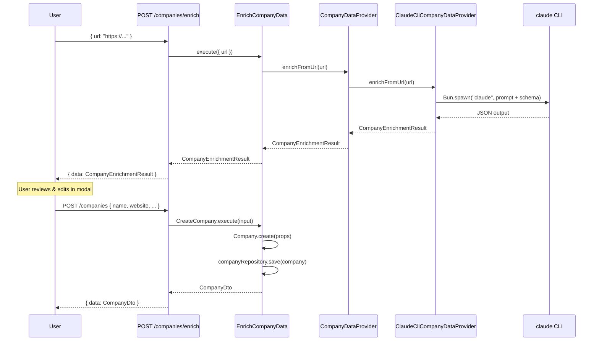

# Company Enrichment from URL — Design Spec

## Context

The `companies` table exists but is populated only via seed data. Users need a way to add companies by providing a URL (LinkedIn page or website). The backend enriches the data using an LLM (Claude CLI) and returns a preview. The user reviews/edits the data in a modal before saving. This spec covers the domain, application, infrastructure, and API layers — not the web UI.

## Architecture Overview



## 1. Port — CompanyDataProvider

**File:** `application/src/ports/CompanyDataProvider.ts`

```typescript
export type CompanyEnrichmentResult = {
  name: string | null;
  website: string | null;
  logoUrl: string | null;
  linkedinLink: string | null;
  businessType: BusinessType | null;
  industry: Industry | null;
  stage: CompanyStage | null;
};

export interface CompanyDataProvider {
  enrichFromUrl(url: string): Promise<CompanyEnrichmentResult>;
}
```

- All fields nullable — the LLM may not determine every field
- Uses domain enum types (`BusinessType`, `Industry`, `CompanyStage`) so the result is type-safe
- The port is in the application layer, keeping domain pure

## 2. Use Cases

### EnrichCompanyData

**File:** `application/src/use-cases/company/EnrichCompanyData.ts`

- **Input:** `{ url: string }`
- **Dependencies:** `CompanyDataProvider`
- **Logic:** Delegates to `companyDataProvider.enrichFromUrl(url)`, returns the result directly
- **Output:** `CompanyEnrichmentResult` (preview, not persisted)
- No domain entity involvement — this is purely a data lookup

### CreateCompany

**File:** `application/src/use-cases/company/CreateCompany.ts`

- **Input:** `CreateCompanyInput` — `name` required, all other fields (`website`, `logoUrl`, `linkedinLink`, `businessType`, `industry`, `stage`) nullable
- **Dependencies:** `CompanyRepository`
- **Logic:**
  1. Call `Company.create(props)` domain factory
  2. Call `companyRepository.save(company)`
  3. Map to `CompanyDto` and return
- **Output:** `CompanyDto`

## 3. Infrastructure Adapter — ClaudeCliCompanyDataProvider

**File:** `infrastructure/src/services/ClaudeCliCompanyDataProvider.ts`

- Implements `CompanyDataProvider`
- Uses `Bun.spawn()` to invoke `claude` CLI in non-interactive mode
- Passes a structured prompt with the URL and a JSON schema constraining the output
- The JSON schema includes the valid enum values for `businessType`, `industry`, and `stage`
- Parses stdout as JSON, maps to `CompanyEnrichmentResult`
- Returns nulls for fields the LLM couldn't determine

**Prompt structure (approximate):**
```
Given this URL: {url}
Look up or infer information about this company.
Return a JSON object matching the provided schema.
Only include fields you are confident about — use null for uncertain fields.
```

**JSON schema passed to CLI:**
```json
{
  "type": "object",
  "properties": {
    "name": { "type": ["string", "null"] },
    "website": { "type": ["string", "null"] },
    "logoUrl": { "type": ["string", "null"] },
    "linkedinLink": { "type": ["string", "null"] },
    "businessType": { "enum": ["B2B", "B2C", "B2B2C", "B2G", "D2C", "MARKETPLACE", "PLATFORM", null] },
    "industry": { "enum": ["AUTOMOBILE", "SECURITY", ..., null] },
    "stage": { "enum": ["SEED", "SERIES_A", ..., null] }
  },
  "required": ["name", "website", "logoUrl", "linkedinLink", "businessType", "industry", "stage"]
}
```

**Error handling:** If the CLI fails or returns unparseable output, throw an error that the use case can surface to the API layer.

## 4. API Routes

### POST /companies/enrich

**File:** `api/src/routes/company/EnrichCompanyRoute.ts`

- **Body:** `{ url: string }` (validated with `t.Object({ url: t.String() })`)
- **Calls:** `EnrichCompanyData.execute({ url })`
- **Response:** `{ data: CompanyEnrichmentResult }`

### POST /companies

**File:** `api/src/routes/company/CreateCompanyRoute.ts`

- **Body:** `{ name: string, website?: string, logo_url?: string, linkedin_link?: string, business_type?: string, industry?: string, stage?: string }`
- **Validation:** `name` required (minLength: 1), others optional/nullable
- **Calls:** `CreateCompany.execute(input)` (snake_case → camelCase conversion)
- **Response:** `{ data: CompanyDto }`

## 5. DI Wiring

### New tokens in `infrastructure/src/DI.ts`

```typescript
Company: {
  Repository: existing,
  DataProvider: new InjectionToken<CompanyDataProvider>('DI.Company.DataProvider'),
  Enrich: new InjectionToken<EnrichCompanyData>('DI.Company.Enrich'),
  Create: new InjectionToken<CreateCompany>('DI.Company.Create'),
}
```

### Container bindings in `api/src/container.ts`

```typescript
container.bind({ provide: DI.Company.DataProvider, useClass: ClaudeCliCompanyDataProvider });
container.bind({
  provide: DI.Company.Enrich,
  useFactory: () => new EnrichCompanyData(container.get(DI.Company.DataProvider))
});
container.bind({
  provide: DI.Company.Create,
  useFactory: () => new CreateCompany(container.get(DI.Company.Repository))
});
```

## 6. Testing Strategy

### Unit Tests

- **`EnrichCompanyData`** — mock `CompanyDataProvider`, verify it delegates correctly
- **`CreateCompany`** — mock `CompanyRepository`, verify domain entity creation and persistence
- **`ClaudeCliCompanyDataProvider`** — mock `Bun.spawn()`, verify prompt construction and JSON parsing, test error handling for CLI failures / bad output

### Integration Tests

- **`CreateCompany` via repository** — integration test with real Postgres (Testcontainers), verify company is persisted correctly
- **`ClaudeCliCompanyDataProvider`** — optional smoke test that actually calls Claude CLI (can be skipped in CI if no CLI available)

## Files to Create/Modify

| Action | File |
|--------|------|
| Create | `application/src/ports/CompanyDataProvider.ts` |
| Create | `application/src/use-cases/company/EnrichCompanyData.ts` |
| Create | `application/src/use-cases/company/CreateCompany.ts` |
| Create | `infrastructure/src/services/ClaudeCliCompanyDataProvider.ts` |
| Create | `api/src/routes/company/EnrichCompanyRoute.ts` |
| Create | `api/src/routes/company/CreateCompanyRoute.ts` |
| Modify | `infrastructure/src/DI.ts` — add new tokens |
| Modify | `api/src/container.ts` — add new bindings |
| Modify | `api/src/index.ts` — register new routes |
| Modify | `application/src/use-cases/index.ts` — export new use cases |
| Modify | `application/src/ports/index.ts` — export new port |
| Modify | `application/src/dtos/CompanyDto.ts` — add `toCompanyDto()` helper if not present |

## Verification

1. `bun run typecheck` — all types resolve
2. `bun run check` — Biome lint passes
3. `bun run test` — unit tests pass
4. `bun run dep:check` — architecture boundaries respected
5. Manual test: `curl -X POST localhost:8000/companies/enrich -d '{"url":"https://linkedin.com/company/github"}' -H 'Content-Type: application/json'` — returns enriched data
6. Manual test: `curl -X POST localhost:8000/companies -d '{"name":"GitHub","website":"https://github.com"}' -H 'Content-Type: application/json'` — creates company
