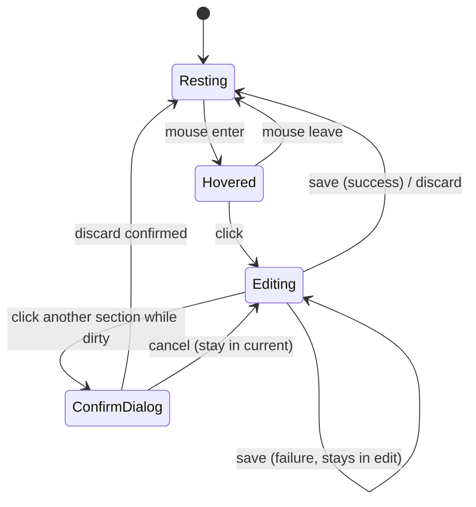

# Content-First Editing Pattern

## Context

TailoredIn's UI currently uses an "always-editable" pattern where data fields render as form inputs at all times, with a sticky SaveBar appearing when fields are dirty. While functional, this makes every page feel editing-oriented rather than content-oriented. The UI should feel like a flat, dynamic app where content is king — editable sections display as pure rendered content, with a subtle hover effect signaling interactivity, and only transform into editing UI when clicked.

## Design Decisions

| Decision | Choice | Rationale |
|---|---|---|
| Scope | All pages | Every editable surface adopts this pattern |
| Edit granularity | Aggregate-level | One domain aggregate = one editable section. Click opens all fields. |
| Hover effect | Subtle background wash | Warm amber tint (`bg-accent/30`) on hover. Minimal, consistent with design system. |
| List editing (simple) | Inline expand | Headlines, Education, Companies: card expands in-place to show edit form |
| List editing (complex) | Keep modals | Experiences (nested Accomplishments): card is content-first, click opens modal |
| Save/Discard | Inline per-section | Each editing section has its own Save/Discard buttons at the bottom |
| Concurrent editing | One at a time | Only one section editable at a time per page. Opening another prompts save/discard of current. |
| Component architecture | Wrapper component | `EditableSection` with `Display`/`Editor` children slots |
| Storybook | Full + page stories | All new primitives, updated existing stories, plus page-level composition stories |

## Core Component: `EditableSection`

A shared wrapper that manages the view-to-edit lifecycle for any content section.

### API

```tsx
<EditableSectionProvider>
  <EditableSection
    sectionId="profile"
    onSave={() => handleSave()}
    onDiscard={() => reset()}
    isSaving={mutation.isPending}
    isDirty={isDirty}
  >
    <EditableSection.Display>
      {/* Pure content — rendered values, no form fields */}
    </EditableSection.Display>

    <EditableSection.Editor>
      {/* Form fields — EditableField components + validation */}
    </EditableSection.Editor>
  </EditableSection>
</EditableSectionProvider>
```

### States



### Behavior

- **Resting:** Renders `Display` children. Standard card appearance.
- **Hovered:** Warm amber background wash (`bg-accent/30`, `transition: background 200ms ease`). Cursor changes to pointer.
- **Editing:** Renders `Editor` children. Border shifts to amber (`border-primary/50`). Inline Save/Discard buttons at section bottom.
- **Mutual exclusion:** `EditableSectionProvider` context manages which section is active. Opening section A while section B is editing:
  - If B is clean (not dirty): B closes silently.
  - If B is dirty: `ConfirmDialog` prompts to save/discard B first.
- **Keyboard:** Escape triggers discard (with confirm dialog if dirty).
- **Transition:** Smooth height animation + content crossfade (~200ms) between Display and Editor.

### `EditableSectionProvider`

Placed at the page layout level. Provides context for mutual exclusion across all `EditableSection` instances on the page.

```tsx
// Manages active section state
interface EditableSectionContextValue {
  activeSectionId: string | null;
  requestEdit: (sectionId: string) => boolean | Promise<boolean>;
  closeActive: () => void;
}
```

## List Pages: `EditableSection` with Card Layout

On list pages, each list item is its own aggregate and gets its own `EditableSection`. No separate component needed — `EditableSection` with `variant="card"` provides the card styling and inline expand behavior.

```tsx
<EditableSectionProvider>
  {educations.map(education => (
    <EditableSection
      key={education.id}
      sectionId={`education-${education.id}`}
      variant="card"
      onSave={() => handleSave(education.id)}
      onDiscard={() => reset(education.id)}
      isSaving={mutation.isPending}
      isDirty={isDirty(education.id)}
    >
      <EditableSection.Display>
        <EducationCardContent education={education} />
      </EditableSection.Display>

      <EditableSection.Editor>
        {/* Education form fields */}
      </EditableSection.Editor>
    </EditableSection>
  ))}
</EditableSectionProvider>
```

The `variant` prop controls visual treatment:
- `"section"` (default): Used on Profile page — full-width section with group dividers.
- `"card"`: Used on list pages — card styling with border-radius, used for inline expand.

Used for: Headlines, Education, Companies.
NOT used for: Experiences (too complex — keeps modal pattern, but `ExperienceCard` still renders content-first in Display mode).

## Content Display Components

Each aggregate needs a display component that renders data as pure content (no form fields):

| Component | Aggregate | Content |
|---|---|---|
| `ProfileDisplay` | Profile | All profile fields in grouped layout: Identity (name, location), Contact (email, phone), About (paragraph), Links (URLs as links) |
| `ExperienceCardContent` | Experience | Title, company, dates, location, summary paragraph |
| `HeadlineCardContent` | Headline | Label, summary text |
| `EducationCardContent` | Education | Degree, institution, year, location, honors |
| `CompanyCardContent` | Company | Name, website, industry badge, stage badge, business type |

### Empty Field Handling

Fields with no value render as "Not set" in italic muted text (`text-muted-foreground italic`). This signals the field exists without showing a blank input.

### Visual Grouping Within a Section

Within a single `EditableSection`, related fields can be visually grouped with subtle dividers and group labels (e.g., "Identity", "Contact", "About", "Links" within the Profile section). These are purely visual — they all edit and save together as one aggregate.

## Page-Level Patterns

### Profile Page

Single `EditableSection` wrapping the entire Profile aggregate:

```
┌─────────────────────────────────────────┐
│ IDENTITY                                │
│ First Name    Last Name    Location     │
│ Sylvain       Estevez      SF, CA       │
│                                         │
│ CONTACT                                 │
│ Email                Phone              │
│ sylvain@ex.com       (555) 123-4567     │
│                                         │
│ ABOUT                                   │
│ Full-stack engineer with 8+ years...    │
│                                         │
│ LINKS                                   │
│ GitHub         LinkedIn       Website   │
│ github.com/s   linkedin.com   Not set   │
└─────────────────────────────────────────┘
       ↓ click anywhere ↓
┌─────────────────────────────────────────┐
│ IDENTITY                                │
│ [First Name___] [Last Name___] [Loc___] │
│                                         │
│ CONTACT                                 │
│ [Email___________] [Phone_________]     │
│                                         │
│ ABOUT                                   │
│ [Textarea________________________]      │
│                                         │
│ LINKS                                   │
│ [GitHub URL___] [LinkedIn___] [Web___]  │
│                                         │
│                    [Discard]  [Save]     │
└─────────────────────────────────────────┘
```

### Experience List Page

Content-first cards. Click opens modal (unchanged container, but card is now content-first):

```
┌─────────────────────────────────────────┐
│ Senior Engineer                         │
│ Acme Corp · San Francisco              │
│ Jan 2022 — Present                     │
│ Led the migration of the billing...    │
└─────────────────────────────────────────┘
       ↓ click ↓
       Opens ExperienceFormModal (existing)
```

### Headline / Education / Company List Pages

Content-first cards with inline expand:

```
┌─────────────────────────────────────────┐
│ BS Computer Science                     │
│ Stanford University · 2018              │
│ Magna Cum Laude                         │
└─────────────────────────────────────────┘
       ↓ click ↓
┌─────────────────────────────────────────┐
│ [Degree Title_____________________]     │
│ [Institution______] [Year____]          │
│ [Location_________] [Honors__]          │
│                                         │
│                    [Discard]  [Save]     │
└─────────────────────────────────────────┘
```

## Transition & Animation

- **View → Edit:** Smooth height transition + content crossfade (~200ms). CSS `transition: all 200ms ease`.
- **Edit → View:** Same reverse transition on save/discard success.
- **Hover:** `transition: background 200ms ease` on the section wrapper.
- **Layout stability:** Display and Editor should occupy similar width/grid to minimize layout shift during transition.

## Design System Updates

### New Rules to Add

Add to `design-system.md`:

- **Content-first display:** All editable data renders as plain content by default. Form inputs only appear when the user clicks to edit.
- **Hover affordance:** Editable sections show warm amber background wash on hover with pointer cursor.
- **Edit mode border:** Editing sections get amber border to distinguish from resting sections.

Add to `ux-guidelines.md`:

- **Section 1 rewrite:** Replace "Always-Editable Fields" with "Content-First Click-to-Edit" pattern.
- **Inline save/discard:** Each editing section has its own Save/Discard buttons. No more page-level SaveBar for section editing.
- **Mutual exclusion:** Only one section editable at a time per page.
- **Inline expand for lists:** Simple-entity list items expand in-place on click. Complex entities (experiences) keep modal.

### Rules to Update

- "Always-editable fields — no edit mode toggles" → "Content-first display with click-to-edit"
- "Aggregate-scoped save with sticky SaveBar" → "Inline save/discard per section"
- SaveBar is **retained** for modal forms but no longer used on pages directly.

## Storybook Coverage

### New Stories

| Story File | Content |
|---|---|
| `EditableSection.stories.tsx` | All states: resting, hovered, editing, saving. Dirty/clean variants. |
| `EditableSectionProvider.stories.tsx` | Multi-section page with mutual exclusion demo |
| `EditableSection-card.stories.tsx` | Card variant: collapsed content view, expanded edit form, save/discard flow |
| `ProfileDisplay.stories.tsx` | Full profile content display with all field groups |
| `ExperienceCardContent.stories.tsx` | Experience rendered as content |
| `HeadlineCardContent.stories.tsx` | Headline rendered as content |
| `EducationCardContent.stories.tsx` | Education rendered as content |
| `CompanyCardContent.stories.tsx` | Company rendered as content |
| `ProfilePage.stories.tsx` | Full page composition: content → hover → edit → save flow |
| `ExperienceListPage.stories.tsx` | List with content cards, click → modal |
| `EducationListPage.stories.tsx` | List with inline expand editing |

### Updated Stories

| Story File | Change |
|---|---|
| `EditableField.stories.tsx` | Still valid — used inside Editor slots |
| `FormModal.stories.tsx` | Still valid — used for complex entity editing |
| `SaveBar.stories.tsx` | Document as "modal-only usage" |

## Component Inventory

```
New:
├── shared/
│   ├── EditableSection.tsx            ← core wrapper (Display + Editor slots, variant: section | card)
│   └── EditableSectionProvider.tsx     ← mutual exclusion context
├── profile/
│   └── ProfileDisplay.tsx             ← all Profile aggregate fields as content
├── resume/experience/
│   └── ExperienceCardContent.tsx      ← experience content display
├── resume/headlines/
│   └── HeadlineCardContent.tsx        ← headline content display
├── resume/education/
│   └── EducationCardContent.tsx       ← education content display
└── companies/
    └── CompanyCardContent.tsx         ← company content display

Modified:
├── routes/profile/index.tsx           ← refactor from always-editable to EditableSection
├── routes/experiences/index.tsx       ← ExperienceCard becomes content-first
├── routes/headlines/index.tsx         ← InlineExpandCard with HeadlineCardContent
├── routes/education/index.tsx         ← InlineExpandCard with EducationCardContent
├── routes/companies/index.tsx         ← InlineExpandCard with CompanyCardContent
├── web/design/design-system.md        ← new content-first rules
└── web/design/ux-guidelines.md        ← rewritten Section 1 (Editing & Forms)

Retained (no change):
├── shared/EditableField.tsx           ← still used inside Editor slots
├── shared/SaveBar.tsx                 ← still used in modals
├── shared/FormModal.tsx               ← still used for Experiences
└── hooks/use-dirty-tracking.ts        ← still used for dirty state
```

## Verification

1. **Storybook:** Run `bun --cwd web storybook` and verify all new stories render correctly in all states
2. **Profile page:** Start dev servers, navigate to Profile. Verify content displays as plain text, hover shows amber wash, click opens edit mode, Save/Discard work, Escape discards.
3. **List pages:** Verify content-first cards on Headlines, Education, Companies. Click to inline-expand, save/discard, mutual exclusion.
4. **Experiences:** Verify content-first cards open modal on click (unchanged behavior for the modal itself).
5. **Navigation guard:** Verify dirty state still blocks navigation when editing.
6. **Dark mode:** Verify all three states (resting, hovered, editing) look correct in both light and dark mode.
7. **Run `bun verify`** — full project health check passes.
