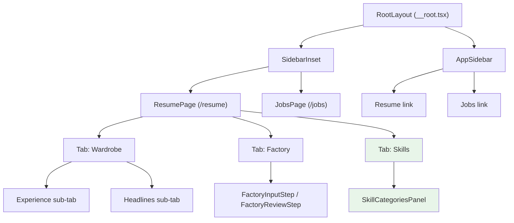

# Nav Restructure — Design Spec

**Date:** 2026-04-04

## Context

The web app has two overlapping navigation systems and a duplicated component:

1. **Sidebar vs. in-page tabs:** The sidebar lists Wardrobe, Factory, and Skills as individual clickable items. The Resume page also renders Wardrobe | Factory as in-page tabs. Both navigate to the same destinations (`/resume?tab=wardrobe`, `/resume?tab=factory`).

2. **Duplicate skills UI:** `SkillsTab` (wardrobe inner sub-tab at `web/src/components/wardrobe/SkillsTab.tsx`) and `SkillsPage` (route at `web/src/routes/resume/skills.tsx`) are near-identical — same hooks, same DnD logic, same components. They differ only in heading, button size, and spacing.

3. **Missing Jobs link:** The Jobs page (`/jobs`) has no sidebar entry.

4. **Uncontrolled tabs bug:** `<Tabs defaultValue={tab}>` means clicking between tabs doesn't update the URL. The user can be on Factory visually but the URL still says `?tab=wardrobe`.

## Design

Sidebar becomes section-level only. Pages own their sub-navigation via URL-synced tabs. The duplicate skills component is consolidated.

### Target structure

```
Sidebar              Resume page (/resume)
--------             ----------------------
Resume           →   [Wardrobe] [Factory] [Skills]
Jobs             →   Jobs page (/jobs)
                     [Triage] [Pipeline] [Archive] [All]  ← unchanged
```



Key change in the Wardrobe sub-tabs: the inner "Skills" sub-tab is **removed** (it was a duplicate of the Skills page). Wardrobe keeps only Experience and Headlines.

## Changes

### 1. Sidebar (`web/src/components/layout/sidebar.tsx`)

Replace the three-item `resumeNav` array with a flat two-item array:

```ts
const appNav: NavItem[] = [
  { label: 'Resume', to: '/resume', icon: BookOpen },
  { label: 'Jobs',   to: '/jobs',   icon: Briefcase },
];
```

- Drop the `search` property from `NavItem` — sidebar items no longer carry search params
- Simplify `isActive`: just `matchRoute({ to: item.to, fuzzy: true })`, no search-param branch
- Remove `SidebarGroupLabel` ("Resume") — it's now one of the nav items, making the label redundant
- Lucide imports: add `Briefcase`; remove `Wand2`, `Wrench`

### 2. Controlled tabs on Resume page (`web/src/routes/resume/index.tsx`)

**a) Extend the search schema:**

```ts
const searchSchema = z.object({
  tab: z.enum(['wardrobe', 'factory', 'skills']).optional().catch('wardrobe')
});
```

**b) Switch from uncontrolled to controlled tabs:**

Currently uses `defaultValue={tab ?? 'wardrobe'}` which doesn't sync clicks back to the URL. Change to:

```tsx
const navigate = Route.useNavigate();

<Tabs value={tab ?? 'wardrobe'} onValueChange={(v) => navigate({ search: { tab: v } })}>
```

This ensures the URL always reflects the active tab — bookmarkable, back/forward friendly, and consistent with the sidebar's fuzzy route matching.

**c) Add the Skills tab trigger and content:**

```tsx
<TabsTrigger value="skills">Skills</TabsTrigger>
```

```tsx
<TabsContent value="skills" className="pt-4">
  <SkillCategoriesPanel />
</TabsContent>
```

**d) Remove the wardrobe inner "Skills" sub-tab:**

The wardrobe sub-tabs go from `Experience | Headlines | Skills` to `Experience | Headlines`. Remove the `SkillsTab` import and its `TabsTrigger`/`TabsContent`.

### 3. Create `SkillCategoriesPanel` (`web/src/components/resume/skills/skill-categories-panel.tsx`)

Extract from the existing `SkillsTab` component (which is already headerless — just the action row + category list + dialog). This replaces both:
- `web/src/components/wardrobe/SkillsTab.tsx` (delete)
- `web/src/routes/resume/skills.tsx` (becomes redirect)

The panel contains:
- "Add Category" button (right-aligned)
- Loading skeletons
- Empty state
- `SortableList` of `SkillCategoryCard` items with DnD reordering
- `CategoryFormDialog`

Imports carry over from `SkillsTab`: `@dnd-kit/sortable`, `lucide-react`, `category-form-dialog`, `skill-category-card`, `sortable-list`, `use-skills` hooks.

### 4. Delete `SkillsTab` (`web/src/components/wardrobe/SkillsTab.tsx`)

Replaced by `SkillCategoriesPanel`. Remove the file entirely.

### 5. Redirect `/resume/skills` (`web/src/routes/resume/skills.tsx`)

Replace the page component with a `beforeLoad` redirect, matching the existing `/resume/builder` pattern:

```ts
export const Route = createFileRoute('/resume/skills')({
  beforeLoad: () => {
    throw redirect({ to: '/resume', search: { tab: 'skills' } });
  }
});
```

Existing bookmarks to `/resume/skills` keep working.

### 6. No changes needed

- `web/src/routes/resume/builder.tsx` — already redirects to `/resume?tab=factory`
- `web/src/routes/jobs/index.tsx` — job view tabs are not duplicated; no change
- `web/src/routeTree.gen.ts` — auto-generated on next dev server start

## Files summary

| File | Action | Change |
|------|--------|--------|
| `web/src/components/layout/sidebar.tsx` | Modify | Replace 3 nav items with 2 top-level items |
| `web/src/routes/resume/index.tsx` | Modify | Add `skills` to enum; controlled tabs; add Skills tab; remove wardrobe Skills sub-tab |
| `web/src/components/resume/skills/skill-categories-panel.tsx` | Create | Extracted from SkillsTab — single source of truth for skills UI |
| `web/src/components/wardrobe/SkillsTab.tsx` | Delete | Replaced by SkillCategoriesPanel |
| `web/src/routes/resume/skills.tsx` | Modify | Replace page component with beforeLoad redirect |

## Verification

1. `bun run web:dev` — dev server starts, route tree regenerates
2. Sidebar shows exactly two items: Resume and Jobs
3. Clicking Resume → `/resume` loads Wardrobe tab (default)
4. Clicking Jobs → `/jobs` loads job list with Triage view
5. Resume page tabs: Wardrobe, Factory, Skills all render correctly
6. Clicking between tabs updates the URL search param (`?tab=wardrobe`, `?tab=factory`, `?tab=skills`)
7. Browser back/forward navigates between tabs correctly
8. Wardrobe sub-tabs: only Experience and Headlines (no more Skills)
9. Skills tab: shows category list with Add, Edit, DnD reorder
10. `/resume/skills` redirects to `/resume?tab=skills`
11. `/resume/builder` still redirects to `/resume?tab=factory`
12. `bun run check` — Biome passes
13. `bun run typecheck` — no type errors
