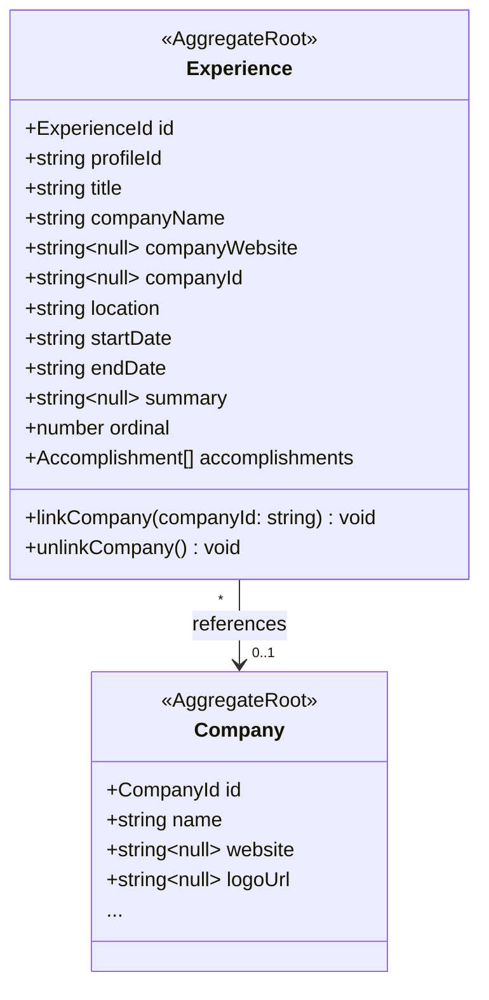

# Experience-Company Link Design

## Context

Experiences currently store `companyName` (string) and `companyWebsite` (string | null) as flat fields. Companies are a separate aggregate with rich data (logo, industry, stage, business type, LinkedIn link). There is no relationship between them.

Users need to optionally link an Experience to a Company entity so the experience card can display richer company data (logo, link icon). The experience retains its own snapshot fields because company data changes over time, but an experience reflects a point-in-time state.

## Data Model

### Domain: Experience aggregate

Add an optional `companyId: string | null` field to Experience. Existing `companyName` and `companyWebsite` remain untouched — they are the experience's own data.



### Database migration

```sql
ALTER TABLE experiences
  ADD COLUMN company_id UUID NULL REFERENCES companies(id) ON DELETE SET NULL;
```

`ON DELETE SET NULL` ensures deleting a company unlinks experiences gracefully.

### DTO

```typescript
type ExperienceDto = {
  id: string;
  title: string;
  companyName: string;
  companyWebsite: string | null;
  companyId: string | null;        // NEW
  company: CompanyDto | null;      // NEW — eagerly loaded
  location: string;
  startDate: string;
  endDate: string;
  summary: string | null;
  ordinal: number;
  accomplishments: AccomplishmentDto[];
};
```

## Backend

### New use cases

1. **LinkCompanyToExperience** — Input: `{ experienceId, companyId }`. Validates both the experience and company exist (returns `EntityNotFoundError` if either is missing). Sets `companyId` on Experience, saves, returns updated `ExperienceDto` (with company populated).

2. **UnlinkCompanyFromExperience** — Input: `{ experienceId }`. Clears `companyId` to null, saves, returns updated `ExperienceDto`.

### New API routes

| Method | Path | Body | Response |
|--------|------|------|----------|
| `PUT` | `/experiences/:id/company` | `{ company_id: string }` | `{ data: ExperienceDto }` |
| `DELETE` | `/experiences/:id/company` | — | `{ data: ExperienceDto }` |

Linking/unlinking are separate from `PUT /experiences/:id` (general update). This keeps the general update from accidentally clearing the company link.

### Repository changes

`PostgresExperienceRepository`:
- `toDomain()`: Map `company_id` column to domain `companyId`
- `save()`: Persist `companyId` to database
- `findAll()` / `findByIdOrFail()`: Eagerly load the associated Company when `companyId` is set, include as `CompanyDto` in the DTO conversion

### DI tokens

Add to `DI.Experience`:
- `LinkCompany: InjectionToken<LinkCompanyToExperience>`
- `UnlinkCompany: InjectionToken<UnlinkCompanyFromExperience>`

## Frontend

### Experience Card

```
Linked:
┌──────────────────────────────────────────┐
│  [AC]  Acme Corp  🔗                  ✕  │
│        Senior Engineer                   │
│        📍 San Francisco  Oct 2022 — Now  │
└──────────────────────────────────────────┘

Unlinked (unchanged):
┌──────────────────────────────────────────┐
│  Some Startup                         ✕  │
│  Junior Developer                        │
│  📍 Remote  Jan 2020 — Sep 2021          │
└──────────────────────────────────────────┘
```

- When `experience.company` is present: show company logo (or 2-letter initial avatar), company name, and a muted `Link2` icon
- When absent: card looks exactly as today

### Experience Form Modal — Company Field

The "Company" text field gains a **link/unlink button** next to it.

**Unlinked state:** Link button (🔗) opens a search popover.

**Search popover:**
- Anchored to the Company field
- Reuses `useCompanies()` data, filters client-side by name — no new API call
- Shows logo + name + website for each matching company
- "+ Create new company" opens `CompanyFormModal` in create mode (nested modal). On creation, the new company is auto-linked.
- Selecting a company triggers `useLinkCompany` mutation immediately

**After linking — sync suggestions:**
- If `company.name !== experience.companyName`: show `"Use [company.name]?"` chip below the Company field
- If `company.website !== experience.companyWebsite`: show `"Use [company.website]?"` chip below the Website field
- Clicking a suggestion calls `setField()` (standard dirty tracking)
- Suggestions disappear when values match or on dismiss
- Text fields remain fully editable at all times

**Linked state:** Link button becomes unlink button (✕). Clicking it triggers `useUnlinkCompany` mutation.

### New hooks (`use-experiences.ts`)

```typescript
useLinkCompany()     // PUT /experiences/:id/company → invalidates experiences list
useUnlinkCompany()   // DELETE /experiences/:id/company → invalidates experiences list
```

### CompanyFormModal extension

Add optional `onCreated?: (company: CompanyDto) => void` callback. When provided, the modal calls it after successful creation instead of just closing. This enables the "create and auto-link" flow from the experience form.

## Verification

1. **Unit tests**: New use cases (`LinkCompanyToExperience`, `UnlinkCompanyFromExperience`) with success/error paths
2. **Integration tests**: Repository correctly persists and loads `companyId`, eagerly loads company data
3. **Manual QA flow**:
   - Create an experience without a company link — card shows as today
   - Open experience form, click link button, search for existing company, select it
   - Verify sync suggestions appear for differing fields
   - Accept one suggestion, dismiss the other — verify dirty tracking works
   - Save — verify card shows logo + link icon
   - Re-open, click unlink — verify company removed, card reverts to text-only
   - Link flow: click "+ Create new company", go through full creation, verify auto-link
   - Delete a linked company from the companies page — verify experience becomes unlinked (ON DELETE SET NULL)
4. **Type check + lint**: `bun run typecheck && bun run check`
5. **Architecture boundaries**: `bun run dep:check`
