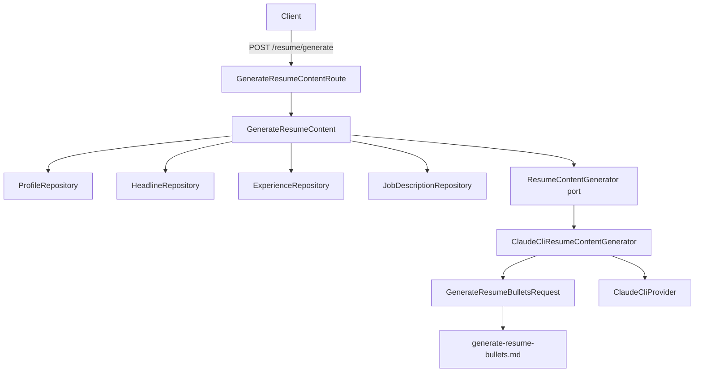

# Resume Content Generation — Design Spec

**Date:** 2026-04-05
**Branch:** vectorized-bubbling-horizon
**Status:** Approved

## Context

Add an LLM-powered endpoint (`POST /resume/generate`) that takes a job description already in the database and returns tailored resume bullet points for each work experience of the first (and only) profile. The LLM frames bullets to highlight relevance to the JD without inventing any competency, respects per-experience bullet count tiers based on recency, and enforces bullet length bounds (min 80, max 350 characters).

## Architecture



Follows the existing Onion Architecture pattern:
- Port interface in `application/src/ports/`
- Use case in `application/src/use-cases/resume/`
- Concrete LLM service in `infrastructure/src/services/`
- Route in `api/src/routes/resume/`
- DI wired in `infrastructure/src/DI.ts` + `api/src/container.ts`

## Endpoint

```
POST /resume/generate
Content-Type: application/json

{ "jobDescriptionId": "string" }
```

**Response:**
```json
{
  "data": {
    "experiences": [
      {
        "experienceId": "uuid",
        "experienceTitle": "Senior Software Engineer",
        "companyName": "Acme Corp",
        "bullets": [
          "Led migration of monolithic architecture to microservices, cutting deployment time by 60% across five production services.",
          "..."
        ]
      }
    ]
  }
}
```

**curl command:**
```bash
curl -X POST http://localhost:8000/resume/generate \
  -H "Content-Type: application/json" \
  -d '{"jobDescriptionId": "your-jd-id"}' | jq
```

## Bullet Count Tiers (by recency)

Experiences sorted by `startDate` descending. Position 0 = most recent.

| Position | Min | Max |
|---|---|---|
| 0 | 2 | 12 |
| 1 | 2 | 10 |
| 2 | 2 | 8 |
| 3 | 2 | 6 |
| 4+ | 2 | 3 |

## Bullet Quality Rules

1. **No invention** — bullets MUST be derived strictly from their experience's data (title, summary, accomplishments). No borrowing from other experiences.
2. **Length** — each bullet is ≥ 80 and ≤ 350 characters.
3. **Tone** — inspired by the candidate's `about` text and headline summary.
4. **Relevance** — bullets framed to highlight fit with the target job description.

## LLM Output Schema (Zod)

```typescript
z.object({
  experiences: z.array(z.object({
    experienceId: z.string(),
    bullets: z.array(z.string().min(80).max(350))
  }))
})
```

Bullet count constraints (min/max per experience) are enforced via prompt instructions, not the Zod schema (since Zod can't vary array length bounds per element).

## Profile/Headline Selection

- **Profile:** First profile in the database (single-user assumption).
- **Headline:** Most recently created headline for that profile.
- **Experiences:** All experiences for that profile, sorted by `startDate` descending.

## Error Handling

| Condition | Response |
|---|---|
| `jobDescriptionId` not found | 404 Not Found |
| No profile in DB | 404 Not Found |
| LLM failure | 500 via `ExternalServiceError` |
| LLM returns invalid schema | Retried up to 3x by `BaseLlmCliProvider` |

## Files

### New
- `application/src/ports/ResumeContentGenerator.ts`
- `application/src/dtos/ResumeContentDto.ts`
- `application/src/use-cases/resume/GenerateResumeContent.ts`
- `infrastructure/src/services/llm/GenerateResumeBulletsRequest.ts`
- `infrastructure/src/services/prompts/generate-resume-bullets.md`
- `infrastructure/src/services/ClaudeCliResumeContentGenerator.ts`
- `api/src/routes/resume/GenerateResumeContentRoute.ts`

### Modified
- `application/src/index.ts` — export port, use case, DTO
- `infrastructure/src/DI.ts` — add `Resume` namespace tokens
- `infrastructure/src/index.ts` — export service
- `api/src/container.ts` — add bindings
- `api/src/index.ts` — register route plugin

## Testing

- Unit test: `GenerateResumeContent` use case (mock all dependencies)
- Unit test: `GenerateResumeBulletsRequest` (assert schema shape + prompt content)
- Manual E2E: curl command above against running server
