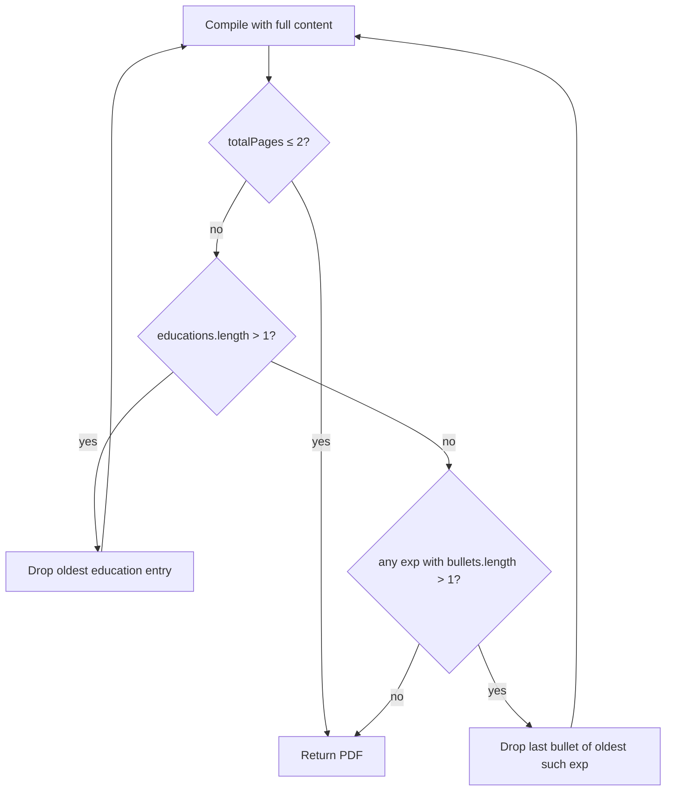

# Typst Resume Rendering: Education, Page Breaks, 2-Page Max

**Date:** 2026-04-05  
**Status:** Approved

---

## Context

Three rendering gaps in the PDF generation pipeline:

1. **Education section missing** — `honors` never reaches the render layer; section silently skips when data is absent.
2. **Experiences cut mid-page** — `cv-entry` blocks are breakable by default, splitting entries across page boundaries.
3. **No page budget enforcement** — no hard 2-page cap exists; layout settings are hardcoded strings scattered across `cv.typ` and `generateMetadataToml`.

Additionally, `ResumeTemplate` and `LayoutAnalysis`/`BlockLayout` are defined in the domain but not wired into the pipeline. Future sessions will add more templates — this session establishes the generic plumbing.

---

## Design

### 1. Wire `ResumeTemplate` through the pipeline

Add a `DEFAULT_RESUME_TEMPLATE` constant to `domain/src/value-objects/ResumeTemplate.ts` using compact values (below). Add `template: ResumeTemplate` to `ResumeRenderInput`. The use case passes `DEFAULT_RESUME_TEMPLATE`; future sessions will add template selection.

**Default values:**

| Field | Value | Notes |
|---|---|---|
| `id` | `'brilliant-cv-default'` | |
| `pageSize` | `'us-letter'` | |
| `margins` | `{ top: 1.1, bottom: 1.1, left: 1.1, right: 1.1 }` | cm, down from 1.5cm |
| `bodyFontSizePt` | `10` | down from 10.5pt |
| `lineHeightEm` | `0.65` | down from 0.75em |
| `headerFontSizePt` | `32` | brilliant-cv default, not overridden yet |
| `sectionSpacingPt` | `2` | down from 4pt |
| `entrySpacingPt` | `2` | down from 3pt |

The renderer generates a `config.typ` in the temp directory from `input.template`. `cv.typ` imports `config.typ` instead of hardcoding `#set text`, `#set par`, `#set page`. This makes the template fully swappable.

```typst
// config.typ — auto-generated from ResumeTemplate
#let cfg-body-font-size = 10pt
#let cfg-leading = 0.65em
#let cfg-margin = 1.1cm
```

```typst
// cv.typ
#import "./config.typ": cfg-body-font-size, cfg-leading, cfg-margin
#set text(size: cfg-body-font-size)
#set par(leading: cfg-leading)
#set page(margin: cfg-margin)
```

`metadata.toml` generation reads `template.sectionSpacingPt` and `template.entrySpacingPt` for `before_section_skip` and `before_entry_skip`. `before_entry_description_skip` is derived as `max(1, floor(entrySpacingPt / 2))`.

### 2. Education: honors + non-breakable

Add `honors: string | null` to `ResumeRenderEducation` in `application/src/ports/ResumeRenderer.ts`. Pass it through in `GenerateResumePdf.ts`. In `generateEducationTyp`, render honors as italic description text when present. Wrap each education entry in `block(breakable: false)`.

### 3. Experience entries non-breakable

Wrap each `cv-entry` in `generateProfessionalTyp` with `block(breakable: false)`. Page breaks happen between entries only.

### 4. Multi-pass 2-page enforcement (strict)



**Trimming order:**
1. Drop education entries oldest-first (keep at minimum 1 — most recent)
2. Drop last bullet of oldest experience with `bullets.length > 1` (soft floor: 2)
3. Continue below floor if needed — hard floor: 1 bullet per experience
4. If all at 1 bullet and still > 2 pages: return PDF as-is (unreachable in practice)

**Page count:** parse compiled PDF binary for `/Type /Page` occurrences (excluding `/Pages`). Wrap result in a `LayoutAnalysis` object (`totalPages` populated; block-level fields deferred to a future session requiring `typst query` instrumentation).

```typescript
function analyzeLayout(pdf: Uint8Array): LayoutAnalysis {
  const text = new TextDecoder('latin1').decode(pdf);
  const totalPages = (text.match(/\/Type\s*\/Page[^s]/g) ?? []).length;
  return {
    totalPages,
    header: { name: empty, headline: empty, infoLine: empty },
    experiences: [],
    education: [],
    skills: [],
  };
}
```

---

## Affected files

| File | Change |
|---|---|
| `domain/src/value-objects/ResumeTemplate.ts` | Add `DEFAULT_RESUME_TEMPLATE` constant |
| `application/src/ports/ResumeRenderer.ts` | Add `template: ResumeTemplate` to `ResumeRenderInput`; add `honors` to `ResumeRenderEducation` |
| `application/src/use-cases/resume/GenerateResumePdf.ts` | Pass `DEFAULT_RESUME_TEMPLATE` and `honors` |
| `infrastructure/src/services/TypstResumeRenderer.ts` | Read layout from template, generate `config.typ`, `block(breakable:false)`, honors, multi-pass loop, `analyzeLayout` |
| `infrastructure/typst/cv.typ` | Import `config.typ` instead of hardcoded `#set` rules |

---

## Verification

1. `bun wt:up` → `POST /resume/pdf` with valid IDs
2. Open PDF: Education section visible, no experience entry split across pages, ≤ 2 pages
3. `bun test infrastructure/test/services/TypstResumeRenderer.test.ts`
   - `analyzeLayout` returns correct `totalPages` for a known PDF fixture
   - `generateEducationTyp` renders honors when present, empty description when null
   - `generateProfessionalTyp` wraps entries in `block(breakable: false)`
   - Multi-pass loop drops education before bullets, respects bullet floors
