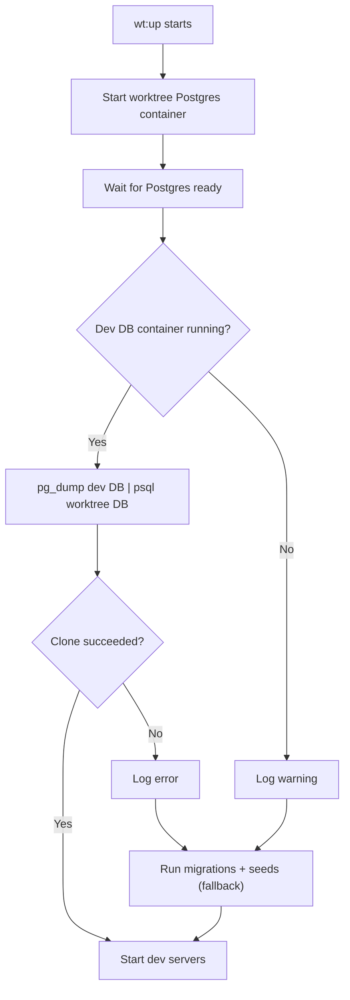

# Worktree DB Clone from Dev

## Problem

Worktrees currently start with an empty database, running all migrations and the `DatabaseSeeder` from scratch. This means worktrees don't have the real data that exists in the dev database (companies, job descriptions, etc.), making them less useful for development and testing against realistic data.

## Solution

On `wt:up`, clone the running dev database into the worktree's isolated Postgres container via a piped `pg_dump | psql`. If the dev DB isn't running, fall back to migrations + seeds.

## Design

### Flow



### New file: `infrastructure/dev/DatabaseClone.ts`

Single exported function:

```typescript
/**
 * Clone the dev database into a worktree's Postgres container.
 * Returns true on success, false if dev DB is unavailable or clone fails.
 */
export function cloneDevDatabase(devContainerName: string, wtContainerName: string, wtDbName: string): boolean
```

Implementation:
- Check `isContainerRunning(devContainerName)` — return `false` if not running
- Run piped command via `Bun.spawnSync`:
  ```bash
  docker exec <devContainer> pg_dump -U postgres --no-owner --no-privileges tailored_in \
  | docker exec -i <wtContainer> psql -U postgres <wtDbName>
  ```
- Since Bun doesn't support shell pipes in `spawnSync`, wrap in `sh -c "..."` or use two spawns with stdout/stdin piping
- Return `true` on exit code 0, `false` otherwise

### Changes to `infrastructure/dev/wt-up.ts`

Replace lines 90-108 (the migrations + seeds block) with:

```typescript
import { cloneDevDatabase } from './DatabaseClone.js';

// Try cloning dev DB
const cloned = cloneDevDatabase(
  'tailored-in-postgres-1',
  ctx.containerName,
  session.dbName
);

if (!cloned) {
  log.warn('Dev DB not available — falling back to migrations + seeds.');
  await runMigrations({ dbConfig: ormConfig, containerName: ctx.containerName, repoRoot: ctx.repoRoot });
  await runSeeds(ormConfig);
}
```

### What the clone includes

The `pg_dump` captures everything:
- Full schema (tables, indexes, constraints, sequences)
- All data rows
- The `mikro_orm_migrations` table (so MikroORM knows all migrations are applied)

No need to run migrations separately after a successful clone.

### Constraints

- Dev DB must be running on `tailored-in-postgres-1` for the clone path
- Both containers use the same Postgres version (17-alpine) and same `postgres` user/password
- The dev DB name is hardcoded as `tailored_in` (matches `.env.example`)

## Files to modify

| File | Change |
|------|--------|
| `infrastructure/dev/DatabaseClone.ts` | **New** — `cloneDevDatabase()` function |
| `infrastructure/dev/wt-up.ts` | Replace migrations+seeds block with clone-then-fallback |

## Verification

1. `bun run typecheck` — no type errors
2. `bun run check` — lint clean
3. Manual test: `bun dev:up`, then from a worktree run `bun wt:up` — worktree DB should have dev data
4. Manual test: stop dev DB, run `bun wt:up` from worktree — should fall back to migrations + seeds with warning
