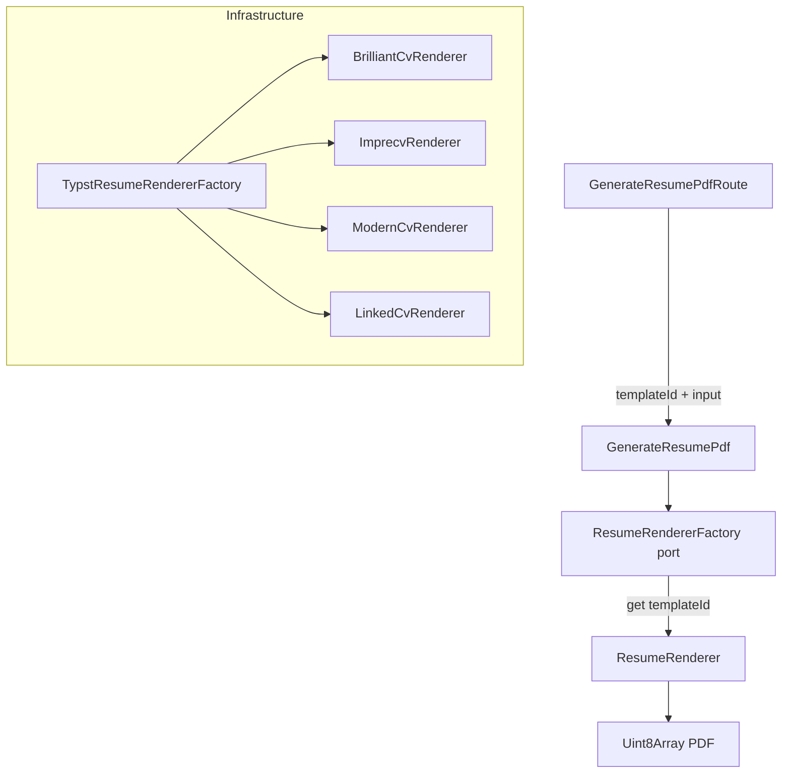

# Multi-Template Resume Renderer — Design Spec

**Date:** 2026-04-06
**Branch:** soft-humming-pancake
**Status:** Approved

## Context

`TypstResumeRenderer` is hardcoded to a single Typst template (Brilliant CV). This adds three additional templates — imprecv, modern-cv, and linked-cv — selectable per render request. Each template targets a different visual style and use case, giving users choice over how their generated resume looks.

## Templates

| ID | Template | Visual Style | Data Approach |
|---|---|---|---|
| `brilliant-cv` | Brilliant CV (existing) | Minimal, monochrome | TOML + generated `.typ` modules |
| `imprecv` | imprecv | Dense, ATS-first | YAML data file |
| `modern-cv` | modern-cv | Colorful, polished, Awesome-CV inspired | Single generated `.typ` |
| `linked-cv` | linked-cv | LinkedIn-inspired, timeline per employer | Single generated `.typ` |

`linked-cv` is integrated without the tech stack / workstream row feature — timeline and employer grouping only.

## Architecture



## API Contract

```
POST /resume/pdf
Content-Type: application/json

{
  "jobDescriptionId": "uuid",
  "headlineId": "uuid",
  "templateId": "brilliant-cv" | "imprecv" | "modern-cv" | "linked-cv"  // optional, defaults to "brilliant-cv"
}
```

Response is unchanged: binary PDF.

`ResumeRenderInput` is unchanged — template selection is a routing concern, not a data concern.

## Application Layer

### New: `ResumeTemplate` type

**File:** `application/src/types/ResumeTemplate.ts`

```typescript
export type ResumeTemplate = 'brilliant-cv' | 'imprecv' | 'modern-cv' | 'linked-cv';
export const DEFAULT_RESUME_TEMPLATE: ResumeTemplate = 'brilliant-cv';
```

Export from `application/src/index.ts`.

### New port: `ResumeRendererFactory`

**File:** `application/src/ports/ResumeRendererFactory.ts`

```typescript
export interface ResumeRendererFactory {
  get(templateId: ResumeTemplate): ResumeRenderer;
}
```

Export from `application/src/ports/index.ts`.

### Modified: `GenerateResumePdf`

**File:** `application/src/use-cases/resume/GenerateResumePdf.ts`

- `GenerateResumePdfInput` gains `templateId?: ResumeTemplate`
- Constructor takes `ResumeRendererFactory` instead of `ResumeRenderer`
- In `execute()`: `const renderer = this.rendererFactory.get(input.templateId ?? DEFAULT_RESUME_TEMPLATE)`

## Infrastructure Layer

### New: `TypstResumeRendererFactory`

**File:** `infrastructure/src/services/TypstResumeRendererFactory.ts`

```typescript
@injectable()
export class TypstResumeRendererFactory implements ResumeRendererFactory {
  constructor(
    private readonly brilliantCv: BrilliantCvRenderer,
    private readonly imprecv: ImprecvRenderer,
    private readonly modernCv: ModernCvRenderer,
    private readonly linkedCv: LinkedCvRenderer,
  ) {}

  get(templateId: ResumeTemplate): ResumeRenderer {
    switch (templateId) {
      case 'brilliant-cv': return this.brilliantCv;
      case 'imprecv':      return this.imprecv;
      case 'modern-cv':    return this.modernCv;
      case 'linked-cv':    return this.linkedCv;
    }
  }
}
```

### Renderer classes

| Class | File | Notes |
|---|---|---|
| `BrilliantCvRenderer` | `infrastructure/src/services/renderers/BrilliantCvRenderer.ts` | Existing `TypstResumeRenderer` logic moved here |
| `ImprecvRenderer` | `infrastructure/src/services/renderers/ImprecvRenderer.ts` | Generates `template.yml` + static `template.typ` |
| `ModernCvRenderer` | `infrastructure/src/services/renderers/ModernCvRenderer.ts` | Generates single `resume.typ` |
| `LinkedCvRenderer` | `infrastructure/src/services/renderers/LinkedCvRenderer.ts` | Generates single `main.typ`, groups experiences by company |

All implement `ResumeRenderer` with `@injectable()`.

#### ImprecvRenderer

Generates two files:
- `template.yml` — all user data (personal, work, education)
- `template.typ` — static orchestration file importing `@preview/imprecv`

Work entry YAML shape:
```yaml
work:
  - organization: Acme Corp
    location: San Francisco, CA
    positions:
      - position: Senior Engineer
        startDate: "2022-01-01"
        endDate: "present"
        highlights:
          - "Bullet one"
```

Uses `@preview/imprecv` from Typst registry. No `--font-path` needed (Libertinus Serif is bundled).

#### ModernCvRenderer

Generates a single `resume.typ`:
```typst
#import "@preview/modern-cv:0.9.0": *

#show: resume.with(
  author: (firstname: ..., lastname: ..., email: ..., ...),
  paper-size: "us-letter",
  colored-headers: true,
  show-footer: false,
)

= Experience

#resume-entry(title: ..., location: ..., date: ..., description: ...)
#resume-item[
  - Bullet one
  - Bullet two
]

= Education
...
```

Requires `--font-path ./fonts/roboto-sourcesans` (Roboto + Source Sans Pro + FontAwesome OTF).

#### LinkedCvRenderer

Groups `ResumeRenderExperience[]` by `companyName` before generating. Multiple roles at the same company emit a single `#frame.connected-frames("slug", (...roles))` block.

Date format: ISO input (`"2022-01-01"`) converted to `"MM-YYYY"` (e.g., `"01-2022"`). Separate `formatLinkedCvDate()` helper.

```typst
#import "@preview/linked-cv:0.1.0": *

// header...

#components.section("Experience")

#components.employer-info(
  none,
  name: "Acme Corp",
  duration: ("01-2022", "current"),
)

#frame.connected-frames(
  "acme-corp",
  (
    title: [Senior Engineer],
    duration: ("06-2023", "current"),
    body: [
      - Bullet one
      - Bullet two
    ]
  ),
)
```

Requires `--font-path ./fonts/roboto-sourcesans` (shared with modern-cv).

## DI Changes

**File:** `infrastructure/src/DI.ts`

In the `Resume` namespace:
- Replace `Renderer: InjectionToken<ResumeRenderer>` with `RendererFactory: InjectionToken<ResumeRendererFactory>`
- Import `ResumeRendererFactory` from `@tailoredin/application`

**File:** `api/src/container.ts`

Concrete `@injectable()` classes bind by class type directly (no extra tokens needed):

```typescript
// 4 renderer classes — bind by class (needle-di resolves @injectable() by class token)
container.bind({ provide: BrilliantCvRenderer, useClass: BrilliantCvRenderer });
container.bind({ provide: ImprecvRenderer,     useClass: ImprecvRenderer });
container.bind({ provide: ModernCvRenderer,    useClass: ModernCvRenderer });
container.bind({ provide: LinkedCvRenderer,    useClass: LinkedCvRenderer });
container.bind({ provide: DI.Resume.RendererFactory, useClass: TypstResumeRendererFactory });

// GenerateResumePdf — replace DI.Resume.Renderer arg with DI.Resume.RendererFactory
container.bind({
  provide: DI.Resume.GeneratePdf,
  useFactory: () => new GenerateResumePdf(
    container.get(DI.Profile.Repository),
    container.get(DI.Headline.Repository),
    container.get(DI.Experience.Repository),
    container.get(DI.Education.Repository),
    container.get(DI.JobDescription.Repository),
    container.get(DI.Resume.Generator),
    container.get(DI.Resume.RendererFactory),
  ),
});
```

## File & Font Layout

```
infrastructure/typst/
├── fonts/
│   ├── ibm-plex/                  ← existing IBM Plex Sans OTF files (moved from fonts/)
│   └── roboto-sourcesans/         ← new: Roboto + Source Sans Pro + FontAwesome OTF
├── brilliant-cv/                  ← existing static files (moved from typst root)
│   ├── cv.typ
│   ├── helpers.typ
│   └── modules_en/
└── eval/                          ← untouched
```

Each renderer copies only its own subdirectory into the temp compile dir and sets `--font-path` to its font subdir.

`imprecv` uses no local font files (bundled with Typst). `modern-cv` and `linked-cv` share `roboto-sourcesans/`.

**Typst package registry:** `@preview/` packages are downloaded on first use and cached at `~/.cache/typst/packages/`. A one-time warm-up compile per template is sufficient for a personal tool deployment.

## Files

### New
- `application/src/types/ResumeTemplate.ts`
- `application/src/ports/ResumeRendererFactory.ts`
- `infrastructure/src/services/TypstResumeRendererFactory.ts`
- `infrastructure/src/services/renderers/BrilliantCvRenderer.ts`
- `infrastructure/src/services/renderers/ImprecvRenderer.ts`
- `infrastructure/src/services/renderers/ModernCvRenderer.ts`
- `infrastructure/src/services/renderers/LinkedCvRenderer.ts`

### Modified
- `application/src/use-cases/resume/GenerateResumePdf.ts` — factory injection + templateId input
- `application/src/ports/index.ts` — export `ResumeRendererFactory`
- `application/src/index.ts` — export `ResumeTemplate`, `DEFAULT_RESUME_TEMPLATE`
- `infrastructure/src/DI.ts` — replace `Renderer` token with `RendererFactory` + 4 renderer tokens
- `infrastructure/src/index.ts` — export new classes
- `api/src/container.ts` — bind new classes
- `api/src/routes/resume/GenerateResumePdfRoute.ts` — add optional `templateId` to body schema, validated against `ResumeTemplate` union (`'brilliant-cv' | 'imprecv' | 'modern-cv' | 'linked-cv'`)

### Moved / Restructured
- `infrastructure/src/services/TypstResumeRenderer.ts` → deleted (logic split into renderer classes)
- `infrastructure/typst/fonts/*.otf` → `infrastructure/typst/fonts/ibm-plex/`
- `infrastructure/typst/cv.typ`, `helpers.typ`, `modules_en/` → `infrastructure/typst/brilliant-cv/`

### New Assets
- `infrastructure/typst/fonts/roboto-sourcesans/` — Roboto + Source Sans Pro + FontAwesome OTF files

## Verification

1. `bun run typecheck` — no type errors
2. `bun run check` — Biome lint/format passes
3. `bun run dep:check` — architecture boundaries respected
4. `bun run test` — unit tests pass
5. Manual smoke tests (with worktree env running):
   ```bash
   # Default template (brilliant-cv)
   curl -X POST http://localhost:{PORT}/resume/pdf \
     -H "Content-Type: application/json" \
     -d '{"jobDescriptionId":"...", "headlineId":"..."}' --output out-brilliant.pdf

   # imprecv
   curl -X POST http://localhost:{PORT}/resume/pdf \
     -H "Content-Type: application/json" \
     -d '{"jobDescriptionId":"...", "headlineId":"...", "templateId":"imprecv"}' --output out-imprecv.pdf

   # modern-cv
   curl ... "templateId":"modern-cv" ... --output out-modern.pdf

   # linked-cv
   curl ... "templateId":"linked-cv" ... --output out-linked.pdf
   ```
6. Open all 4 PDFs and verify each renders its distinct visual style
