# Composable Resume Generation Pipeline

## Context

The current resume generation system uses a monolithic LLM prompt that bundles all context into a single markdown template (`generate-resume-bullets.md`). This works but has significant limitations:

1. **No API-level caching**: Every request sends the full prompt. Stable context (rules, profile, company data) is re-sent and re-processed on every call.
2. **Thin context**: Tone is handled with a vague "mirror the About section" instruction. Company enrichment data (industry, stage, description) is available but unused. JD skills aren't surfaced.
3. **Coarse granularity**: Generation scopes are limited to full-resume, headline-only, or experience-only. No bullet-level control.
4. **No composability**: The prompt is a single template with string interpolation. Adding or reordering context sections requires editing the template.
5. **No prompt visibility**: Prompt templates are hardcoded in infrastructure — not visible or editable in the UI.
6. **Sequential for full resume**: One LLM call generates everything. A single failure wastes the entire call.

This design replaces the current generation pipeline with a **composable, cacheable, parallel, fine-grained** system built on typed prompt sections.

**Supersedes**: The "Parallel, Context-Rich, Cached Resume Generation" spec (`2026-04-10-parallel-cached-resume-generation-design.md`). This design goes further in composability, caching strategy, and granularity.

## Design

### Generation Scopes

Four scopes, each producing a specific piece of resume content:

| Scope | Input | Output | When used |
|---|---|---|---|
| `HEADLINE` | Profile + JD + all experience metadata | Professional headline string | Full generate, or regenerate headline |
| `EXPERIENCE_BULLETS` | Profile + JD + one experience (full) + company | Summary + bullets for one experience | Full generate (x N, parallel), or regenerate one experience |
| `EXPERIENCE_SUMMARY` | Same as `EXPERIENCE_BULLETS` | Summary line only | Regenerate summary for one experience |
| `BULLET` | Profile + JD + experience context + existing bullets + bullet instructions | Single bullet string | Per-bullet generation with custom params |

A full generate dispatches `1 HEADLINE + N EXPERIENCE_BULLETS` calls in parallel via `Promise.all`.

The `BULLET` scope allows per-bullet instructions (e.g. "emphasize leadership in this bullet"). Existing bullets for the experience are included as context so the new bullet doesn't repeat them.

### Prompt Section Model

Each prompt section is a typed, named unit that produces a chunk of prompt text:

```typescript
abstract class PromptSection {
  abstract readonly name: string;
  abstract readonly cacheTier: CacheTier;
  abstract readonly inputSchema: z.ZodType;
  abstract render(context: GenerationContext): PromptBlock;
}

type PromptBlock = {
  content: string;
  cacheTier: CacheTier;
};
```

Concrete sections:

| Section | Cache Tier | Purpose |
|---|---|---|
| `RulesSection` | `SYSTEM_STABLE` | Bullet writing rules, no-invention policy, length constraints, format rules |
| `OutputConstraintsSection` | `SYSTEM_STABLE` | Output format instructions, JSON schema reference |
| `ProfileSection` | `PROFILE_STABLE` | Candidate name, location |
| `ToneSection` | `PROFILE_STABLE` | About text with instruction to derive voice/tone/style from it |
| `CompanyContextSection` | `PROFILE_STABLE` | Company name, description, industry, stage, businessType |
| `EducationSection` | `PROFILE_STABLE` | Degree, institution, graduation year, honors |
| `SettingsSection` | `SESSION_STABLE` | Model tier, bullet range defaults, admin custom prompts |
| `JobDescriptionSection` | `REQUEST_VARIABLE` | JD title, description, rawText, soughtHardSkills, soughtSoftSkills, level |
| `ExperienceDetailSection` | `REQUEST_VARIABLE` | Title, company, dates, location, summary, accomplishments, bullet range |
| `OtherExperiencesSection` | `REQUEST_VARIABLE` | Lightweight metadata (title, company, dates) of other experiences for differentiation |
| `UserInstructionsSection` | `REQUEST_VARIABLE` | User-provided prompt, placed last for maximum weight |
| `BulletParamsSection` | `REQUEST_VARIABLE` | Existing bullets (to avoid repetition) + bullet-specific instructions |

### Cache Tiers & API Message Mapping

Four tiers map to Anthropic API messages with cache breakpoints:

| Cache Tier | API Position | Cache Behavior | Content |
|---|---|---|---|
| `SYSTEM_STABLE` | `system` message | Stable across all requests, all users | Writing rules, output constraints |
| `PROFILE_STABLE` | First `user` message with `cache_control: {"type": "ephemeral"}` | Changes only when profile/company data changes | Profile, tone (About), company data, education |
| `SESSION_STABLE` | Second `user` message with `cache_control: {"type": "ephemeral"}` | Changes when settings or admin prompts change | Generation settings, admin custom prompts |
| `REQUEST_VARIABLE` | Third `user` message (no cache) | Different every request | JD, experience detail, user instructions |

When generating 5 experiences in parallel against the same JD, the system message + profile block are cached and reused across all 5 API calls. Only the experience-specific user message varies.

### Scope Recipes

A `ScopeRecipe` defines which sections compose a scope's prompt and the output schema:

```typescript
class ScopeRecipe {
  readonly scope: GenerationScope;
  readonly sections: PromptSection[];
  readonly outputSchema: z.ZodType;

  compose(context: GenerationContext): AnthropicMessage[];
}
```

**HEADLINE recipe sections:**
1. Rules (system-stable)
2. Output Constraints (system-stable)
3. Profile (profile-stable)
4. Tone (profile-stable)
5. Education (profile-stable)
6. Settings (session-stable)
7. JD (request-variable)
8. Other Experiences — all, as metadata for years-of-experience and title selection (request-variable)
9. User Instructions (request-variable)

**EXPERIENCE_BULLETS recipe sections:**
1. Rules (system-stable)
2. Output Constraints (system-stable)
3. Profile (profile-stable)
4. Tone (profile-stable)
5. Company Context — for this experience's linked company (profile-stable)
6. Settings (session-stable)
7. JD (request-variable)
8. Experience Detail — full detail for this experience (request-variable)
9. Other Experiences — lightweight metadata for differentiation (request-variable)
10. User Instructions (request-variable)

**EXPERIENCE_SUMMARY recipe:** Same as EXPERIENCE_BULLETS but output schema only includes summary.

**BULLET recipe sections:**
1. Rules (system-stable)
2. Output Constraints (system-stable)
3. Profile (profile-stable)
4. Tone (profile-stable)
5. Company Context (profile-stable)
6. Settings (session-stable)
7. JD (request-variable)
8. Experience Detail (request-variable)
9. Bullet Params — existing bullets + specific instructions (request-variable)
10. User Instructions (request-variable)

### Output Schemas

Each scope has a Zod output schema for structured output:

```typescript
// HEADLINE
z.object({ headline: z.string().min(HEADLINE_MIN).max(HEADLINE_MAX) })

// EXPERIENCE_BULLETS
z.object({
  summary: z.string().min(SUMMARY_MIN).max(SUMMARY_MAX),
  bullets: z.array(z.string().min(BULLET_MIN).max(BULLET_MAX))
})

// EXPERIENCE_SUMMARY
z.object({ summary: z.string().min(SUMMARY_MIN).max(SUMMARY_MAX) })

// BULLET
z.object({ bullet: z.string().min(BULLET_MIN).max(BULLET_MAX) })
```

Length constraints come from `ResumeConstraints` in the domain layer.

### Tone Handling

Tone is a dedicated `PROFILE_STABLE` section. It includes the raw About text with an explicit instruction to derive voice, tone, and writing style from it. No separate tone extraction LLM call — the generation LLM derives tone inline.

The About text is the sole tone source. This keeps tone grounded in what the user actually wrote, avoids a lossy intermediate representation, and eliminates an extra LLM call.

### Company Context

The `CompanyContextSection` surfaces five fields from linked companies:

- **name** — company name
- **description** — what the company does, its mission, products (richest context)
- **industry** — e.g. fintech, healthcare, SaaS
- **stage** — seed, series A, ..., public
- **businessType** — B2B, B2C, B2B2C

This lets the LLM frame bullets with real company context. For `EXPERIENCE_BULLETS` scope, only the specific experience's company is included. For `HEADLINE`, all companies appear as lightweight metadata.

### User Instructions & Admin Prompts

**Admin prompts** (admin-only, gated behind role when multi-user):
- Prompt section templates are viewable and editable in the Settings UI
- Composable blocks view: toggle, reorder, edit section templates within a scope recipe
- Raw editor: view/edit the composed prompt as a single text block
- Currently exposed because there's only one user; will be scoped to an admin role later

**User instructions** (per-generation):
- Custom prompts written in the Atelier UI (e.g. "emphasize my AWS experience")
- Always the **last section** in `REQUEST_VARIABLE` tier
- Framed as highest-priority additive guidance — the LLM gives these heavy weight without contradicting structural rules (length limits, no invention, etc.)
- Can be attached per-scope: headline instructions, experience instructions, bullet instructions

### Parallel Execution & Assembly

**Flow:**
1. **Gather** — Build `GenerationContext` from DB (profile, JD with skills, all experiences with accomplishments, linked companies, education, settings, overrides)
2. **Compose** — For each element, the `ScopeRecipe` composes sections into Anthropic API messages with cache breakpoints
3. **Execute** — `Promise.all` dispatches all LLM calls in parallel. System + profile content cached across calls.
4. **Assemble** — Merge results into `ResumeContent` entity

**Error handling:** Individual element failures don't block the rest. If 1 of 5 experience calls fails, the other 4 succeed. Failed elements can be retried independently.

**Scoped regeneration:** Regenerating a single element follows the same pipeline — dispatches one call instead of N+1.

### Class Diagram

```mermaid
classDiagram
    direction TB

    namespace Domain {
        class GenerationScope {
            <<enumeration>>
            HEADLINE
            EXPERIENCE_BULLETS
            EXPERIENCE_SUMMARY
            BULLET
        }

        class CacheTier {
            <<enumeration>>
            SYSTEM_STABLE
            PROFILE_STABLE
            SESSION_STABLE
            REQUEST_VARIABLE
        }

        class ResumeConstraints {
            +HEADLINE_MIN_LENGTH: number
            +HEADLINE_MAX_LENGTH: number
            +BULLET_MIN_LENGTH: number
            +BULLET_MAX_LENGTH: number
            +SUMMARY_MIN_LENGTH: number
            +SUMMARY_MAX_LENGTH: number
        }

        class GenerationContext {
            +profile: ProfileSnapshot
            +jobDescription: JDSnapshot
            +experiences: ExperienceSnapshot[]
            +companies: CompanySnapshot[]
            +education: EducationSnapshot[]
            +settings: SettingsSnapshot
            +userInstructions: string | null
        }

        class ProfileSnapshot {
            +firstName: string
            +lastName: string
            +about: string | null
            +location: string | null
        }

        class JDSnapshot {
            +id: string
            +title: string
            +description: string
            +rawText: string | null
            +soughtHardSkills: string[]
            +soughtSoftSkills: string[]
            +level: JobLevel | null
        }

        class ExperienceSnapshot {
            +id: string
            +title: string
            +companyName: string
            +summary: string | null
            +accomplishments: AccomplishmentSnapshot[]
            +startDate: string
            +endDate: string
            +location: string
            +bulletMin: number
            +bulletMax: number
            +companyId: string | null
        }

        class CompanySnapshot {
            +id: string
            +name: string
            +description: string | null
            +industry: Industry
            +stage: CompanyStage
            +businessType: BusinessType
        }

        class EducationSnapshot {
            +degreeTitle: string
            +institutionName: string
            +graduationYear: number
            +honors: string | null
        }

        class SettingsSnapshot {
            +modelTier: ModelTier
            +bulletMin: number
            +bulletMax: number
            +adminPrompts: Map~GenerationScope, string~
        }
    }

    GenerationContext *-- ProfileSnapshot
    GenerationContext *-- JDSnapshot
    GenerationContext *-- "0..*" ExperienceSnapshot
    GenerationContext *-- "0..*" CompanySnapshot
    GenerationContext *-- "0..*" EducationSnapshot
    GenerationContext *-- SettingsSnapshot
    ExperienceSnapshot *-- "0..*" AccomplishmentSnapshot

    namespace Application {
        class PromptSection {
            <<abstract>>
            +name: string
            +cacheTier: CacheTier
            +inputSchema: ZodType
            +render(ctx: GenerationContext): PromptBlock
        }

        class PromptBlock {
            +content: string
            +cacheTier: CacheTier
        }

        class ScopeRecipe {
            +scope: GenerationScope
            +sections: PromptSection[]
            +outputSchema: ZodType
            +compose(ctx: GenerationContext): AnthropicMessage[]
        }

        class PromptRegistry {
            +getRecipe(scope: GenerationScope): ScopeRecipe
            +getSections(): PromptSection[]
            +updateSectionTemplate(name: string, template: string): void
        }

        class GenerateResumeContent {
            +execute(input): ResumeContentDto
        }

        class GenerationContextBuilder {
            +build(jobDescriptionId: string): GenerationContext
        }

        class ResumeElementGenerator {
            <<port>>
            +generate(scope, recipe, context): GeneratedContent
        }
    }

    PromptSection --> CacheTier
    PromptSection --> PromptBlock
    ScopeRecipe o-- "1..*" PromptSection
    ScopeRecipe --> GenerationScope
    PromptRegistry o-- "1..*" ScopeRecipe
    GenerateResumeContent --> GenerationContextBuilder
    GenerateResumeContent --> PromptRegistry
    GenerateResumeContent --> ResumeElementGenerator

    namespace Infrastructure {
        class ClaudeApiResumeElementGenerator {
            +generate(scope, recipe, context): GeneratedContent
        }

        class RulesSection
        class OutputConstraintsSection
        class ProfileSection
        class ToneSection
        class CompanyContextSection
        class EducationSection
        class SettingsSection
        class JobDescriptionSection
        class ExperienceDetailSection
        class OtherExperiencesSection
        class UserInstructionsSection
        class BulletParamsSection
    }

    ClaudeApiResumeElementGenerator ..|> ResumeElementGenerator
    RulesSection --|> PromptSection
    OutputConstraintsSection --|> PromptSection
    ProfileSection --|> PromptSection
    ToneSection --|> PromptSection
    CompanyContextSection --|> PromptSection
    EducationSection --|> PromptSection
    SettingsSection --|> PromptSection
    JobDescriptionSection --|> PromptSection
    ExperienceDetailSection --|> PromptSection
    OtherExperiencesSection --|> PromptSection
    UserInstructionsSection --|> PromptSection
    BulletParamsSection --|> PromptSection
```



### What Stays the Same

- `ResumeContent` entity and its schema
- `ResumeExperience` value object shape
- `GenerationSettings` and `ExperienceGenerationOverride` entities
- PDF generation pipeline (`GenerateResumePdf`, Typst rendering)
- Display settings (hidden bullets, hidden education)
- API route input/output contracts (same DTOs to the frontend)
- `ResumeConstraints` value object

### What Gets Replaced

- `ResumeContentGenerator` port and `ClaudeApiResumeContentGenerator` implementation
- `GenerateResumeBulletsRequest`, `RegenerateHeadlineRequest`, `RegenerateExperienceRequest` LLM request classes
- The monolithic `generate-resume-bullets.md` prompt template
- The `GenerateResumeContent` use case internals (same class, rewritten body)
- `GenerationScope` enum — extended with new scopes (`EXPERIENCE_SUMMARY`, `BULLET`)

### Files

**New (application layer):**
- `application/src/services/prompt/PromptSection.ts` — abstract base class
- `application/src/services/prompt/PromptBlock.ts` — block type
- `application/src/services/prompt/CacheTier.ts` — enum
- `application/src/services/prompt/ScopeRecipe.ts` — recipe class
- `application/src/services/prompt/PromptRegistry.ts` — registry
- `application/src/services/GenerationContextBuilder.ts` — context builder
- `application/src/ports/ResumeElementGenerator.ts` — new port

**New (domain layer):**
- `domain/src/value-objects/GenerationContext.ts` — context snapshots (ProfileSnapshot, JDSnapshot, etc.)

**New (infrastructure layer):**
- `infrastructure/src/services/prompt-sections/RulesSection.ts`
- `infrastructure/src/services/prompt-sections/OutputConstraintsSection.ts`
- `infrastructure/src/services/prompt-sections/ProfileSection.ts`
- `infrastructure/src/services/prompt-sections/ToneSection.ts`
- `infrastructure/src/services/prompt-sections/CompanyContextSection.ts`
- `infrastructure/src/services/prompt-sections/EducationSection.ts`
- `infrastructure/src/services/prompt-sections/SettingsSection.ts`
- `infrastructure/src/services/prompt-sections/JobDescriptionSection.ts`
- `infrastructure/src/services/prompt-sections/ExperienceDetailSection.ts`
- `infrastructure/src/services/prompt-sections/OtherExperiencesSection.ts`
- `infrastructure/src/services/prompt-sections/UserInstructionsSection.ts`
- `infrastructure/src/services/prompt-sections/BulletParamsSection.ts`
- `infrastructure/src/services/ClaudeApiResumeElementGenerator.ts` — new implementation

**Modified:**
- `domain/src/value-objects/GenerationScope.ts` — add EXPERIENCE_SUMMARY, BULLET
- `application/src/use-cases/resume/GenerateResumeContent.ts` — rewrite to use pipeline
- `application/src/index.ts` — export new types
- `infrastructure/src/DI.ts` — new tokens
- `infrastructure/src/index.ts` — export new service
- `api/src/container.ts` — new bindings

**Removed:**
- `infrastructure/src/services/llm/GenerateResumeBulletsRequest.ts`
- `infrastructure/src/services/llm/RegenerateHeadlineRequest.ts`
- `infrastructure/src/services/llm/RegenerateExperienceRequest.ts`
- `infrastructure/src/services/prompts/generate-resume-bullets.md`
- `application/src/ports/ResumeContentGenerator.ts`

## Verification

1. **Unit tests**: Test each PromptSection's `render()` output and input schema validation
2. **Unit tests**: Test ScopeRecipe composition — verify correct message structure and cache breakpoints
3. **Unit tests**: Test GenerateResumeContent use case with mocked ResumeElementGenerator
4. **Integration test**: Full pipeline with real LLM call for one experience
5. **Manual E2E**: Generate a full resume via the Atelier UI, verify parallel execution (check logs for concurrent calls), verify output quality
6. **Cache verification**: Check Anthropic API response headers for cache hits on second generation against same JD
7. **Scoped generation**: Test headline-only, experience-only, summary-only, and bullet-only regeneration
8. **Error handling**: Simulate one experience failure, verify others succeed and partial results are returned
