# Parallel, Context-Rich, Cached Resume Generation

## Problem

The current resume generation system has three limitations:

1. **Sequential, monolithic LLM call**: One request generates headline + all experiences together. A single failure wastes the entire call. Latency scales linearly with experience count.
2. **Thin context**: The prompt only uses profile (name, about), JD (title, description, rawText), and experience (title, company, summary, accomplishments). Available but unused: JD skills, education, company enrichment data, experience dates/locations.
3. **No element-level caching**: Every "Generate" click triggers a full LLM call for all elements, even if only one experience changed. The only caching is at the PDF level.

## Goals

- **Parallelize**: Generate headline and each experience as independent, concurrent LLM calls.
- **Enrich context**: Feed each element's prompt with all available structured data (skills, education, company industry/stage, dates, other experiences as differentiation context).
- **Cache by content hash**: Skip LLM calls when inputs haven't changed. Editing one experience regenerates only that experience.

## Design

### Generation Flow (New)

```
User clicks "Generate"
  |
  v
1. GATHER CONTEXT
   Fetch: profile, JD (with skills), all experiences (with dates),
          education, linked companies, settings, overrides
   Bundle into GenerationContext
  |
  v
2. PLAN
   For each element (1 headline + N experiences):
     Compute InputHash from relevant slice of GenerationContext
     Check CachedGenerationResult by (jobDescriptionId, scope, experienceId?, inputHash)
     Mark element as CACHED or PENDING
  |
  v
3. EXECUTE (parallel)
   Promise.all( pendingElements.map(el => generator.generate(el)) )
   Each call is an independent, focused LLM request
  |
  v
4. CACHE
   Persist each new result as CachedGenerationResult
  |
  v
5. ASSEMBLE
   Merge cached + fresh results into ResumeContent
   Persist ResumeContent (immutable, as today)
  |
  v
6. PDF (unchanged)
```

### What Goes Into Each Element's Input Hash

The hash determines cache validity. If any input changes, the hash changes, and that element is regenerated.

**Headline hash inputs:**
- Profile: firstName, lastName, about
- JD: title, description, soughtHardSkills, soughtSoftSkills, level
- All experiences metadata: (id, title, companyName, startDate, endDate) - for years-of-experience calculation and title selection
- Settings: model tier, headline prompt

**Experience hash inputs:**
- Profile: firstName, lastName, about
- JD: title, description, soughtHardSkills, soughtSoftSkills, level
- This experience: title, companyName, summary, accomplishments, startDate, endDate, location
- This experience's company enrichment: industry, stage, businessType (if linked)
- Bullet range: min/max (from override or global settings)
- Settings: model tier, experience prompt
- Other experiences metadata: (title, companyName, startDate, endDate) - lightweight, for differentiation only

**Key caching property**: Editing experience A's accomplishments changes only A's hash. Other experiences reference A only by metadata (title, company, dates), which rarely changes. This means most elements remain cached when one experience is edited.

### New Context Data (Not Currently Used)

| Source | Fields | Purpose in Prompt |
|--------|--------|-------------------|
| JobDescription | `soughtHardSkills`, `soughtSoftSkills` | Explicit skill matching - bullets should surface these |
| JobDescription | `level` | Seniority calibration - tone and achievement framing |
| Experience | `startDate`, `endDate` | Tenure context, years-of-experience in headline |
| Experience | `location` | Geographic context for role framing |
| Company (enriched) | `industry`, `stage`, `businessType` | Company context - "Series B fintech" vs "enterprise SaaS" |
| Education | `degreeTitle`, `institutionName`, `honors` | Academic context for relevant roles |

### Class Diagram

```mermaid
classDiagram
    direction TB

    %% ─── DOMAIN LAYER ────────────────────────────────────────────

    namespace Domain {

        class GenerationContext {
            +profile: ProfileSnapshot
            +jobDescription: JobDescriptionSnapshot
            +experiences: ExperienceSnapshot[]
            +education: EducationSnapshot[]
            +settings: SettingsSnapshot
        }

        class ProfileSnapshot {
            +firstName: string
            +lastName: string
            +about: string | null
            +location: string | null
        }

        class JobDescriptionSnapshot {
            +id: string
            +title: string
            +description: string
            +rawText: string | null
            +soughtHardSkills: string[]
            +soughtSoftSkills: string[]
            +level: JobLevel | null
        }

        class ExperienceSnapshot {
            +id: string
            +title: string
            +companyName: string
            +summary: string | null
            +accomplishments: AccomplishmentSnapshot[]
            +startDate: string
            +endDate: string | null
            +location: string
            +companyIndustry: Industry | null
            +companyStage: CompanyStage | null
            +companyBusinessType: BusinessType | null
            +bulletMin: number
            +bulletMax: number
        }

        class AccomplishmentSnapshot {
            +title: string
            +narrative: string | null
        }

        class EducationSnapshot {
            +degreeTitle: string
            +institutionName: string
            +graduationYear: number
            +honors: string | null
        }

        class SettingsSnapshot {
            +modelTier: ModelTier
            +resumePrompt: string | null
            +headlinePrompt: string | null
            +experiencePrompt: string | null
        }

        class CachedGenerationResult {
            +id: string
            +profileId: string
            +jobDescriptionId: string
            +scope: GenerationScope
            +experienceId: string | null
            +inputHash: string
            +content: GeneratedContent
            +modelId: string
            +createdAt: Date
        }

        class GeneratedContent {
            <<union>>
            HeadlineContent | ExperienceBulletsContent
        }

        class HeadlineContent {
            +headline: string
        }

        class ExperienceBulletsContent {
            +summary: string
            +bullets: string[]
        }

        class CachedGenerationResultRepository {
            <<port>>
            +findByHash(jobDescriptionId, scope, experienceId, inputHash): CachedGenerationResult | null
            +findAllForJob(jobDescriptionId): CachedGenerationResult[]
            +save(result: CachedGenerationResult): void
        }
    }

    GenerationContext *-- ProfileSnapshot
    GenerationContext *-- JobDescriptionSnapshot
    GenerationContext *-- "0..*" ExperienceSnapshot
    GenerationContext *-- "0..*" EducationSnapshot
    GenerationContext *-- SettingsSnapshot
    ExperienceSnapshot *-- "0..*" AccomplishmentSnapshot
    CachedGenerationResult *-- GeneratedContent
    GeneratedContent <|-- HeadlineContent
    GeneratedContent <|-- ExperienceBulletsContent

    %% ─── APPLICATION LAYER ───────────────────────────────────────

    namespace Application {

        class GenerateResumeContent {
            -contextBuilder: GenerationContextBuilder
            -planComputer: GenerationPlanComputer
            -elementGenerator: ResumeElementGenerator
            -cachedResultRepo: CachedGenerationResultRepository
            -resumeContentRepo: ResumeContentRepository
            +execute(input): ResumeContentDto
        }

        class GenerationContextBuilder {
            -profileRepo: ProfileRepository
            -jdRepo: JobDescriptionRepository
            -experienceRepo: ExperienceRepository
            -educationRepo: EducationRepository
            -companyRepo: CompanyRepository
            -settingsRepo: GenerationSettingsRepository
            -overrideRepo: ExperienceGenerationOverrideRepository
            +build(jobDescriptionId): GenerationContext
        }

        class GenerationPlanComputer {
            -cachedResultRepo: CachedGenerationResultRepository
            +compute(context): GenerationPlan
        }

        class GenerationPlan {
            +elements: PlanElement[]
            +pending(): PlanElement[]
            +cached(): PlanElement[]
        }

        class PlanElement {
            +scope: GenerationScope
            +experienceId: string | null
            +inputHash: string
            +status: ~cached~ | ~pending~
            +cachedResult: CachedGenerationResult | null
        }

        class InputHashComputer {
            +computeHeadlineHash(context): string
            +computeExperienceHash(context, experienceId): string
        }

        class ResumeElementGenerator {
            <<port>>
            +generateHeadline(context): HeadlineContent
            +generateExperience(context, experienceId): ExperienceBulletsContent
        }
    }

    GenerateResumeContent --> GenerationContextBuilder
    GenerateResumeContent --> GenerationPlanComputer
    GenerateResumeContent --> ResumeElementGenerator
    GenerateResumeContent --> CachedGenerationResultRepository
    GenerationPlanComputer --> InputHashComputer
    GenerationPlanComputer --> CachedGenerationResultRepository
    GenerationPlan *-- "1..*" PlanElement

    %% ─── INFRASTRUCTURE LAYER ────────────────────────────────────

    namespace Infrastructure {

        class ClaudeApiResumeElementGenerator {
            -provider: ClaudeApiProvider
            +generateHeadline(context): HeadlineContent
            +generateExperience(context, experienceId): ExperienceBulletsContent
        }

        class GenerateHeadlineLlmRequest {
            +prompt: string
            +schema: ZodSchema
            +model: Model
        }

        class GenerateExperienceBulletsLlmRequest {
            +prompt: string
            +schema: ZodSchema
            +model: Model
            +experienceId: string
        }

        class PostgresCachedGenerationResultRepository {
            +findByHash(...)
            +findAllForJob(...)
            +save(...)
        }
    }

    ClaudeApiResumeElementGenerator ..|> ResumeElementGenerator
    ClaudeApiResumeElementGenerator --> GenerateHeadlineLlmRequest
    ClaudeApiResumeElementGenerator --> GenerateExperienceBulletsLlmRequest
    PostgresCachedGenerationResultRepository ..|> CachedGenerationResultRepository
```



### Scoped Regeneration

The current "regenerate headline" and "regenerate single experience" features map naturally:

- **Regenerate headline**: Force-skip the headline cache entry, generate fresh, update cache.
- **Regenerate experience**: Force-skip that experience's cache entry, generate fresh, update cache.
- **Full regenerate**: Follow the normal plan (cache hits + parallel misses). To force-regenerate everything, pass a `forceRefresh` flag that ignores all cache entries.

### Per-Element Prompt Design

Each element gets a focused, richer prompt:

**Experience prompt includes:**
1. Candidate profile (name, about, location)
2. Target JD (title, description, skills sought, level)
3. **This experience** (full detail: title, company, dates, location, summary, accomplishments)
4. **This experience's company** (industry, stage, business type) - if enriched
5. **Other experiences** (title + company + dates only) - for differentiation
6. **Education** (degree, institution, honors) - for academic relevance
7. Settings (bullet range, custom experience prompt)

**Headline prompt includes:**
1. Candidate profile (name, about, location)
2. Target JD (title, description, skills sought, level)
3. All experiences (title, company, dates) - for years-of-experience and title selection
4. Education summary
5. Settings (custom headline prompt)

### Error Handling

Individual element failures don't block the entire generation:
- If 1 of 5 experience calls fails, the other 4 succeed and are cached.
- The failed element can be retried independently.
- The use case returns partial results with an indication of which elements failed.

### Cache Lifecycle

- **Automatic invalidation**: Hash-based. No manual invalidation needed.
- **Explicit invalidation**: User clicks "Regenerate" on a specific element (force-skip cache).
- **Eviction**: Old cache entries can be pruned by age (e.g., keep last 30 days). Not critical for MVP.
- **Storage**: `cached_generation_results` table with unique index on `(job_description_id, scope, experience_id, input_hash)`.

### Database Schema

```sql
CREATE TABLE cached_generation_results (
    id              UUID PRIMARY KEY DEFAULT gen_random_uuid(),
    profile_id      UUID NOT NULL REFERENCES profiles(id),
    job_description_id UUID NOT NULL REFERENCES job_descriptions(id),
    scope           VARCHAR(20) NOT NULL,          -- 'HEADLINE' | 'EXPERIENCE'
    experience_id   UUID REFERENCES experiences(id), -- NULL for HEADLINE
    input_hash      VARCHAR(64) NOT NULL,          -- SHA-256 hex
    content         JSONB NOT NULL,                -- HeadlineContent | ExperienceBulletsContent
    model_id        VARCHAR(50) NOT NULL,          -- e.g. 'claude-sonnet-4-6'
    created_at      TIMESTAMP(3) DEFAULT CURRENT_TIMESTAMP,

    UNIQUE (job_description_id, scope, experience_id, input_hash)
);

CREATE INDEX idx_cached_gen_job_id ON cached_generation_results(job_description_id);
```

### Migration Path

This is a **replacement** of the current generation pipeline, not an addition:

1. Add `CachedGenerationResult` entity + repository + migration
2. Add `GenerationContext` value objects (snapshots)
3. Add `GenerationContextBuilder` service
4. Add `InputHashComputer` service
5. Add `GenerationPlanComputer` service
6. Replace `ResumeContentGenerator` port with `ResumeElementGenerator` port
7. Implement `ClaudeApiResumeElementGenerator` with per-element LLM requests
8. Implement `PostgresCachedGenerationResultRepository`
9. Rewrite `GenerateResumeContent` use case to use the new pipeline
10. Update prompts to include enriched context
11. Remove old `GenerateResumeBulletsRequest`, `RegenerateHeadlineRequest`, `RegenerateExperienceRequest`

`ResumeContent` (the assembled result) stays unchanged - it remains the immutable output that the PDF renderer and UI consume.

### What Stays the Same

- `ResumeContent` entity and its schema
- `GenerationSettings` and `ExperienceGenerationOverride`
- PDF generation pipeline (`GenerateResumePdf`, Typst rendering)
- Display settings (hidden bullets, hidden education)
- API routes (input/output contracts unchanged)
- Frontend (same DTOs, same UI interactions)
